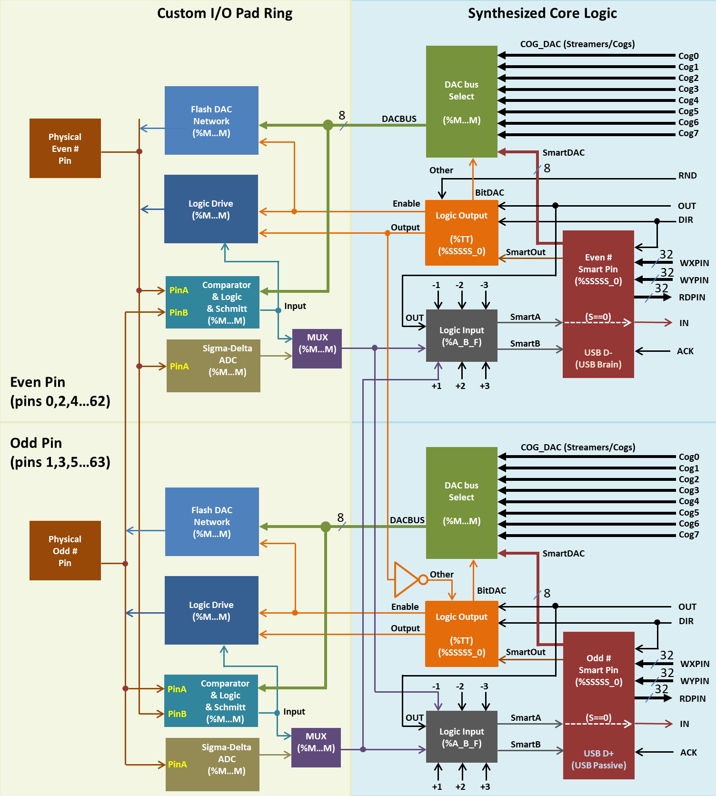

# Image Number List for Identification

## What Each Image Actually Shows (per Titus manual):

**Image 1: Page 03**

**IDENTIFIED:** Input-Output-Bit Timing section (part 1 of 3 in sequence)

**Image 2: Page 04 (img01)**

**IDENTIFIED:** Input-Output-Bit Timing section (part 2 of 3 in sequence)

**Image 3: Page 04 (img02)**

**IDENTIFIED:** Input-Output-Bit Timing section (part 3 of 3 in sequence)

**Image 4: Page 13**

**IDENTIFIED:** Mode %00011: DAC Output with added PWM dither

**Image 5: Page 15**

**IDENTIFIED:** Mode %00100: Pulse/cycle output

**Image 6: Page 16**

**IDENTIFIED:** Mode %00101: Transition Output

**Image 7: Page 17 (img01)**

**IDENTIFIED:** Mode %00110: Numerically Controlled Oscillator (NCO) (first image)

**Image 8: Page 17 (img02)**

**IDENTIFIED:** Mode %00110: NCO (second image in same section)

**Image 9: Page 19**

**IDENTIFIED:** Mode %00111: NCO Duty Cycle

**Image 10: Page 20**

**IDENTIFIED:** Mode %01000: Triangle Wave PWM (first image)

**Image 11: Page 21**

**IDENTIFIED:** Mode %01000: Triangle Wave PWM (second image in same section)

**Image 12: Page 23**

**IDENTIFIED:** Mode %01011: A/B-input quadrature encoder

**Image 13: Page 29**

**IDENTIFIED:** Mode %10000: Time A-input states

**Image 14: Page 31**

**IDENTIFIED:** Mode %10010: Time A-input highs, rises, or edges (first image)

**Image 15: Page 32**

**IDENTIFIED:** Mode %10010: Time A-input highs, rises, or edges (second image)

**Image 16: Page 33**

**IDENTIFIED:** Mode %11000: Synchronous serial transmit

**Image 17: Page 34**

**IDENTIFIED:** Mode %11001: Synchronous serial receive

**Image 18: Page 46 (img01)**

**IDENTIFIED:** Mode %11100: Asynchronous serial transmit (first image)

**Image 19: Page 46 (img02)**

**IDENTIFIED:** Mode %11100: Asynchronous serial transmit (second image)

**Image 20: Page 52 (img01)**

**IDENTIFIED:** Mode %11101: Asynchronous serial receive (first image)

**Image 21: Page 52 (img02)**

**IDENTIFIED:** Mode %11101: Asynchronous serial receive (second image)

**Image 22: Smart Pins Master**

**IDENTIFIED:** Smart Pin master architecture diagram

## Summary:
- **3 images** (1-3): For Input-Output-Bit Timing section (not in document yet)
- **18 images** (4-21): Applied to various Smart Pin modes
- **1 image** (22): Overview architecture diagram
- **Total: 22 images** all identified and properly mapped