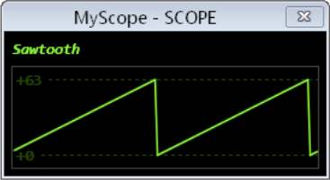
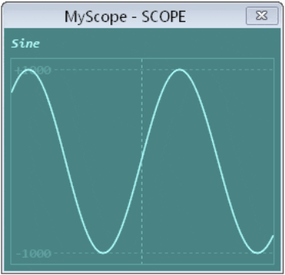
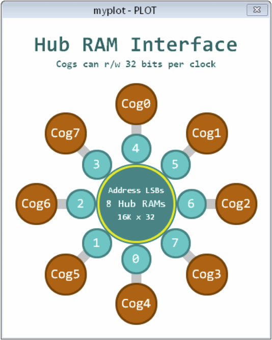
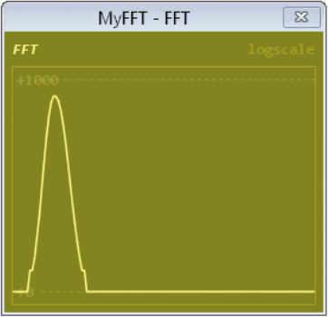

# P2 Debug Window System User Manual

**A Comprehensive Guide to Propeller 2 Visual Debugging and Display Interfaces**

---

## Table of Contents

1. [Introduction](#introduction)
2. [System Overview](#system-overview)
3. [DEBUG Terminal Windows](#debug-terminal-windows)
4. [SCOPE Oscilloscope Displays](#scope-oscilloscope-displays)
5. [PLOT Graphics Windows](#plot-graphics-windows)
6. [FFT Analysis Displays](#fft-analysis-displays)
7. [Single-Step Debugger](#single-step-debugger)
8. [Variable Monitors](#variable-monitors)
9. [Memory Displays](#memory-displays)
10. [Dashboard Design Patterns](#dashboard-design-patterns)
11. [System Integration](#system-integration)
12. [Real-World Applications](#real-world-applications)
13. [Troubleshooting](#troubleshooting)
14. [Best Practices](#best-practices)

---

## Introduction

The Propeller 2 Debug Window System provides a comprehensive suite of visual debugging and display interfaces that transform how you develop, debug, and monitor P2 applications. Unlike traditional microcontrollers that rely on external tools, the P2 integrates powerful display capabilities directly into the silicon through its DEBUG infrastructure.

### What You'll Learn

By the end of this manual, you'll master:
- **Multi-window debugging** using coordinated display systems
- **Real-time monitoring** dashboards for complex applications  
- **Signal analysis** using integrated oscilloscope and FFT displays
- **Memory and variable visualization** for performance optimization
- **Interactive debugging** with single-step control and breakpoints
- **Dashboard design patterns** for professional monitoring systems

### System Capabilities

The P2 Debug Window System includes:

| Window Type | Primary Function | Key Features |
|:------------|:------------------|:--------------|
| **DEBUG TERM** | Text displays and user interfaces | 300×200 chars, 4 color schemes, real-time output |
| **DEBUG SCOPE** | Oscilloscope displays | Real-time waveforms, multi-channel, auto-triggering |
| **DEBUG PLOT** | Graphics and plotting | Hub RAM visualization, architectural diagrams |
| **DEBUG FFT** | Frequency analysis | Signal processing, spectrum analysis |
| **Debugger Interface** | Code debugging | Single-step, breakpoints, multi-COG support |
| **Variable Monitors** | Runtime data display | Real-time variable tracking, formatted output |
| **Memory Displays** | Memory visualization | Hub/COG memory mapping, usage analysis |

### When to Use This System

**Development Scenarios**:
- **Algorithm Development**: Visualize data flow and transformations
- **Signal Processing**: Monitor input/output waveforms and frequency content  
- **System Monitoring**: Create dashboards for multi-COG applications
- **Educational Demonstrations**: Build interactive learning tools
- **Production Debugging**: Diagnose field issues with integrated displays

**Professional Applications**:
- **Industrial Control**: Real-time process monitoring dashboards
- **Audio/Video Systems**: Signal analysis and quality monitoring
- **Robotics**: Sensor fusion and control system visualization  
- **IoT Devices**: Status displays and diagnostic interfaces
- **Test Equipment**: Custom measurement and analysis tools

---

## System Overview

### Architecture Integration

The P2 Debug Window System operates as an integrated part of the Propeller 2 architecture:

```
┌─────────────────────────────────────────────────────────────┐
│                    P2 Debug Window System                   │
├─────────────────────────────────────────────────────────────┤
│  DEBUG TERM    │  DEBUG SCOPE   │  DEBUG PLOT   │  DEBUG FFT │
│  Text Windows  │  Oscilloscope  │  Graphics     │  Analysis  │
├─────────────────────────────────────────────────────────────┤
│           DEBUG Infrastructure & Communication              │
├─────────────────────────────────────────────────────────────┤
│    COG 0    │    COG 1    │    COG 2    │    COG 3    │...│
│   (Main)    │  (Signal)   │ (Monitor)   │ (Control)   │    │
├─────────────────────────────────────────────────────────────┤
│              Hub Memory & Smart Pin System                  │
└─────────────────────────────────────────────────────────────┘
```

### Multi-Window Coordination

**Simultaneous Operation**: Multiple window types can operate concurrently:
- **Text terminals** for status and control
- **Scope displays** for real-time signals  
- **Plot windows** for data visualization
- **FFT displays** for frequency analysis
- **Debug interfaces** for code development

**Resource Management**: Each window type uses different P2 resources:
- **COG Independence**: Non-blocking operation across COGs
- **Memory Efficiency**: Optimized for real-time performance
- **Communication**: Seamless data sharing between displays

### Window Lifecycle

| Phase | Description | Actions |
|:------|:-------------|:---------|
| **Declaration** | Define window parameters | Set size, color schemes, display modes |
| **Initialization** | Activate window display | Open window, establish communication |
| **Active Operation** | Real-time data updates | Send data, update displays, handle user input |
| **Coordination** | Multi-window synchronization | Coordinate updates, manage resources |
| **Termination** | Clean shutdown | Close displays, release resources |

---

## DEBUG Terminal Windows


*Basic DEBUG terminal showing text output functionality*

### Overview

DEBUG Terminal windows provide sophisticated text-based displays for user interfaces, status monitoring, and debugging output. These are the foundation of P2's visual debugging system.

### Terminal Specifications

**Resolution and Sizing**:

| Parameter | Range | Default | Description |
|:----------|:------|:---------|:-------------|
| **Columns** | 1-300 | 40 | Character columns per line |
| **Rows** | 1-200 | 20 | Text rows in display |
| **Font Size** | 6-200 pts | 12 | Text size for readability |
| **Color Schemes** | 4 simultaneous | B&W | Foreground/background combinations |

### Terminal Declaration and Setup

```spin2
' Basic terminal creation
DEBUG(`TERM MyStatus SIZE 80 25 TEXTSIZE 14)

' Multi-terminal dashboard
DEBUG(`TERM SystemLog SIZE 60 30 TEXTSIZE 10)
DEBUG(`TERM UserInterface SIZE 40 15 TEXTSIZE 16)
DEBUG(`TERM DataDisplay SIZE 50 20 TEXTSIZE 12)
```

**Configuration Commands**:

```spin2
' Sizing and appearance
DEBUG(`TERM MyTerm SIZE 80 25)        ' Set dimensions
DEBUG(`TERM MyTerm TEXTSIZE 14)       ' Set font size
DEBUG(`TERM MyTerm COLOR 1 0)         ' White text, black background

' Real-time content updates
DEBUG(`TERM MyTerm "System Status: OK")
DEBUG(`TERM MyTerm.dec(sensor_value))  ' Formatted numeric output
DEBUG(`TERM MyTerm.bin(status_bits))   ' Binary representation
```

### Control Character System

**Basic Control Characters**:

| Code | Function | Usage Example | Description |
|:-----|:----------|:---------------|:-------------|
| `0` | Clear & Home | `DEBUG(`TERM.char(0))` | Clear screen, cursor to home |
| `1` | Home Only | `DEBUG(`TERM.char(1))` | Move cursor to top-left |
| `2` | Set Column | `DEBUG(`TERM.char(2,40))` | Position cursor horizontally |
| `3` | Set Row | `DEBUG(`TERM.char(3,15))` | Position cursor vertically |
| `4-7` | Color Select | `DEBUG(`TERM.char(5))` | Choose color scheme 0-3 |

---

## SCOPE Oscilloscope Displays



*SCOPE display showing real-time waveform visualization with sawtooth pattern*



*SCOPE display demonstrating anti-aliasing for smooth waveform rendering*

### Overview

DEBUG SCOPE displays provide real-time oscilloscope functionality integrated directly into the P2 system. These displays are essential for signal analysis, waveform monitoring, and real-time system debugging.

### SCOPE Capabilities

**Display Features**:

| Feature | Specification | Description |
|:---------|:--------------|:-------------|
| **Real-time Plotting** | Live updates | Continuous waveform display during execution |
| **Multi-channel** | Multiple signals | Simultaneous display of different signals |
| **Auto-scaling** | Automatic range | Dynamic scaling for optimal viewing |
| **Anti-aliasing** | Smooth rendering | High-quality waveform display |
| **Color Coding** | Channel identification | Different colors for different signals |
| **Trigger System** | Auto-triggering | Stable waveform capture |

### SCOPE Declaration and Basic Usage

```spin2
' Single-channel scope display
DEBUG(`SCOPE MySig samples signal)

' Multi-channel X-Y scope
DEBUG(`SCOPE_XY Waveforms samples x_signal y_signal color)

' Auto-scaling scope with triggering
DEBUG(`SCOPE AutoScope AUTO)
DEBUG(`SCOPE AutoScope TRIGGER channel AUTO)
```

---

## PLOT Graphics Windows



*PLOT display showing Hub RAM memory visualization and system architecture*

### Overview

DEBUG PLOT windows provide sophisticated graphics and plotting capabilities for visualizing system architecture, memory usage, data relationships, and complex visualizations that go beyond simple waveforms.

### PLOT Capabilities

**Graphics Features**:

| Feature | Description | Applications |
|:---------|:-------------|:--------------|
| **Memory Mapping** | Visual memory layout | Hub/COG memory visualization |
| **Architecture Diagrams** | System structure display | Hardware configuration views |
| **Data Relationships** | Multi-dimensional plotting | Sensor correlation analysis |
| **Performance Metrics** | Resource usage graphics | CPU/memory utilization |
| **Network Topology** | Connection mapping | Multi-COG communication |

---

## FFT Analysis Displays



*FFT display showing frequency domain analysis of digital signals*

### Overview

DEBUG FFT displays provide integrated frequency domain analysis capabilities, essential for signal processing applications, audio analysis, vibration monitoring, and digital signal processing validation.

### FFT Display Features

**Analysis Capabilities**:

| Feature | Description | Applications |
|:---------|:-------------|:--------------|
| **Real-time FFT** | Live frequency analysis | Audio processing, vibration analysis |
| **Spectrum Display** | Frequency domain visualization | Signal quality assessment |
| **Peak Detection** | Automatic frequency identification | Tone detection, fault analysis |
| **Windowing Functions** | Signal conditioning | Spectral leakage reduction |
| **Multiple Channels** | Simultaneous analysis | Comparative frequency analysis |

---

## Single-Step Debugger

### Overview

The P2 Single-Step Debugger provides PASM-level debugging capabilities with breakpoint support, variable monitoring, and multi-COG debugging coordination. This is essential for low-level optimization and system debugging.

### Debugger Features

**Core Capabilities**:

| Feature | Description | Usage |
|:---------|:-------------|:-------|
| **Single-Step Execution** | Step through PASM instructions | Instruction-level debugging |
| **Breakpoint Management** | Set/remove breakpoints | Conditional program halting |
| **Variable Monitoring** | Real-time variable display | State inspection |
| **Multi-COG Debugging** | Independent COG debugging | Parallel process debugging |
| **Clock Adaptation** | Dynamic frequency tracking | Debug across clock changes |

---

## Variable Monitors

### Overview

Variable Monitors provide real-time display of program variables, memory contents, and system state information. These displays are essential for understanding program behavior and optimizing performance.

### Monitor Types

**Variable Display Formats**:

| Format | Description | Example Usage |
|:--------|:-------------|:---------------|
| **Decimal Display** | Numeric values | Sensor readings, counters |
| **Hexadecimal Display** | Memory addresses, bit patterns | Pointer values, status registers |
| **Binary Display** | Bit-level information | Pin states, flag collections |
| **Formatted Display** | Custom formatting | Timestamps, structured data |

---

## Memory Displays

### Overview

Memory Displays provide visualization of Hub RAM usage, COG memory allocation, and memory access patterns. These displays are crucial for performance optimization and memory management.

### Memory Visualization Types

**Display Categories**:

| Type | Purpose | Information Shown |
|:-----|:---------|:-------------------|
| **Hub Memory Map** | RAM allocation tracking | Used/free regions, fragmentation |
| **COG Memory Status** | Per-COG memory usage | Active/inactive COGs, memory utilization |
| **Memory Access Patterns** | Performance analysis | Read/write hotspots, access frequency |
| **Stack Usage** | Stack overflow prevention | Stack depth, peak usage |

---

## Dashboard Design Patterns

### Overview

Effective dashboard design combines multiple window types to create comprehensive monitoring and control systems. This section covers proven patterns for organizing complex information displays.

### Multi-Window Coordination Patterns

**System Monitor Dashboard**:

```
┌─────────────────────────────────────────────────────────────────────┐
│                        P2 System Dashboard                         │
├─────────────────────┬─────────────────────┬─────────────────────────┤
│   Status Terminal   │   Performance Plot   │    Variable Monitor     │
│                     │                     │                         │
│ • System: Online    │ [CPU Usage Graph]   │ Temperature: 45°C       │
│ • COGs: 6/8 Active  │ [Memory Usage]      │ Pressure: 1013 mBar    │
│ • Errors: 0         │ [Network Traffic]   │ Flow Rate: 15.2 L/min  │
│ • Uptime: 15:42:33  │                     │ Battery: 12.6V         │
├─────────────────────┼─────────────────────┼─────────────────────────┤
│   SCOPE Display     │   FFT Analysis      │    Memory Map           │
│                     │                     │                         │
│ [Real-time Signal]  │ [Frequency Spectrum]│ [Hub Memory Layout]     │
│ [Trigger: Auto]     │ [Peak: 440Hz]       │ [COG Status Grid]       │
│ [Scale: 1V/div]     │ [Level: -20dB]      │ [Free: 234KB]          │
└─────────────────────┴─────────────────────┴─────────────────────────┘
```

---

## System Integration

### Overview

System Integration covers how to coordinate multiple debug windows, manage resources efficiently, and create robust multi-window applications that provide comprehensive system visibility.

### Resource Management

**Window Resource Allocation**:

| Resource Type | Consideration | Management Strategy |
|:---------------|:---------------|:-------------------|
| **Memory Usage** | Each window consumes RAM | Monitor total allocation, prioritize critical displays |
| **Update Frequency** | Balance detail vs performance | Stagger updates, variable refresh rates |
| **COG Coordination** | Multi-COG display updates | Coordinate timing, avoid conflicts |
| **Communication Bandwidth** | Serial/debug channel limits | Batch updates, compress data |

---

## Real-World Applications

### Overview

This section demonstrates practical applications of the P2 Debug Window System in real-world scenarios, showing how to combine multiple window types for effective monitoring and control systems.

### Industrial Process Monitoring

**Chemical Plant Dashboard**:

```spin2
CON
    ' Process parameters
    NUM_TANKS = 4
    NUM_PUMPS = 6
    NUM_SENSORS = 20

VAR
    long tank_levels[NUM_TANKS]
    long tank_temperatures[NUM_TANKS]
    long pump_speeds[NUM_PUMPS]
    long sensor_readings[NUM_SENSORS]
    long process_alarms
    long production_rate

PUB chemical_plant_monitoring()
    ' Initialize comprehensive plant monitoring system
    
    ' Main overview terminal
    DEBUG(`TERM PlantOverview SIZE 80 30 TEXTSIZE 12)
    
    ' Individual system monitors
    DEBUG(`TERM TankStatus SIZE 40 20 TEXTSIZE 10)
    DEBUG(`TERM PumpControl SIZE 40 20 TEXTSIZE 10)
    DEBUG(`TERM AlarmLog SIZE 60 15 TEXTSIZE 10)
    
    ' Real-time process visualization
    DEBUG(`PLOT ProcessFlow)
    DEBUG(`SCOPE ProcessSignals)
    DEBUG(`FFT VibrationAnalysis)
```

---

## Troubleshooting

### Overview

This section covers common issues with the P2 Debug Window System, diagnostic techniques, and solutions for optimal performance and reliability.

### Common Display Issues

**Window Communication Problems**:

| Problem | Symptoms | Diagnosis | Solution |
|:---------|:----------|:-----------|:----------|
| **No Display Output** | Window opens but shows nothing | Check DEBUG statements | Verify correct window name, check syntax |
| **Garbled Text** | Corrupted characters in terminal | Serial communication issue | Check baud rate, cable connection |
| **Slow Updates** | Delayed or choppy display | Resource overload | Reduce update frequency, optimize code |
| **Window Freezing** | Display stops updating | Blocking code in update loop | Add non-blocking delays, check infinite loops |

---

## Best Practices

### Overview

This section outlines proven strategies for designing effective debug window systems, optimizing performance, and creating maintainable monitoring solutions.

### Design Principles

**Information Hierarchy**:

| Priority Level | Information Type | Window Type | Update Rate |
|:----------------|:------------------|:-------------|:-------------|
| **Critical** | Safety alarms, system faults | Status terminals | Immediate |
| **Important** | Process variables, performance | Variable monitors | 1-10Hz |
| **Useful** | Trends, diagnostics | SCOPE/PLOT displays | 0.1-1Hz |
| **Reference** | Memory usage, statistics | Memory displays | 0.01-0.1Hz |

---

**End of Manual**

This comprehensive guide covers the complete P2 Debug Window System, providing you with the knowledge and tools needed to create sophisticated monitoring, debugging, and control interfaces for your Propeller 2 applications. The integrated approach to multiple window types enables professional-grade dashboards suitable for industrial, educational, and development applications.