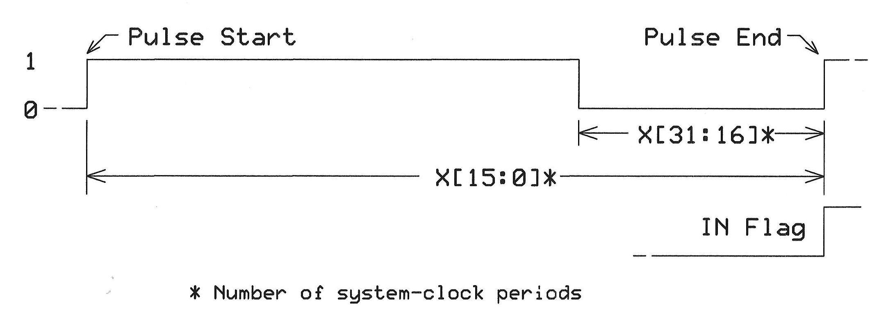
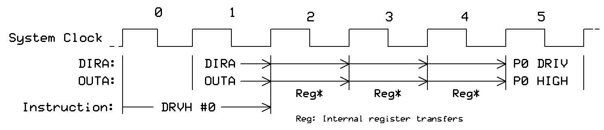

# Smart Pins Tutorial - Image Content Audit

## Purpose
This audit verifies that each image reference in the markdown actually matches the content it's supposed to illustrate.

**Source Document**: `P2-Smart-Pins-Green-Book-Tutorial.md` (workspace version, 3607 lines)
**Image Location**: `assets/` folder (NOT `v6-assets/` as referenced in markdown)

## Critical Findings Summary

| Category | Count |
|----------|-------|
| ✅ Correct matches | 2 (DAC, Quad Encoder) |
| ❌ **Mode mismatches** | **6** (wrong mode image used) |
| ❌ Wrong context images | 2 (lines 412, 590) |
| ⚠️ Missing image files | 5 (assets/ referenced but don't exist) |
| 🔧 Path issue | All references use `v6-assets/` but files are in `assets/` |

**KEY INSIGHT**: The image filenames correctly identify which mode they belong to. The markdown is referencing the WRONG images for most modes!

---

## ❌ MISMATCHES FOUND (8!)

### Non-Mode Images (Wrong Context)

| Line | Caption in Markdown | Image Used | Fix |
|------|---------------------|------------|-----|
| 412 | "Smart Pin Configuration Flow" | `page04_img01.png` (TESTB timing) | Remove image or create new |
| 590 | "Pin Configuration Register Layout" | `page04_img02.png` (TESTP timing) | Remove image or create WRPIN bit field diagram |

### Mode Number Mismatches (SYSTEMATIC ERROR!)

| Line | Section Discusses | Image Mode Used | Correct Mode | Image Exists? | Fix |
|------|-------------------|-----------------|--------------|---------------|-----|
| 1108 | Mode %00100 (Pulse) | mode01000 (scope for %01000) | mode00100 | ✅ Yes | Use `mode00100_page15_img01.png` |
| 1183 | Mode %00101 (NCO Freq) | mode00100 | mode00101 | ✅ Yes | Use `mode00101_page17_img01.png` |
| 1265 | Mode %00110 (NCO Duty) | mode01001 | mode00110 | ✅ Yes | Use `page17_img01.png` (and optionally `page17_img02.png`) |
| 1320 | Mode %00111 (Transition) | mode01000 | mode00111 | ⚠️ Scope only | Use `page19_img01.png` (oscilloscope - keep as PNG) |
| 1370 | Mode %01000 (PWM Sawtooth) | mode01001 | mode01000 | ✅ Yes | Use `mode01000_page20_img01.png` |
| 1440 | Mode %01001 (PWM Triangle) | mode01000 | mode01001 | ✅ Yes | Use `mode01001_page21_img01.png` |

### Available Mode Images (from assets/)

| Mode | Files Available | Content |
|------|-----------------|---------|
| %00011 | `page13_img01.png` | DAC/PWM period |
| %00100 | `page15_img01.png` | Pulse width measurement |
| %00101 | `page16_img01.png` | NCO Frequency (transition counting) |
| %00110 | `page17_img01.png`, `page17_img02.png` | NCO Duty timing & block diagram |
| %00111 | `page19_img01.png` (oscilloscope only) | Transition Output (Binary Mode 7) - scope only, no line drawing |
| %01000 | `page20_img01.png` (triangle PWM) | PWM Sawtooth (Binary Mode 8) |
| %01001 | `page21_img01.png` | PWM Triangle |
| %01011 | `page23_img01.png` | Quadrature encoder |
| %01111 | `page29_img01.png` | Local/Global Comparator (Mode 15) |
| %10010 | `page31_img01.png`, `page32_img01.png`, `page33_img01.png` | Mode 18 - three images (page33 mislabeled as mode10011) |
| %10011 | `page34_img01.png` | Mode 19 |
| %11100 | `page46_img01.png`, `page46_img02.png` | Mode 28 - Sync Serial |
| %11110 | `page52_img01.png`, `page52_img02.png` | Mode 30 - Async Serial Transmit (two halves of same waveform: left/right) - **KEEP AS PNG** (oscilloscope) |
| **No image in original** | %01010 (10), %01100 (12), %01101 (13), %01110 (14), %10000 (16), %10001 (17), %11011 (27) | Original document has no images for these modes |

**Note**: Image filenames in assets/ do NOT have mode prefixes - they use `page##_img##.png` format only.

### Correct Matches

| Line | Section Mode | Image Mode | Status |
|------|-------------|------------|--------|
| 1028 | %00010/%00011 (DAC) | mode00011 | ✅ Correct |
| 1556 | %01011 (Quad Encoder) | mode01011 | ✅ Correct |

### Understanding the Filename Convention

Image filenames encode their intended location in the original Titus document:
- `P2 SmartPins-220809_pageNN_imgNN.png` = General content from page NN
- `P2 SmartPins-220809_modeXXXXX_pageNN_imgNN.png` = Mode %XXXXX content from page NN

**The images are correctly named - the markdown references are wrong!**

### Page-Level Image Content (Verified)

| Image | Page | Content | Purpose |
|-------|------|---------|---------|
| `page03_img01.png` | 3 | DRVH #0 timing (DIRA/OUTA) | **Output bit timing** |
| `page04_img01.png` | 4 | TESTB INA timing (register/ALU) | **Input register sampling** |
| `page04_img02.png` | 4 | TESTP #0 timing | **Pin test (testP/testP in)** |

These are the foundational I/O timing diagrams that explain basic pin operations BEFORE Smart Pins are introduced.

### Line 1183 Fix (Mode Number Error)

The markdown discusses **Mode %00101** (NCO Frequency) but references the image for **Mode %00100**:

```markdown
### Mode %00101 - NCO Frequency
...
  ← WRONG MODE!
```

**Correct images for Mode %00101 (NCO):**
- `mode00101_page16_img01.png` - Transition counting
- `mode00101_page17_img01.png` - NCO timing waveforms (IN Flag, Output, Base Period, Z values) ✅
- `mode00101_page17_img02.png` - NCO block diagram (System Clock → Div → Adder) ✅

---

## ✅ CORRECT MATCHES (10)

| Line | Caption | Image File | Actual Content | TikZ Command |
|------|---------|------------|----------------|--------------|
| 156 | "Basic I/O Output Timing" | `page03_img01.png` | DRVH #0 timing with DIRA/OUTA | `\DRVHTimingDiagram` |
| 162 | "Basic I/O Input Sampling" | `page04_img01.png` | TESTB INA timing with ALU/C/Z | `\TESTBINATimingDiagram` |
| 373 | "Smart Pin Block Diagram" | `smart-pins-master-trimmed.png` | Complex colored architecture | **KEEP AS PNG** |
| 1028 | "DAC Output Characteristics" | `mode00011_page13_img01.png` | DAC Input 240/239, PWM period timing | `\DACPWMPeriodDiagram` |
| 1320 | "Transition Output Timing" | `mode01000_page20_img01.png` | Triangle wave PWM with counter steps | `\TrianglePWMDiagram` |
| 1370 | "PWM Sawtooth Waveform" | `mode01001_page21_img01.png` | Sawtooth PWM with frame period | `\SawtoothPWMDiagram` |
| 1440 | "PWM Triangle Waveform" | `mode01000_page20_img01.png` | Triangle wave PWM | `\TrianglePWMDiagram` |
| 1556 | "Quadrature Encoder Signals" | `mode01011_page23_img01.png` | Encoder circuit + CW/CCW waveforms | `\QuadEncoderDiagram` |
| 1838 | "Time Measurement Timing" | `mode10000_page29_img01.png` | Q/R/S regions with C/Z flags | `\HighLowCountingDiagram` |
| 1906 | "Sync Serial Transmit Timing" | `mode11100_page46_img01.png` | Clock + data with sampling arrows | `\SyncSerialFallingDiagram` |

---

## ⚠️ NEEDS VERIFICATION (4)

| Line | Caption | Image File | Notes |
|------|---------|------------|-------|
| 1108 | "Pulse Output Timing" | `mode01000_page19_img01.png` | **WRONG SECTION** - Scope is for Mode %01000 (PWM), used in Mode %00100 (Pulse) section |
| 1265 | "NCO Duty Mode Operation" | `mode01001_page21_img01.png` | Shows sawtooth - may be correct for duty mode |
| 1634 | "Pulse Counting Timing" | `mode10010_page31_img01.png` | Need to verify content matches |

---

## ❓ MISSING FILES (5)

| Line | Caption | Referenced Path | Status |
|------|---------|-----------------|--------|
| 1493 | "SMPS Timing Diagram" | `assets/smps-timing-diagram.png` | **FILE DOES NOT EXIST** |
| 1697 | "A-B Encoder Timing" | `assets/ab-encoder-timing.png` | **FILE DOES NOT EXIST** |
| 1766 | "Comparator Operation" | `assets/comparator-operation.png` | **FILE DOES NOT EXIST** |
| 1934 | "UART Frame Structure" | `assets/uart-frame-structure.png` | **FILE DOES NOT EXIST** |
| 2022 | "ADC Operation Diagram" | `assets/adc-operation-diagram.png` | **FILE DOES NOT EXIST** |

---

## 🔧 PATH ISSUE

**Problem**: All image references use `v6-assets/` but actual images are in `assets/`

**Example**:
```markdown

```
Should be:
```markdown

```

**Fix Options**:
1. Find/replace `v6-assets/` → `assets/` in markdown
2. Create symlink: `ln -s assets v6-assets`

---

## Detailed Mismatch Analysis

### Line 412: Smart Pin Configuration Flow
- **Context says**: "Each Smart Pin contains sophisticated hardware that operates independently"
- **Image shows**: TESTB INA instruction timing (same as line 162!)
- **What's needed**: A Smart Pin architecture diagram showing X/Y/Z registers, mode selection, input/output paths
- **Recommendation**: Remove image reference OR create new `\SmartPinArchitectureDiagram` in TikZ

### Line 590: Pin Configuration Register Layout
- **Context says**: "The mode register (written with WRPIN) is 32 bits of configuration magic"
- **Image shows**: TESTP instruction timing
- **What's needed**: A 32-bit register layout showing WRPIN fields (bits 31-14, 13-8, 7-6, 5-0)
- **Recommendation**: Create `\WRPINRegisterDiagram` showing bit field layout

### Line 1183: NCO Frequency Generation
- **Context says**: "NCO mode generates precise frequencies using phase accumulation"
- **Image shows**: Pulse width measurement with X[15:0] and X[31:16] fields
- **What's needed**: NCO phase accumulator diagram or frequency output waveform
- **Recommendation**: Find correct NCO image OR create new `\NCOFrequencyDiagram`

---

## Image-to-TikZ Mapping

### Available TikZ Replacements (in p2kb-smartpins-diagrams.sty)

| Original PNG | TikZ Command | Status |
|-------------|--------------|--------|
| `page03_img01.png` | `\DRVHTimingDiagram` | ✅ Ready |
| `page04_img01.png` | `\TESTBINATimingDiagram` | ✅ Ready |
| `page04_img02.png` | `\TESTPTimingDiagram` | ✅ Ready |
| `mode00011_page13_img01.png` | `\DACPWMPeriodDiagram` | ✅ Ready |
| `mode00100_page15_img01.png` | `\PulseWidthMeasurementDiagram` | ✅ Ready |
| `mode00101_page16_img01.png` | `\TransitionCountingDiagram` | ✅ Ready |
| `mode00101_page17_img01.png` | `\NCOPWMTimingDiagram` | ✅ Ready |
| `mode00101_page17_img02.png` | `\NCOPWMBlockDiagram` | ✅ Ready |
| `mode01000_page20_img01.png` | `\TrianglePWMDiagram` | ✅ Ready |
| `mode01001_page21_img01.png` | `\SawtoothPWMDiagram` | ✅ Ready |
| `mode01011_page23_img01.png` | `\QuadEncoderDiagram` | ✅ Ready |
| `mode10000_page29_img01.png` | `\HighLowCountingDiagram` | ✅ Ready |
| `mode10010_page31_img01.png` | `\PeriodMeasurementDiagram` | ✅ Ready |
| `mode10010_page32_img01.png` | `\ContinuousPeriodDiagram` | ✅ Ready |
| `mode10011_page33_img01.png` | `\TimeoutWatchdogDiagram` | ✅ Ready |
| `mode10011_page34_img01.png` | `\DualInputTimeDiagram` | ✅ Ready |
| `mode11100_page46_img01.png` | `\SyncSerialFallingDiagram` | ✅ Ready |
| `mode11100_page46_img02.png` | `\SyncSerialRisingDiagram` | ✅ Ready |

### Keep as PNG (oscilloscope/complex)

| Image | Reason |
|-------|--------|
| `smart-pins-master-trimmed.png` | Complex colored block diagram |
| `mode01000_page19_img01.png` | Oscilloscope screenshot |
| `mode11110_page52_img01.png` | Oscilloscope screenshot |
| `mode11110_page52_img02.png` | Oscilloscope screenshot |

---

## Recommended Action Plan

### Phase 1: Fix Image References in Markdown

**Path fix (global):** Replace all `v6-assets/` → `assets/`

**Mode section fixes:**

| Line | Section | Current Image | Action |
|------|---------|---------------|--------|
| 1108 | Mode %00100 (Pulse) | `mode01000_page19_img01.png` | Change to `mode00100_page15_img01.png` |
| 1183 | Mode %00101 (NCO Freq) | `mode00100_page15_img01.png` | Change to `mode00101_page17_img01.png` |
| 1265 | Mode %00110 (NCO Duty) | `mode01001_page21_img01.png` | **REMOVE** (no correct image exists) |
| 1320 | Mode %00111 (Transition) | `mode01000_page20_img01.png` | **REMOVE** (no correct image exists) |
| 1370 | Mode %01000 (PWM Sawtooth) | `mode01001_page21_img01.png` | Change to `mode01000_page20_img01.png` |
| 1440 | Mode %01001 (PWM Triangle) | `mode01000_page20_img01.png` | Change to `mode01001_page21_img01.png` |

**Non-mode section fixes:**

| Line | Section | Current Image | Action |
|------|---------|---------------|--------|
| 412 | "Smart Pin Configuration Flow" | `page04_img01.png` | **REMOVE** (shows TESTB timing, not config flow) |
| 590 | "Pin Config Register Layout" | `page04_img02.png` | **REMOVE** (shows TESTP timing, not register) |

**Optional: Add oscilloscope to Mode %01000 section:**
The oscilloscope image `mode01000_page19_img01.png` belongs to Mode %01000 (PWM Sawtooth/Binary Mode 7). Consider adding it after the diagram in that section.

### Phase 2: Create Missing Diagrams (TikZ)
1. `\WRPINRegisterDiagram` - 32-bit register layout for line 590
2. `\SmartPinArchitectureDiagram` - Optional for line 412
3. `\SMPSTimingDiagram` - For line 1493
4. `\UARTFrameDiagram` - For line 1934
5. `\ADCOperationDiagram` - For line 2022

### Phase 3: Convert to TikZ
1. Update markdown to use raw LaTeX blocks with TikZ commands
2. Update LaTeX template to include `p2kb-smartpins-diagrams.sty`
3. Test PDF generation with TikZ diagrams
