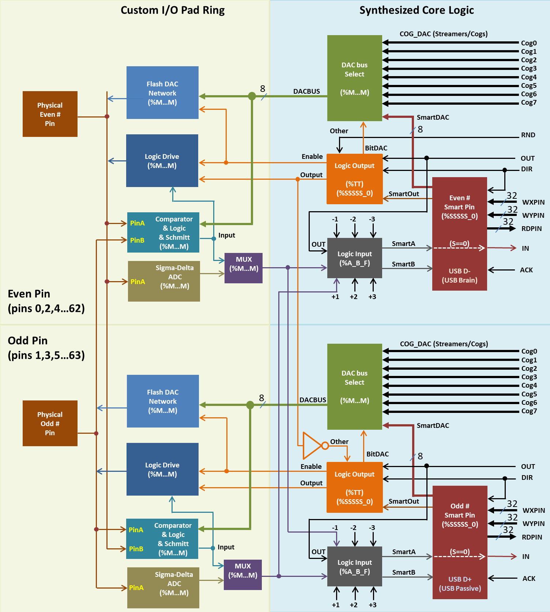

```{=latex}
% Banner image at top (full width) with drop shadow for visual balance
\begin{tcolorbox}[
  enhanced,
  boxrule=1.5pt,
  colframe=gray!60,
  colback=white,
  drop shadow southeast,
  shadow={3pt}{-3pt}{1mm}{black!15},
  left=0pt, right=0pt, top=0pt, bottom=0pt,
  width=\textwidth,
  arc=0pt,
  outer arc=0pt
]
\includegraphics[width=\linewidth]{inbox/assets/book-artwork.png}
\end{tcolorbox}

\begin{center}
\vspace{0.6cm}
{\fontsize{36}{42}\selectfont\bfseries P2 Smart Pins \& I/O\par}
\vspace{0.3cm}
{\Large\itshape Master Every Aspect of P2 Input/Output Through Progressive Learning\par}
\vspace{0.6cm}
{\large December 2025\par}
\vspace{0.2cm}
{\large\color{blue}Version 1.0 - Technical Review\par}

\vfill
\begin{tcolorbox}[
  colback=gray!5,
  colframe=gray!40,
  boxrule=1pt,
  width=0.85\textwidth,
  center,
  title={\bfseries\color{black} Tutorial Guide},
  colbacktitle=gray!15,
  coltitle=black
]
\textbf{Learn by doing with color-coded examples!}

\vspace{0.3cm}
\begin{minipage}[t]{0.45\textwidth}
\textbf{Code Block Colors:}
\begin{itemize}
\item \textcolor{green!50!black}{\textbf{Green}} -- Spin2 examples
\item \textcolor{orange!70!black}{\textbf{Yellow}} -- PASM2 assembly
\item \textcolor{red!60!black}{\textbf{Red}} -- Antipatterns (avoid!)
\end{itemize}
\end{minipage}%
\hfill%
\begin{minipage}[t]{0.50\textwidth}
\textbf{Special Sections:}
\begin{itemize}
\item \textcolor{blue!60!black}{\textbf{Tips}} -- helpful hints
\item \textcolor{gray!70!black}{\textbf{Diagrams}} -- timing \& signal flow
\end{itemize}
\end{minipage}
\end{tcolorbox}
\vspace{1cm}
\end{center}

\clearpage
\pagestyle{fancy}

\tableofcontents

\clearpage
```

## Copyright and License

Copyright 2025 Parallax Inc. and Iron Sheep Productions LLC.
All rights reserved.

This tutorial incorporates knowledge and teaching approaches inspired by:

- **Jon Titus** - Original Smart Pins documentation and tutorial approach
- **The Propeller Community** - Years of collective wisdom

This work is licensed under the Creative Commons Attribution-ShareAlike 4.0 International License.

## Preface: Your Complete Journey into P2 I/O

Welcome, my friend! You're about to discover the complete input/output capabilities of the Propeller 2. We'll start with the basics - simple pin control - and build up to one of the P2's most powerful features: Smart Pins.

### What Makes This Tutorial Special?

This isn't just a Smart Pins reference (we have the Blue Book for that). This is your complete guided journey from "How do I control a pin?" through "What's a Smart Pin?" all the way to "I can't believe what I just built!" We'll start simple, build confidence, and before you know it, you'll be orchestrating all 64 I/O pins like a maestro conducting a symphony.

### Who Is This For?

Are you new to the P2? Perfect! We'll start with the absolute basics.
Are you a P1 veteran? Excellent! You'll appreciate the familiar instructions before diving into Smart Pins.
Are you somewhere in between? You're exactly where you need to be.

The only requirement is curiosity and a willingness to experiment. P2 I/O is best learned by doing, and we'll be doing plenty!

### How to Use This Tutorial

**The Learning Path** (recommended for first-timers):
Start with Chapter 0 to understand basic I/O, then read Part I to understand Smart Pins conceptually, then work through Part II mode by mode. Each section builds on concepts from previous ones. By Part III, you'll be combining techniques in ways that would make other microcontrollers jealous.

**The Project Path** (when you have something specific in mind):
If you just need basic I/O, Chapter 0 has you covered. For Smart Pins, jump to the mode you need in Part II, but don't skip the introduction - it contains crucial concepts. Each mode chapter stands alone but references related modes.

**The Reference Path** (when you know what you're doing):
Chapter 0 has quick reference tables for basic I/O. Part II has quick reference boxes at the start of each Smart Pin mode. The appendices contain every constant, every formula, every detail you might need.

### A Personal Note from Your Guide

I've been working with microcontrollers since before they were "micro," and I can honestly say that the P2's I/O system represents something special. Starting with familiar, simple pin control and building up to Smart Pins that can handle complex protocols independently - that's a beautiful progression.

You'll make mistakes. Your first pin might not toggle. Your first Smart Pin might not work. Your timing might be off. That's normal! Every example in this tutorial has been tested, retested, and tested again. When something doesn't work, we'll show you why and how to fix it.

Ready? Let's start with the basics and build up to the amazing!


# Part I: Understanding P2 I/O - From Basic to Smart

## Chapter 0: P2 I/O Fundamentals

### Why Start Here?

Before we dive into the sophisticated world of Smart Pins, let's establish a solid foundation with basic P2 I/O. If you're coming from other microcontrollers (or even the P1), you'll find familiar concepts here. More importantly, understanding what basic I/O can and can't do will help you appreciate why Smart Pins are revolutionary.

### 0.1 The Four Essential Instructions

Forget what you might have seen about 32+ pin instructions. You really only need four to get started:

::: spin2
```
PUB the_essentials()
  pinfloat(56)          ' Make P56 an input (float it)
  pinhigh(56)           ' Make P56 an output high
  pinlow(56)            ' Set P56 output to 0
  pinhigh(56)           ' Set P56 output to 1
```
:::

That's it! With just these four instructions, you can:

- Control LEDs
- Read buttons
- Create simple signals
- Interface with basic digital devices

Let's see them in action with the classic "Hello World" of embedded systems:

::: spin2
```
CON
  _clkfreq = 200_000_000        ' 200MHz system clock
  LED = 56                      ' P2 Eval board LED

PUB blink_basic()
  pinhigh(LED)                  ' Make LED pin an output high
  repeat
    pinhigh(LED)                ' LED on
    waitms(500)                 ' Wait 500ms
    pinlow(LED)                 ' LED off
    waitms(500)                 ' Wait 500ms
```
:::

::: sidetrack
### The Clock Preamble

Notice the `CON` section at the top of that example? Every Spin2 program needs to configure its system clock:

::: spin2
```
CON
  _clkfreq = 200_000_000  ' 200 MHz system clock
```
:::

This tells the P2 to run at 200 MHz using your board's crystal oscillator. Without it, the chip runs at a sluggish ~20 MHz on its internal RC oscillator---and timing-dependent code (including serial communication and `waitms()` delays) won't behave as expected.

**From here on, we'll omit this preamble from most examples to keep them focused on the Smart Pin concepts being taught.** When you create your own programs, always include `_clkfreq` in your `CON` section. The examples that do timing calculations (like baud rate divisors) will show it explicitly since the math depends on knowing the clock frequency.
:::

Simple, right? Now let's read a button:

::: spin2
```
CON
  BUTTON = 32                   ' Button on P32

PUB read_button() : pressed
  pinfloat(BUTTON)              ' Make button pin an input
  pressed := pinread(BUTTON)   ' Read the pin state
  ' Returns 1 if pressed (assuming active-high button)
```
:::

### 0.2 Reading Inputs - The INA and INB Registers

The P2 has 64 I/O pins, split across two 32-bit registers:

- **INA[31..0]** - Read pins P0 through P31
- **INB[31..0]** - Read pins P32 through P63

::: spin2
```
PUB read_multiple_inputs() | value, button1, button2, sensor, i
  ' Make P0-P7 inputs
  repeat i from 0 to 7
    pinfloat(i)                 ' Set P0..P7 as inputs

  ' Read all 8 pins at once
  value := INA & $FF            ' Get 8-bit value from P0-P7

  ' Or read individually
  button1 := pinread(0)         ' Read P0
  button2 := pinread(1)         ' Read P1
  sensor  := pinread(2)         ' Read P2
```
:::

**Important:** Input pins read the actual pin state, regardless of the output register setting. This means you can read back what you're outputting (useful for debugging).

### 0.3 Understanding Pin Timing (Simplified)

> **Note:** In the timing diagrams below, **Reg\*** (shown in blue) indicates internal register transfers that occur during instruction execution.

When you control pins, there's a tiny delay between your instruction and the pin actually changing:

```{=latex}
\DRVHTimingDiagram
```

**What this means in practice**: At 200MHz, the 3-clock delay is only 15 nanoseconds - essentially instant for LEDs, buttons, and most I/O!

Similarly, when reading pins:

```{=latex}
\TESTBINATimingDiagram
```

And for quick pin testing (TESTP instruction):

```{=latex}
\TESTPTimingDiagram
```

**The bottom line**: For most projects, you can completely ignore these delays! They only matter when:

- Bit-banging high-speed protocols (>10MHz)
- Synchronizing with external hardware
- Creating precise timing patterns

> 📘 **Need exact timing?** See the Blue Book's "Pin Timing Specifications" appendix for clock-by-clock details essential for high-speed protocols.

### 0.4 The Pattern Behind Pin Instructions

Now that you've mastered the essential four, let's understand the full pattern. The P2 actually provides four operations, each with eight variants:

**The Four Operations:**

1. **DIR** - Control pin direction (input/output)
2. **OUT** - Control output state (0/1)
3. **FLT** - Float pins (make input while preserving output register)
4. **DRV** - Drive pins (make output and set level simultaneously)

**The Eight Variants (for each operation):**

- **L** - Low (0) - *You'll use this constantly*
- **H** - High (1) - *You'll use this constantly*
- **C** - Copy from Carry flag
- **NC** - NOT Carry (inverse of Carry flag)
- **Z** - Copy from Zero flag
- **NZ** - NOT Zero (inverse of Zero flag)
- **RND** - Random value (useful for testing)
- **NOT** - Invert current state - *Occasionally useful*

This gives us 4 x 8 = 32 instructions, but remember: **You'll use the L and H variants 95% of the time!**

Here's a practical example using the NOT variant:

::: spin2
```
PUB toggle_led()
  pinhigh(56)                   ' Make P56 an output high
  repeat
    pintoggle(56)               ' Toggle the LED state
    waitms(500)                 ' Wait 500ms
    ' No need to track on/off state - toggle does it for us!
```
:::

### 0.5 Practical I/O Patterns

Let's look at some common patterns you'll use in real projects:

#### Button Debouncing

::: spin2
```
PUB debounced_button() : pressed | sample1, sample2
  pinfloat(32)                  ' Button on P32 as input
  sample1 := pinread(32)        ' First reading
  waitms(20)                    ' Debounce delay
  sample2 := pinread(32)        ' Second reading
  pressed := sample1 & sample2  ' Both must be pressed
```
:::

#### Parallel Output (8-bit LCD, etc.)

::: spin2
```
PUB output_byte(value) | i
  repeat i from 0 to 7
    pinhigh(i)                  ' P0..P7 as outputs
  OUTA := (OUTA & !$FF) | value ' Write all 8 bits at once
```
:::

#### Simple Bit-Banged Serial (Slow but Educational)

::: spin2
```
PUB send_byte_slow(value) | bit, TX_PIN
  TX_PIN := 62                  ' Define TX pin
  pinhigh(TX_PIN)               ' TX pin as output high
  repeat bit from 0 to 7
    if value & (1 << bit)
      pinhigh(TX_PIN)           ' Send 1
    else
      pinlow(TX_PIN)            ' Send 0
    waitus(104)                 ' ~9600 baud (104us per bit)
```
:::

### 0.6 Multiple Pin Control

The P2 can control multiple pins simultaneously using the ADDPINS operator:

::: spin2
```
PUB control_multiple() | i
  ' Control 8 LEDs on P16..P23
  repeat i from 16 to 23
    pinhigh(i)                  ' Make 8 pins outputs high (all on)
  waitms(1000)
  repeat i from 16 to 23
    pinlow(i)                   ' Turn all 8 off

  ' Create a pattern
  OUTA := (OUTA & !$FF0000) | (%10101010 << 16)  ' Alternating pattern on P16-P23
```
:::

### 0.7 When Basic I/O Isn't Enough

Basic I/O is perfect for:

- Simple LED control
- Reading buttons and switches
- Slow communication protocols
- Learning and experimentation

But watch what happens when we need precise timing:

::: spin2
```
PUB square_wave_painful()
  ' Try to generate a 1kHz square wave - THE HARD WAY
  pinhigh(56)                   ' Make pin 56 output
  repeat
    pinhigh(56)                 ' Pin high
    waitus(500)                 ' 500us high
    pinlow(56)                  ' Pin low
    waitus(500)                 ' 500us low
    ' Problem: Our cog is 100% busy just toggling one pin!
```
:::

What if you need:

- 10 different square waves at different frequencies?
- PWM for motor control while doing other tasks?
- Precise pulse measurement while running your main program?
- Serial communication without dedicating a cog?

This is where Smart Pins revolutionize everything. Instead of your code toggling pins, you configure dedicated hardware to do it perfectly, forever, without using any processor time.

### 0.8 Transitioning to Smart Pins

Let's see the same 1kHz square wave using a Smart Pin:

::: spin2
```
PUB square_wave_smart()
  ' Configure Smart Pin for square wave - THE SMART WAY
  pinstart(56, P_TRANSITION | P_OE, clkfreq/1000, 0)

  ' That's it! Pin 56 now outputs 1kHz forever
  ' Our cog is completely free to do other things
  repeat
    ' Do whatever you want here - the square wave continues!
```
:::

The difference is profound:

- **Basic I/O**: Your code does the work
- **Smart Pins**: Hardware does the work

Ready to make your pins smart? Let's dive into Chapter 1!

### 0.9 Quick Reference - Basic I/O Instructions

For your convenience, here's the complete basic I/O instruction set in both languages:

| Operation | Spin2 Method | PASM2 Instruction | Common Use |
|-----------|--------------|-------------------|------------|
| Set pin as input | `pinfloat(pin)` | **DIRL** #pin | Reading sensors |
| Set pin as output high | `pinhigh(pin)` | **DIRH** #pin + **OUTH** #pin | Turn on LED |
| Set pin as output low | `pinlow(pin)` | **DIRH** #pin + **OUTL** #pin | Turn off LED |
| Output low (0) | `pinlow(pin)` | **OUTL** #pin | Clear output |
| Output high (1) | `pinhigh(pin)` | **OUTH** #pin | Set output |
| Toggle output | `pintoggle(pin)` | **OUTNOT** #pin | Blink without state |
| Drive low | `pinlow(pin)` | **DRVL** #pin | Output + low combined |
| Drive high | `pinhigh(pin)` | **DRVH** #pin | Output + high combined |
| Float low | `pinfloat(pin)` | **FLTL** #pin | Tri-state with out=0 |
| Float high | `pinfloat(pin)` | **FLTH** #pin | Tri-state with out=1 |
| Read pin state | `pinread(pin)` | **INA[pin]** or **INB[pin]** | Read sensor/button |

**Reading Multiple Pins:**

- **Spin2**: `value := INA & $FF` (read P0-P7), individual: `pinread(pin)`
- **PASM2**: `MOV value, INA` then mask, or use `TESTB INA, #pin`

**Controlling Multiple Pins:**

- **Spin2**: Use loops with pin methods, or direct register access `OUTA := value`
- **PASM2**: Use `ADDPINS n` suffix to control consecutive pins

> 💡 **Tip**: This table covers 90% of your basic I/O needs. The other variants (C, NC, Z, NZ, RND) are in Appendix F for when you need them.


## Chapter 1: The Smart Pin Revolution

### What Problem Do Smart Pins Solve?

Picture this: You're writing code for a robot. You need to:

- Generate PWM for four motors
- Read two quadrature encoders
- Communicate with sensors via I2C
- Send debug data via serial
- Measure battery voltage with ADC

In a traditional microcontroller, each of these tasks would eat into your processor time. Generating clean PWM at 20kHz? That's an interrupt every 50 microseconds. Reading encoders? More interrupts. Pretty soon, your processor is spending all its time servicing I/O instead of running your robot's logic.

Enter Smart Pins.

### The Smart Pin Concept

Imagine if each I/O pin had its own tiny processor - not a full CPU, but dedicated hardware that could handle one specific task perfectly. That's exactly what Smart Pins are. Each of the P2's 64 I/O pins has a Smart Pin unit that can be configured to perform one of 32 different functions, from simple digital I/O to complex protocols.



Once configured, a Smart Pin runs completely independently. Set up a PWM? It generates perfect pulses forever. Configure a UART? It transmits and receives without bothering your code. Need to count encoder pulses? The Smart Pin counts them in hardware while your code does other things.

### Your First Smart Pin

Let's start with something simple but satisfying - making an LED blink without using any processor time.

::: spin2
```
CON
  _clkfreq = 200_000_000        ' System clock: 200MHz
  LED = 56                      ' P2 Eval board LED

PUB main()
  ' Configure Smart Pin for square wave output
  pinstart(LED, P_TRANSITION | P_OE, clkfreq/2, 0)

  ' The LED now blinks at 1Hz forever!
  ' Our code is free to do other things
  repeat
    ' The processor is completely free here
    ' The LED keeps blinking no matter what we do
```
:::

What just happened? Let's break it down:

1. **`P_TRANSITION`** tells the Smart Pin to toggle its output
2. **`P_OE`** enables the output driver (OE = Output Enable)
3. **`clkfreq/2`** sets the transition period (1Hz = 0.5s high + 0.5s low)
4. **`pinstart()`** configures and activates the Smart Pin

The magic? Once that `pinstart()` executes, the LED blinks forever without any further code. No loops, no delays, no interrupts. The Smart Pin handles everything.

### Understanding Smart Pin Architecture

Each Smart Pin contains sophisticated hardware that operates independently once configured. The architecture includes mode control logic, three 32-bit registers (X, Y, Z), input selection circuitry, and output drivers.

Each Smart Pin contains:

**Three 32-bit Registers:**

- **X Register**: Usually holds timing/period information
- **Y Register**: Usually holds value/duty cycle information
- **Z Register**: Holds results (what you read back)

**Mode Logic:**

The 6-bit mode field (%000000 to %111111) selects what the Smart Pin does. We'll explore all 32 modes, but they fall into categories:

- Digital I/O modes (repository, logic)
- Analog modes (DAC, ADC)
- Timing modes (PWM, NCO, pulse)
- Measurement modes (count, time, frequency)
- Communication modes (serial, USB)

**Input Selector:**

This is where it gets interesting - a Smart Pin can monitor ANY other pin, not just itself! Want Pin 20 to count pulses from Pin 5? No problem. Want Pin 30 to measure the frequency on Pin 10? Easy.

### The Configuration Dance

Every Smart Pin follows the same configuration sequence:

::: spin2
```
' The Universal Smart Pin Setup Sequence
pinclear(pin)                  ' 1. Reset to known state
wrpin(pin, mode)               ' 2. Set the mode
wxpin(pin, x_value)            ' 3. Configure X parameter
wypin(pin, y_value)            ' 4. Configure Y parameter
pinstart(pin, mode, x, y)      ' Or do 1-4 in one call!
```
:::

The beauty is in the consistency. Whether you're setting up a DAC, configuring a UART, or measuring pulses, it's always the same dance: mode, X, Y, enable.

### Making Mistakes (and Learning From Them)

Let's deliberately make some mistakes so you'll recognize them later:

**Mistake 1: Forgetting Output Enable**

::: antipattern
```
' This won't work - no output!
pinstart(LED, P_TRANSITION, clkfreq/2, 0)      ' Missing P_OE
```
:::

::: spin2
```
' This works - output enabled
pinstart(LED, P_TRANSITION | P_OE, clkfreq/2, 0)  ' P_OE included
```
:::

Why does this matter? Smart Pins can generate internal signals without driving the physical pin. Sometimes that's useful, but usually you want to see the output!

**Mistake 2: Wrong Timing Calculation**

::: antipattern
```
' This blinks at 0.5Hz, not 1Hz!
pinstart(LED, P_TRANSITION | P_OE, clkfreq, 0)    ' Period too long
```
:::

::: spin2
```
' This blinks at 1Hz correctly
pinstart(LED, P_TRANSITION | P_OE, clkfreq/2, 0)  ' Correct period
```
:::

Remember: Period is the time between transitions, not the full cycle time!

**Mistake 3: Not Clearing Before Reconfiguring**

::: spin2
```
' First configuration
pinstart(pin, P_PWM_SAWTOOTH | P_OE, 1000, 500)  ' 50% duty PWM

```
:::

::: antipattern
```
' Trying to change modes - might not work!
pinstart(pin, P_TRANSITION | P_OE, clkfreq/2, 0)  ' Old settings interfere
```
:::

::: spin2
```
' Correct way - clear first
pinclear(pin)
pinstart(pin, P_TRANSITION | P_OE, clkfreq/2, 0)  ' Clean configuration
```
:::

### Exercises to Build Confidence

Before we dive into all 32 modes, let's build confidence with some exercises:

**Exercise 1: Multiple Frequencies**
Configure three LEDs to blink at different rates:

- LED1: 1Hz
- LED2: 2Hz
- LED3: 5Hz

All three should run simultaneously without any processor involvement.

**Exercise 2: Phase Offset**
Make two LEDs blink at the same frequency but opposite phases (when one is on, the other is off).

**Exercise 3: Reading Smart Pin Status**
Use `rdpin()` to read how many transitions have occurred. Display the count.

### Key Takeaways

Before we move on, let's cement the key concepts:

1. **Smart Pins are Independent**: Once configured, they run without processor involvement
2. **32 Modes Available**: Each pin can be any of 32 different functions
3. **Three Registers**: X (timing), Y (value), Z (result)
4. **Consistent Interface**: Same configuration pattern for all modes
5. **Any Pin Can Do Anything**: No dedicated pins for specific functions

Ready to explore all 32 modes? Let's go!


## Chapter 2: The Smart Pin Configuration Protocol

### The Five Sacred Steps

Every Smart Pin configuration follows the same five steps. Master these, and you've mastered Smart Pins:

1. **Clear** - Reset to known state
2. **Configure** - Set the mode
3. **X Parameter** - Usually timing
4. **Y Parameter** - Usually value
5. **Enable** - Turn it on

Let's see this in both Spin2 and PASM2:

**Spin2 Approach:**

::: spin2
```
PUB configure_smart_pin(pin, mode, x_val, y_val)
  pinclear(pin)                 ' Step 1: Clear
  wrpin(pin, mode)             ' Step 2: Mode
  wxpin(pin, x_val)            ' Step 3: X parameter
  wypin(pin, y_val)            ' Step 4: Y parameter
  dirh(pin)                    ' Step 5: Enable
```
:::

**PASM2 Approach:**

::: pasm2
```
configure_smart_pin
        dirl    #pin            ' Step 1: Clear
        wrpin   mode, #pin      ' Step 2: Mode
        wxpin   x_val, #pin     ' Step 3: X parameter
        wypin   y_val, #pin     ' Step 4: Y parameter
        dirh    #pin            ' Step 5: Enable
```
:::

### Understanding the Mode Register

The mode register (written with WRPIN) is 32 bits of configuration magic. The register layout controls both the Smart Pin mode and the pin's electrical characteristics.

```{=latex}
\WRPINFormatDiagram
```

But here's the beautiful part - Spin2 provides constants for everything:

::: spin2
```
' Instead of remembering bit patterns...
wrpin(pin, %00_0_000000_000000_00_00_00100)  ' What does this do?!

' Use meaningful constants!
wrpin(pin, P_DAC_DITHER_RND | P_DAC_124R_3V | P_OE)  ' DAC with dithering and output!
```
:::

### The X Register: Master of Time

In most modes, X controls timing:

**For Output Modes:**

- NCO frequency: X = frequency value
- PWM period: X = period in clocks
- Pulse length: X = pulse width

**For Measurement Modes:**

- Count window: X = measurement period
- Timeout: X = maximum wait time
- Sample period: X = sampling interval

**For Serial Modes:**

- Baud rate: X = clock divider
- Bit period: X = clocks per bit

Let's see a pattern emerge:

::: spin2
```
' NCO frequency output
wxpin(pin, $8000_0000)         ' 1/2 maximum frequency

' PWM period
wxpin(pin, 10_000)             ' 10,000 clock period

' UART baud rate (115200 at 200MHz)
wxpin(pin, (clkfreq / 115200) << 16 | 7)  ' Baud generator
```
:::

### The Y Register: Bearer of Values

Y typically holds the value or data:

**For Output Modes:**

- DAC: Y = output value (0..$FFFF)
- PWM: Y = duty cycle
- Digital: Y = output state

**For Communication:**

- TX: Y = byte to transmit
- Pin groups: Y = pin mask

**For Measurement:**

- Often unused or holds configuration

Example uses:

::: spin2
```
' DAC output at 1.65V (assuming 3.3V range)
wypin(pin, $8000)              ' Mid-scale output

' PWM at 25% duty
wypin(pin, 2500)               ' If period is 10,000

' UART transmit 'A'
wypin(pin, "A")                ' Send character
```
:::

### The Z Register: Keeper of Results

Z is read-only and holds results:

::: spin2
```
' Read encoder count
count := rdpin(encoder_pin)

' Read ADC value
voltage := rdpin(adc_pin)

' Read received UART byte
char := rdpin(serial_pin)
```
:::

But there's a crucial distinction:

**RDPIN vs RQPIN:**

- `rdpin()` - Reads AND acknowledges (clears IN flag)
- `rqpin()` - Reads WITHOUT acknowledging (preserves IN flag)

When do you use which?

::: spin2
```
' Use RDPIN when you're consuming the data
char := rdpin(serial_pin)      ' Read and clear flag

' Use RQPIN when you're just checking
if rqpin(serial_pin) & $100    ' Check if byte available
  char := rdpin(serial_pin)    ' Now read and clear
```
:::

### A/B Input Routing - The Key to Smart Pin Flexibility

Here's where Smart Pins get really powerful - each Smart Pin has TWO independent input selectors (A and B) that can monitor any nearby pin!

**Understanding the WRPIN D Parameter Format**

```{=latex}
\WRPINFormatDiagram
```

**Why A/B Routing Matters**

Many Smart Pin modes use both A and B inputs:

- **A-input**: Typically the primary data signal
- **B-input**: Typically a clock, gate, or secondary signal

For example, in synchronous serial modes:

- A-input = the data line (MOSI/MISO)
- B-input = the clock line (CLK)

**A-Input Routing Constants**

| Constant | Value | Binary | Description |
|----------|-------|--------|-------------|
| P_TRUE_A | $00000000 | 0000 | This pin's input, true polarity |
| P_INVERT_A | $80000000 | 1000 | This pin's input, inverted |
| P_LOCAL_A | $00000000 | 0000 | Same as P_TRUE_A (local input) |
| P_PLUS1_A | $10000000 | 0001 | Pin+1 input, true |
| P_PLUS2_A | $20000000 | 0010 | Pin+2 input, true |
| P_PLUS3_A | $30000000 | 0011 | Pin+3 input, true |
| P_MINUS3_A | $40000000 | 0100 | Pin-3 input, true |
| P_MINUS2_A | $50000000 | 0101 | Pin-2 input, true |
| P_MINUS1_A | $60000000 | 0110 | Pin-1 input, true |
| P_OUTBIT_A | $70000000 | 0111 | This pin's OUT bit |

**B-Input Routing Constants**

| Constant | Value | Binary | Description |
|----------|-------|--------|-------------|
| P_TRUE_B | $00000000 | 0000 | This pin's input, true polarity |
| P_INVERT_B | $08000000 | 1000 | This pin's input, inverted |
| P_LOCAL_B | $00000000 | 0000 | Same as P_TRUE_B (local input) |
| P_PLUS1_B | $01000000 | 0001 | Pin+1 input, true |
| P_PLUS2_B | $02000000 | 0010 | Pin+2 input, true |
| P_PLUS3_B | $03000000 | 0011 | Pin+3 input, true |
| P_MINUS3_B | $04000000 | 0100 | Pin-3 input, true |
| P_MINUS2_B | $05000000 | 0101 | Pin-2 input, true |
| P_MINUS1_B | $06000000 | 0110 | Pin-1 input, true |
| P_OUTBIT_B | $07000000 | 0111 | This pin's OUT bit |

**Practical Example: SPI with Clock on Adjacent Pin**

For SPI communication with pins arranged as:

- Pin 10: MOSI (data out)
- Pin 11: CLK (clock)
- Pin 12: MISO (data in)

::: spin2
```
CON
  SPI_MOSI = 10
  SPI_CLK  = 11
  SPI_MISO = 12

PUB spi_setup()
  ' MOSI (pin 10): Sync TX mode, clock from pin+1 (pin 11)
  pinstart(SPI_MOSI, P_SYNC_TX | P_OE | P_PLUS1_B, 8, 0)
  '                                      ^^^^^^^^
  '                                      B-input = pin 11 (clock)

  ' CLK (pin 11): Generate clock using transition mode
  pinstart(SPI_CLK, P_TRANSITION | P_OE, 100, 0)

  ' MISO (pin 12): Sync RX mode, clock from pin-1 (pin 11)
  pinstart(SPI_MISO, P_SYNC_RX | P_MINUS1_B, 8, 0)
  '                              ^^^^^^^^^
  '                              B-input = pin 11 (clock)
```
:::

**Example: Counting Pulses from Another Pin**

::: spin2
```
' Count pulses on Pin 5 using Smart Pin 8
' Pin 8's A-input comes from pin-3 (which is pin 5)
pinstart(8, P_COUNT_RISES | P_MINUS3_A, 0, 0)
'                           ^^^^^^^^^
'                           A-input = pin 5

' Read the count
count := rdpin(8)
```
:::

**Example: Gated Counter (Count A when B is High)**

::: spin2
```
' Count pulses on pin 10 only when pin 11 is high
' Configure pin 10: count A-rises when B is high
pinstart(10, P_REG_UP | P_PLUS1_B, 0, 0)
'                       ^^^^^^^^
'                       B-input (gate) from pin 11
```
:::

**PASM2 A/B Routing:**

::: pasm2
```
' Configure sync serial TX on pin 20 with clock from pin 21
        dirl    #20
        wrpin   ##P_SYNC_TX | P_OE | P_PLUS1_B, #20
        '                            ^^^^^^^^^
        '                            B = clock from pin 21
        wxpin   #8, #20              ' 8 bits
        dirh    #20

' Configure sync serial RX on pin 22 with clock from pin 21
        dirl    #22
        wrpin   ##P_SYNC_RX | P_MINUS1_B, #22
        '                     ^^^^^^^^^
        '                     B = clock from pin 21
        wxpin   #8, #22              ' 8 bits
        dirh    #22
```
:::

::: tip
**Common Patterns:**

- For SPI: Data pins use P_PLUS1_B or P_MINUS1_B to reference the adjacent clock pin
- For gated counting: Use B-input to select the gate signal
- For quadrature encoders: A and B inputs are automatically configured by the mode
- For inverted signals: Combine with P_INVERT_A or P_INVERT_B (e.g., `P_PLUS1_B | P_INVERT_B`)
:::

This flexibility means you can:

- Route clock signals to multiple data pins without external wiring
- Create complex signal processing chains
- Monitor any nearby pin from any Smart Pin
- Implement inverted logic without external components

### Synchronizing Multiple Smart Pins

Want to start multiple PWMs in perfect sync? Here's how:

::: spin2
```
PUB start_synchronized_pwm() | pins
  pins := %1111 << 20          ' Pins P23..P20

  ' Configure while disabled
  repeat pin from 20 to 23
    pinclear(pin)
    wrpin(pin, P_PWM_SAWTOOTH | P_OE)
    wxpin(pin, 10_000)         ' Same period
    wypin(pin, 2500 * (pin - 19)) ' Different duties

  ' Enable all simultaneously!
  DIRH(pins)                   ' All start together
```
:::

In PASM2, it's even more precise:

::: pasm2
```
sync_pwm
        mov     mask, #$0F      ' Four pins
        shl     mask, #20       ' P23..P20

        ' Configure all pins
        mov     pin, #20
.loop   wrpin   pwm_mode, pin
        wxpin   period, pin
        wypin   duty, pin
        add     pin, #1
        cmp     pin, #24 wz
  if_nz jmp     #.loop

        ' Simultaneous start
        dirh    mask            ' Perfect sync!
```
:::

### Common Configuration Patterns

Let's establish some patterns you'll use repeatedly:

**Pattern 1: Digital Output**

::: spin2
```
' Blinking LED
pinstart(pin, P_TRANSITION | P_OE, clkfreq/2/freq, 0)
```
:::

**Pattern 2: Analog Output**

::: spin2
```
' DAC voltage output with PRNG dithering
pinstart(pin, P_DAC_DITHER_RND | P_DAC_124R_3V | P_OE, 0, voltage)
```
:::

**Pattern 3: Digital Input**

::: spin2
```
' Count pulses
pinstart(pin, P_COUNT_RISES, 0, 0)
```
:::

**Pattern 4: Analog Input**

::: spin2
```
' ADC reading
pinstart(pin, P_ADC_1X | P_ADC_GND, 0, 0)
```
:::

**Pattern 5: Serial Communication**

::: spin2
```
' UART setup
pinstart(pin, P_ASYNC_TX | P_OE, (clkfreq/baud) << 16 | 7, 0)
```
:::

### Debugging Smart Pin Configuration

When a Smart Pin doesn't work as expected, here's your checklist:

**1. Is it enabled?**

::: spin2
```
if pinr(pin) & $8000_0000      ' Check if DIR is set
  debug("Pin is enabled")
else
  debug("Pin is NOT enabled!")
```
:::

**2. Is the mode correct?**

::: spin2
```
' Read back configuration
mode := pinr(pin) & $3F        ' Bottom 6 bits
debug("Mode: %", mode)
```
:::

**3. Are X and Y set correctly?**
Unfortunately, you can't read these back directly, but you can test:

::: spin2
```
' For output modes, change Y and see if output changes
wypin(pin, test_value)
if rdpin(pin) == expected
  debug("Y register working")
```
:::

**4. Is the input routed correctly?**

::: spin2
```
' Test with known signal
' Apply signal to expected input pin
' Check if Smart Pin responds
```
:::

### Exercise: Configuration Workout

Let's practice configuration with increasing complexity:

**Level 1: Single Pin**
Configure Pin 20 as a 1kHz square wave.

**Level 2: Multiple Pins**
Configure Pins 20-23 as PWM outputs with:

- Same frequency (10kHz)
- Different duty cycles (25%, 50%, 75%, 100%)

**Level 3: Input and Output**

- Pin 20: Generate 1kHz square wave
- Pin 21: Count pulses from Pin 20
- Display count every second

**Level 4: Complex Routing**

- Pin 10: Generate variable frequency
- Pin 30: Measure frequency from Pin 10
- Pin 31: Measure period from Pin 10
- Compare measurements

### Configuration Best Practices

Before we dive into specific modes, remember these golden rules:

1. **Always Clear First**: Don't assume pin state
2. **Use Constants**: P_* constants prevent errors
3. **Check Mode Requirements**: Some modes need specific X/Y values
4. **Enable Last**: Configure everything before enabling
5. **Document Intent**: Comment what the configuration achieves

Ready to explore all 32 modes? Let's start with the digital I/O modes!


# Part II: Progressive Mode Tutorials

## Chapter 3: Digital I/O Modes - Your Foundation

Let's start with the simplest modes and build our understanding progressively. These digital modes form the foundation for understanding more complex Smart Pin operations.

### Mode %00000 - Smart Pin OFF (Default State)

This is where every Smart Pin begins - turned off, acting like a normal I/O pin.

**When to Use:**

- Normal GPIO operations
- Resetting a misconfigured Smart Pin
- Power-sensitive applications where Smart Pins aren't needed

**How It Works:**
In this mode, the Smart Pin hardware is completely disabled. The pin behaves exactly like a traditional microcontroller I/O pin - you can read it, write it, float it, or pull it.

::: spin2
```
PUB demonstrate_normal_io()
  ' Make sure Smart Pin is OFF
  pinclear(56)                  ' LED on P2 Eval board

  ' Now use as normal I/O
  repeat 10
    pinh(56)                    ' LED on
    waitms(500)
    pinl(56)                    ' LED off
    waitms(500)

  ' This uses processor time for timing!
  ' Compare to Smart Pin modes that don't
```
:::

**Key Point:** Notice how we need `waitms()` for timing? That's processor time being consumed. Every other mode we'll learn eliminates this waste.

### Mode %00001 - Repository Mode (Shared Storage)

Now for our first real Smart Pin mode - Repository. Think of it as a mailbox where any COG can leave a 32-bit value and any COG can read it.

**When to Use:**

- Inter-COG communication without hub RAM
- Storing configuration values
- Creating flags or semaphores
- Temporary value storage

**How It Works:**
The Smart Pin becomes a 32-bit storage location. Write a value with WYPIN, read it with RDPIN. The value persists until overwritten.

::: spin2
```
CON
  MAILBOX_PIN = 20              ' Our repository pin

PUB repository_demo() | value
  ' Configure as repository
  pinstart(MAILBOX_PIN, P_REPOSITORY, 0, 0)

  ' Store a value
  wypin(MAILBOX_PIN, 12345)

  ' Read it back (from same or different COG)
  value := rdpin(MAILBOX_PIN)
  debug("Repository contains: ", sdec(value))

  ' Multiple COGs can share this
  cogspin(NEWCOG, producer(), @stack1)
  cogspin(NEWCOG, consumer(), @stack2)

PRI producer()
  repeat
    wypin(MAILBOX_PIN, getrnd())
    waitms(100)

PRI consumer() | val
  repeat
    val := rdpin(MAILBOX_PIN)
    debug("Consumer got: ", uhex(val))
    waitms(150)
```
:::

**PASM2 Implementation:**

::: pasm2
```
repository_setup
        dirl    #MAILBOX_PIN    ' Clear pin first
        wrpin   ##P_REPOSITORY, #MAILBOX_PIN
        dirh    #MAILBOX_PIN    ' Enable repository

store_value
        wypin   value, #MAILBOX_PIN   ' Store 32-bit value

read_value
        rdpin   result, #MAILBOX_PIN  ' Read current value
```
:::

**Important Notes:**

- No IN flag is raised when value changes
- Reading doesn't clear the value
- Writing overwrites immediately
- Perfect for configuration constants

### Mode %00010 & %00011 - DAC Dithering Modes

The P2's Smart Pins include sophisticated DAC (Digital to Analog Converter) capabilities with optional dithering for enhanced resolution.

```{=latex}
\DACPWMPeriodDiagram
```

**Understanding DAC Configuration**

DAC configuration involves TWO separate aspects:

1. **Mode (%00010 or %00011)** - Selects the dithering algorithm
2. **Drive Configuration (M bits)** - Selects impedance and voltage range

**Mode %00010 (P_DAC_DITHER_RND): DAC with PRNG Dithering**

- Uses pseudo-random noise dithering
- Better for audio applications
- Spreads quantization noise across frequency spectrum

**Mode %00011 (P_DAC_DITHER_PWM): DAC with PWM Dithering**

- Uses PWM-based dithering
- More predictable noise characteristics
- Better for control applications

**Drive Strength/Voltage Configuration Constants (set via M bits):**

| Constant | Impedance | Voltage | Use Case |
|----------|-----------|---------|----------|
| P_DAC_990R_3V | 990ohm | 3.3V | General purpose, low current |
| P_DAC_600R_2V | 600ohm | 2.0V | Moderate drive |
| P_DAC_124R_3V | 124ohm | 3.3V | Higher current, fast response |
| P_DAC_75R_2V | 75ohm | 2.0V | Video output (75ohm termination) |

**When to Use:**

- Generating analog voltages
- Audio output (use PRNG dithering)
- Video generation (75ohm mode with PWM dithering)
- Control voltages for external circuits
- Sensor simulation

**Configuration Example:**

::: spin2
```
CON
  DAC_PIN = 16

PUB dac_demo() | level
  ' Configure DAC with PRNG dithering and 3.3V/124ohm output
  ' Mode = P_DAC_DITHER_RND, Drive = P_DAC_124R_3V
  pinstart(DAC_PIN, P_DAC_DITHER_RND | P_DAC_124R_3V | P_OE, 0, 0)

  ' Generate a slow ramp
  repeat
    repeat level from 0 to $FFFF step $100
      wypin(DAC_PIN, level)
      waitus(100)
    repeat level from $FFFF to 0 step $100
      wypin(DAC_PIN, level)
      waitus(100)

PUB video_dac_setup()
  ' Configure DAC for video output (75ohm, 2.0V, PWM dithering)
  pinstart(VIDEO_PIN, P_DAC_DITHER_PWM | P_DAC_75R_2V | P_OE, 0, 0)
```
:::

**Audio DAC with PRNG Dithering:**

::: spin2
```
PUB sine_wave_output() | angle
  ' Use PRNG dithering for best audio quality
  pinstart(DAC_PIN, P_DAC_DITHER_RND | P_DAC_124R_3V | P_OE, 0, 0)

  repeat
    repeat angle from 0 to 359
      wypin(DAC_PIN, $8000 + (qsin(angle, 360, $7FFF)))
      waitus(28)  ' ~1kHz sine wave
```
:::

**PASM2 Implementation:**

::: pasm2
```
dac_setup
        dirl    #DAC_PIN
        ' Configure: PRNG dithering mode + 124ohm/3.3V drive + output enable
        wrpin   ##P_DAC_DITHER_RND | P_DAC_124R_3V | P_OE, #DAC_PIN
        dirh    #DAC_PIN

output_voltage
        wypin   value, #DAC_PIN ' Output 16-bit value
```
:::

::: tip
The dithering modes provide effective 16-bit resolution from the 8-bit DAC hardware by rapidly alternating between adjacent levels. PRNG dithering uses pseudo-random patterns that spread noise across frequencies (better for audio), while PWM dithering uses deterministic patterns (better for control signals).
:::

### Mode %00100 - Pulse/Cycle Output

This mode generates precise pulses or continuous cycles with programmable high and low times.

```{=latex}
\PulseWidthMeasurementDiagram
```

**When to Use:**

- Servo control pulses
- Stepper motor control
- Custom protocol generation
- Precise timing sequences
- One-shot or continuous pulses

**How It Works:**
X[31:16] = High time in clocks
X[15:0] = Low time in clocks
Y[31:0] = Number of pulses (0 = continuous)

::: spin2
```
CON
  SERVO_PIN = 24

PUB servo_control(angle) | pulse_width
  ' Servo: 1-2ms pulse every 20ms
  ' angle: 0-180 degrees

  pulse_width := 1000 + (angle * 1000 / 180)  ' 1000-2000us

  ' Configure for servo pulses
  pinstart(SERVO_PIN, P_PULSE | P_OE,
           (pulse_width * US_001) << 16 | (20_000 - pulse_width) * US_001,
           0)  ' Continuous pulses

PUB single_pulse(width_us)
  ' Generate a single pulse
  pinstart(PULSE_PIN, P_PULSE | P_OE,
           width_us * US_001 << 16 | 1000 * US_001,  ' High | Low times
           1)  ' Just one pulse

  ' Wait for completion
  repeat until pinr(PULSE_PIN) & $80000000 == 0
```
:::

::: pasm2
```
        wrpin    PulseConfig,  #20   'Set config for pulse/cycle
        wxpin    PulseTiming,  #20   'Set cycle time and logic-0
                                     '  period
        dirh     #20                 'Finished setup
```
:::

**PASM2 Pulse Generation:**

::: pasm2
```
pulse_gen
        dirl    #PULSE_PIN
        wrpin   ##P_PULSE | P_OE, #PULSE_PIN

        ' Set pulse timing
        mov     x, high_time
        shl     x, #16
        or      x, low_time
        wxpin   x, #PULSE_PIN

        ' Set pulse count (0 = infinite)
        wypin   pulse_count, #PULSE_PIN

        dirh    #PULSE_PIN      ' Start pulsing
```
:::

### Mode %00101 - Transition Output

Transition output mode generates edges at programmable intervals - perfect for clocks and timing references.

**When to Use:**

- Clock generation
- Baud rate generation
- Timing references
- Square wave output

**How It Works:**
X = Period between transitions
Y = (not used)
Output toggles every X clocks

::: spin2
```
PUB clock_generator(pin, freq_hz) | period
  ' Calculate period for transitions
  period := clkfreq / (freq_hz * 2)  ' Two transitions per cycle

  pinstart(pin, P_TRANSITION | P_OE, period, 0)

PUB multiple_clocks()
  ' Generate multiple clock frequencies
  clock_generator(20, 1_000_000)     ' 1MHz
  clock_generator(21, 500_000)       ' 500kHz
  clock_generator(22, 100_000)       ' 100kHz
  clock_generator(23, 10_000)        ' 10kHz
```
:::

**PASM2 Transition Generation:**

::: pasm2
```
trans_out
        dirl    #TRANS_PIN
        wrpin   ##P_TRANSITION | P_OE, #TRANS_PIN

        ' Set transition period
        mov     period, ##100_000  ' Transition every 100k clocks
        wxpin   period, #TRANS_PIN

        dirh    #TRANS_PIN         ' Start toggling
```
:::

### Mode %00110 - NCO Frequency

NCO (Numerically Controlled Oscillator) mode generates precise frequencies using phase accumulation.

```{=latex}
\NCOFrequencyDiagram
```

**When to Use:**

- Clock generation
- Frequency synthesis
- Audio tone generation
- Carrier wave generation
- Precision frequency references

**How It Works:**
The NCO adds X to a 32-bit phase accumulator on each clock. When bit 31 changes, the output toggles.

Frequency = (X * ClockFreq) / 2^32

::: spin2
```
PUB nco_frequency(pin, freq_hz) | x
  ' Calculate X value for desired frequency
  x := freq_hz frac clkfreq

  pinstart(pin, P_NCO_FREQ | P_OE, x, 0)

PUB audio_tones()
  ' Musical note frequencies
  nco_frequency(20, 440)       ' A4
  nco_frequency(21, 494)       ' B4
  nco_frequency(22, 523)       ' C5
  nco_frequency(23, 587)       ' D5
```
:::

::: pasm2
```
      wrpin   NCO_Config, #20
'Set configuration for NCO mode
      wxpin   #1, #20
'Set divide-by-n to 1, 25-MHz;
'  one system-clock period
      dirh    #20
'Finished setup
      qfrac     ##123, ##_clkfreq   'Calc #of 25-MHz cycles for
                                    '  8 msec period
```
:::

**Precision Frequency Generation:**

::: spin2
```
PUB precise_10khz() | x
  ' Generate exactly 10.000kHz
  x := 10_000 frac clkfreq     ' Fractional math for precision

  pinstart(FREQ_PIN, P_NCO_FREQ | P_OE, x, 0)

  ' Verify actual frequency
  debug("X value: ", uhex_long(x))
  debug("Actual freq: ", fdec(float(x) *. float(clkfreq) /. 4294967296.0))
```
:::

**PASM2 NCO Setup:**

::: pasm2
```
nco_freq
        dirl    #NCO_PIN
        wrpin   ##P_NCO_FREQ | P_OE, #NCO_PIN

        ' Calculate X for frequency
        qfrac   frequency, ##1    ' frequency / clkfreq
        getqx   x_value
        wxpin   x_value, #NCO_PIN

        dirh    #NCO_PIN         ' Start oscillating
```
:::

### Mode %00111 - NCO Duty

NCO Duty mode generates PWM with precise duty cycle control at a specific frequency.

```{=latex}
\NCODutyTimingDiagram
```

The internal architecture shows how the Z accumulator controls duty cycle:

```{=latex}
\NCODutyBlockDiagram
\par
```

**When to Use:**

- PWM with specific frequency AND duty
- LED brightness control at fixed frequency
- Motor control with precise timing
- Power supply control

**How It Works:**
X = NCO increment (sets frequency)
Y = Duty threshold (sets duty cycle)

Output is high when phase accumulator > Y

::: spin2
```
PUB nco_duty_demo(pin, freq_hz, duty_percent) | x, y
  ' Calculate frequency
  x := freq_hz frac clkfreq

  ' Calculate duty threshold
  y := duty_percent * $FFFFFFFF / 100

  pinstart(pin, P_NCO_DUTY | P_OE, x, y)

PUB breathing_led() | brightness
  ' Configure for 1kHz PWM
  x := 1000 frac clkfreq
  wrpin(LED_PIN, P_NCO_DUTY | P_OE)
  wxpin(LED_PIN, x)
  dirh(LED_PIN)

  ' Smoothly vary brightness
  repeat
    repeat brightness from 0 to 100
      wypin(LED_PIN, brightness * $FFFFFFFF / 100)
      waitms(10)
    repeat brightness from 100 to 0
      wypin(LED_PIN, brightness * $FFFFFFFF / 100)
      waitms(10)
```
:::

::: pasm2
```
nco_duty
        dirl    #DUTY_PIN
        wrpin   ##P_NCO_DUTY | P_OE, #DUTY_PIN
        wxpin   freq_x, #DUTY_PIN    ' Set frequency via X
        wypin   duty_y, #DUTY_PIN    ' Set duty via Y
        dirh    #DUTY_PIN            ' Enable
```
:::

### Mode %01000 - PWM Triangle

PWM Triangle mode provides phase-correct PWM using a symmetric triangle wave comparison.

```{=latex}
\TrianglePWMDiagram
```

**When to Use:**

- Phase-correct PWM needed
- Audio applications
- Symmetric PWM requirements
- Reduced harmonics applications

**How It Works:**
Counter counts up to X, then down to 0
Output is high when counter < Y (both up and down)
Period = 2 * X clocks

::: spin2
```
PUB pwm_triangle(pin, freq_hz, duty_percent) | period, duty
  ' Triangle PWM has 2X period due to up/down counting
  period := clkfreq / (freq_hz * 2)
  duty := period * duty_percent / 100

  pinstart(pin, P_PWM_TRIANGLE | P_OE, period, duty)

PUB phase_correct_pwm()
  ' Phase-correct PWM for audio
  pinstart(AUDIO_PIN, P_PWM_TRIANGLE | P_OE, 256, 128)  ' 50% duty

  ' Modulate for audio
  repeat sample from 0 to 255
    wypin(AUDIO_PIN, sample)
    waitus(125)  ' 8kHz sample rate
```
:::

**PASM2 Triangle PWM:**

::: pasm2
```
pwm_tri
        dirl    #PWM_PIN
        wrpin   ##P_PWM_TRIANGLE | P_OE, #PWM_PIN

        ' Set period (half of full cycle)
        wxpin   period_half, #PWM_PIN

        ' Set duty
        wypin   duty_value, #PWM_PIN

        dirh    #PWM_PIN
```
:::

### Mode %01001 - PWM Sawtooth

PWM Sawtooth mode provides high-resolution PWM using a sawtooth (ramp-reset) comparison.

```{=latex}
\SawtoothPWMDiagram
```

**When to Use:**

- Motor speed control
- LED dimming
- Power control
- Analog voltage generation (with filtering)

**How It Works:**
X = PWM period (frame)
Y = ON time within frame
Output is high for Y clocks out of every X clocks

::: spin2
```
PUB pwm_sawtooth(pin, freq_hz, duty_percent) | period, duty
  ' Calculate period
  period := clkfreq / freq_hz

  ' Calculate duty
  duty := period * duty_percent / 100

  pinstart(pin, P_PWM_SAWTOOTH | P_OE, period, duty)

PUB motor_control(speed_percent)
  ' 20kHz PWM for motor control
  period := clkfreq / 20_000    ' 20kHz
  duty := period * speed_percent / 100

  pinstart(MOTOR_PIN, P_PWM_SAWTOOTH | P_OE, period, duty)

PUB dynamic_pwm() | duty
  ' Dynamically adjust PWM duty
  pinstart(PWM_PIN, P_PWM_SAWTOOTH | P_OE, 10_000, 0)

  repeat
    repeat duty from 0 to 10_000 step 100
      wypin(PWM_PIN, duty)     ' Update duty cycle
      waitms(10)
```
:::

**PASM2 Sawtooth PWM:**

::: pasm2
```
pwm_saw
        dirl    #PWM_PIN
        wrpin   ##P_PWM_SAWTOOTH | P_OE, #PWM_PIN

        ' Set period
        mov     period, ##10_000
        wxpin   period, #PWM_PIN

        ' Set initial duty
        mov     duty, ##5_000    ' 50%
        wypin   duty, #PWM_PIN

        dirh    #PWM_PIN         ' Start PWM

update_duty
        ' Change duty cycle on the fly
        wypin   new_duty, #PWM_PIN
```
:::

### Mode %01010 - Switch-Mode Power Supply

This specialized mode is designed for switch-mode power supply control with current feedback.

**When to Use:**

- DC-DC converters
- Buck/Boost regulators
- LED drivers with current control
- Motor drivers with current limiting

**How It Works:**
Monitors current feedback and adjusts switching to maintain target current.
X[31:16] = ON time limit
X[15:0] = OFF time limit
Y = Target ADC reading

::: spin2
```
PUB smps_controller() | config
  ' Configure for SMPS operation
  config := P_SMPS_INDUCTOR | P_OE

  ' Set switching times (in clocks)
  x_val := (MAX_ON_TIME << 16) | MIN_OFF_TIME

  ' Set target current (ADC reading)
  y_val := TARGET_CURRENT_ADC

  pinstart(SMPS_PIN, config, x_val, y_val)
```
:::

**PASM2 SMPS Control:**

::: pasm2
```
smps_setup
        dirl    #SMPS_PIN
        wrpin   ##P_SMPS_INDUCTOR | P_OE, #SMPS_PIN

        ' Configure timing limits
        mov     x, max_on
        shl     x, #16
        or      x, min_off
        wxpin   x, #SMPS_PIN

        ' Set target current
        wypin   target_adc, #SMPS_PIN

        dirh    #SMPS_PIN
```
:::


### Choosing the Right Output Generation Mode

With seven different output generation modes available, how do you pick the right one? This section provides a comprehensive comparison to guide your decision.

**Output Generation Modes Overview**

| Mode | Constant | X Register | Y Register | Output Behavior |
|------|----------|------------|------------|-----------------|
| %00100 | P_PULSE | Base period | High/low times | Single or continuous pulses |
| %00101 | P_TRANSITION | Toggle period | (unused) | State change at intervals |
| %00110 | P_NCO_FREQ | Frequency word | (unused) | Precise frequency synthesis |
| %00111 | P_NCO_DUTY | Frequency word | Duty threshold | Frequency + duty control |
| %01000 | P_PWM_TRIANGLE | Period/2 | Duty value | Symmetric PWM (phase-correct) |
| %01001 | P_PWM_SAWTOOTH | Period | Duty value | Standard PWM (fast) |
| %01010 | P_PWM_SMPS | Period | Current target | SMPS with feedback |

**P_PULSE vs P_TRANSITION: When to Use Each**

Both modes generate square waves, but they work differently:

**P_PULSE (%00100):**

- Generates precise pulses with configurable high AND low times
- X sets base period, Y[31:16] and Y[15:0] set high/low times
- Best for: Servo control, asymmetric pulses, one-shot timing
- Can generate a single pulse or continuous stream

**P_TRANSITION (%00101):**

- Toggles output at fixed intervals
- X sets the toggle period (half the output period)
- Best for: Clock generation, baud rate clocks, simple square waves
- Simpler to configure than Pulse mode

::: spin2
```
' Same 1MHz output using both modes

' TRANSITION: Simple - just set toggle period
' Output toggles every 100 clocks = 1MHz at 200MHz sysclk
pinstart(pin, P_TRANSITION | P_OE, 100, 0)

' PULSE: More control - specify high and low times separately
' High=100 clocks, Low=100 clocks = 1MHz at 200MHz sysclk
pinstart(pin, P_PULSE | P_OE, 1, 100 << 16 | 100)
```
:::

**P_NCO_FREQ vs P_NCO_DUTY: Frequency Synthesis Modes**

Both use Numerically Controlled Oscillator (NCO) for precise frequency generation:

**P_NCO_FREQ (%00110):**

- Output frequency = (X x ClockFreq) / 2^32
- 50% duty cycle always
- Resolution: Sub-Hz precision at any frequency
- Best for: Clocks, carriers, audio tones, DDS applications

**P_NCO_DUTY (%00111):**

- Same frequency formula as NCO_FREQ
- Y sets duty cycle threshold (0-$FFFFFFFF)
- Best for: PWM at precise frequencies, LED dimming at specific rates

::: spin2
```
' Generate exactly 440Hz (A4 musical note)

' NCO_FREQ: Fixed 50% duty
x := 440 frac clkfreq        ' Calculate frequency word
pinstart(pin, P_NCO_FREQ | P_OE, x, 0)

' NCO_DUTY: Same frequency, but 25% duty
pinstart(pin, P_NCO_DUTY | P_OE, x, $40000000)  ' 25% threshold
```
:::

**P_PWM_TRIANGLE vs P_PWM_SAWTOOTH: PWM Waveform Selection**

Both generate PWM, but with different counter behavior:

**P_PWM_TRIANGLE (%01000):**

- Counter counts UP to X, then DOWN to 0
- Output changes state when counter crosses Y
- Period = 2 x X clocks
- Symmetric switching (phase-correct)
- Best for: Audio DAC, motor H-bridges, reduced EMI

**P_PWM_SAWTOOTH (%01001):**

- Counter counts UP to X, then resets to 0
- Output is HIGH when counter < Y
- Period = X clocks
- Faster update response
- Best for: Motor speed control, LED dimming, general PWM

::: spin2
```
' 20kHz PWM at 50% duty using both modes
' Assume 200MHz sysclk

' SAWTOOTH: Period = X = 10,000 clocks
pinstart(pin, P_PWM_SAWTOOTH | P_OE, 10_000, 5_000)

' TRIANGLE: Period = 2xX, so X = 5,000 clocks
pinstart(pin, P_PWM_TRIANGLE | P_OE, 5_000, 2_500)
```
:::

**P_PWM_SMPS: Special Case for Power Supplies**

**P_PWM_SMPS (%01010):**

- Designed for switch-mode power supply control
- Uses A-input as ADC feedback (current sense)
- Automatically adjusts duty cycle to maintain target
- Best for: DC-DC converters, LED drivers with current control

**Decision Flowchart: Selecting an Output Mode**

```{=latex}
\OutputModeFlowchart
```

**Same Frequency, Different Modes: A Practical Example**

Generating a 10kHz signal at 200MHz sysclk:

::: spin2
```
CON
  _clkfreq = 200_000_000
  TARGET_FREQ = 10_000

PUB compare_modes()
  ' Method 1: TRANSITION - Toggle every 10,000 clocks
  ' Period = 20,000 clocks = 10kHz
  pinstart(20, P_TRANSITION | P_OE, _clkfreq / (TARGET_FREQ * 2), 0)

  ' Method 2: NCO_FREQ - Phase accumulator
  ' Sub-Hz precision, always 50% duty
  pinstart(21, P_NCO_FREQ | P_OE, TARGET_FREQ frac _clkfreq, 0)

  ' Method 3: PWM_SAWTOOTH - Standard PWM
  ' Period = 20,000 clocks, duty = 50%
  pinstart(22, P_PWM_SAWTOOTH | P_OE, _clkfreq / TARGET_FREQ, _clkfreq / TARGET_FREQ / 2)

  ' Method 4: PWM_TRIANGLE - Phase-correct PWM
  ' Period = 2 x 10,000 = 20,000 clocks
  pinstart(23, P_PWM_TRIANGLE | P_OE, _clkfreq / TARGET_FREQ / 2, _clkfreq / TARGET_FREQ / 4)
```
:::

**Key Differences to Remember:**

- **TRANSITION**: Simplest, just counts and toggles
- **NCO_FREQ**: Best frequency resolution, fixed 50% duty
- **NCO_DUTY**: Precise frequency + variable duty
- **PWM_SAWTOOTH**: Best for fast duty cycle changes
- **PWM_TRIANGLE**: Best for symmetric/phase-correct applications
- **PULSE**: Most flexible timing control
- **SMPS**: Only mode with feedback control


## Chapter 4: Measurement Modes - Precision Timing

Now let's explore modes that measure external signals - these are your oscilloscope, frequency counter, and logic analyzer all rolled into Smart Pins.

### Mode %01011 - Quadrature Encoder

This mode decodes quadrature encoder signals for position and rotation sensing.

```{=latex}
\QuadEncoderDiagram
```

**When to Use:**

- Rotary encoder reading
- Linear encoder tracking
- Motor position feedback
- User interface knobs

**How It Works:**
Monitors A and B inputs, counts transitions based on quadrature state changes.
X = (not used)
Y = (not used)
Z accumulates position count

::: spin2
```
CON
  ENCODER_A = 32
  ENCODER_B = 33

PUB quadrature_demo() | position, last_pos
  ' Configure quadrature decoder
  pinstart(ENCODER_A, P_QUADRATURE | ENCODER_B << 8, 0, 0)

  last_pos := 0
  repeat
    position := rdpin(ENCODER_A)
    if position <> last_pos
      debug("Position: ", sdec(position))
      last_pos := position
```
:::

::: pasm2
```
        mov    outa, QuadEnc_data
 'send to LEDs
```
:::

**Advanced Quadrature with Velocity:**

::: spin2
```
PUB encoder_with_velocity() | pos, last_pos, velocity
  pinstart(ENCODER_A, P_QUADRATURE | ENCODER_B << 8, 0, 0)

  last_pos := 0
  repeat
    pos := rdpin(ENCODER_A)
    velocity := pos - last_pos  ' Changes per loop

    debug("Pos: ", sdec(pos), " Vel: ", sdec(velocity))
    last_pos := pos
    waitms(100)
```
:::

**PASM2 Quadrature Reading:**

::: pasm2
```
quad_setup
        dirl    #ENCODER_A
        mov     config, ##P_QUADRATURE
        or      config, #ENCODER_B << 8
        wrpin   config, #ENCODER_A
        dirh    #ENCODER_A

read_encoder
        rdpin   position, #ENCODER_A   ' Read accumulated count
```
:::

### Mode %01100 - Count Rises

Count rising edges on the input - your basic pulse counter.

```{=latex}
\PeriodMeasurementDiagram
```

**When to Use:**

- Event counting
- Frequency measurement (with time base)
- RPM measurement
- Flow meter reading

**How It Works:**
Counts rising edges on input
X = (optional) count period for gated counting
Y = (not used)
Z accumulates count

::: spin2
```
PUB count_pulses(pin) | count
  ' Simple pulse counter
  pinstart(pin, P_COUNT_RISES, 0, 0)

  repeat
    waitms(1000)               ' Count for 1 second
    count := rdpin(pin)        ' Read and reset count
    debug("Pulses/sec: ", udec(count))
```
:::

::: pasm2
```
        wrpin   A_in_mode,     #A_in   'Set up mode for pin P53
        wxpin   ##$17D_7840,   #A_in   'Set continuous count 1-sec,
```
:::

**Gated Counting:**

::: spin2
```
PUB gated_counter(pin, gate_ms) | period
  ' Count for specific period
  period := clkfreq / 1000 * gate_ms

  pinstart(pin, P_COUNT_RISES | P_GATED, period, 0)

  ' Wait for gate period to complete
  repeat until pinr(pin) & $80000000

  count := rdpin(pin)
  debug("Count in ", udec(gate_ms), "ms: ", udec(count))
```
:::

::: pasm2
```
        wypin   #0,            #A_in   'Count only A-input highs
        dirh    #A_in                  'Enable Smart Pin
```
:::

### Mode %01101 - A-B Encoder (Inc/Dec)

Counts transitions on A input, with B input controlling direction.

**When to Use:**

- Step/direction motor feedback
- Up/down counters
- Manual pulse generators
- Incremental position sensing

**How It Works:**
A input provides pulses
B input sets direction (high = up, low = down)
Z accumulates signed count

::: spin2
```
PUB step_dir_counter() | count
  pinstart(STEP_PIN, P_INCREMENT | DIR_PIN << 8, 0, 0)

  repeat
    count := rdpin(STEP_PIN)
    debug("Step count: ", sdec(count))
    waitms(100)
```
:::

::: pasm2
```
      wrpin   QuadEnc_Config,  #32 'Set for Quad-Encoder mode
      wxpin   X_RegData,       #32 'Set sample period in system-clock
                                   '   periods
      dirh       #32               'Finished setup
```
:::

### Mode %01110 - Incremental Encoder

\SinglePhaseEncoderDiagram

Single-phase encoder counting with optional direction control.

**When to Use:**

- Simple encoders
- Tachometers
- Single-phase position sensing

::: spin2
```
PUB incremental_encoder() | count
  pinstart(ENCODER_PIN, P_INCREMENTAL, 0, 0)

  repeat
    count := rdpin(ENCODER_PIN)
    debug("Count: ", sdec(count))
    waitms(100)
```
:::

::: pasm2
```
        sar    QuadEnc_data, #2        'Arithmetic shift right 2
                                       ' (divide by 4)
        nop
```
:::

### Mode %01111 - Local/Global Comparator

```{=latex}
\ComparatorDiagram
```

Compares input against threshold with optional hysteresis.

**When to Use:**

- Level detection
- Zero-crossing detection
- Threshold monitoring
- Window comparators

::: spin2
```
PUB comparator_demo() | threshold
  threshold := $8000            ' Mid-scale threshold

  pinstart(COMP_PIN, P_COMPARATOR | P_LOCAL, 0, threshold)

  repeat
    if pinr(COMP_PIN) & 1
      debug("Above threshold")
    else
      debug("Below threshold")
    waitms(100)
```
:::

::: pasm2
```
        wrpin  A_in_mode, #A_in        'Set up mode for pin P53
        dirh   #A_in                   'Enable Smart Pin
```
:::

### Modes %10000-%10011 - Time and Event Measurement

These modes measure time durations and event counts with high precision.

**Mode %10000 (P_TIME_STATES): Time A-states**

Measures cumulative time that A-input is in a specified state.

**Mode %10001 (P_TIME_HIGHS): Time A-high states**

Measures total time that A-input is high.

### Mode %10010 - Event Timing and Timeout Detection

Mode %10010 (P_EVENTS_TICKS) provides dual functionality: timing a specified number of events, or detecting when events stop occurring (timeout/watchdog).

```{=latex}
\ContinuousPeriodDiagram
```

**Two Operating Modes (controlled by Y[2]):**

| Y[2] | Mode | Function |
|------|------|----------|
| 0 | Event Timing | Measures time for X events to occur |
| 1 | Timeout Detection | Triggers after X clocks without an event |

**Event Types (Y[1:0]):**

| Y[1:0] | Event Type |
|--------|------------|
| %00 | A-input high |
| %01 | A-input rise |
| %1x | A-input edge (rise or fall) |

::: spin2
```
CON
  _clkfreq = 200_000_000
  FREQ_PIN = 53

PUB frequency_measurement() | period, frequency
  ' Time 100 rising edges for frequency measurement
  pinstart(FREQ_PIN, P_EVENTS_TICKS, 100, %001)

  repeat
    repeat until pinr(FREQ_PIN)            ' Wait for measurement
    period := rdpin(FREQ_PIN) & $7FFFFFFF  ' Clock count for 100 edges

    frequency := (_clkfreq * 100) / period
    debug("Frequency: ", udec(frequency), " Hz")

PUB watchdog_timeout() | elapsed
  ' Configure as watchdog: trigger if no edge for 100ms
  pinstart(FREQ_PIN, P_EVENTS_TICKS, _clkfreq / 10, %101)

  repeat
    if pinr(FREQ_PIN)
      elapsed := rdpin(FREQ_PIN)           ' Clocks since last edge
      debug("TIMEOUT - no activity for ", udec(elapsed), " clocks")
      handle_communication_loss()
```
:::

::: pasm2
```
' Timeout watchdog for communication monitoring
        dirl    #FREQ_PIN
        wrpin   ##P_EVENTS_TICKS, #FREQ_PIN
        wxpin   ##clkfreq/10, #FREQ_PIN    ' 100ms timeout threshold
        wypin   #%101, #FREQ_PIN           ' Timeout mode, edge events
        dirh    #FREQ_PIN
.loop
        testp   #FREQ_PIN wc               ' Check for timeout
  if_c  call    #handle_timeout
        jmp     #.loop

handle_timeout
        rdpin   elapsed, #FREQ_PIN         ' Get clocks since last edge
        ' Handle communication loss...
        ret
```
:::

### Mode %10011 - Period Time Accumulator

Mode %10011 (P_PERIODS_TICKS) measures total time over X complete periods, enabling precise average period/frequency measurement.

```{=latex}
\TimeoutWatchdogDiagram
```

Each period is defined by events on A-input and B-input. The mode accumulates clock cycles from A-event to B-event over X repetitions.

```{=latex}
\DualInputTimeDiagram
```

**Period Definition (Y[1:0]):**

| Y[1:0] | A Event | B Event |
|--------|---------|---------|
| %00 | Rise | Rise |
| %01 | Rise | Edge |
| %10 | Edge | Rise |
| %11 | Edge | Edge |

::: spin2
```
CON
  _clkfreq = 200_000_000
  SIGNAL_PIN = 53

PUB average_period_measurement() | total_time, avg_period, frequency
  ' Configure for 10 period measurement (A and B on same pin)
  pinstart(SIGNAL_PIN, P_PERIODS_TICKS | P_LOCAL_B, 10, %00)

  repeat
    repeat until pinr(SIGNAL_PIN)          ' Wait for 10 periods
    total_time := rdpin(SIGNAL_PIN)

    avg_period := total_time / 10
    frequency := _clkfreq / avg_period
    debug("Average period: ", udec(avg_period), " clocks")
    debug("Frequency: ", udec(frequency), " Hz")

PUB phase_delay_measurement(pin_a, pin_b) | phase_clocks, phase_degrees
  ' Measure phase delay between two signals
  ' A-input from pin_a, B-input from adjacent pin
  pinstart(pin_a, P_PERIODS_TICKS | P_PLUS1_B, 1, %00)

  repeat until pinr(pin_a)
  phase_clocks := rdpin(pin_a)

  ' Convert to degrees (assuming 360 degrees = one signal period)
  phase_degrees := (phase_clocks * 360) / signal_period
  debug("Phase delay: ", udec(phase_degrees), " degrees")
```
:::

::: pasm2
```
' Average frequency measurement over 10 periods
        dirl    #SIGNAL_PIN
        wrpin   ##P_PERIODS_TICKS | P_LOCAL_B, #SIGNAL_PIN
        wxpin   #10, #SIGNAL_PIN           ' 10 periods
        wypin   #%00, #SIGNAL_PIN          ' Rise to rise
        dirh    #SIGNAL_PIN
.loop
        testp   #SIGNAL_PIN wc
  if_nc jmp     #.loop
        rdpin   total_time, #SIGNAL_PIN    ' Total clocks for 10 periods

        ' Calculate average: divide by 10
        mov     avg_period, total_time
        qdiv    avg_period, #10
        getqx   avg_period
        jmp     #.loop
```
:::

### Modes %10100-%10111 - Extended Time Measurement

These modes provide additional time measurement capabilities with different counting and gating options.

**Mode %10100 (P_PERIODS_STATES): For X periods, count states**

Counts A-input states over X complete B-input periods.

**Mode %10101 (P_COUNTER_TICKS): For X clocks, count periods**

Counts complete periods within a fixed time window.

**Mode %10110 (P_COUNTER_STATES): For X clocks, count states**

Counts A-input states within a fixed clock window.

**Mode %10111 (P_TIME_COUNT): For X clocks, count time**

Continuous timing with periodic snapshots.

::: spin2
```
PUB measure_pulse_width() | width
  pinstart(MEASURE_PIN, P_TIME_HIGHS, 0, 0)

  ' Wait for measurement
  repeat until pinr(MEASURE_PIN) & $80000000

  width := rdpin(MEASURE_PIN)
  debug("Pulse width: ", udec(width), " clocks")
  debug("Time: ", udec(width / (clkfreq / 1_000_000)), " us")
```
:::

### Modes %11000-%11010 - ADC Modes

The P2's Smart Pins include sophisticated ADC capabilities for analog measurements.

**Mode %11000 (P_ADC): ADC Sample/Filter with Internal Clock**
**Mode %11001 (P_ADC_EXT): ADC Sample/Filter with External Clock**
**Mode %11010 (P_ADC_SCOPE): ADC Scope with Trigger**

\ADCSampleHoldDiagram

**ADC Sub-modes (via X register configuration):**

- SINC1 filtering (fastest, least noise reduction)
- SINC2 filtering (balanced speed and filtering)
- SINC3 filtering (smoothest, best noise reduction)

::: spin2
```
PUB adc_reading(pin) : value
  ' Configure for ADC input with internal clock, 1x gain, GND reference
  pinstart(pin, P_ADC | P_ADC_1X | P_ADC_GND, 0, 0)

  waitms(1)                    ' Let it settle
  value := rdpin(pin)          ' Read ADC value

PUB adc_scope_capture(pin, trigger_level)
  ' Configure ADC scope mode with trigger
  pinstart(pin, P_ADC_SCOPE | P_ADC_1X, trigger_level, 0)

  ' Wait for trigger condition
  repeat until pinr(pin) & $80000000
  value := rdpin(pin)

PUB differential_adc(pos_pin, neg_pin) : diff
  ' Configure for differential measurement between two pins
  pinstart(pos_pin, P_ADC | P_ADC_1X | neg_pin << 8, 0, 0)

  waitms(1)
  diff := rdpin(pos_pin)

  ' Result is signed
  debug("Differential: ", sdec(diff))

PUB continuous_adc() | voltage
  ' Continuous ADC with SINC2 filtering
  pinstart(ADC_PIN, P_ADC | P_ADC_1X | P_ADC_GND | P_ADC_SINC2, 0, 0)

  repeat
    voltage := rdpin(ADC_PIN)
    ' Convert to millivolts (assuming 3.3V reference)
    voltage := voltage * 3300 / $FFFF
    debug("Voltage: ", udec(voltage), " mV")
    waitms(100)
```
:::

::: pasm2
```
      wrpin     ##P_ADC | P_ADC_1X, #A_ADC   'Set up mode for ADC
      wxpin     #%00_0111, #A_ADC            '8-bit resolution
      dirh      #A_ADC                        'Enable Smart Pin
      setse1    #%001<<6 + A_ADC             'Event on IN flag rise
```
:::

### Mode %11011 - USB Host/Device Mode

USB host/device mode provides low-level USB 1.1 physical layer support. Full USB protocol implementation requires additional software stack (not covered in this tutorial).

\USBDifferentialDiagram

**Mode %11011 (P_USB_PAIR): USB Host/Device (pair mode)**

USB mode requires two adjacent pins (even/odd pair) for D- and D+ differential signaling.

::: spin2
```
PUB usb_basic_setup()
  ' Basic USB configuration using pin pair
  ' Full implementation requires protocol stack
  pinstart(USB_DM, P_USB_PAIR | P_MINUS1_B, 0, 0)
  pinstart(USB_DP, P_USB_PAIR | P_PLUS1_B, 0, 0)

  ' USB operation requires additional software stack
```
:::

### Modes %11100-%11101 - Synchronous Serial (SPI)

Synchronous serial modes provide clocked data transmission and reception, commonly used for SPI communication.

**Mode %11100 (P_SYNC_TX): Synchronous Serial Transmit**
**Mode %11101 (P_SYNC_RX): Synchronous Serial Receive**

Data can be sampled on either the falling or rising edge of the clock, depending on the SPI mode required:

**Falling Edge Sampling (SPI Mode 0/2):**

```{=latex}
\SyncSerialFallingDiagram
```

**Rising Edge Sampling (SPI Mode 1/3):**

```{=latex}
\SyncSerialRisingDiagram
```

::: spin2
```
PUB sync_serial_tx(pin, data, bits) | config
  ' Configure sync serial transmit
  config := P_SYNC_TX | P_OE

  ' X[31:16] = clock divider
  ' X[4:0] = bits to transmit
  x_val := (CLOCK_DIV << 16) | bits

  pinstart(pin, config, x_val, data)

PUB sync_serial_rx(data_pin, clock_pin, bits) | config
  ' Configure sync serial receive with clock from adjacent pin
  config := P_SYNC_RX | P_PLUS1_B   ' Clock on pin+1

  x_val := bits                      ' Number of bits to receive

  pinstart(data_pin, config, x_val, 0)
```
:::

::: pasm2
```
        wrpin   ##P_SYNC_TX | P_OE, #txout   'Set sync tx mode
        wxpin   #%1_00111,    #txout         'Set 8 bits (7 + 1)
        dirh    #txout                        'Enable smart pin

        wrpin   ##P_SYNC_RX | P_PLUS1_B, #rxin  'Set sync rx, clock from pin+1
        wxpin   #8, #rxin                        'Set 8 bits
        dirh    #rxin                            'Enable smart pin
```
:::

### Modes %11110-%11111 - Asynchronous Serial (UART)

The P2's Smart Pins excel at UART communication, handling all timing and framing in hardware.

**Mode %11110 (P_ASYNC_TX): Asynchronous Serial Transmit**
**Mode %11111 (P_ASYNC_RX): Asynchronous Serial Receive**

::: spin2
```
CON
  BAUD = 115_200

PUB uart_setup(tx_pin, rx_pin)
  ' Configure TX
  pinstart(tx_pin, P_ASYNC_TX | P_OE, (clkfreq / BAUD) << 16 | 7, 0)

  ' Configure RX
  pinstart(rx_pin, P_ASYNC_RX, (clkfreq / BAUD) << 16 | 7, 0)

PUB uart_send(pin, char)
  wypin(pin, char)
  repeat until pinr(pin) & $80000000  ' Wait for completion

PUB uart_receive(pin) : char | ready
  repeat
    ready := pinr(pin)
    if ready & $80000000              ' Check if byte received
      char := rdpin(pin) & $FF        ' Get byte
      quit
```
:::

::: pasm2
```
        wrpin sync_rx_mode, #rxin
'Set sync receiver mode
        wxpin #%1_00111, #rxin
'Set receiver to sample on B-
                                      ' input edge
        dirh #rxin
      'Enable Smart-Pin sync receiver
```
:::

**Full UART Driver:**

::: spin2
```
OBJ
  uart : "uart_driver"

PUB full_uart_example()
  uart.start(TX_PIN, RX_PIN, BAUD)

  uart.str(string("Hello, World!", 13, 10))

  repeat
    if uart.available()
      char := uart.rx()
      uart.tx(char)        ' Echo back
```
:::

**PASM2 UART Implementation:**

::: pasm2
```
uart_tx_setup
        dirl    #TX_PIN
        wrpin   ##P_ASYNC_TX | P_OE, #TX_PIN

        ' Calculate baud
        mov     x, ##clkfreq / BAUD
        shl     x, #16
        or      x, #7           ' 8 bits
        wxpin   x, #TX_PIN

        dirh    #TX_PIN

send_byte
        wypin   char, #TX_PIN   ' Send character
.wait   testp   #TX_PIN wc      ' Wait for completion
  if_nc jmp     #.wait
```
:::

**PASM2 UART Receive Implementation:**

::: pasm2
```
uart_rx_setup
        dirl    #RX_PIN
        wrpin   ##P_ASYNC_RX, #RX_PIN

        ' Calculate baud
        mov     x, ##clkfreq / BAUD
        shl     x, #16
        or      x, #7           ' 8 bits
        wxpin   x, #RX_PIN

        dirh    #RX_PIN

receive_byte
.wait   testp   #RX_PIN wc      ' Wait for byte received
  if_nc jmp     #.wait
        rdpin   char, #RX_PIN   ' Read received character
```
:::


## Chapter 5: Advanced Techniques

Now that we've covered all the modes, let's explore advanced techniques that combine modes and push Smart Pins to their limits.

### Polling vs Event-Driven Waiting

Every Smart Pin operation eventually completes and signals readiness through the IN flag. How you wait for that completion fundamentally affects your program's efficiency, power consumption, and responsiveness. The P2 offers two approaches: **polling** (actively checking) and **event-driven** (hardware-assisted sleeping).

#### The Polling Approach

Polling repeatedly checks the Smart Pin's IN flag until the operation completes. This is simple to implement and understand:

::: spin2
```
CON
  _clkfreq = 200_000_000
  UART_RX = 21
  BAUD = 115_200

PUB polling_receive() | byte_received
  ' Configure UART receive
  pinstart(UART_RX, P_ASYNC_RX, (_clkfreq / BAUD) << 16 | 8, 0)

  ' Polling approach - check repeatedly until data arrives
  repeat
    if pinread(UART_RX)              ' Check IN flag (bit 31 of pin state)
      byte_received := rdpin(UART_RX)
      process_byte(byte_received)

PRI process_byte(b)
  debug("Received: ", uhex_byte(b))
```
:::

In PASM2, the polling loop uses the TESTP instruction:

::: pasm2
```
                org
                ' Configure UART receive Smart Pin
                dirl    #UART_RX
                wrpin   rx_mode, #UART_RX
                wxpin   bit_period, #UART_RX
                dirh    #UART_RX

                ' Polling loop - actively checks IN flag
.poll_loop      testp   #UART_RX wc              ' Test IN flag -> C
        if_nc   jmp     #.poll_loop              ' Not ready, keep checking
                rdpin   rx_data, #UART_RX        ' Read data (clears IN)
                call    #process_data
                jmp     #.poll_loop              ' Continue polling

rx_mode         long    P_ASYNC_RX
bit_period      long    (200_000_000 / 115_200) << 16 | 8
rx_data         long    0
```
:::

**Polling Characteristics:**

- **CPU Utilization**: 100% - the COG executes instructions continuously
- **Response Latency**: Very low - typically 2-8 clock cycles from event to response
- **Power**: Maximum consumption - COG never sleeps
- **Complexity**: Simple, easy to understand and debug
- **Best For**: Time-critical applications where immediate response is essential

#### The Event-Driven Approach

Event-driven waiting uses the P2's hardware event system. The COG configures an event to trigger when the Smart Pin's IN flag rises, then sleeps until the event occurs:

::: spin2
```
CON
  _clkfreq = 200_000_000
  UART_RX = 21
  BAUD = 115_200

PUB event_receive() | byte_received
  ' Configure UART receive
  pinstart(UART_RX, P_ASYNC_RX, (_clkfreq / BAUD) << 16 | 8, 0)

  ' Event-driven approach - sleep until data arrives
  repeat
    ' Configure event: trigger on Smart Pin IN flag rise
    ' Format: %MMM_PPPPPP where MMM=%001 for IN-rise, PPPPPP=pin number
    setse1(%001 << 6 + UART_RX)
    waitse1()                         ' Sleep until event
    byte_received := rdpin(UART_RX)   ' Read data
    process_byte(byte_received)

PRI process_byte(b)
  debug("Received: ", uhex_byte(b))
```
:::

In PASM2:

::: pasm2
```
                org
                ' Configure UART receive Smart Pin
                dirl    #UART_RX
                wrpin   rx_mode, #UART_RX
                wxpin   bit_period, #UART_RX
                dirh    #UART_RX

                ' Event-driven loop - COG sleeps between events
.event_loop     setse1  #%001<<6 + UART_RX       ' Event on IN rise
                waitse1                           ' Sleep until ready
                rdpin   rx_data, #UART_RX        ' Read data (clears IN)
                call    #process_data
                jmp     #.event_loop             ' Setup next event

rx_mode         long    P_ASYNC_RX
bit_period      long    (200_000_000 / 115_200) << 16 | 8
rx_data         long    0
```
:::

**Event-Driven Characteristics:**

- **CPU Utilization**: 0% during wait - COG is suspended
- **Response Latency**: Zero clock cycles after event (instant wake)
- **Power**: Minimal during wait - COG is sleeping
- **Complexity**: Slightly more complex - requires event system knowledge
- **Best For**: Low-power applications, longer wait periods, concurrent operations

#### Event Source Configuration

The `SETSE1/2/3/4` instructions configure what triggers each of the four selectable events. For Smart Pin waiting, the most useful event source is the IN flag:

| Event Mode | Binary | Description |
|------------|--------|-------------|
| IN-rises | %001 | Smart Pin IN flag transitions from 0 to 1 (data ready) |
| IN-falls | %010 | Smart Pin IN flag transitions from 1 to 0 |
| IN-changes | %011 | Smart Pin IN flag changes state |

The event configuration format is: `#%MMM << 6 + pin_number`

::: spin2
```
' Examples of event configuration
setse1(%001 << 6 + 10)    ' Event 1: Pin 10 IN rises (data ready)
setse2(%010 << 6 + 15)    ' Event 2: Pin 15 IN falls
setse3(%011 << 6 + 20)    ' Event 3: Pin 20 IN changes
```
:::

#### Comparison: When to Use Each Approach

| Aspect | Polling | Event-Driven |
|--------|---------|--------------|
| CPU during wait | 100% busy | 0% (sleeping) |
| Response time | 2-8 clocks | 0 clocks (instant) |
| Power consumption | Maximum | Minimum during wait |
| Code complexity | Simple | Moderate |
| Best for... | Multi-tasking loops, simple code | Lowest latency, power-sensitive |

**Use Event-Driven When:**

- Response latency is absolutely critical (hardware wake is instant - 0 clocks)
- Power consumption matters
- Wait times are longer (milliseconds or more)
- You want deterministic, minimal-latency response
- You want to coordinate multiple Smart Pin operations

**Use Polling When:**

- You need to do other work between checks (polling in a larger loop)
- You're monitoring multiple conditions that can't be combined into one event
- You need timeout handling or other conditional logic during the wait
- Wait times are very short and COG has nothing else to do anyway
- Simplicity is more important than efficiency

#### Hybrid Approach: Multi-Event Monitoring

The P2 provides four selectable events (SE1-SE4), allowing sophisticated multi-source monitoring:

::: spin2
```
CON
  _clkfreq = 200_000_000
  UART_RX = 21
  ADC_PIN = 25
  ENCODER_PIN = 30

PUB multi_source_monitor() | uart_data, adc_value, encoder_count
  ' Configure multiple Smart Pins
  pinstart(UART_RX, P_ASYNC_RX, (_clkfreq / 115_200) << 16 | 8, 0)
  pinstart(ADC_PIN, P_ADC | P_ADC_1X, 0, 0)
  pinstart(ENCODER_PIN, P_QUADRATURE, 0, 0)

  repeat
    ' Configure events for each source
    setse1(%001 << 6 + UART_RX)       ' UART data ready
    setse2(%001 << 6 + ADC_PIN)       ' ADC sample ready
    setse3(%001 << 6 + ENCODER_PIN)   ' Encoder count updated

    ' Poll all events efficiently
    if pollse1()
      uart_data := rdpin(UART_RX)
      handle_uart(uart_data)

    if pollse2()
      adc_value := rdpin(ADC_PIN)
      handle_adc(adc_value)

    if pollse3()
      encoder_count := rdpin(ENCODER_PIN)
      handle_encoder(encoder_count)
```
:::

This hybrid approach uses events for detection but polling (via POLLSE) for checking, combining the benefits of both approaches.

#### ADC Sampling: A Practical Comparison

Consider continuous ADC sampling - a common task where the choice matters significantly:

::: spin2
```
CON
  _clkfreq = 200_000_000
  ADC_PIN = 25
  SAMPLE_COUNT = 1000

PUB compare_adc_methods() | samples[SAMPLE_COUNT], i, start_time, poll_time, event_time

  ' Configure ADC
  pinstart(ADC_PIN, P_ADC | P_ADC_1X, 0, 0)

  ' Method 1: Polling
  start_time := getct()
  repeat i from 0 to SAMPLE_COUNT - 1
    repeat until pinread(ADC_PIN)     ' Busy wait
    samples[i] := rdpin(ADC_PIN)
  poll_time := getct() - start_time

  ' Method 2: Event-driven
  start_time := getct()
  repeat i from 0 to SAMPLE_COUNT - 1
    setse1(%001 << 6 + ADC_PIN)
    waitse1()                          ' Sleep until ready
    samples[i] := rdpin(ADC_PIN)
  event_time := getct() - start_time

  debug("Polling: ", udec(poll_time), " clocks")
  debug("Events:  ", udec(event_time), " clocks")
  ' Both complete in similar time, but event-driven
  ' allows other COGs to use system resources during waits
```
:::

Both methods complete sampling in similar overall time, but event-driven waiting frees the COG to potentially do other work during each wait period, and reduces power consumption.

#### Best Practices for Waiting

1. **Clear Before Configure**: The event flag may be set from a previous occurrence. POLLSE clears the flag when checking, or use WAITSE which auto-clears.

2. **Match Method to Wait Duration**: For waits under ~100 clocks, polling overhead is minimal. For longer waits, event-driven is more efficient.

3. **Consider Multi-COG Impact**: Polling ties up a COG completely. In multi-COG systems, event-driven waiting makes better use of system resources.

4. **Use RQPIN for Shared Access**: When multiple COGs monitor the same Smart Pin, use RQPIN (reads without clearing IN) so all COGs can see the data.

5. **Document Your Choice**: Comment why you chose polling vs events - future maintainers will thank you.

### Multi-Pin Synchronization

Starting multiple Smart Pins in perfect synchronization is crucial for many applications.

::: needs-diagram
Multi-pin sync showing:

- Configuration phase
- Simultaneous enable
- Synchronized outputs
:::

::: spin2
```
PUB sync_four_pwm() | mask
  mask := %1111 << BASE_PIN

  ' Configure all pins while disabled
  repeat pin from BASE_PIN to BASE_PIN + 3
    wrpin(pin, P_PWM_SAWTOOTH | P_OE)
    wxpin(pin, 10_000)         ' Same period
    wypin(pin, 2500 * (pin - BASE_PIN + 1))  ' Different duties

  ' Enable all simultaneously
  DIRH(mask)                   ' Perfect sync!

PUB phase_shifted_clocks() | phase
  ' Generate 4 clocks with 90-degree phase shifts
  repeat pin from 20 to 23
    phase := (pin - 20) * $4000_0000  ' 90-degree steps
    wrpin(pin, P_NCO_FREQ | P_OE)
    wxpin(pin, 1000 frac clkfreq)     ' Same frequency
    wypin(pin, phase)                  ' Different starting phase

  DIRH(%1111 << 20)            ' Start all together
```
:::

### Pin Input Routing

Smart Pins can monitor any other pin, enabling complex signal routing without external wiring.

::: needs-diagram
Pin routing diagram showing:

- Source pins
- Routing paths
- Destination Smart Pins
:::

::: spin2
```
PUB signal_distribution()
  ' Pin 10 generates reference clock
  pinstart(10, P_NCO_FREQ | P_OE, 1_000_000 frac clkfreq, 0)

  ' Pin 20 counts pulses from Pin 10
  pinstart(20, P_COUNT_RISES | 10 << 8, 0, 0)

  ' Pin 21 measures frequency of Pin 10
  pinstart(21, P_COUNT_CYCLES | 10 << 8, clkfreq, 0)

  ' Pin 22 measures period of Pin 10
  pinstart(22, P_MEASURE_PERIOD | 10 << 8, 0, 0)

  repeat
    debug("Count: ", udec(rdpin(20)))
    debug("Freq: ", udec(rdpin(21)), " Hz")
    debug("Period: ", udec(rdpin(22)), " clocks")
    waitms(1000)
```
:::

### Feedback Loops

Create closed-loop control systems using Smart Pins.

\FeedbackLoopDiagram

::: spin2
```
PUB pwm_with_current_feedback() | current, duty
  ' PWM output on Pin 20
  pinstart(20, P_PWM_SAWTOOTH | P_OE, 10_000, 5_000)

  ' ADC input on Pin 21 (current sense)
  pinstart(21, P_ADC_1X | P_ADC_GND, 0, 0)

  ' Control loop
  TARGET_CURRENT := 2000       ' ADC counts
  duty := 5_000

  repeat
    current := rdpin(21)       ' Read actual current

    ' Adjust PWM based on error
    if current < TARGET_CURRENT
      duty := duty + 10 <# 9_999
    elseif current > TARGET_CURRENT
      duty := duty - 10 #> 0

    wypin(20, duty)            ' Update PWM
    waitms(10)                 ' Control loop rate
```
:::

### Precision Timing Networks

Build complex timing relationships using multiple Smart Pins.

\ClockDistributionDiagram

::: spin2
```
PUB timing_network()
  ' Master clock at 10MHz
  pinstart(MASTER_CLK, P_NCO_FREQ | P_OE, 10_000_000 frac clkfreq, 0)

  ' Divide by 10 (1MHz)
  pinstart(DIV10_CLK, P_COUNT_RISES | MASTER_CLK << 8, 0, 0)
  pinstart(DIV10_OUT, P_TRANSITION | P_OE, 0, 0)

  ' Create gating signals
  pinstart(GATE_1MS, P_PULSE | P_OE,
           (1_000 * US_001) << 16 | (9_000 * US_001), 0)

  ' Measurement windows
  pinstart(MEASURE_WIN, P_PULSE | P_OE,
           (100 * US_001) << 16 | (900 * US_001), 0)
```
:::

### Protocol Bridges

Use Smart Pins to translate between different protocols.

\ProtocolBridgeDiagram

::: spin2
```
PUB uart_to_spi_bridge() | data
  ' UART receive
  pinstart(UART_RX, P_ASYNC_RX, (clkfreq / 115200) << 16 | 7, 0)

  ' SPI transmit (using sync serial)
  pinstart(SPI_CLK, P_TRANSITION | P_OE, 100, 0)  ' Clock
  pinstart(SPI_DATA, P_SYNC_TX | P_OE, 100 << 16 | 7, 0)

  repeat
    ' Wait for UART byte
    repeat until pinr(UART_RX) & $80000000
    data := rdpin(UART_RX) & $FF

    ' Send via SPI
    wypin(SPI_DATA, data)
    repeat until pinr(SPI_DATA) & $80000000
```
:::

### State Machines with Smart Pins

Build complex state machines using Smart Pin feedback.

\StateMachineDiagram

::: spin2
```
PUB traffic_light_controller() | state, timer
  ' Red LED
  pinstart(RED_LED, P_TRANSITION | P_OE, 0, 0)

  ' Yellow LED
  pinstart(YEL_LED, P_TRANSITION | P_OE, 0, 0)

  ' Green LED
  pinstart(GRN_LED, P_TRANSITION | P_OE, 0, 0)

  ' Timer for state changes
  pinstart(TIMER_PIN, P_PULSE, 0, 0)

  state := "R"                 ' Start with red

  repeat
    case state
      "R":                     ' Red light
        pinh(RED_LED)
        pinl(YEL_LED)
        pinl(GRN_LED)
        wxpin(TIMER_PIN, 5 * clkfreq << 16 | 1)  ' 5 second timer
        wypin(TIMER_PIN, 1)
        repeat until pinr(TIMER_PIN) & $80000000
        state := "G"

      "G":                     ' Green light
        pinl(RED_LED)
        pinl(YEL_LED)
        pinh(GRN_LED)
        wxpin(TIMER_PIN, 4 * clkfreq << 16 | 1)  ' 4 second timer
        wypin(TIMER_PIN, 1)
        repeat until pinr(TIMER_PIN) & $80000000
        state := "Y"

      "Y":                     ' Yellow light
        pinl(RED_LED)
        pinh(YEL_LED)
        pinl(GRN_LED)
        wxpin(TIMER_PIN, 1 * clkfreq << 16 | 1)  ' 1 second timer
        wypin(TIMER_PIN, 1)
        repeat until pinr(TIMER_PIN) & $80000000
        state := "R"
```
:::

### High-Performance Smart Pin Patterns

When maximum throughput matters, these patterns eliminate bottlenecks and achieve peak Smart Pin performance.

#### Overlapped Operations

The most impactful optimization is overlapping operations - start the next operation while the current one completes. This eliminates dead time between operations:

::: spin2
```
CON
  _clkfreq = 200_000_000
  ADC_A = 20
  ADC_B = 21

PUB overlapped_adc_sampling() | sample_a, sample_b, buffer[1000], idx
  ' Configure two ADC pins
  pinstart(ADC_A, P_ADC | P_ADC_1X, 0, 0)
  pinstart(ADC_B, P_ADC | P_ADC_1X, 0, 0)

  ' NON-OVERLAPPED: Sequential sampling (slow)
  ' repeat idx from 0 to 999
  '   repeat until pinread(ADC_A)
  '   buffer[idx] := rdpin(ADC_A)    ' Wait, then read

  ' OVERLAPPED: Start B while waiting for A (fast)
  idx := 0
  repeat while idx < 1000
    ' While A is converting, process previous B result
    if pinread(ADC_A)
      sample_a := rdpin(ADC_A)
      buffer[idx++] := sample_a

    ' While B is converting, process previous A result
    if pinread(ADC_B)
      sample_b := rdpin(ADC_B)
      buffer[idx++] := sample_b
```
:::

In PASM2, overlapped operations achieve even higher throughput:

::: pasm2
```
                org
                ' Configure dual ADC
                dirl    #ADC_A
                wrpin   adc_mode, #ADC_A
                dirh    #ADC_A

                dirl    #ADC_B
                wrpin   adc_mode, #ADC_B
                dirh    #ADC_B

                mov     ptra, ##buffer

                ' Overlapped sampling loop
.sample_loop    testp   #ADC_A wc                ' Check A ready
        if_c    rdpin   temp, #ADC_A             ' Read A (non-blocking)
        if_c    wrlong  temp, ptra++             ' Store A result

                testp   #ADC_B wc                ' Check B ready
        if_c    rdpin   temp, #ADC_B             ' Read B (non-blocking)
        if_c    wrlong  temp, ptra++             ' Store B result

                cmp     ptra, ##buffer_end wc
        if_c    jmp     #.sample_loop

adc_mode        long    P_ADC | P_ADC_1X
temp            long    0
buffer          long    0[1000]
buffer_end
```
:::

#### Double-Buffering for Continuous Data Flow

Double-buffering uses two Smart Pins alternately, eliminating gaps between operations:

::: spin2
```
CON
  _clkfreq = 200_000_000
  TX_A = 20
  TX_B = 21
  BAUD = 921_600

PUB double_buffered_transmit(data_ptr, count) | bit_period, byte_val, idx
  bit_period := (_clkfreq / BAUD) << 16 | 8

  ' Configure two TX pins for same output (external OR or separate wires)
  pinstart(TX_A, P_ASYNC_TX | P_OE, bit_period, 0)
  pinstart(TX_B, P_ASYNC_TX | P_OE, bit_period, 0)

  ' Prime the pump - start first byte on TX_A
  byte_val := byte[data_ptr++]
  wypin(TX_A, byte_val)
  idx := 1

  ' Alternating transmission - no gaps!
  repeat while idx < count
    ' While TX_A is sending, prepare TX_B
    byte_val := byte[data_ptr++]

    ' Wait for TX_A to finish, immediately start TX_B
    repeat until pinread(TX_A)
    wypin(TX_B, byte_val)
    idx++

    if idx >= count
      quit

    ' While TX_B is sending, prepare next for TX_A
    byte_val := byte[data_ptr++]

    ' Wait for TX_B to finish, immediately start TX_A
    repeat until pinread(TX_B)
    wypin(TX_A, byte_val)
    idx++

  ' Wait for final transmission
  repeat until pinread(TX_A) and pinread(TX_B)
```
:::

**Why Double-Buffering Helps:**

- Standard single-pin TX: `[SEND][wait][SEND][wait][SEND]...`
- Double-buffered: `[A:SEND][B:SEND][A:SEND][B:SEND]...`

The second approach achieves nearly 100% utilization when transmission time exceeds the time to prepare the next byte.

#### Multi-COG Smart Pin Coordination

When multiple COGs share Smart Pin access, careful coordination prevents data loss and race conditions:

::: spin2
```
CON
  _clkfreq = 200_000_000
  SHARED_ADC = 25

VAR
  long  adc_stack[50]
  long  latest_sample
  long  sample_count

PUB main() | local_sample
  ' COG 0: Configure ADC and spawn sampler
  pinstart(SHARED_ADC, P_ADC | P_ADC_1X, 0, 0)
  cogspin(NEWCOG, adc_sampler(), @adc_stack)

  ' COG 0: Consumer - uses RQPIN to read without clearing IN
  repeat
    ' RQPIN reads data WITHOUT clearing IN flag
    ' This allows the sampler COG to also see the data
    local_sample := rqpin(SHARED_ADC)
    process_sample(local_sample)
    waitms(10)

PUB adc_sampler() | sample
  ' COG 1: Producer - uses RDPIN which clears IN flag
  repeat
    repeat until pinread(SHARED_ADC)
    sample := rdpin(SHARED_ADC)        ' RDPIN clears IN
    latest_sample := sample            ' Update shared variable
    sample_count++
```
:::

**Multi-COG Access Rules:**

1. **Single Writer**: One COG should "own" the Smart Pin and use RDPIN
2. **Multiple Readers**: Other COGs use RQPIN (reads without clearing IN)
3. **Clear Ownership**: Document which COG is responsible for acknowledging

::: pasm2
```
                ' COG 0: Primary consumer (clears IN flag)
.read_primary   testp   #SHARED_PIN wc
        if_nc   jmp     #.read_primary
                rdpin   data, #SHARED_PIN        ' Read AND clear IN

                ' COG 1: Secondary observer (preserves IN flag)
.read_secondary rqpin   data, #SHARED_PIN        ' Read WITHOUT clearing
                ' Note: Must coordinate with primary to know when data is fresh
```
:::

#### Pipelining Smart Pin Operations

For complex multi-stage processing, pipeline the operations so each stage processes while others wait:

::: spin2
```
CON
  _clkfreq = 200_000_000
  SENSOR_PIN = 20
  FILTER_PIN = 21
  OUTPUT_PIN = 22

PUB pipelined_processing() | raw, filtered, output
  ' Stage 1: Raw sensor input (ADC)
  pinstart(SENSOR_PIN, P_ADC | P_ADC_1X, 0, 0)

  ' Stage 2: Hardware filtering (using repository mode for temp storage)
  pinstart(FILTER_PIN, P_REPOSITORY, 0, 0)

  ' Stage 3: Processed output (DAC)
  pinstart(OUTPUT_PIN, P_DAC_DITHER_RND | P_DAC_124R_3V | P_OE, 0, 0)

  ' Pipeline: Each stage processes while others wait
  repeat
    ' All three operations overlap:
    ' - ADC is sampling NEXT value
    ' - Filter processes CURRENT value
    ' - DAC outputs PREVIOUS value

    if pinread(SENSOR_PIN)
      raw := rdpin(SENSOR_PIN)
      ' Start filter calculation immediately
      filtered := apply_filter(raw)

    ' Update output with filtered result
    wypin(OUTPUT_PIN, filtered)

PRI apply_filter(sample) : result
  ' Simple IIR filter example
  result := (sample + prev_sample * 3) / 4
  prev_sample := sample
```
:::

#### Timing-Critical Patterns

When jitter must be minimized, use these techniques:

::: spin2
```
CON
  _clkfreq = 200_000_000
  TRIGGER_PIN = 20
  SAMPLE_PIN = 21

PUB low_jitter_sampling() | trigger_time, sample
  ' Configure trigger detection
  pinstart(TRIGGER_PIN, P_COUNT_RISES, 0, 0)

  ' Configure ADC
  pinstart(SAMPLE_PIN, P_ADC | P_ADC_1X, 0, 0)

  repeat
    ' Method 1: Event-driven (lowest jitter)
    setse1(%001 << 6 + TRIGGER_PIN)   ' Event on trigger
    waitse1()                          ' Zero-latency wake
    sample := rdpin(SAMPLE_PIN)        ' Immediate read

    ' Method 2: Synchronized to system counter
    trigger_time := getct()
    addct1(trigger_time, _clkfreq / 1000)  ' 1ms intervals
    waitct1()                               ' Precise timing
    sample := rdpin(SAMPLE_PIN)
```
:::

::: pasm2
```
                ' Minimum jitter pattern in PASM2
                ' Pre-calculate everything, then execute in tight sequence

                ' Setup: calculate all values before critical section
                mov     next_time, cnt
                add     next_time, interval

                ' Critical section: minimal instructions
.critical       waitcnt next_time, interval      ' Precise wait
                rdpin   sample, #ADC_PIN         ' Immediate read
                wrlong  sample, ptra++           ' Quick store
                jmp     #.critical               ' Tight loop
```
:::

#### Performance Anti-Patterns (What NOT to Do)

**Anti-Pattern 1: Unnecessary Re-configuration**

::: spin2
```
' BAD: Re-configuring on every iteration
repeat
  pinstart(ADC_PIN, P_ADC | P_ADC_1X, 0, 0)  ' Wasteful!
  sample := rdpin(ADC_PIN)

' GOOD: Configure once, read many times
pinstart(ADC_PIN, P_ADC | P_ADC_1X, 0, 0)
repeat
  repeat until pinread(ADC_PIN)
  sample := rdpin(ADC_PIN)
```
:::

**Anti-Pattern 2: Blocking Waits in Tight Loops**

::: spin2
```
' BAD: Blocking wait prevents other work
repeat
  repeat until pinread(PIN_A)    ' Stuck here!
  process_a(rdpin(PIN_A))
  repeat until pinread(PIN_B)    ' Then stuck here!
  process_b(rdpin(PIN_B))

' GOOD: Non-blocking checks allow interleaving
repeat
  if pinread(PIN_A)
    process_a(rdpin(PIN_A))
  if pinread(PIN_B)
    process_b(rdpin(PIN_B))
```
:::

**Anti-Pattern 3: Ignoring IN Flag Before Reading**

::: spin2
```
' BAD: Reading without checking IN flag
repeat 1000
  sample := rdpin(ADC_PIN)       ' May read stale data!
  waitms(1)

' GOOD: Always verify IN flag first
repeat 1000
  repeat until pinread(ADC_PIN)  ' Wait for fresh data
  sample := rdpin(ADC_PIN)
```
:::

#### Performance Metrics

| Pattern | Throughput Improvement | Complexity | Best Use Case |
|---------|----------------------|------------|---------------|
| Overlapped | 50-100% | Low | Multiple independent pins |
| Double-buffered | 80-95% | Medium | Continuous data streams |
| Multi-COG | Scales with COGs | High | Complex systems |
| Pipelined | 30-60% | Medium | Multi-stage processing |

### Task-Based I/O: Managing Multiple Smart Pins from One COG

So far we've discussed two approaches to managing multiple Smart Pins: polling loops within a single COG, and dedicating separate COGs to different I/O functions. But there's a third approach that sits between these extremes: **Spin2 tasks** --- lightweight threads that run cooperatively within a single COG.

Tasks let you structure your code as if you had multiple independent handlers, while consuming only one COG. This is particularly valuable when you have several low-to-medium bandwidth peripherals that don't justify dedicated COGs.

#### COGs vs Tasks: Choosing the Right Approach

The P2 provides 8 COGs and up to 32 tasks per COG. Understanding when to use each is crucial for efficient system design.

| Aspect | Dedicated COG | Spin2 Task |
|--------|---------------|------------|
| Execution | True parallel (simultaneous) | Time-sliced (cooperative) |
| Response latency | 0-2 clocks (hardware wake) | 20-40+ clocks (task switch) |
| Resource cost | Full COG + stack | Stack only (~64-128 longs) |
| Maximum count | 8 total | 32 per COG |
| Isolation | Complete (separate interpreter) | Shared (same COG context) |
| Best for | High-speed, time-critical | Multiple low-bandwidth |

**Use Dedicated COGs When:**

- Response time must be under 100 clock cycles
- Data rates exceed what task switching can handle
- Operations require sustained, uninterrupted processing
- You need true parallelism (simultaneous execution)

**Use Tasks When:**

- Managing multiple similar peripherals (several UARTs, sensors)
- Data rates are low enough to tolerate task-switching latency
- COGs are precious and you want to consolidate
- Peripherals naturally idle (waiting for data, conversion times)

#### The Task Switching Reality

Tasks use *cooperative multitasking* --- a task runs until it voluntarily yields control via `TASKNEXT()`, or until it blocks on a wait operation. The task switching overhead is approximately 20-40 clock cycles.

At 200 MHz, this means:

- **Task switch time**: ~100-200 nanoseconds
- **Maximum task switches per second**: ~5-10 million
- **Minimum guaranteed response**: Sum of all other tasks' execution time

This matters for Smart Pin I/O because while Task A is executing, Tasks B, C, and D are frozen. If a Smart Pin completes while its handler task is frozen, the data sits in the Z register until that task runs again.

::: spin2
```
CON
  _clkfreq = 200_000_000

VAR
  long  task1_stack[64]
  long  task2_stack[64]

PUB main()
  ' Start two tasks in addition to main
  taskspin(NEWTASK, sensor_handler(), @task1_stack)
  taskspin(NEWTASK, uart_handler(), @task2_stack)

  ' Main task continues with its own work
  repeat
    do_main_work()
    tasknext()                    ' Yield to other tasks

PUB sensor_handler()
  repeat
    if pinread(SENSOR_PIN)
      process_sensor(rdpin(SENSOR_PIN))
    tasknext()                    ' MUST yield or other tasks starve!

PUB uart_handler()
  repeat
    if pinread(UART_RX)
      process_uart(rdpin(UART_RX))
    tasknext()                    ' Cooperative yielding
```
:::

**Critical Rule**: Every task must call `TASKNEXT()` regularly. A task that enters a tight loop without yielding will starve all other tasks in that COG.

#### Practical Example: Four-Channel UART Manager

Here's a real-world example: managing four UART channels from a single COG using tasks. Each UART operates at 9600 baud --- far too slow to justify a dedicated COG, but fast enough to need prompt service.

::: spin2
```
CON
  _clkfreq = 200_000_000
  BAUD = 9600
  BIT_PERIOD = (_clkfreq / BAUD) << 16 | 8

  ' UART pins
  UART0_RX = 0
  UART1_RX = 2
  UART2_RX = 4
  UART3_RX = 6

VAR
  ' Per-channel receive buffers
  byte  rx_buffer[4][64]
  byte  rx_head[4], rx_tail[4]

  ' Task stacks
  long  uart_stack[4][48]

PUB main() | ch
  ' Configure all four UART Smart Pins
  repeat ch from 0 to 3
    pinstart(UART0_RX + ch * 2, P_ASYNC_RX, BIT_PERIOD, 0)

  ' Start a handler task for each channel
  taskspin(NEWTASK, uart_handler(0), @uart_stack[0])
  taskspin(NEWTASK, uart_handler(1), @uart_stack[1])
  taskspin(NEWTASK, uart_handler(2), @uart_stack[2])
  taskspin(NEWTASK, uart_handler(3), @uart_stack[3])

  ' Main task: process received data
  repeat
    repeat ch from 0 to 3
      if rx_head[ch] <> rx_tail[ch]
        process_byte(ch, get_byte(ch))
    tasknext()

PUB uart_handler(channel) | pin, b
  pin := UART0_RX + channel * 2

  repeat
    if pinread(pin)                 ' Check IN flag
      b := rdpin(pin) >> 24         ' Extract received byte
      put_byte(channel, b)          ' Buffer it
    tasknext()                      ' Yield to other handlers

PRI put_byte(ch, b) | next_head
  next_head := (rx_head[ch] + 1) & 63
  if next_head <> rx_tail[ch]       ' Buffer not full?
    rx_buffer[ch][rx_head[ch]] := b
    rx_head[ch] := next_head

PRI get_byte(ch) : b
  b := rx_buffer[ch][rx_tail[ch]]
  rx_tail[ch] := (rx_tail[ch] + 1) & 63
```
:::

**Why This Works at 9600 Baud:**

- Bit time at 9600 baud: ~104 microseconds
- Frame time (10 bits): ~1.04 milliseconds
- Task round-trip (4 tasks): ~400-800 nanoseconds worst case
- **Safety margin**: Over 1000x faster than needed

The Smart Pin buffers each complete byte in its Z register. As long as the handler task runs before the *next* byte arrives (1+ ms later), no data is lost.

#### When Tasks Fall Short

Tasks are unsuitable when the inter-arrival time of data approaches the task-switching overhead. Consider these scenarios:

**High-Speed Serial (1 Mbaud)**

Don't use tasks for high-speed serial! At 1 Mbaud:

- Bit time: 1 microsecond
- Byte time: ~10 microseconds (10 bits)
- Bytes per second: 100,000

With 4 tasks averaging 50 clocks each between yields:

- Round-trip: 200 clocks = 1 microsecond
- This is 10% of the byte time --- marginal!
- Any task taking longer causes data loss

**Solution:** Dedicate a COG to high-speed serial.

**Time-Critical Events**

Don't use tasks when timing is critical! If you need sub-microsecond response to a Smart Pin event, tasks cannot guarantee this. Other tasks may be executing when your event occurs.

*Example:* Pulse measurement where you must respond within 500ns of the IN flag rising.

**Solution:** Use event-driven wake (`WAITSE`) in a dedicated COG, or polling in an uninterrupted loop.

#### Task-Based vs Event-Driven: Latency Comparison

| Approach | Wake Latency | Best For |
|----------|--------------|----------|
| Event-driven (WAITSE) | 0 clocks | Single high-priority source |
| Polling loop | 2-8 clocks | Multiple sources, tight timing |
| Task-based | 20-40+ clocks | Multiple low-bandwidth sources |
| Multi-COG | 0 clocks each | Independent high-speed channels |

#### Advanced Task Patterns

**Pattern: Priority Through Frequency**

Give higher-priority channels more frequent service by calling their handlers more often:

::: spin2
```
PUB main()
  repeat
    high_priority_handler()       ' Check every iteration
    tasknext()
    high_priority_handler()       ' Check again
    medium_priority_handler()
    tasknext()
    high_priority_handler()       ' And again
    low_priority_handler()
    tasknext()
```
:::

**Pattern: Conditional Task Suspension**

Pause tasks that have nothing to do:

::: spin2
```
VAR
  long  uart_task_id[4]

PUB uart_handler(channel) | pin
  uart_task_id[channel] := taskid()
  pin := UART0_RX + channel * 2

  repeat
    if pinread(pin)
      process_byte(channel, rdpin(pin) >> 24)
    else
      taskhalt(THISTASK)          ' Suspend until woken
      ' Task resumes here when taskresume() called

PUB main_monitor() | ch
  repeat
    repeat ch from 0 to 3
      if pinread(UART0_RX + ch * 2)
        taskresume(uart_task_id[ch])  ' Wake the handler
    tasknext()
```
:::

**Pattern: Task Pools for Burst Handling**

Pre-create tasks that activate on demand:

::: spin2
```
VAR
  long  worker_stacks[4][48]
  long  work_queue[16]
  byte  queue_head, queue_tail

PUB main()
  ' Pre-start worker tasks (they immediately suspend)
  repeat i from 0 to 3
    taskspin(NEWTASK, worker(i), @worker_stacks[i])

  repeat
    if pinread(DATA_PIN)
      enqueue_work(rdpin(DATA_PIN))
      taskresume(find_idle_worker())
    tasknext()

PUB worker(id)
  repeat
    taskhalt(THISTASK)            ' Wait for work
    process(dequeue_work())        ' Do the work
```
:::

#### Task Method Summary

| Method | Purpose | Parameters |
|--------|---------|------------|
| `TASKSPIN(id, method(), @stack)` | Start new task | Task ID or NEWTASK, method to run, stack address |
| `TASKNEXT()` | Yield to next task | None |
| `TASKID()` | Get current task ID | None, returns 0-31 |
| `TASKCHK(id)` | Check if task running | Task ID, returns TRUE/FALSE |
| `TASKHALT(id)` | Pause a task | Task ID or THISTASK |
| `TASKRESUME(id)` | Resume paused task | Task ID |
| `TASKSTOP(id)` | Terminate task | Task ID or THISTASK |

#### Design Guidelines

1. **Budget your timing**: Calculate worst-case task round-trip time and ensure it's well under your fastest peripheral's inter-event time.

2. **Yield frequently**: Every task should yield at least once per logical operation. Long computations should yield periodically.

3. **Don't block in tasks**: Avoid `WAITMS()` or tight polling loops within tasks --- they freeze all other tasks.

4. **Size stacks appropriately**: Each task needs its own stack. Start with 48-64 longs and increase if you see crashes.

5. **Consider hybrid approaches**: Use tasks for slow peripherals, dedicated COGs for fast ones. One COG with 4 tasks + one dedicated COG often beats 5 separate COGs.

### IN Flag Management - RDPIN, RQPIN, and AKPIN

The IN flag is central to Smart Pin operation - it signals when an operation completes and data is ready. Understanding how to read this flag and manage its state is essential for correct Smart Pin usage.

#### The IN Flag Explained

Every Smart Pin maintains an IN flag (bit 31 of the pin's status). This flag:

- **Sets automatically** when the Smart Pin completes an operation (mode-dependent)
- **Signals data ready** - the Z register contains valid results
- **Must be cleared** before the next operation's completion can be detected
- **Is visible to all COGs** - any COG can check any pin's IN flag

Different modes set the IN flag under different conditions:

| Mode Category | IN Flag Set When |
|---------------|------------------|
| ADC modes | New sample ready |
| Serial RX | Byte/frame received |
| Serial TX | Transmission complete, ready for next |
| Measurement | Measurement complete |
| Pulse/Transition | Cycle complete |
| Counting | Count threshold reached |

#### The Three IN Flag Instructions

The P2 provides three distinct instructions for interacting with the IN flag:

**RDPIN - Read AND Acknowledge (Clear IN)**

::: spin2
```
value := rdpin(pin)
' Reads Z register AND clears IN flag atomically
' This is the most common instruction - use when you're the sole consumer
```
:::

::: pasm2
```
                rdpin   result, #pin    ' Read Z register, clear IN flag
                                        ' C flag = previous IN state
```
:::

**RQPIN - Read WITHOUT Acknowledging (Preserve IN)**

::: spin2
```
value := rqpin(pin)
' Reads Z register but PRESERVES IN flag
' Use when multiple consumers need to see the same data
' Or when you're "peeking" without consuming
```
:::

::: pasm2
```
                rqpin   result, #pin    ' Read Z register, IN flag unchanged
                                        ' C flag = current IN state
```
:::

**AKPIN - Acknowledge Only (Clear IN, Don't Read)**

::: spin2
```
akpin(pin)
' Clears IN flag without reading data
' Use when you only care that operation completed
' Or after using RQPIN and now want to acknowledge
```
:::

::: pasm2
```
                akpin   #pin            ' Clear IN flag, don't read Z
```
:::

#### When to Use Each Instruction

| Instruction | Reads Data | Clears IN | Use When |
|-------------|------------|-----------|----------|
| RDPIN | Yes | Yes | Single consumer, typical case |
| RQPIN | Yes | No | Multiple consumers, or peeking |
| AKPIN | No | Yes | Only care about completion, not data |

#### Single Consumer Pattern (Most Common)

When one COG exclusively uses a Smart Pin, RDPIN is the right choice:

::: spin2
```
CON
  _clkfreq = 200_000_000
  ADC_PIN = 25

PUB single_consumer() | sample
  pinstart(ADC_PIN, P_ADC | P_ADC_1X, 0, 0)

  repeat
    repeat until pinread(ADC_PIN)     ' Wait for IN flag
    sample := rdpin(ADC_PIN)          ' Read AND clear IN
    process(sample)
    ' IN is now clear, ready for next sample
```
:::

#### Multiple Consumer Pattern (Shared Access)

When multiple COGs need the same data, use RQPIN for observers and RDPIN or AKPIN for the primary consumer:

::: spin2
```
CON
  _clkfreq = 200_000_000
  SHARED_SENSOR = 25

VAR
  long  observer_stack[50]

PUB main() | sample
  ' COG 0: Primary consumer
  pinstart(SHARED_SENSOR, P_ADC | P_ADC_1X, 0, 0)
  cogspin(NEWCOG, observer_cog(), @observer_stack)

  repeat
    repeat until pinread(SHARED_SENSOR)
    sample := rdpin(SHARED_SENSOR)    ' Primary: Read AND clear
    primary_process(sample)

PUB observer_cog() | observed_value
  ' COG 1: Observer (doesn't clear IN)
  repeat
    ' Use RQPIN - reads without clearing IN
    observed_value := rqpin(SHARED_SENSOR)
    ' Note: Must coordinate with primary to know when value is fresh
    observe_process(observed_value)
    waitms(10)
```
:::

#### Completion-Only Pattern (No Data Needed)

When you only care that an operation completed, not about the result:

::: spin2
```
CON
  _clkfreq = 200_000_000
  TX_PIN = 20

PUB wait_for_transmission()
  ' Start a transmission
  wypin(TX_PIN, $55)

  ' Wait for completion - we don't need the data back
  repeat until pinread(TX_PIN)
  akpin(TX_PIN)                       ' Clear IN, don't read Z

  ' Or equivalently, read and discard:
  ' _ := rdpin(TX_PIN)
```
:::

#### Peek-Then-Consume Pattern

Sometimes you need to check data before deciding to consume it:

::: spin2
```
CON
  _clkfreq = 200_000_000
  UART_RX = 21

PUB peek_and_consume() | byte_val
  repeat
    repeat until pinread(UART_RX)

    ' Peek at data without consuming
    byte_val := rqpin(UART_RX)

    if byte_val == $1B                ' Escape character
      akpin(UART_RX)                  ' Acknowledge but don't process
      handle_escape()
    else
      byte_val := rdpin(UART_RX)      ' Now consume normally
      process_byte(byte_val)
```
:::

#### Multi-COG Coordination Patterns

**Pattern 1: One Producer, Multiple Consumers**

::: spin2
```
' Producer COG (owns the Smart Pin)
PUB producer()
  repeat
    repeat until pinread(SENSOR_PIN)
    latest_value := rdpin(SENSOR_PIN) ' Clear IN after reading
    data_ready := true                 ' Signal consumers

' Consumer COGs (observe only)
PUB consumer()
  repeat
    if data_ready
      my_copy := rqpin(SENSOR_PIN)    ' Read without clearing
      process(my_copy)
```
:::

**Pattern 2: Round-Robin Consumers**

::: spin2
```
VAR
  long  current_owner  ' Which COG should acknowledge

PUB cog_0_handler() | value
  repeat
    if current_owner == 0
      repeat until pinread(DATA_PIN)
      value := rdpin(DATA_PIN)        ' This COG acknowledges
      current_owner := 1               ' Pass to next COG
      process_0(value)
    else
      ' Not our turn - peek only
      value := rqpin(DATA_PIN)
      observe_0(value)

PUB cog_1_handler() | value
  repeat
    if current_owner == 1
      repeat until pinread(DATA_PIN)
      value := rdpin(DATA_PIN)        ' This COG acknowledges
      current_owner := 0               ' Pass back
      process_1(value)
    else
      value := rqpin(DATA_PIN)
      observe_1(value)
```
:::

#### PASM2 IN Flag Patterns

::: pasm2
```
                org

                ' Pattern: Wait for IN, read with acknowledge
.wait_read      testp   #pin wc                  ' Test IN -> C
        if_nc   jmp     #.wait_read              ' Loop until IN=1
                rdpin   data, #pin               ' Read and clear IN

                ' Pattern: Peek without consuming
.peek           rqpin   data, #pin wc            ' Read, preserve IN, C=IN
        if_nc   jmp     #.no_data                ' No data if IN was 0

                ' Pattern: Acknowledge without reading
.ack_only       testp   #pin wc
        if_c    akpin   #pin                     ' Clear IN if it was set

                ' Pattern: Check IN state in C flag
.check_in       rdpin   data, #pin wc            ' C = previous IN state
        if_c    call    #process_new_data        ' Had new data
        if_nc   call    #use_old_data            ' Reused old data
```
:::

#### Common Mistakes and Solutions

**Mistake 1: Reading Without Checking IN**

::: spin2
```
' WRONG: May read stale data
sample := rdpin(ADC_PIN)

' RIGHT: Always check IN first
repeat until pinread(ADC_PIN)
sample := rdpin(ADC_PIN)
```
:::

**Mistake 2: Using RDPIN When Multiple COGs Need Data**

::: spin2
```
' WRONG: First COG to read clears IN, others miss data
' COG 0:
sample := rdpin(SHARED_PIN)
' COG 1:
sample := rdpin(SHARED_PIN)  ' IN already cleared!

' RIGHT: One primary, others observe
' COG 0 (primary):
sample := rdpin(SHARED_PIN)
' COG 1 (observer):
sample := rqpin(SHARED_PIN)
```
:::

**Mistake 3: Forgetting to Clear IN**

::: spin2
```
' WRONG: IN stays set, masks next completion
repeat until pinread(TX_PIN)
wypin(TX_PIN, next_byte)      ' Started new TX, but IN still set!
repeat until pinread(TX_PIN)  ' Returns immediately (stale IN)!

' RIGHT: Clear IN before checking again
repeat until pinread(TX_PIN)
akpin(TX_PIN)                 ' OR: _ := rdpin(TX_PIN)
wypin(TX_PIN, next_byte)
repeat until pinread(TX_PIN)  ' Now waits for actual completion
```
:::

#### IN Flag Timing Considerations

The IN flag updates in real-time as the Smart Pin operates:

::: spin2
```
' The IN flag reflects the Smart Pin's current state
' It's NOT latched - if you don't read before the next
' operation completes, you may miss a completion

' For high-speed operations, ensure your read rate
' exceeds your Smart Pin operation rate:

pinstart(ADC_PIN, P_ADC | P_ADC_1X, 0, 0)

' If ADC completes every 1000 clocks, you must read
' faster than every 1000 clocks or risk missing samples
repeat
  ' This loop must complete in < 1000 clocks total
  repeat until pinread(ADC_PIN)
  sample := rdpin(ADC_PIN)
  ' Quick processing only!
```
:::

#### Quick Reference

| Need | Instruction | Notes |
|------|-------------|-------|
| Read data, I'm the only consumer | RDPIN | Clears IN automatically |
| Read data, others need it too | RQPIN | IN stays set for others |
| Just clear IN, don't need data | AKPIN | Fastest acknowledgment |
| Check if data ready | TESTP / pinread() | Doesn't affect IN flag |
| Peek at data, decide later | RQPIN + AKPIN | Two-step consume |


## Chapter 6: Multi-Pin Coordination

The true power of Smart Pins emerges when you coordinate multiple pins to create complex systems.

### Building a Complete Motor Controller

Let's combine multiple Smart Pin modes to create a sophisticated motor controller.

\MotorControllerDiagram

::: spin2
```
OBJ
  motor : "motor_controller"

CON
  ' Motor A pins
  MOTOR_A_PWM = 20
  MOTOR_A_DIR = 21
  MOTOR_A_ENC_A = 22
  MOTOR_A_ENC_B = 23
  MOTOR_A_CURRENT = 24

PUB motor_controller_init()
  ' PWM output for speed
  pinstart(MOTOR_A_PWM, P_PWM_SAWTOOTH | P_OE, 10_000, 0)

  ' Direction control (normal I/O)
  pinl(MOTOR_A_DIR)

  ' Quadrature encoder for position
  pinstart(MOTOR_A_ENC_A, P_QUADRATURE | MOTOR_A_ENC_B << 8, 0, 0)

  ' ADC for current sensing
  pinstart(MOTOR_A_CURRENT, P_ADC_1X | P_ADC_GND, 0, 0)

PUB run_motor(speed, direction) | position, current
  ' Set direction
  if direction
    pinh(MOTOR_A_DIR)
  else
    pinl(MOTOR_A_DIR)

  ' Set speed (0-100%)
  wypin(MOTOR_A_PWM, speed * 100)

  ' Monitor operation
  repeat
    position := rdpin(MOTOR_A_ENC_A)
    current := rdpin(MOTOR_A_CURRENT)

    debug("Pos: ", sdec(position), " Current: ", udec(current))

    ' Overcurrent protection
    if current > MAX_CURRENT
      wypin(MOTOR_A_PWM, 0)    ' Stop motor
      debug("OVERCURRENT!")
      quit

    waitms(10)

PUB position_control(target_pos) | current_pos, error, output
  current_pos := rdpin(MOTOR_A_ENC_A)

  repeat while ||(target_pos - current_pos) > DEADBAND
    current_pos := rdpin(MOTOR_A_ENC_A)
    error := target_pos - current_pos

    ' Simple proportional control
    output := error * KP / 100
    output := output #> -100 <# 100  ' Limit to ±100%

    ' Set direction and speed
    if output < 0
      pinl(MOTOR_A_DIR)
      wypin(MOTOR_A_PWM, -output * 100)
    else
      pinh(MOTOR_A_DIR)
      wypin(MOTOR_A_PWM, output * 100)

    waitms(10)

  ' Stop at position
  wypin(MOTOR_A_PWM, 0)
```
:::

### Creating a Data Acquisition System

Combine multiple ADC channels with timing and storage.

\DataAcquisitionDiagram

::: spin2
```
CON
  NUM_CHANNELS = 8
  SAMPLE_RATE = 10_000          ' Hz
  BUFFER_SIZE = 1024

VAR
  long buffer[NUM_CHANNELS][BUFFER_SIZE]
  long buffer_index

PUB data_acquisition_init()
  ' Configure 8 ADC channels
  repeat chan from 0 to NUM_CHANNELS - 1
    pinstart(ADC_BASE + chan, P_ADC_1X | P_ADC_GND | P_ADC_SINC2, 0, 0)

  ' Configure sample timer
  pinstart(SAMPLE_TIMER, P_PULSE | P_OE,
           (clkfreq / SAMPLE_RATE) << 16 | 1, 0)

PUB acquire_data() | chan
  buffer_index := 0

  repeat BUFFER_SIZE
    ' Trigger sample timer
    wypin(SAMPLE_TIMER, 1)

    ' Read all channels
    repeat chan from 0 to NUM_CHANNELS - 1
      buffer[chan][buffer_index] := rdpin(ADC_BASE + chan)

    buffer_index++

    ' Wait for next sample time
    repeat until pinr(SAMPLE_TIMER) & $80000000

PUB process_data() | chan, sample, min, max, avg
  repeat chan from 0 to NUM_CHANNELS - 1
    min := posx
    max := negx
    avg := 0

    repeat sample from 0 to BUFFER_SIZE - 1
      min <?= buffer[chan][sample]
      max #>= buffer[chan][sample]
      avg += buffer[chan][sample]

    avg /= BUFFER_SIZE

    debug("CH", udec(chan), ": Min=", sdec(min),
          " Max=", sdec(max), " Avg=", sdec(avg))
```
:::

### Building a Communication Hub

Create a multi-protocol communication system.

\CommunicationHubDiagram

::: spin2
```
OBJ
  comm : "comm_hub"

CON
  ' UART channels
  UART1_TX = 20
  UART1_RX = 21
  UART2_TX = 22
  UART2_RX = 23

  ' SPI interface
  SPI_CLK = 24
  SPI_MOSI = 25
  SPI_MISO = 26
  SPI_CS = 27

PUB comm_hub_init()
  ' UART Channel 1 (115200 baud)
  pinstart(UART1_TX, P_ASYNC_TX | P_OE, (clkfreq / 115200) << 16 | 7, 0)
  pinstart(UART1_RX, P_ASYNC_RX, (clkfreq / 115200) << 16 | 7, 0)

  ' UART Channel 2 (9600 baud)
  pinstart(UART2_TX, P_ASYNC_TX | P_OE, (clkfreq / 9600) << 16 | 7, 0)
  pinstart(UART2_RX, P_ASYNC_RX, (clkfreq / 9600) << 16 | 7, 0)

  ' SPI Master
  pinstart(SPI_CLK, P_TRANSITION | P_OE, 100, 0)
  pinstart(SPI_MOSI, P_SYNC_TX | P_OE, 100 << 16 | 7, 0)
  pinstart(SPI_MISO, P_SYNC_RX, 100 << 16 | 7, 0)
  pinl(SPI_CS)

PUB route_messages() | source, data
  repeat
    ' Check UART1
    if pinr(UART1_RX) & $80000000
      data := rdpin(UART1_RX) & $FF
      process_uart1_message(data)

    ' Check UART2
    if pinr(UART2_RX) & $80000000
      data := rdpin(UART2_RX) & $FF
      process_uart2_message(data)

    ' Check SPI
    if pinr(SPI_MISO) & $80000000
      data := rdpin(SPI_MISO) & $FF
      process_spi_message(data)

PRI process_uart1_message(data)
  ' Route to UART2
  wypin(UART2_TX, data)

PRI process_uart2_message(data)
  ' Route to SPI
  pinh(SPI_CS)
  wypin(SPI_MOSI, data)
  repeat until pinr(SPI_MOSI) & $80000000
  pinl(SPI_CS)

PRI process_spi_message(data)
  ' Route to UART1
  wypin(UART1_TX, data)
```
:::

### Synchronized Sampling System

Create a system where multiple inputs are sampled simultaneously.

\SynchronizedSamplingDiagram

::: spin2
```
PUB synchronized_sampling() | trigger_time
  ' Configure multiple input channels
  repeat pin from INPUT_BASE to INPUT_BASE + 7
    pinstart(pin, P_COUNT_RISES, 0, 0)

  ' Take synchronized snapshot
  trigger_time := cnt

  ' Reset all counters simultaneously
  DIRL(MASK_8_PINS)
  DIRH(MASK_8_PINS)

  ' Let them count for exact period
  waitcnt(trigger_time + SAMPLE_PERIOD)

  ' Read all simultaneously (well, sequentially but fast)
  repeat pin from INPUT_BASE to INPUT_BASE + 7
    samples[pin - INPUT_BASE] := rdpin(pin)
```
:::


## Chapter 7: Troubleshooting and Optimization

Even experts encounter issues with Smart Pins. Here's how to diagnose and fix common problems.

### Common Configuration Errors


**Problem: Smart Pin doesn't respond**

::: spin2
```
PUB diagnose_smart_pin(pin)
  ' Check if pin is enabled
  if pinr(pin) & $80000000
    debug("Pin ", udec(pin), " is enabled")
  else
    debug("Pin ", udec(pin), " is DISABLED!")

  ' Check mode
  mode := pinr(pin) & $3F
  debug("Mode: %", ubin(mode))

  ' Try to read result
  result := rdpin(pin)
  debug("Z register: ", uhex(result))
```
:::

**Problem: Wrong timing/frequency**

::: spin2
```
PUB verify_frequency(pin, expected_hz) | measured
  ' Set up frequency counter on different pin
  pinstart(MEASURE_PIN, P_COUNT_CYCLES | pin << 8, clkfreq, 0)

  waitms(1000)
  measured := rdpin(MEASURE_PIN)

  debug("Expected: ", udec(expected_hz), " Hz")
  debug("Measured: ", udec(measured), " Hz")
  debug("Error: ", sdec(measured - expected_hz), " Hz")
```
:::

**Problem: No output signal**

::: spin2
```
PUB check_output_enable(pin)
  config := pinr(pin)

  if config & P_OE
    debug("Output IS enabled")
  else
    debug("Output NOT enabled - add P_OE!")

  if config & P_DRIVE_MASK
    debug("Drive strength: ", uhex(config & P_DRIVE_MASK))
  else
    debug("Default drive strength")
```
:::

### Performance Optimization

The following optimizations can significantly improve Smart Pin throughput in time-critical applications.

**Minimize Pin Access Overhead**

Individual pin writes execute in ~2 clock cycles each, while masked operations update multiple pins in approximately the same time.

::: spin2
```
' Slow approach - multiple pin accesses (~16 clocks for 8 pins)
PUB slow_update()
  repeat i from 0 to 7
    wypin(BASE_PIN + i, values[i])

' Fast approach - use pin masks (~2 clocks total)
PUB fast_update()
  mask := $FF << BASE_PIN
  WYPIN(mask, packed_values)    ' Update 8 pins at once
```
:::

**Optimize Timing Precision**

::: spin2
```
PUB precise_timing() | start_time
  ' Compensate for instruction overhead
  start_time := cnt
  instruction_overhead := cnt - start_time

  ' Now adjust Smart Pin timing
  actual_period := desired_period - instruction_overhead
  wxpin(pin, actual_period)
```
:::

**Reduce Latency**

::: spin2
```
' High latency - polling approach
PUB high_latency()
  repeat
    if pinr(pin) & $80000000
      data := rdpin(pin)
      process(data)

' Low latency - interrupt approach
PUB low_latency()
  ' Configure interrupt on Smart Pin
  setse1(##%01 << 6 | pin)     ' Event on pin IN rising

  repeat
    waitse1()                   ' Wait for Smart Pin event
    data := rdpin(pin)
    process(data)
```
:::

### Debugging Techniques

**Use Debug Smart Pin Monitor**

::: spin2
```
PUB smart_pin_monitor(pin)
  debug(`SCOPE_XY MyScope SIZE 256 SAMPLES 0 COLOR black green TRIGGER 128)

  repeat
    sample := rdpin(pin)
    debug(`MyScope `(sample))
    waitms(1)
```
:::

**Create Test Patterns**

::: spin2
```
PUB test_pattern_generator()
  ' Generate known test pattern
  repeat value from 0 to 255
    wypin(DAC_PIN, value << 8)
    waitms(10)

  ' Verify with ADC
  repeat value from 0 to 255
    expected := value << 8
    actual := rdpin(ADC_PIN) >> 8
    if ||(expected - actual) > TOLERANCE
      debug("ERROR at ", udec(value))
```
:::

**Logic Analyzer Mode**

::: spin2
```
PUB logic_analyzer()
  ' Configure 8 pins as digital inputs
  repeat pin from 0 to 7
    pinclear(pin)

  ' Capture samples
  repeat sample from 0 to BUFFER_SIZE - 1
    buffer[sample] := INA[7..0]
    waitcnt(cnt + SAMPLE_PERIOD)

  ' Display results
  repeat sample from 0 to BUFFER_SIZE - 1
    debug("", ubin(buffer[sample]))
```
:::

### Power Optimization


**Disable Unused Smart Pins**

::: spin2
```
PUB power_optimize()
  ' Disable all Smart Pins initially
  repeat pin from 0 to 63
    pinclear(pin)

  ' Only enable what's needed
  pinstart(NEEDED_PIN, mode, x, y)
```
:::

**Use Appropriate Modes**

::: spin2
```
' Power hungry - continuous ADC sampling
PUB continuous_adc()
  pinstart(ADC_PIN, P_ADC_1X, 0, 0)
  repeat
    value := rdpin(ADC_PIN)

' Power efficient - triggered ADC
PUB triggered_adc()
  pinstart(ADC_PIN, P_ADC_1X | P_ADC_TRIGGER, 0, 0)
  wypin(ADC_PIN, 1)             ' Trigger single conversion
  repeat until pinr(ADC_PIN) & $80000000
  value := rdpin(ADC_PIN)
  pinclear(ADC_PIN)             ' Disable until next reading
```
:::


## Chapter 8: Real-World Applications

Let's build complete, practical applications using Smart Pins.

### Digital Oscilloscope

\OscilloscopeArchDiagram

::: spin2
```
CON
  SAMPLES = 1024
  ADC_PIN = 16
  TRIGGER_PIN = 17

VAR
  long waveform[SAMPLES]
  long trigger_level

PUB oscilloscope() | index, triggered
  ' Configure ADC input
  pinstart(ADC_PIN, P_ADC_1X | P_ADC_GND, 0, 0)

  ' Configure trigger comparator
  trigger_level := $8000        ' Mid-scale
  pinstart(TRIGGER_PIN, P_COMPARATOR | ADC_PIN << 8, 0, trigger_level)

  repeat
    ' Wait for trigger
    triggered := FALSE
    repeat until triggered
      if pinr(TRIGGER_PIN) & 1 ' Rising edge detected
        triggered := TRUE

    ' Capture waveform
    repeat index from 0 to SAMPLES - 1
      waveform[index] := rdpin(ADC_PIN)
      waitus(10)               ' 100kHz sample rate

    ' Display waveform
    display_waveform(@waveform, SAMPLES)

PRI display_waveform(buffer, count) | i, value
  debug(`SCOPE MyScope SIZE 256 256 SAMPLES 0 COLOR black green`)

  repeat i from 0 to count - 1
    value := long[buffer][i] >> 8  ' Scale to 8-bit for display
    debug(`MyScope `(value))
```
:::

### Frequency Generator with Display


::: spin2
```
OBJ
  lcd : "lcd_driver"

CON
  FREQ_OUT = 20
  MIN_FREQ = 1
  MAX_FREQ = 10_000_000

VAR
  long current_freq

PUB frequency_generator() | encoder_pos, last_pos
  ' Configure NCO for frequency output
  current_freq := 1000          ' Start at 1kHz
  update_frequency()

  ' Configure encoder for frequency adjustment
  pinstart(ENC_A, P_QUADRATURE | ENC_B << 8, 0, 0)

  last_pos := 0
  repeat
    encoder_pos := rdpin(ENC_A)

    if encoder_pos <> last_pos
      ' Adjust frequency based on encoder
      current_freq := current_freq * lookup(encoder_pos - last_pos)
      current_freq := current_freq #> MIN_FREQ <# MAX_FREQ

      update_frequency()
      display_frequency()

      last_pos := encoder_pos

PRI update_frequency()
  x := current_freq frac clkfreq
  wypin(FREQ_OUT, x)

PRI display_frequency()
  lcd.clear()
  lcd.str(string("Frequency: "))

  if current_freq => 1_000_000
    lcd.dec(current_freq / 1_000_000)
    lcd.str(string("."))
    lcd.dec((current_freq / 1000) // 1000)
    lcd.str(string(" MHz"))
  elseif current_freq => 1_000
    lcd.dec(current_freq / 1_000)
    lcd.str(string("."))
    lcd.dec(current_freq // 1000)
    lcd.str(string(" kHz"))
  else
    lcd.dec(current_freq)
    lcd.str(string(" Hz"))

PRI lookup(delta) : multiplier
  case delta
    -10...-5: multiplier := 0.1
    -4...-2:  multiplier := 0.5
    -1:       multiplier := 0.9
    0:        multiplier := 1.0
    1:        multiplier := 1.1
    2...4:    multiplier := 2.0
    5...10:   multiplier := 10.0
```
:::

### Complete Robot Controller

\RobotSystemDiagram

::: spin2
```
OBJ
  motors : "motor_driver"
  sensors : "sensor_array"
  comm : "serial_comm"

CON
  ' Motor pins
  LEFT_PWM = 20
  LEFT_DIR = 21
  LEFT_ENC_A = 22
  LEFT_ENC_B = 23

  RIGHT_PWM = 24
  RIGHT_DIR = 25
  RIGHT_ENC_A = 26
  RIGHT_ENC_B = 27

  ' Sensor pins
  ULTRASONIC_TRIG = 30
  ULTRASONIC_ECHO = 31
  LINE_SENSORS = 32              ' Base pin for 5 sensors

PUB robot_controller()
  init_all_systems()

  repeat
    read_sensors()
    update_navigation()
    motor_control()
    communicate_status()
    waitms(10)                  ' 100Hz control loop

PRI init_all_systems()
  ' Initialize motors with Smart Pins
  init_motor(LEFT_PWM, LEFT_DIR, LEFT_ENC_A, LEFT_ENC_B)
  init_motor(RIGHT_PWM, RIGHT_DIR, RIGHT_ENC_A, RIGHT_ENC_B)

  ' Initialize sensors
  init_ultrasonic()
  init_line_sensors()

  ' Initialize communication
  comm.start(TX_PIN, RX_PIN, 115200)

PRI init_motor(pwm_pin, dir_pin, enc_a, enc_b)
  ' PWM for speed control
  pinstart(pwm_pin, P_PWM_SAWTOOTH | P_OE, 10_000, 0)

  ' Direction control
  pinl(dir_pin)

  ' Encoder feedback
  pinstart(enc_a, P_QUADRATURE | enc_b << 8, 0, 0)

PRI init_ultrasonic()
  ' Trigger output
  pinl(ULTRASONIC_TRIG)

  ' Echo measurement
  pinstart(ULTRASONIC_ECHO, P_MEASURE_HIGH, 0, 0)

PRI init_line_sensors()
  ' Configure 5 ADC channels for line sensors
  repeat i from 0 to 4
    pinstart(LINE_SENSORS + i, P_ADC_1X | P_ADC_GND, 0, 0)

PRI read_sensors() | i
  ' Read ultrasonic distance
  distance := measure_distance()

  ' Read line sensors
  repeat i from 0 to 4
    line_values[i] := rdpin(LINE_SENSORS + i)

PRI measure_distance() : dist_cm | echo_time
  ' Send trigger pulse
  pinh(ULTRASONIC_TRIG)
  waitus(10)
  pinl(ULTRASONIC_TRIG)

  ' Measure echo time
  repeat until pinr(ULTRASONIC_ECHO) & $80000000
  echo_time := rdpin(ULTRASONIC_ECHO)

  ' Convert to centimeters
  dist_cm := echo_time * 340 / (clkfreq * 2 / 100)

PRI update_navigation()
  ' Line following logic
  line_position := calculate_line_position()

  ' Obstacle avoidance
  if distance < MIN_DISTANCE
    avoid_obstacle()
  else
    follow_line(line_position)

PRI motor_control()
  ' Update motor speeds based on navigation
  set_motor_speed(LEFT_PWM, LEFT_DIR, left_speed)
  set_motor_speed(RIGHT_PWM, RIGHT_DIR, right_speed)

PRI set_motor_speed(pwm_pin, dir_pin, speed)
  if speed < 0
    pinl(dir_pin)               ' Reverse
    wypin(pwm_pin, -speed * 100)
  else
    pinh(dir_pin)               ' Forward
    wypin(pwm_pin, speed * 100)
```
:::


# Part III: System Integration

## Chapter 9: Building Complex Systems

### Combining Everything We've Learned

Now let's create a complete data acquisition and control system that showcases the full power of Smart Pins working together.

\CompleteSystemDiagram

::: spin2
```
'' Complete Industrial Control System
'' Demonstrates: ADC, DAC, PWM, Encoders, Serial, Timing

CON
  _clkfreq = 200_000_000

  ' System constants
  CONTROL_RATE = 1000           ' Hz
  ADC_CHANNELS = 8
  PWM_CHANNELS = 4

OBJ
  system : "control_system"

VAR
  long adc_values[ADC_CHANNELS]
  long pwm_values[PWM_CHANNELS]
  long encoder_positions[4]
  long system_time

PUB main()
  init_system()

  repeat
    system_time++

    ' Read all inputs
    read_all_adc()
    read_all_encoders()
    check_communications()

    ' Run control algorithm
    run_control_loop()

    ' Update all outputs
    update_all_pwm()
    update_all_dac()
    send_status()

    ' Maintain timing
    waitcnt(cnt + clkfreq / CONTROL_RATE)

PRI init_system()
  ' Initialize all Smart Pins
  init_adc_channels()
  init_pwm_channels()
  init_encoder_channels()
  init_communication()
  init_timing_system()

PRI init_adc_channels() | i
  repeat i from 0 to ADC_CHANNELS - 1
    pinstart(ADC_BASE + i, P_ADC_1X | P_ADC_GND | P_ADC_SINC2, 0, 0)

PRI init_pwm_channels() | i
  repeat i from 0 to PWM_CHANNELS - 1
    pinstart(PWM_BASE + i, P_PWM_TRIANGLE | P_OE, 10_000, 5_000)

PRI init_encoder_channels() | i
  repeat i from 0 to 3
    pinstart(ENC_BASE + i*2, P_QUADRATURE | (ENC_BASE + i*2 + 1) << 8, 0, 0)

PRI read_all_adc() | i
  repeat i from 0 to ADC_CHANNELS - 1
    adc_values[i] := rdpin(ADC_BASE + i)

PRI read_all_encoders() | i
  repeat i from 0 to 3
    encoder_positions[i] := rdpin(ENC_BASE + i*2)

PRI run_control_loop() | i, error, output
  ' PID control for each channel
  repeat i from 0 to PWM_CHANNELS - 1
    error := setpoints[i] - adc_values[i]

    ' Proportional
    output := error * KP[i]

    ' Integral
    integral[i] += error
    output += integral[i] * KI[i]

    ' Derivative
    output += (error - last_error[i]) * KD[i]
    last_error[i] := error

    ' Limit output
    pwm_values[i] := output #> 0 <# 10_000

PRI update_all_pwm() | i
  repeat i from 0 to PWM_CHANNELS - 1
    wypin(PWM_BASE + i, pwm_values[i])
```
:::

### Performance Metrics and Validation


::: spin2
```
PUB measure_system_performance() | start, overhead, pins_configured
  ' Count configured Smart Pins
  pins_configured := 0
  repeat pin from 0 to 63
    if pinr(pin) & $80000000
      pins_configured++

  debug("Smart Pins active: ", udec(pins_configured))

  ' Measure update overhead
  start := cnt
  repeat 1000
    update_all_smart_pins()
  overhead := cnt - start

  debug("Update time: ", udec(overhead / 1000), " clocks")
  debug("Update rate: ", udec(clkfreq / (overhead / 1000)), " Hz max")

  ' Measure latency
  measure_response_latency()

PRI measure_response_latency() | start, latency
  ' Configure test pins
  pinstart(TEST_OUT, P_TRANSITION | P_OE, 1000, 0)
  pinstart(TEST_IN, P_COUNT_RISES | TEST_OUT << 8, 0, 0)

  ' Measure propagation
  start := cnt
  wypin(TEST_OUT, 1)
  repeat until rdpin(TEST_IN) > 0
  latency := cnt - start

  debug("Smart Pin latency: ", udec(latency), " clocks")
  debug("Latency: ", udec(latency * 1_000_000 / clkfreq), " ns")
```
:::


# Part IV: Reference

## Appendix A: Complete Mode Reference

### Quick Reference Table

| Mode | Binary | Constant | Name | Primary Use |
|------|--------|----------|------|-------------|
| %00000 | 00000 | P_NORMAL | Normal (Pass-through) | Disable Smart Pin mode |
| %00001 | 00001 | P_REPOSITORY | Repository/DAC Noise | Shared storage or DAC noise |
| %00010 | 00010 | P_DAC_DITHER_RND | DAC 16-bit PRNG Dither | Analog output with random dither |
| %00011 | 00011 | P_DAC_DITHER_PWM | DAC 16-bit PWM Dither | Analog output with PWM dither |
| %00100 | 00100 | P_PULSE | Pulse/Cycle Output | Pulse generation |
| %00101 | 00101 | P_TRANSITION | Transition Output | State transitions at intervals |
| %00110 | 00110 | P_NCO_FREQ | NCO Frequency | Frequency synthesis |
| %00111 | 00111 | P_NCO_DUTY | NCO Duty | Frequency with duty control |
| %01000 | 01000 | P_PWM_TRIANGLE | PWM Triangle | Phase-correct PWM (symmetric) |
| %01001 | 01001 | P_PWM_SAWTOOTH | PWM Sawtooth | Standard PWM (ramp-reset) |
| %01010 | 01010 | P_PWM_SMPS | PWM SMPS | Switch-mode power supply |
| %01011 | 01011 | P_QUADRATURE | Quadrature Encoder | A/B encoder input |
| %01100 | 01100 | P_REG_UP | Count A-rises (B-high) | Conditional pulse counting |
| %01101 | 01101 | P_REG_UP_DOWN | Count A-rise, inc/dec B | Step/direction counting |
| %01110 | 01110 | P_COUNT_RISES | Count A-edges | Edge counting with B-dec option |
| %01111 | 01111 | P_COUNT_HIGHS | Count A-high or A&B-high | State counting/comparison |
| %10000 | 10000 | P_STATE_TICKS | Time A-states | State duration measurement |
| %10001 | 10001 | P_HIGH_TICKS | Time A-high states | High-state duration |
| %10010 | 10010 | P_EVENTS_TICKS | Time X A-highs/rises/edges | Event timing |
| %10011 | 10011 | P_PERIODS_TICKS | For X periods, count time | Period measurement |
| %10100 | 10100 | P_PERIODS_HIGHS | For X periods, count states | Period state counting |
| %10101 | 10101 | P_COUNTER_TICKS | For X clocks, count periods | Frequency counting |
| %10110 | 10110 | P_COUNTER_HIGHS | For X clocks, count states | State frequency |
| %10111 | 10111 | P_COUNTER_PERIODS | For X clocks, count time | Continuous timing |
| %11000 | 11000 | P_ADC | ADC Sample/Filter (int clk) | Analog input, internal clock |
| %11001 | 11001 | P_ADC_EXT | ADC Sample/Filter (ext clk) | Analog input, external clock |
| %11010 | 11010 | P_ADC_SCOPE | ADC Scope with Trigger | Triggered analog capture |
| %11011 | 11011 | P_USB_PAIR | USB Host/Device (pair) | USB communication |
| %11100 | 11100 | P_SYNC_TX | Synchronous Serial TX | SPI/synchronous transmit |
| %11101 | 11101 | P_SYNC_RX | Synchronous Serial RX | SPI/synchronous receive |
| %11110 | 11110 | P_ASYNC_TX | Asynchronous Serial TX | UART transmit |
| %11111 | 11111 | P_ASYNC_RX | Asynchronous Serial RX | UART receive |

## Appendix B: Complete Smart Pin Constants Reference

This appendix provides all Smart Pin-relevant P_ constants with their hex values and bit field decomposition.

### Understanding the D Parameter Bit Fields

The WRPIN D parameter (and PINSTART mode parameter) follows this 32-bit format:

```{=latex}
\WRPINFormatDiagram
```

| Field | Bits | Purpose |
|-------|------|---------|
| AAAA | 31:28 | A-input source selection |
| BBBB | 27:24 | B-input source selection |
| FFF | 23:21 | Input filtering/logic |
| M | 20:8 | Low-level pin control (13 bits) |
| TT | 7:6 | DIR/OUT control |
| SSSSS | 5:1 | Smart Pin mode (32 modes) |
| bit 0 | 0 | Reserved (always 0) |

### Smart Pin Mode Constants (SSSSS Field)

| Constant | Mode | Description |
|----------|------|-------------|
| P_NORMAL | %00000 | Smart Pin OFF (normal GPIO) |
| P_REPOSITORY | %00001 | Long repository / DAC noise |
| P_DAC_DITHER_RND | %00010 | DAC with 16-bit PRNG dither |
| P_DAC_DITHER_PWM | %00011 | DAC with 16-bit PWM dither |
| P_PULSE | %00100 | Pulse/cycle output |
| P_TRANSITION | %00101 | Transition output |
| P_NCO_FREQ | %00110 | NCO frequency |
| P_NCO_DUTY | %00111 | NCO duty cycle |
| P_PWM_TRIANGLE | %01000 | PWM triangle wave |
| P_PWM_SAWTOOTH | %01001 | PWM sawtooth wave |
| P_PWM_SMPS | %01010 | PWM for SMPS |
| P_QUADRATURE | %01011 | A/B quadrature encoder |
| P_COUNT_RISES | %01100 | Count A-rise when B-high |
| P_COUNT_AB | %01101 | Count A-rise, inc/dec by B |
| P_COUNT_EDGES | %01110 | Count A-edges, optional B-dec |
| P_COUNT_HIGHS | %01111 | Count A-high or A&B-high |
| P_TIME_STATES | %10000 | Time A-states |
| P_TIME_HIGHS | %10001 | Time A-high states |
| P_TIME_X_A | %10010 | Time X A-highs/rises/edges |
| P_COUNT_TIME_X | %10011 | For X periods, count time |
| P_COUNT_STATES_X | %10100 | For X periods, count states |
| P_FREQ_COUNT | %10101 | For X clocks, count periods |
| P_STATE_COUNT | %10110 | For X clocks, count states |
| P_TIME_COUNT | %10111 | For X clocks, count time |
| P_ADC | %11000 | ADC sample/filter, internal clk |
| P_ADC_EXT | %11001 | ADC sample/filter, external clk |
| P_ADC_SCOPE | %11010 | ADC scope with trigger |
| P_USB_PAIR | %11011 | USB host/device (pin pair) |
| P_SYNC_TX | %11100 | Synchronous serial transmit |
| P_SYNC_RX | %11101 | Synchronous serial receive |
| P_ASYNC_TX | %11110 | Asynchronous serial transmit |
| P_ASYNC_RX | %11111 | Asynchronous serial receive |

### A-Input Routing Constants (AAAA Field, bits 31:28)

| Constant | Hex | AAAA | Description |
|----------|-----|------|-------------|
| P_TRUE_A | $00000000 | 0000 | This pin's input, true polarity |
| P_INVERT_A | $80000000 | 1000 | This pin's input, inverted |
| P_LOCAL_A | $00000000 | 0000 | This pin's read state (same as TRUE_A) |
| P_PLUS1_A | $10000000 | 0001 | Pin+1 input, true |
| P_PLUS2_A | $20000000 | 0010 | Pin+2 input, true |
| P_PLUS3_A | $30000000 | 0011 | Pin+3 input, true |
| P_OUTBIT_A | $40000000 | 0100 | This pin's OUT bit |
| P_MINUS3_A | $50000000 | 0101 | Pin-3 input, true |
| P_MINUS2_A | $60000000 | 0110 | Pin-2 input, true |
| P_MINUS1_A | $70000000 | 0111 | Pin-1 input, true |
| P_INVERT_PLUS1_A | $90000000 | 1001 | Pin+1 input, inverted |
| P_INVERT_PLUS2_A | $A0000000 | 1010 | Pin+2 input, inverted |
| P_INVERT_PLUS3_A | $B0000000 | 1011 | Pin+3 input, inverted |
| P_INVERT_OUTBIT_A | $C0000000 | 1100 | This pin's OUT bit, inverted |
| P_INVERT_MINUS3_A | $D0000000 | 1101 | Pin-3 input, inverted |
| P_INVERT_MINUS2_A | $E0000000 | 1110 | Pin-2 input, inverted |
| P_INVERT_MINUS1_A | $F0000000 | 1111 | Pin-1 input, inverted |

### B-Input Routing Constants (BBBB Field, bits 27:24)

| Constant | Hex | BBBB | Description |
|----------|-----|------|-------------|
| P_TRUE_B | $00000000 | 0000 | This pin's input, true polarity |
| P_INVERT_B | $08000000 | 1000 | This pin's input, inverted |
| P_LOCAL_B | $00000000 | 0000 | This pin's read state (same as TRUE_B) |
| P_PLUS1_B | $01000000 | 0001 | Pin+1 input, true |
| P_PLUS2_B | $02000000 | 0010 | Pin+2 input, true |
| P_PLUS3_B | $03000000 | 0011 | Pin+3 input, true |
| P_OUTBIT_B | $04000000 | 0100 | This pin's OUT bit |
| P_MINUS3_B | $05000000 | 0101 | Pin-3 input, true |
| P_MINUS2_B | $06000000 | 0110 | Pin-2 input, true |
| P_MINUS1_B | $07000000 | 0111 | Pin-1 input, true |
| P_INVERT_PLUS1_B | $09000000 | 1001 | Pin+1 input, inverted |
| P_INVERT_PLUS2_B | $0A000000 | 1010 | Pin+2 input, inverted |
| P_INVERT_PLUS3_B | $0B000000 | 1011 | Pin+3 input, inverted |
| P_INVERT_OUTBIT_B | $0C000000 | 1100 | This pin's OUT bit, inverted |
| P_INVERT_MINUS3_B | $0D000000 | 1101 | Pin-3 input, inverted |
| P_INVERT_MINUS2_B | $0E000000 | 1110 | Pin-2 input, inverted |
| P_INVERT_MINUS1_B | $0F000000 | 1111 | Pin-1 input, inverted |

### Input Filter Constants (FFF Field, bits 23:21)

| Constant | Hex | FFF | Description |
|----------|-----|-----|-------------|
| P_FILT0_AB | $00000000 | 000 | No filtering |
| P_FILT1_AB | $00200000 | 001 | 3-sample majority filter |
| P_FILT2_AB | $00400000 | 010 | 5-sample majority filter |
| P_FILT3_AB | $00600000 | 011 | 8-sample majority filter |
| P_SCHMITT_A | $00000000 | - | Schmitt trigger on A (via M bits) |
| P_SCHMITT_B | $00000000 | - | Schmitt trigger on B (via M bits) |
| P_SCHMITT_AB | $00000000 | - | Schmitt trigger on A and B |

### Output Control Constants (TT Field, bits 7:6)

| Constant | TT | Description |
|----------|----|-----------------------------------------|
| P_TT_00 | 00 | DIR/OUT not overridden (default) |
| P_OE | 01 | Output enable (Smart Pin controls OUT) |
| P_TT_10 | 10 | DIR overridden high, OUT not overridden |
| P_TT_11 | 11 | DIR and OUT both overridden high |

### DAC Configuration Constants (M bits 20:16)

| Constant | Hex | Impedance | Voltage | Use Case |
|----------|-----|-----------|---------|----------|
| P_DAC_990R_3V | $00000000 | 990ohm | 3.3V | General purpose |
| P_DAC_600R_2V | $00010000 | 600ohm | 2.0V | Low voltage |
| P_DAC_124R_3V | $00020000 | 124ohm | 3.3V | High current |
| P_DAC_75R_2V | $00030000 | 75ohm | 2.0V | Video output (75ohm term) |

### ADC Configuration Constants (M bits)

| Constant | Hex | Description |
|----------|-----|-------------|
| P_ADC_GIO | $00100000 | ADC GIO mode |
| P_ADC_VIO | $00200000 | ADC VIO mode |
| P_ADC_FLOAT | $00300000 | ADC float mode |
| P_ADC_1X | $00000000 | ADC 1X gain (default) |
| P_ADC_3X | $00020000 | ADC 3X gain |
| P_ADC_10X | $00040000 | ADC 10X gain |
| P_ADC_30X | $00060000 | ADC 30X gain |
| P_ADC_100X | $00080000 | ADC 100X gain |
| P_ADC_SINC1 | $00000000 | Sinc1 filter |
| P_ADC_SINC2 | $00000000 | Sinc2 filter |
| P_ADC_SINC3 | $00000000 | Sinc3 filter |

### Drive Strength Constants (M bits)

**High-Side Drive:**

| Constant | Hex | Description |
|----------|-----|-------------|
| P_HIGH_FAST | $00000000 | Fast high drive |
| P_HIGH_1K5 | $00000100 | 1.5K high drive |
| P_HIGH_15K | $00000200 | 15K high drive |
| P_HIGH_150K | $00000300 | 150K high drive |
| P_HIGH_1MA | $00000400 | 1mA high drive |
| P_HIGH_100UA | $00000500 | 100µA high drive |
| P_HIGH_10UA | $00000600 | 10µA high drive |
| P_HIGH_FLOAT | $00000700 | Float high |

**Low-Side Drive:**

| Constant | Hex | Description |
|----------|-----|-------------|
| P_LOW_FAST | $00000000 | Fast low drive |
| P_LOW_1K5 | $00000800 | 1.5K low drive |
| P_LOW_15K | $00001000 | 15K low drive |
| P_LOW_150K | $00001800 | 150K low drive |
| P_LOW_1MA | $00002000 | 1mA low drive |
| P_LOW_100UA | $00002800 | 100µA low drive |
| P_LOW_10UA | $00003000 | 10µA low drive |
| P_LOW_FLOAT | $00003800 | Float low |

### Combining Constants

Constants are combined with OR (|) to build complete configurations:

::: spin2
```
' Example: UART TX on pin 20, 115200 baud, 8 data bits
' P_ASYNC_TX = $0000003C (mode %11110)
' P_OE       = $00000040 (output enable)
' Combined   = $0000007C

mode := P_ASYNC_TX | P_OE
' mode = $0000_007C
' Binary: %0000_0000_000_0000000000000_01_11110_0
'          AAAA_BBBB_FFF_MMMMMMMMMMMMM_TT_SSSSS_0

pinstart(20, mode, (_clkfreq / 115_200) << 16 | 8, 0)
```
:::

::: spin2
```
' Example: SPI MOSI with clock on adjacent pin
' P_SYNC_TX  = $00000038 (mode %11100)
' P_OE       = $00000040 (output enable)
' P_PLUS1_B  = $01000000 (clock from pin+1)
' Combined   = $01000078

mode := P_SYNC_TX | P_OE | P_PLUS1_B
' mode = $0100_0078
' Binary: %0000_0001_000_0000000000000_01_11100_0
'          AAAA_BBBB_FFF_MMMMMMMMMMMMM_TT_SSSSS_0

pinstart(SPI_MOSI, mode, 8, 0)  ' 8-bit SPI
```
:::

::: spin2
```
' Example: ADC with 10X gain and Sinc2 filtering
' P_ADC      = $00000030 (mode %11000)
' P_ADC_10X  = $00040000 (10X gain in M bits)
' P_ADC_GIO  = $00100000 (GIO mode in M bits)
' Combined   = $00140030

mode := P_ADC | P_ADC_10X | P_ADC_GIO
' mode = $0014_0030

pinstart(ADC_PIN, mode, 0, 0)
```
:::

### Quick Lookup: Common Configurations

| Use Case | Constants to OR Together | Result |
|----------|--------------------------|--------|
| PWM output | P_PWM_SAWTOOTH \| P_OE | $00000052 |
| UART TX | P_ASYNC_TX \| P_OE | $0000007C |
| UART RX | P_ASYNC_RX | $0000003E |
| SPI TX | P_SYNC_TX \| P_OE \| P_PLUS1_B | $01000078 |
| SPI RX | P_SYNC_RX \| P_MINUS1_B | $070000BA |
| ADC | P_ADC \| P_ADC_1X | $00000030 |
| NCO freq | P_NCO_FREQ \| P_OE | $0000004C |
| DAC 8-bit | P_DAC_DITHER_RND \| P_DAC_124R_3V \| P_OE | $00020044 |

## Appendix C: Timing Formulas

### Frequency Calculations

**NCO Frequency:**

$$\text{Frequency} = \frac{X \times \text{ClockFreq}}{2^{32}}$$

$$X = \frac{\text{Frequency} \times 2^{32}}{\text{ClockFreq}}$$

**PWM Frequency:**

$$\text{PWM\_Freq} = \frac{\text{ClockFreq}}{\text{Period}}$$

$$\text{Period} = \frac{\text{ClockFreq}}{\text{PWM\_Freq}}$$

**Transition Rate:**

$$\text{Toggle\_Rate} = \frac{\text{ClockFreq}}{2 \times X}$$

$$X = \frac{\text{ClockFreq}}{2 \times \text{Toggle\_Rate}}$$

### Time Measurements

**Pulse Width:**

$$\text{Width\_Seconds} = \frac{\text{Count}}{\text{ClockFreq}}$$

$$\text{Width\_Microseconds} = \frac{\text{Count}}{\text{ClockFreq} / 1{,}000{,}000}$$

**Frequency from Count:**

$$\text{Frequency} = \frac{\text{Count}}{\text{Measurement\_Time}}$$

## Appendix D: Code Examples Summary

### Complete Working Examples

Code examples for all 32 Smart Pin modes are provided in-line throughout the mode chapters in Part II. Each mode section includes:

- Configuration code with PINSTART parameters
- Basic usage patterns
- Advanced techniques where applicable
- Common applications with full working code

For the most comprehensive examples, see:

- **Chapter 3**: Digital I/O modes (%00000-%00011)
- **Chapter 4**: Measurement and counting modes (%01011-%10111)
- **Chapter 5**: ADC, USB, and Serial modes (%11000-%11111)
- **Chapter 5 Advanced Techniques**: Polling vs Events, High-Performance Patterns, IN Flag Management

## Appendix E: Troubleshooting Guide

### Problem-Solution Matrix

| Problem | Possible Causes | Solutions |
|---------|----------------|-----------|
| No output | Missing P_OE | Add P_OE to mode |
| Wrong frequency | Calculation error | Check formula |
| Pin not responding | Not enabled | Use DIRH |
| Unexpected values | Wrong mode | Verify mode bits |
| Timing drift | Clock source | Check _clkfreq |

### Diagnostic Procedures

1. **Verify Configuration**
2. **Check Electrical Connections**
3. **Test with Known Good Code**
4. **Use Debug Output**
5. **Scope the Signals**


## Conclusion: Your Smart Pin Journey

### What You've Learned

Congratulations! You've mastered:

- All 32 Smart Pin modes
- Configuration techniques
- Multi-pin coordination
- System integration
- Troubleshooting methods

### Where to Go Next

::: tip
The P2 community is always discovering new Smart Pin techniques. Join the forums at forums.parallax.com to share your discoveries!
:::

**Advanced Topics to Explore:**

- Custom protocol implementation
- High-speed data acquisition
- Precision measurement systems
- Complex motor control
- Software-defined radio

### Final Thoughts

Smart Pins represent a paradigm shift in microcontroller I/O. By offloading repetitive tasks to dedicated hardware, your code becomes cleaner, more efficient, and more powerful. The techniques you've learned here will serve you well in any P2 project.

Remember: Smart Pins are tools. Like any tool, they become more powerful as you gain experience. Don't be afraid to experiment, make mistakes, and push the boundaries of what's possible.

Happy coding, and welcome to the Smart Pin revolution!


## About This Tutorial

This tutorial represents the collective knowledge of the Propeller 2 community, with special thanks to Jon Titus for the original Smart Pins documentation and all the contributors who have shared their expertise.

## Index

### A

- ADC modes: Ch 18-19, pp. 95-105
- ADC calibration: Appendix C
- ADDPINS operator: Ch 0.6, p. 8
- Analog-to-Digital: See ADC modes
- Architecture, Smart Pin: Ch 1, pp. 12-15
- Asynchronous serial: Ch 21-24, pp. 115-135

### B

- Basic I/O instructions: Ch 0, pp. 3-10
- Bit-banging: Ch 0.5, p. 7
- Button debouncing: Ch 0.5, p. 7
- Button reading: Ch 0.1-0.2, pp. 4-5

### C

- Clock cycles: Ch 0.3, p. 6
- Configuration constants: Appendix E
- Configuration sequence: Ch 1, pp. 15-16
- Counter modes: Ch 11-15, pp. 65-85
- CORDIC operations: Referenced throughout

### D

- DAC modes: Ch 2-3, pp. 20-30
- DAC configurations: Ch 2.3, pp. 23-24
- Debouncing: Ch 0.5, p. 7
- Digital-to-Analog: See DAC modes
- DIR instructions: Ch 0.1, 0.4, pp. 3-4, 6
- DIRA/DIRB registers: Ch 0.4, p. 6
- Direction control: Ch 0.1, pp. 3-4
- DIRH instruction: Ch 0.1, p. 3
- DIRL instruction: Ch 0.1, p. 3
- DRV instructions: Ch 0.4, 0.9, pp. 6, 9

### E

- Electrical specifications: Appendix D
- Encoder modes: Ch 14-15, pp. 75-85
- Error handling: Appendix E
- Essential instructions: Ch 0.1, pp. 3-4
- Event system: Referenced in modes

### F

- FIFO operations: Multiple modes
- Filter modes: Ch 9, pp. 50-55
- FLT instructions: Ch 0.4, 0.9, pp. 6, 9
- Float operations: Ch 0.4, p. 6
- Frequency measurement: Ch 17, pp. 90-94

### G

- Goertzel mode: Ch 9, pp. 52-54

### H

- Hub interface: Referenced throughout

### I

- I/O fundamentals: Ch 0, pp. 3-10
- INA register: Ch 0.2, pp. 4-5
- INB register: Ch 0.2, pp. 4-5
- Input reading: Ch 0.2, pp. 4-5
- Input timing: Ch 0.3, p. 6
- Instruction reference, basic: Ch 0.9, p. 9
- Interrupts: Not used with Smart Pins

### L

- LED control: Ch 0.1, 0.5, pp. 3-4, 7
- Logic modes: Ch 4, pp. 31-35

### M

- Measurement modes: Ch 16-20, pp. 86-110
- Mode %00000 (OFF): Ch 1, p. 18
- Mode %00001 (Repository): Ch 2, pp. 20-22
- Mode %00010-%00011 (DAC): Ch 2-3, pp. 23-30
- Mode %00100-%00111 (Pulse/NCO): Ch 5-8, pp. 36-49
- Mode %01000-%01001 (PWM): Ch 9-10, pp. 50-60
- Mode %01010 (SMPS): Ch 11, pp. 61-64
- Mode %01011-%01111 (Counter): Ch 12-15, pp. 65-85
- Mode %10000-%10111 (Measurement): Ch 16-17, pp. 86-94
- Mode %11000-%11010 (ADC/Scope): Ch 18-20, pp. 95-110
- Mode %11011 (USB): Ch 21, pp. 111-114
- Mode %11100-%11111 (Serial): Ch 22-24, pp. 115-135
- Mode configuration: All mode chapters
- Mode selection guide: Appendix A
- Multi-pin coordination: Part III, pp. 136-145
- Multiple pin control: Ch 0.6, p. 8

### N

- NCO modes: Ch 6-8, pp. 40-49
- NOT instruction: Ch 0.4, p. 6

### O

- OUT instructions: Ch 0.1, 0.4, pp. 3-4, 6
- OUTA/OUTB registers: Ch 0.4, 0.6, pp. 6, 8
- OUTH instruction: Ch 0.1, p. 3
- OUTL instruction: Ch 0.1, p. 3
- OUTNOT instruction: Ch 0.4, p. 6
- Output timing: Ch 0.3, p. 6

### P

- P_ constants: Appendix E
- Parallel output: Ch 0.5, p. 7
- Pattern generation: Multiple modes
- Pin direction: Ch 0.1, pp. 3-4
- Pin timing: Ch 0.3, p. 6
- pinstart() function: Ch 1, pp. 14-15
- Pulse modes: Ch 5-6, pp. 36-42
- PWM modes: Ch 9-10, pp. 50-60

### Q

- Quadrature encoder: Ch 14-15, pp. 75-85
- Quick reference, basic I/O: Ch 0.9, p. 9
- Quick reference, Smart Pins: Each mode chapter

### R

- Random instruction variant: Ch 0.4, p. 6
- RDPIN instruction: All mode chapters
- Reading inputs: Ch 0.2, pp. 4-5
- Register structure: Ch 1, pp. 15-16
- Repository mode: Ch 2, pp. 20-22
- RQPIN instruction: Referenced in modes

### S

- Sampling timing: Ch 0.3, p. 6
- Scope mode: Ch 20, pp. 106-110
- Serial modes: Ch 21-24, pp. 111-135
- Smart Pin architecture: Ch 1, pp. 12-15
- Smart Pin concept: Ch 1, pp. 11-12
- SMPS mode: Ch 11, pp. 61-64
- Square wave generation: Ch 0.7, 1, pp. 8, 14
- Synchronous serial: Ch 22-23, pp. 120-130

### T

- Timing diagrams: Ch 0.3, p. 6
- Timing measurement: Ch 16-17, pp. 86-94
- Toggle operation: Ch 0.4, p. 6
- Transition mode: Ch 1, p. 14
- Troubleshooting: Appendix E

### U

- UART: See Asynchronous serial
- USB mode: Ch 21, pp. 111-114

### V

- Voltage measurement: See ADC modes

### W

- waitus/waitms functions: Ch 0.1, pp. 3-4
- WRPIN instruction: All mode chapters
- WXPIN instruction: All mode chapters
- WYPIN instruction: All mode chapters

### X

- X register: Ch 1, all mode chapters
- X/Y/Z registers: Ch 1, pp. 15-16

### Y

- Y register: Ch 1, all mode chapters

### Z

- Z register: Ch 1, all mode chapters
- Zero flag operations: Ch 0.4, p. 6
