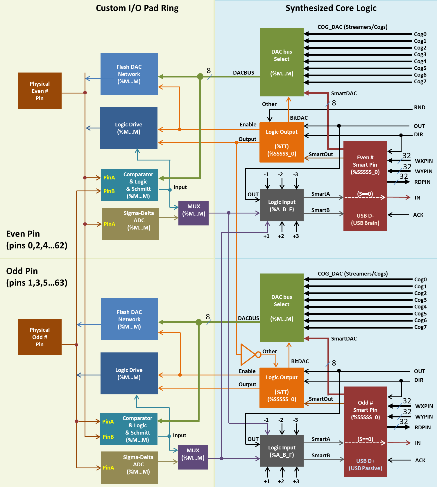

### Smart Pin Block Diagram

**Figure 1.1: Smart Pin Block Diagram**  
*Signal Path for Even/Odd Pin Pairs*  
*Original design and diagram by Chip Gracey, Parallax Inc.*

This comprehensive diagram reveals the sophisticated dual-pin architecture at the heart of P2's Smart Pin system. The diagram shows how even pins (0,2,4...62) and odd pins (1,3,5...63) are organized as pairs with shared resources.

**Understanding This Architecture Diagram:**

The density of this diagram is intentional—it captures every signal path and processing option available in the Smart Pin system. Three key insights emerge:

1. **Pin Pairs Share Resources** - Even/odd pins (like 0-1, 2-3, etc.) share certain hardware blocks, which explains why some operations (like differential signaling) work best on pin pairs.

2. **Three-Layer Processing Architecture**:
   - **Analog Layer** (Yellow/left): Physical pin interface with DACs, ADCs, comparators—where real-world signals meet silicon
   - **Digital Core** (Blue/right): The synthesized logic implementing the 32 operating modes
   - **COG Interface** (Top): How all 8 COGs can stream data to any pin's DAC or exchange data with Smart Pin cores

3. **Flexible Signal Routing** - The PinA/PinB routing system allows any Smart Pin to read from its neighbors (±3 pins), enabling complex multi-pin operations without COG involvement.

**Practical Implications:**

- **Differential Protocols**: Use adjacent pins for best performance
- **Analog Feedback Loops**: Create between pins using internal routing
- **Pin Monitoring**: One pin can watch another's output automatically
- **COG Streaming**: Any COG can drive any pin's DAC directly

This architecture enables capabilities like running USB on one pin pair while simultaneously sampling analog on another, all while a third pair generates precise PWM—with zero COG overhead after configuration.