# P2 Datasheet Image Catalog

**Source Document**: Propeller2-P2X8C4M64P-Datasheet-20221101.pdf  
**Extraction Date**: 2025-09-06  
**Total Images**: 39 successfully extracted images  
**Success Rate**: 100% (39/39 properly cropped images)  
**Numbering**: P2DS-001 through P2DS-039 (P2 DataSheet sequential numbering)  

## Images

### **P2DS-001** | Page 1 - Parallax Contact Banner
**File**: `Propeller2-P2X8C4M64P-Datasheet-20221101_page01_img01.png`  
**Dimensions**: 904×152 pixels, 45KB  
  
**Type**: Contact/Logo  
**Description**: Parallax contact information banner  
**Context**: www.parallax.com/P2 ⌘ sales@parallax.com ⌘ support@parallax.com ⌘ +1 888-512-1024  

---

### **P2DS-002** | Page 1 - RAM Memory Configuration  
**File**: `Propeller2-P2X8C4M64P-Datasheet-20221101_page01_img02.png`  
**Dimensions**: 1294×1292 pixels, 166KB  
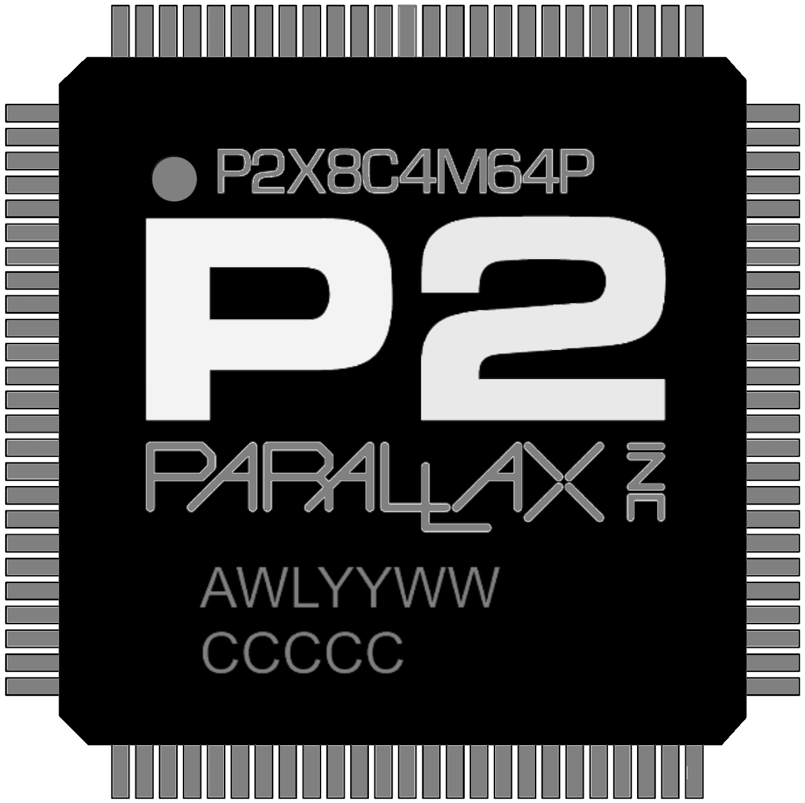  
**Type**: Architecture Diagram  
**Description**: Propeller 2 (P2X8C4M64P) RAM Memory Configuration diagram  
**Context**: Main architectural overview showing memory layout  

---

### **P2DS-003** | Page 6 - Pin Descriptions Table  
**File**: `Propeller2-P2X8C4M64P-Datasheet-20221101_page06_img01.png`  
**Dimensions**: 842×817 pixels, 69KB  
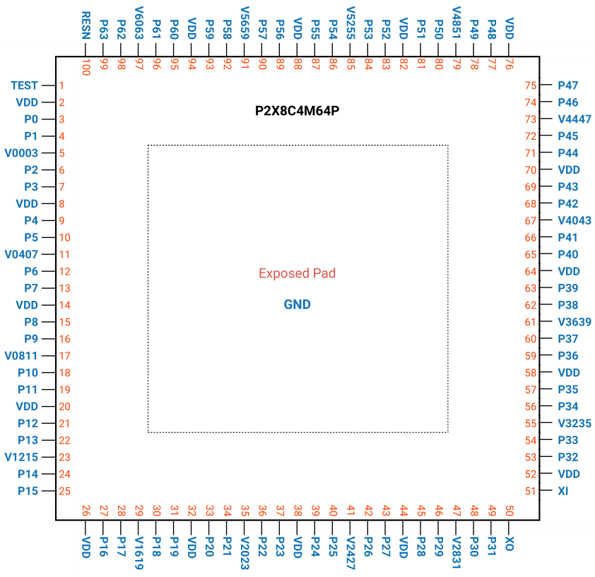  
**Type**: Reference Table  
**Description**: Pin descriptions table  
**Context**: Pin Name Direction V (typ) Description  

---

### **P2DS-004** | Page 7 - Minimal Connections Schematic  
**File**: `Propeller2-P2X8C4M64P-Datasheet-20221101_page07_img01.png`  
**Dimensions**: 1496×866 pixels, 36KB  
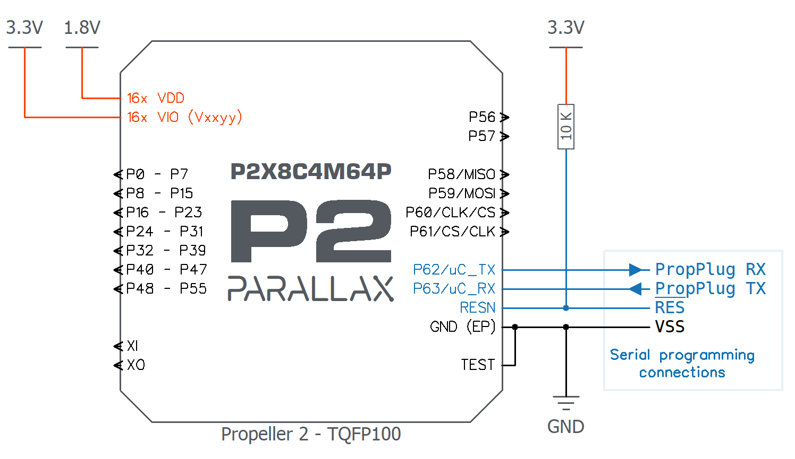  
**Type**: Circuit Schematic  
**Description**: Minimal Propeller 2 Connections schematic  
**Context**: The Propeller 2 is programmed via four wires and may optionally include an external crystal, reset switch, SPI Flash and/or microSD memory  

---

### **P2DS-005** | Page 8 - SPI Flash Boot Circuit  
**File**: `Propeller2-P2X8C4M64P-Datasheet-20221101_page08_img01.png`  
**Dimensions**: 779×475 pixels, 14KB  
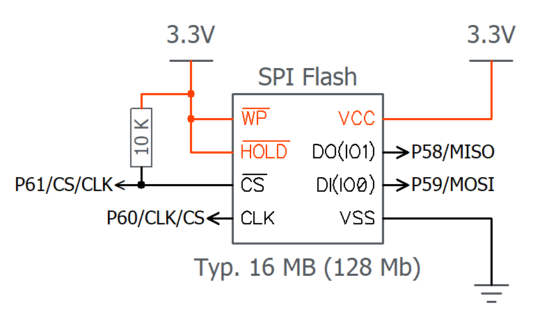  
**Type**: Circuit Schematic  
**Description**: SPI Flash Boot Memory Connections  
**Context**: Note that the RESN pin must always be pulled high (to 3.3 V) with an external resistor  

---

### **P2DS-006** | Page 8 - External Crystal Circuit ⭐ **CROPPED**  
**File**: `Propeller2-P2X8C4M64P-Datasheet-20221101_page08_img02.png`  
**Dimensions**: 389×473 pixels, 15KB  
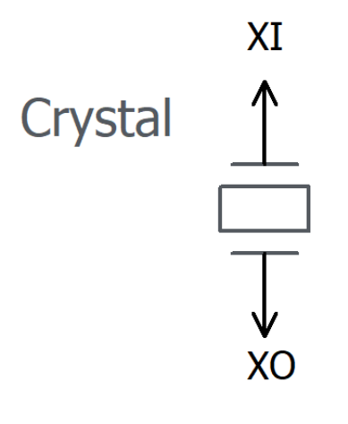  
**Type**: Circuit Detail  
**Description**: External crystal circuit  
**Context**: The internal clock reference is good for very low power applications, but is also fairly low accuracy  

---

### **P2DS-007** | Page 8 - Reset Switch Circuit ⭐ **CROPPED**  
**File**: `Propeller2-P2X8C4M64P-Datasheet-20221101_page08_img03.png`  
**Dimensions**: 473×255 pixels, 7KB  
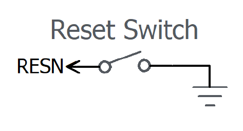  
**Type**: Circuit Detail  
**Description**: Reset switch circuit  
**Context**: Reset Switch can be optionally included and is a convenient way to restart the Propeller 2  

---

### **P2DS-008** | Page 9 - MicroSD Boot Circuit  
**File**: `Propeller2-P2X8C4M64P-Datasheet-20221101_page09_img01.png`  
**Dimensions**: 558×528 pixels, 12KB  
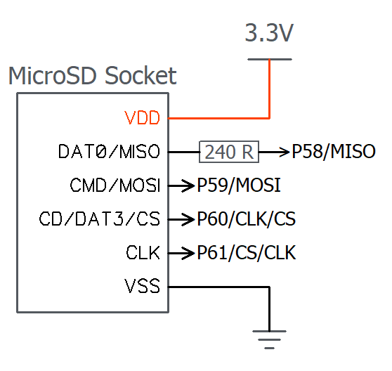  
**Type**: Circuit Schematic  
**Description**: MicroSD Boot Memory Connections  
**Context**: microSD card must be formatted as FAT32 with boot firmware file _BOOT_P2.BIX  

---

### **P2DS-009** | Page 10 - Dual Boot Memory Circuit  
**File**: `Propeller2-P2X8C4M64P-Datasheet-20221101_page10_img01.png`  
**Dimensions**: 1482×727 pixels, 29KB  
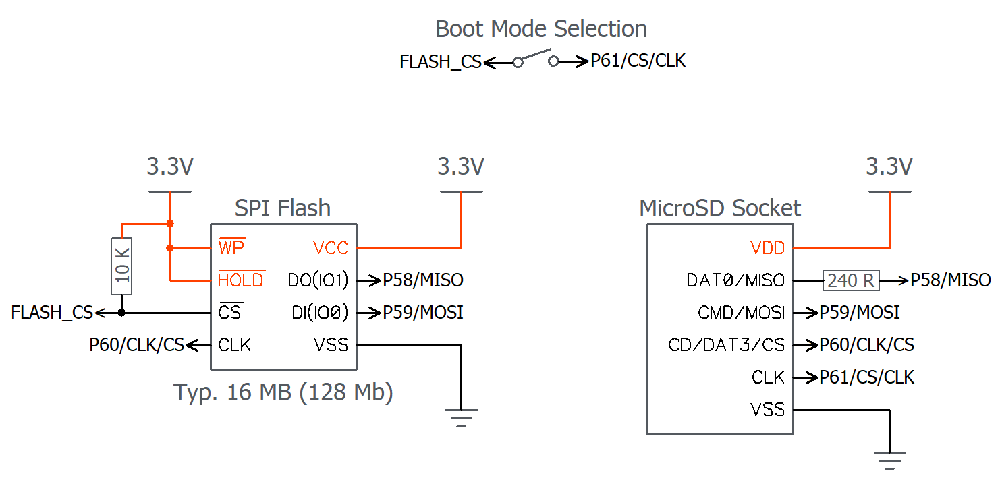  
**Type**: Circuit Schematic  
**Description**: Dual Boot Memory Connections  
**Context**: Boot Mode Selection switch determines the active boot device; either SPI Flash or microSD  

---

### **P2DS-010** | Page 13 - Cog RAM Architecture  
**File**: `Propeller2-P2X8C4M64P-Datasheet-20221101_page13_img01.png`  
**Dimensions**: 2500×1531 pixels, 236KB  
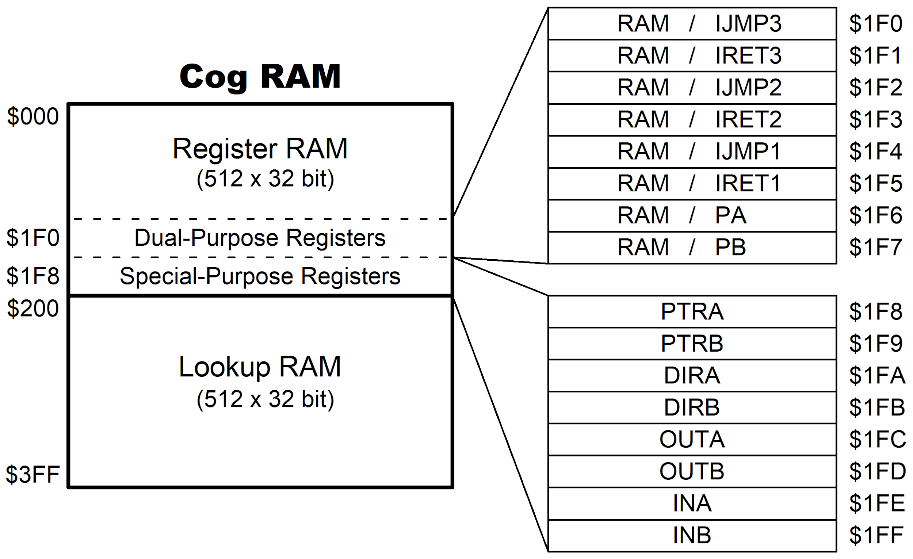  
**Type**: Architecture Diagram  
**Description**: Cog RAM organization showing Register RAM and Lookup RAM  
**Context**: Each cog's RAM is made of two blocks of 512 longs (512 x 32), called Register RAM and Lookup RAM  

---

### **P2DS-011** | Page 17 - Hub RAM Access Diagram  
**File**: `Propeller2-P2X8C4M64P-Datasheet-20221101_page17_img01.png`  
**Dimensions**: 400×500 pixels, 14KB  
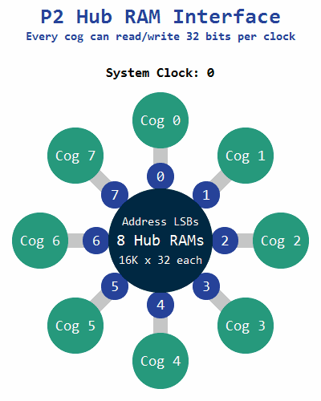  
**Type**: Access Diagram  
**Description**: Hub RAM access timing diagram  
**Context**: Cogs can access Hub RAM either via the sequential FIFO interface, or by waiting for RAM slices  

---

### **P2DS-012** | Page 22 - Input Timing Chart ⭐ **CROPPED**  
**File**: `Propeller2-P2X8C4M64P-Datasheet-20221101_page22_img02.png`  
**Dimensions**: 1400×348 pixels, 69KB  
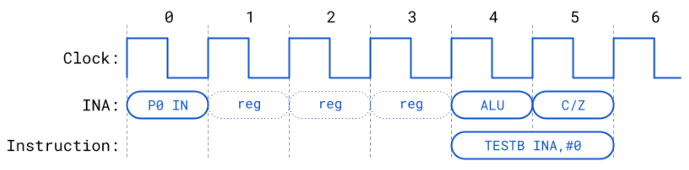  
**Type**: Timing Chart  
**Description**: Input timing diagram using TESTB  
**Context**: IN register reflects the state of the pins registered three clocks before the start of the instruction  

---

### **P2DS-013** | Page 22 - TESTP Timing Chart ⭐ **CROPPED**  
**File**: `Propeller2-P2X8C4M64P-Datasheet-20221101_page22_img03.png`  
**Dimensions**: 1400×350 pixels, 63KB  
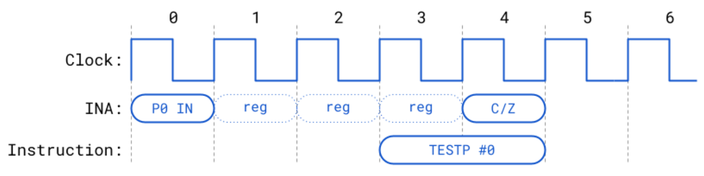  
**Type**: Timing Chart  
**Description**: TESTP/TESTPN timing diagram  
**Context**: TESTP/TESTPN get fresher IN data than is available via the IN registers  

---

### **P2DS-014** | Page 26 - I/O Pin Circuit ⭐ **CROPPED**  
**File**: `Propeller2-P2X8C4M64P-Datasheet-20221101_page26_img01.png`  
**Dimensions**: 657×1054 pixels, 61KB  
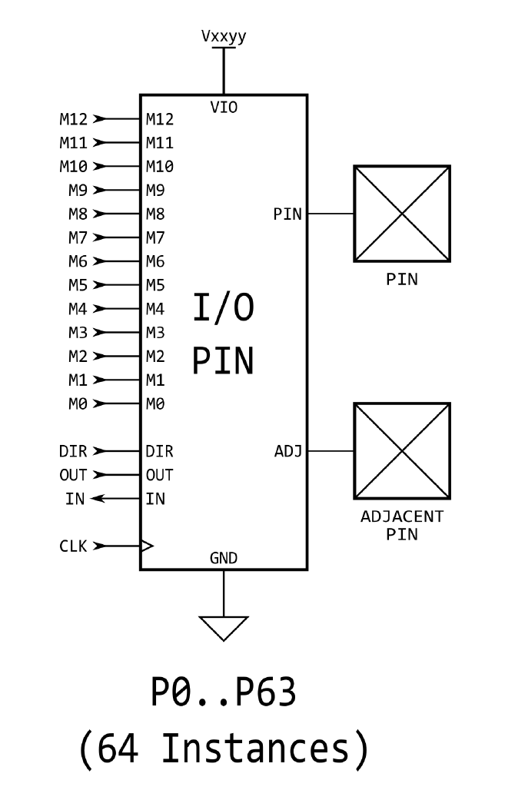  
**Type**: Circuit Diagram  
**Description**: Single I/O pin circuit diagram  
**Context**: I/O pin circuit powered from its local 3.3V supply pin (Vxxyy), connects to its own physical pin and adjacent pin  

---

## I/O Pin Equivalent Schematics Matrix ⭐ **ALL CROPPED** (P2DS-015 through P2DS-038)

### **P2DS-015** | Page 27 - I/O Schematic Row 1 ⭐ **CROPPED**  
**File**: `Propeller2-P2X8C4M64P-Datasheet-20221101_page27_img01.png`  
**Dimensions**: 1400×400 pixels, 65KB  
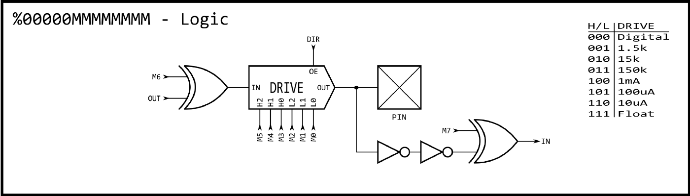  
**Type**: Circuit Matrix  
**Description**: I/O pin equivalent schematics - Row 1 of matrix  

---

### **P2DS-016** | Page 27 - I/O Schematic Row 2 ⭐ **CROPPED**  
**File**: `Propeller2-P2X8C4M64P-Datasheet-20221101_page27_img02.png`  
**Dimensions**: 1400×442 pixels, 54KB  
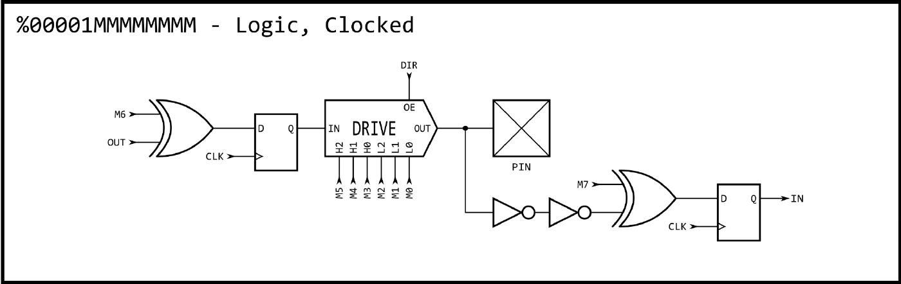  
**Type**: Circuit Matrix  
**Description**: I/O pin equivalent schematics - Row 2 of matrix  

---

### **P2DS-017** | Page 27 - I/O Schematic Row 3 ⭐ **CROPPED**  
**File**: `Propeller2-P2X8C4M64P-Datasheet-20221101_page27_img03.png`  
**Dimensions**: 1400×460 pixels, 52KB  
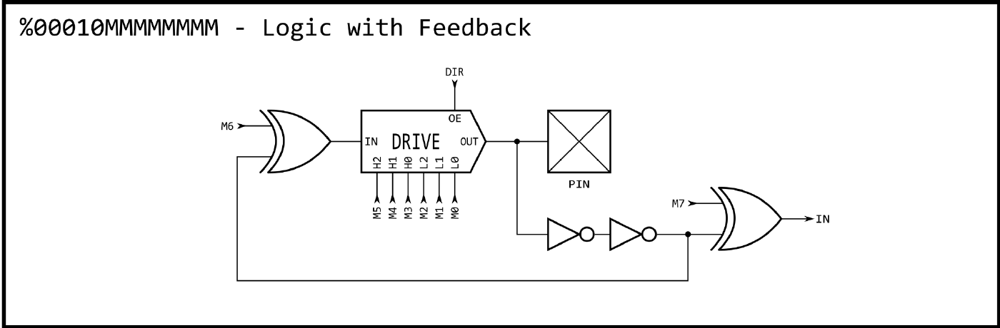  
**Type**: Circuit Matrix  
**Description**: I/O pin equivalent schematics - Row 3 of matrix  

---

### **P2DS-018** | Page 27 - I/O Schematic Row 4 ⭐ **CROPPED**  
**File**: `Propeller2-P2X8C4M64P-Datasheet-20221101_page27_img04.png`  
**Dimensions**: 1400×464 pixels, 58KB  
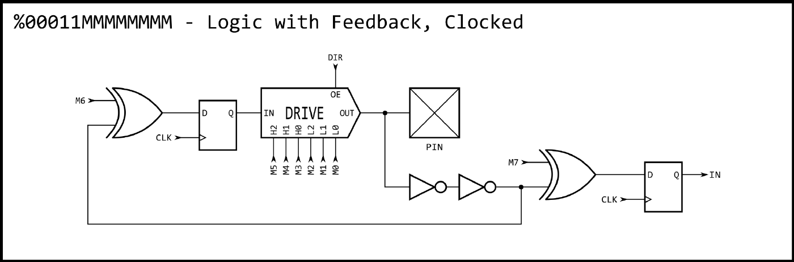  
**Type**: Circuit Matrix  
**Description**: I/O pin equivalent schematics - Row 4 of matrix  

---

### **P2DS-019** | Page 28 - I/O Schematic Row 5 ⭐ **CROPPED**  
**File**: `Propeller2-P2X8C4M64P-Datasheet-20221101_page28_img01.png`  
**Dimensions**: 1400×465 pixels, 60KB  
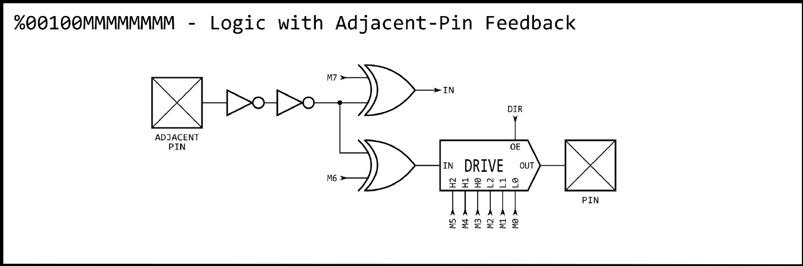  
**Type**: Circuit Matrix  
**Description**: I/O pin equivalent schematics - Row 5 of matrix  

---

### **P2DS-020** | Page 28 - I/O Schematic Row 6 ⭐ **CROPPED**  
**File**: `Propeller2-P2X8C4M64P-Datasheet-20221101_page28_img02.png`  
**Dimensions**: 1400×461 pixels, 66KB  
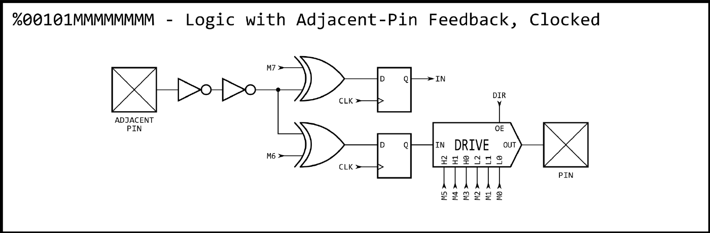  
**Type**: Circuit Matrix  
**Description**: I/O pin equivalent schematics - Row 6 of matrix  

---

### **P2DS-021** | Page 28 - I/O Schematic Row 7 ⭐ **CROPPED**  
**File**: `Propeller2-P2X8C4M64P-Datasheet-20221101_page28_img03.png`  
**Dimensions**: 1400×398 pixels, 46KB  
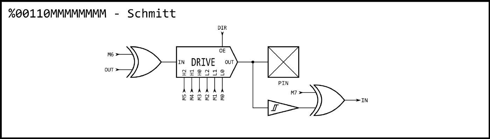  
**Type**: Circuit Matrix  
**Description**: I/O pin equivalent schematics - Row 7 of matrix  

---

### **P2DS-022** | Page 28 - I/O Schematic Row 8 ⭐ **CROPPED**  
**File**: `Propeller2-P2X8C4M64P-Datasheet-20221101_page28_img04.png`  
**Dimensions**: 1400×441 pixels, 52KB  
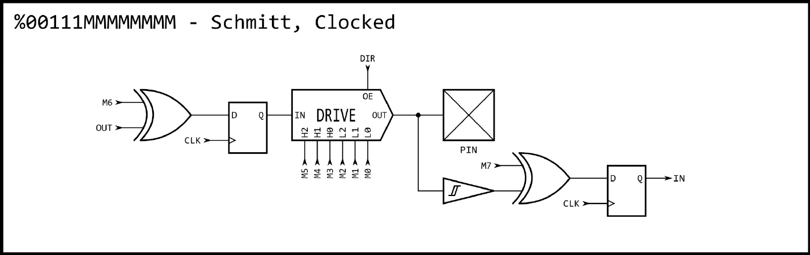  
**Type**: Circuit Matrix  
**Description**: I/O pin equivalent schematics - Row 8 of matrix  

---

### **P2DS-023** | Page 29 - I/O Schematic Row 9 ⭐ **CROPPED**  
**File**: `Propeller2-P2X8C4M64P-Datasheet-20221101_page29_img01.png`  
**Dimensions**: 1400×465 pixels, 50KB  
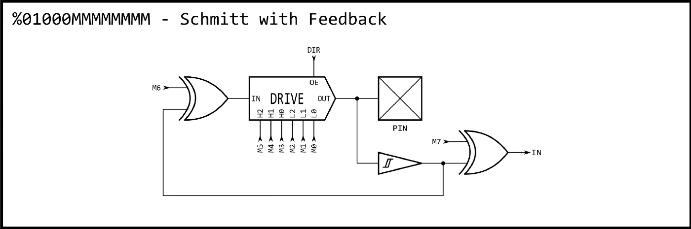  
**Type**: Circuit Matrix  
**Description**: I/O pin equivalent schematics - Row 9 of matrix  

---

### **P2DS-024** | Page 29 - I/O Schematic Row 10 ⭐ **CROPPED**  
**File**: `Propeller2-P2X8C4M64P-Datasheet-20221101_page29_img02.png`  
**Dimensions**: 1400×461 pixels, 57KB  
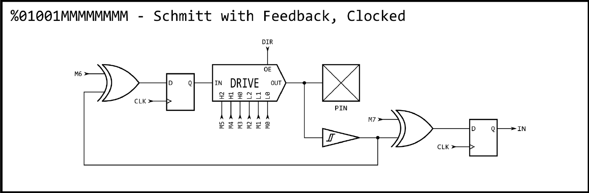  
**Type**: Circuit Matrix  
**Description**: I/O pin equivalent schematics - Row 10 of matrix  

---

### **P2DS-025** | Page 29 - I/O Schematic Row 11 ⭐ **CROPPED**  
**File**: `Propeller2-P2X8C4M64P-Datasheet-20221101_page29_img03.png`  
**Dimensions**: 1400×461 pixels, 57KB  
  
**Type**: Circuit Matrix  
**Description**: I/O pin equivalent schematics - Row 11 of matrix  

---

### **P2DS-026** | Page 29 - I/O Schematic Row 12 ⭐ **CROPPED**  
**File**: `Propeller2-P2X8C4M64P-Datasheet-20221101_page29_img04.png`  
**Dimensions**: 1400×465 pixels, 50KB  
  
**Type**: Circuit Matrix  
**Description**: I/O pin equivalent schematics - Row 12 of matrix  

---

### **P2DS-027** | Page 30 - I/O Schematic Row 13 ⭐ **CROPPED**  
**File**: `Propeller2-P2X8C4M64P-Datasheet-20221101_page30_img01.png`  
**Dimensions**: 1400×460 pixels, 54KB  
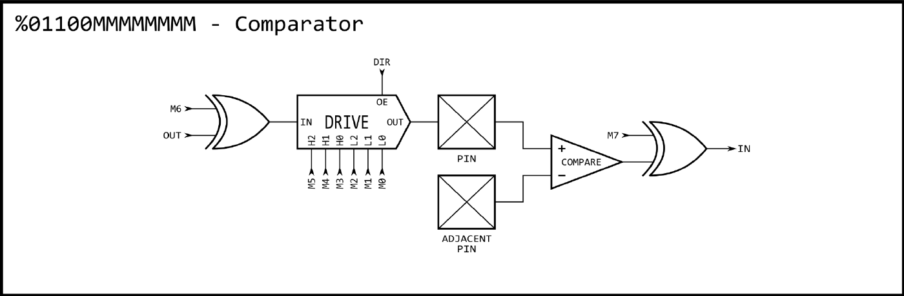  
**Type**: Circuit Matrix  
**Description**: I/O pin equivalent schematics - Row 13 of matrix  

---

### **P2DS-028** | Page 30 - I/O Schematic Row 14 ⭐ **CROPPED**  
**File**: `Propeller2-P2X8C4M64P-Datasheet-20221101_page30_img02.png`  
**Dimensions**: 1400×460 pixels, 60KB  
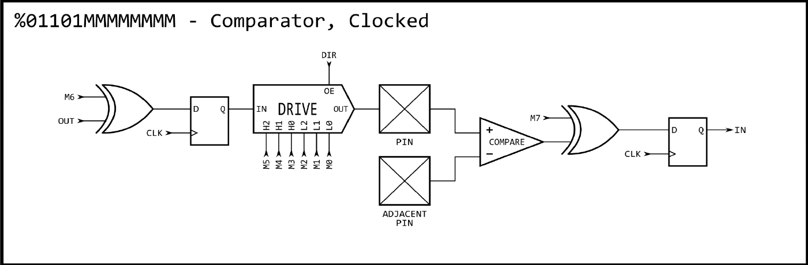  
**Type**: Circuit Matrix  
**Description**: I/O pin equivalent schematics - Row 14 of matrix  

---

### **P2DS-029** | Page 30 - I/O Schematic Row 15 ⭐ **CROPPED**  
**File**: `Propeller2-P2X8C4M64P-Datasheet-20221101_page30_img03.png`  
**Dimensions**: 1400×460 pixels, 55KB  
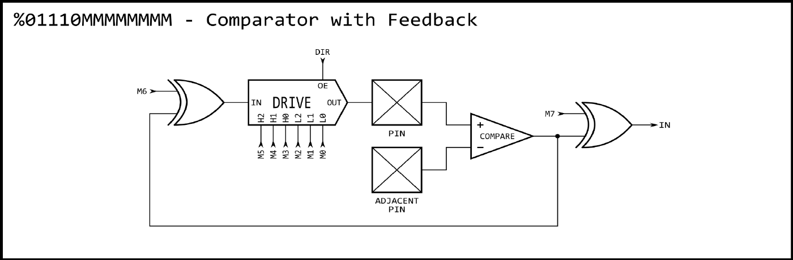  
**Type**: Circuit Matrix  
**Description**: I/O pin equivalent schematics - Row 15 of matrix  

---

### **P2DS-030** | Page 30 - I/O Schematic Row 16 ⭐ **CROPPED**  
**File**: `Propeller2-P2X8C4M64P-Datasheet-20221101_page30_img04.png`  
**Dimensions**: 1400×460 pixels, 61KB  
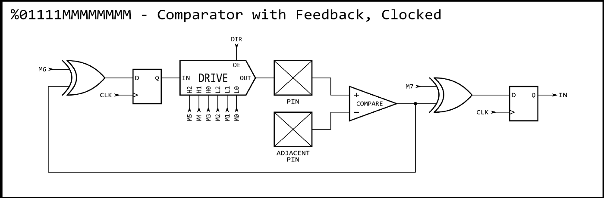  
**Type**: Circuit Matrix  
**Description**: I/O pin equivalent schematics - Row 16 of matrix  

---

### **P2DS-031** | Page 31 - I/O Schematic Row 17 ⭐ **CROPPED**  
**File**: `Propeller2-P2X8C4M64P-Datasheet-20221101_page31_img01.png`  
**Dimensions**: 1400×435 pixels, 68KB  
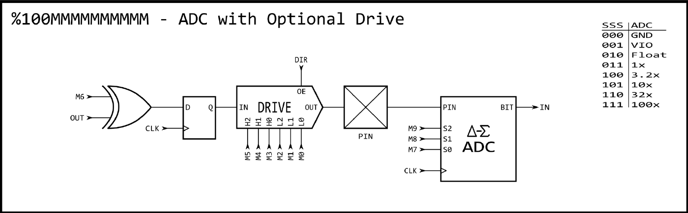  
**Type**: Circuit Matrix  
**Description**: I/O pin equivalent schematics - Row 17 of matrix  

---

### **P2DS-032** | Page 31 - I/O Schematic Row 18 ⭐ **CROPPED**  
**File**: `Propeller2-P2X8C4M64P-Datasheet-20221101_page31_img02.png`  
**Dimensions**: 1400×369 pixels, 58KB  
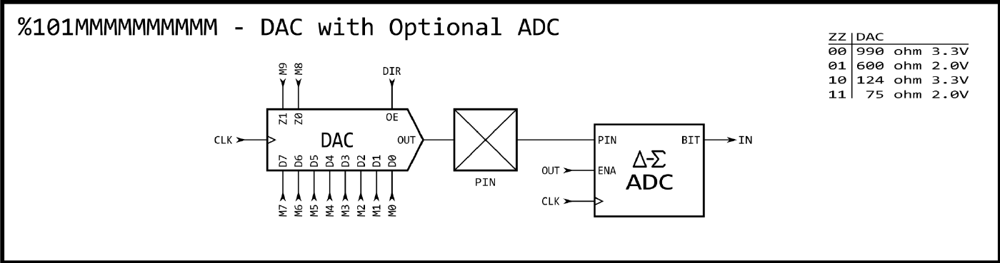  
**Type**: Circuit Matrix  
**Description**: I/O pin equivalent schematics - Row 18 of matrix  

---

### **P2DS-033** | Page 31 - I/O Schematic Row 19 ⭐ **CROPPED**  
**File**: `Propeller2-P2X8C4M64P-Datasheet-20221101_page31_img03.png`  
**Dimensions**: 1400×509 pixels, 51KB  
  
**Type**: Circuit Matrix  
**Description**: I/O pin equivalent schematics - Row 19 of matrix  

---

### **P2DS-034** | Page 31 - I/O Schematic Row 20 ⭐ **CROPPED**  
**File**: `Propeller2-P2X8C4M64P-Datasheet-20221101_page31_img04.png`  
**Dimensions**: 1400×509 pixels, 51KB  
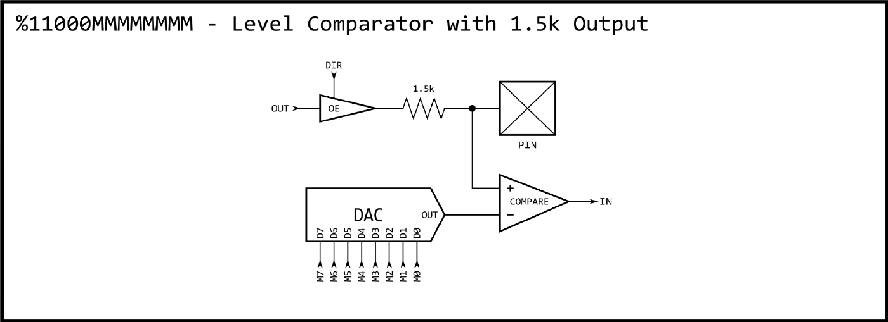  
**Type**: Circuit Matrix  
**Description**: I/O pin equivalent schematics - Row 20 of matrix  

---

### **P2DS-035** | Page 32 - I/O Schematic Row 21 ⭐ **CROPPED**  
**File**: `Propeller2-P2X8C4M64P-Datasheet-20221101_page32_img01.png`  
**Dimensions**: 1400×460 pixels, 50KB  
  
**Type**: Circuit Matrix  
**Description**: I/O pin equivalent schematics - Row 21 of matrix  

---

### **P2DS-036** | Page 32 - I/O Schematic Row 22 ⭐ **CROPPED**  
**File**: `Propeller2-P2X8C4M64P-Datasheet-20221101_page32_img02.png`  
**Dimensions**: 1400×460 pixels, 50KB  
  
**Type**: Circuit Matrix  
**Description**: I/O pin equivalent schematics - Row 22 of matrix  

---

### **P2DS-037** | Page 32 - I/O Schematic Row 23 ⭐ **CROPPED**  
**File**: `Propeller2-P2X8C4M64P-Datasheet-20221101_page32_img03.png`  
**Dimensions**: 1400×460 pixels, 50KB  
  
**Type**: Circuit Matrix  
**Description**: I/O pin equivalent schematics - Row 23 of matrix  

---

### **P2DS-038** | Page 32 - I/O Schematic Row 24 ⭐ **CROPPED**  
**File**: `Propeller2-P2X8C4M64P-Datasheet-20221101_page32_img04.png`  
**Dimensions**: 1400×460 pixels, 50KB  
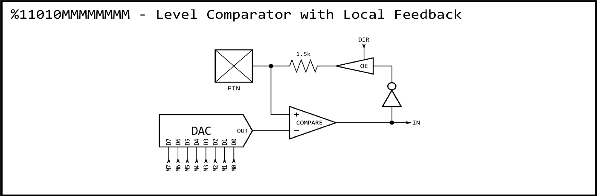  
**Type**: Circuit Matrix  
**Description**: I/O pin equivalent schematics - Row 24 of matrix  

---

### **P2DS-039** | Page 49 - Package Diagram  
**File**: `Propeller2-P2X8C4M64P-Datasheet-20221101_page49_img01.png`  
**Dimensions**: 1451×2201 pixels, 397KB  
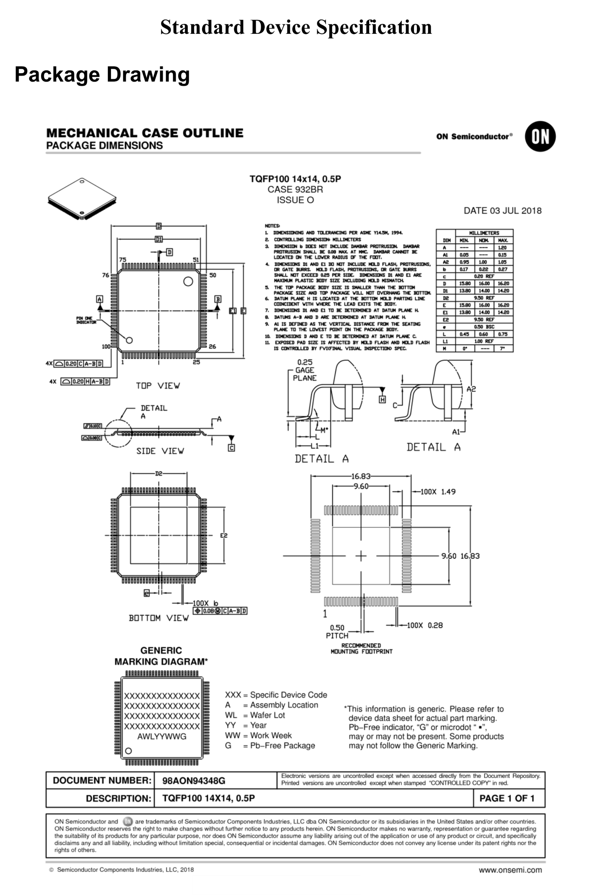  
**Type**: Package Specification  
**Description**: Physical package diagram and specifications  
**Context**: Complete packaging information for P2X8C4M64P  

---

## 📊 Quick Reference by Type

### **High-Value Technical Diagrams**
- **P2DS-002**: RAM Configuration (1294×1292) - Core architecture  
- **P2DS-004**: Minimal Connections (1496×866) - Essential hardware setup
- **P2DS-010**: Cog RAM Layout (2500×1531) - Processor architecture
- **P2DS-012, P2DS-013**: Timing diagrams (1400×350) - Critical timing specs
- **P2DS-014**: I/O Pin Circuit (657×1054) - Pin architecture
- **P2DS-039**: Package diagram (1451×2201) - Physical specifications

### **Boot Configuration Circuits**
- **P2DS-005**: SPI Flash Boot (779×475)
- **P2DS-006**: External Crystal (389×473) ⭐ **CROPPED**
- **P2DS-007**: Reset Switch (473×255) ⭐ **CROPPED**
- **P2DS-008**: MicroSD Boot (558×528)  
- **P2DS-009**: Dual Boot (1482×727)

### **I/O Schematic Matrix** (P2DS-015 through P2DS-038)
- 24 cropped images, all 1400×400-500 pixels
- Complete matrix of I/O pin equivalent circuits
- Systematic coverage of all pin modes

### **Reference/Lower Priority**
- **P2DS-001**: Contact banner (904×152) - Just contact info
- **P2DS-003**: Pin table (842×817) - Text table, not diagram
- **P2DS-011**: Small hub diagram (400×500) - Minor detail

## Usage Examples

**Easy Reference**: 
- "Please update the description for P2DS-027" ✅
- "P2DS-015 through P2DS-038 are the I/O matrix" ✅
- "P2DS-006 and P2DS-007 are the small cropped circuits" ✅

**Instead of**: 
- "Update Propeller2-P2X8C4M64P-Datasheet-20221101_page30_img01.png" ❌

---

**Document Prefix**: P2DS  
**Total Images**: 39 (P2DS-001 through P2DS-039)  
**Success Rate**: 100% properly cropped and numbered