# Propeller 2 (P2X8C4M64P) Datasheet — Image / Figure Catalog

- **Source document:** Parallax Propeller 2 (P2X8C4M64P) Datasheet, © Parallax Inc., dated 2022/11/01 (`Propeller2-P2X8C4M64P-Datasheet-20221101.pdf`, 50 pages)
- **Trust tier:** 🏆 Parallax primary documentary source
- **Catalog date:** 2026-07-06
- **Extraction method:** Full-page **vector-safe render** via `pdftoppm @ 150 DPI` (renders the composited page, so it captures vector line-art — schematics and block diagrams — that embedded-image extraction misses).
- **ID scheme:** Sequential `P2DS-R001` … `P2DS-R038` (one ID per distinct figure/panel; a page may hold several panels).
- **Total figure pages captured:** 16 (pages 6, 7, 8, 9, 10, 13, 17, 22, 26, 27, 28, 29, 30, 31, 32, 49)
- **Total distinct figures cataloged:** 38

> ## ⚠️ SUPERSESSION NOTE
> This catalog **supersedes** [`../images-20250906/`](../images-20250906/), which used **embedded-image extraction** (`pdfimages`) and therefore **missed all vector schematics** — including the entire "Equivalent Schematics for Each Unique I/O Pin Configuration" section (pages 26–32) and the ADC/DAC analog front-end panels. The `images-20250906/` folder is **retained for history only**. **THIS folder (`images-20260706/`) is the source of truth for datasheet figures.**

---

## ADC-Relevant Figures — Quick Index

Per the extraction rubric, every panel in the **"Equivalent Schematics for Each Unique I/O Pin Configuration"** section (pages 26–32) touches the pin analog front-end and is flagged ADC-relevant. The **highest-value analog panels** — true ADC / DAC / sigma-delta / comparator front-ends — are marked ★.

| ID | Page | Panel / Mode | Why analog-relevant |
|----|------|--------------|---------------------|
| ★ P2DS-R013 | 26 | Single I/O Pin Circuit (top-level, 64 instances) | Master pin front-end block; feeds all pin modes incl. ADC/DAC |
| P2DS-R014…R017 | 27 | `%00000`–`%00011` Logic / Logic+Feedback (±Clocked) | Pin equivalent schematics (DRIVE strength front-end) |
| P2DS-R018…R021 | 28 | `%00100`–`%00111` Adjacent-Pin Feedback / Schmitt (±Clocked) | Pin equivalent schematics (Schmitt input threshold) |
| P2DS-R022…R025 | 29 | `%01000`–`%01011` Schmitt Feedback variants (±Clocked) | Pin equivalent schematics (Schmitt input threshold) |
| ★ P2DS-R026 | 30 | `%01100` Comparator | Comparator input mode (PIN vs ADJACENT PIN) |
| ★ P2DS-R027 | 30 | `%01101` Comparator, Clocked | Comparator input mode |
| ★ P2DS-R028 | 30 | `%01110` Comparator with Feedback | Comparator input mode |
| ★ P2DS-R029 | 30 | `%01111` Comparator with Feedback, Clocked | Comparator input mode |
| ★ P2DS-R030 | 31 | `%100` **ADC with Optional Drive** | Δ-Σ ADC front-end; SSS gain table (1×/3.2×/10×/32×/100×) |
| ★ P2DS-R031 | 31 | `%101` **DAC with Optional ADC** | 8-bit DAC + Δ-Σ ADC; ZZ DAC drive table (990Ω/600Ω/124Ω/75Ω) |
| ★ P2DS-R032 | 31 | `%11000` **Level Comparator with 1.5k Output** | 8-bit DAC + analog COMPARE |
| ★ P2DS-R033 | 31 | `%11001` Level Comparator with 1.5k Output, Clocked | 8-bit DAC + analog COMPARE |
| ★ P2DS-R034 | 32 | `%11010` Level Comparator with Local Feedback | 8-bit DAC + analog COMPARE |
| ★ P2DS-R035 | 32 | `%11011` Level Comparator with Local Feedback, Clocked | 8-bit DAC + analog COMPARE |
| ★ P2DS-R036 | 32 | `%111M0` Level Comparator with Separate Feedback | 8-bit DAC + analog COMPARE (PIN + ADJACENT PIN) |
| ★ P2DS-R037 | 32 | `%111M1` Level Comparator with Separate Feedback, Clocked | 8-bit DAC + analog COMPARE (PIN + ADJACENT PIN) |

**Highest-value ADC/DAC redraw targets:** P2DS-R030 (ADC), P2DS-R031 (DAC+ADC), P2DS-R032–R037 (DAC level comparators), and P2DS-R013 (master pin circuit).

---

## Full Figure Catalog

### P2DS-R001 | Page 06 — Chip Pinout (P2X8C4M64P, TQFP-100)
- **Type:** pinout diagram
- **Description:** Top-down pin-assignment drawing of the 100-pin TQFP package showing all numbered pins (1–100) with their signal names (P0–P63 smart I/O, VDD core power, Vxxyy per-group I/O power, XI/XO, TEST, RESN) and the central "Exposed Pad = GND" thermal pad.
- **Tags:** pinout, package, TQFP-100, pin-map, power-pins, exposed-pad
- **ADC-relevant:** no
- 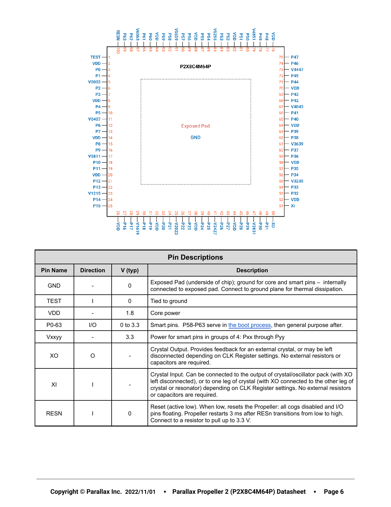

### P2DS-R002 | Page 07 — Minimal Connections
- **Type:** schematic
- **Description:** Minimal-system wiring schematic: P2 TQFP-100 with 16× VDD (1.8 V) and 16× VIO/Vxxyy (3.3 V) power rails, pin-bank labels (P0–P55 in groups of 8), SPI/boot pins P56–P61, serial programming pins P62/uC_TX & P63/uC_RX to a PropPlug (RX/TX/RES), RESN with 10 kΩ pull-up, and TEST/GND to ground.
- **Tags:** schematic, minimal-connections, power, PropPlug, serial-programming, reset, TQFP-100
- **ADC-relevant:** no
- 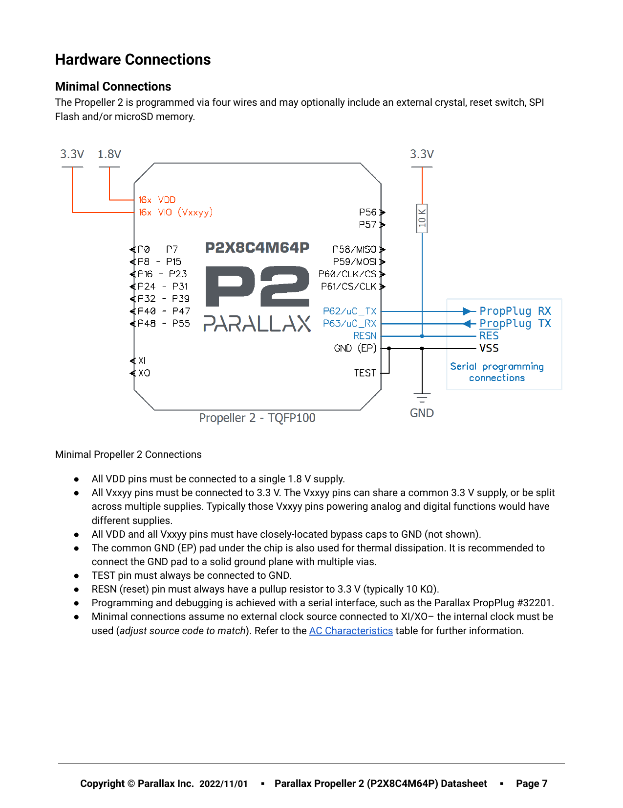

### P2DS-R003 | Page 08 — External Crystal
- **Type:** schematic
- **Description:** Small connection diagram showing a crystal wired between XI and XO (no external resistors/capacitors required); supports crystal, oscillator pack, or MEMS resonator on XI.
- **Tags:** schematic, crystal, oscillator, XI, XO, clock-source
- **ADC-relevant:** no
- 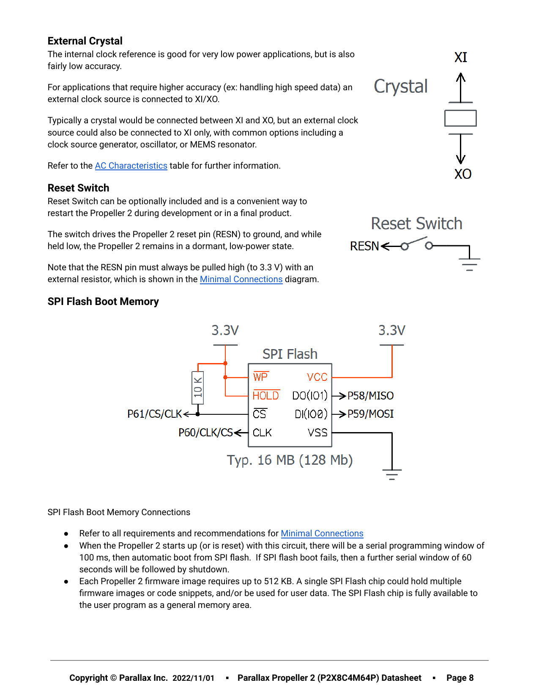 *(page also holds R004 and R005)*

### P2DS-R004 | Page 08 — Reset Switch
- **Type:** schematic
- **Description:** Reset-switch diagram: a momentary switch drives RESN to ground; while held low the P2 is dormant/low-power. RESN must otherwise be pulled to 3.3 V (per Minimal Connections).
- **Tags:** schematic, reset, RESN, switch
- **ADC-relevant:** no
- 

### P2DS-R005 | Page 08 — SPI Flash Boot Memory
- **Type:** schematic
- **Description:** SPI Flash boot wiring (typ. 16 MB / 128 Mb): WP & HOLD & VCC to 3.3 V, CS→P61/CS/CLK with 10 kΩ pull-up, CLK→P60/CLK/CS, DO(IO1)→P58/MISO, DI(IO0)→P59/MOSI, VSS→GND.
- **Tags:** schematic, SPI-flash, boot, memory, P58-P61, MISO, MOSI
- **ADC-relevant:** no
- 

### P2DS-R006 | Page 09 — MicroSD Boot Memory
- **Type:** schematic
- **Description:** MicroSD socket boot wiring: VDD→3.3 V, DAT0/MISO→P58/MISO through a 240 Ω series resistor, CMD/MOSI→P59/MOSI, CD/DAT3/CS→P60/CLK/CS, CLK→P61/CS/CLK, VSS→GND. Boot file `_BOOT_P2.BIX` (or `.BIY`) on FAT32.
- **Tags:** schematic, microSD, SD-card, boot, memory, P58-P61
- **ADC-relevant:** no
- 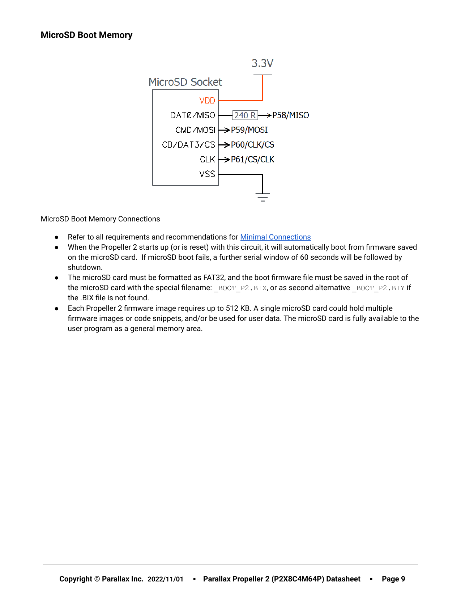

### P2DS-R007 | Page 10 — Dual Boot Memory (with Boot Mode Selection)
- **Type:** schematic
- **Description:** Combined dual-boot wiring showing a Boot Mode Selection switch (FLASH_CS ↔ P61/CS/CLK) selecting between an SPI Flash chip (left) and a MicroSD socket (right), both sharing P58–P61. Switch closed = SPI-Flash boot; switch open = microSD boot.
- **Tags:** schematic, dual-boot, SPI-flash, microSD, boot-mode-selection, memory
- **ADC-relevant:** no
- 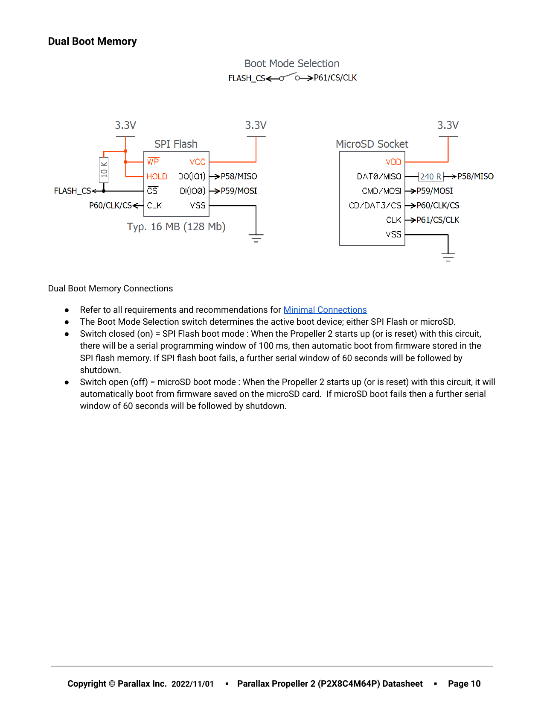

### P2DS-R008 | Page 13 — Cog RAM Organization
- **Type:** block diagram / memory map
- **Description:** Cog RAM map: 512×32 Register RAM ($000–$1FF) over 512×32 Lookup RAM ($200–$3FF), with call-outs expanding the Dual-Purpose Registers ($1F0–$1F7: IJMP3/IRET3…PA/PB) and Special-Purpose Registers ($1F8–$1FF: PTRA, PTRB, DIRA, DIRB, OUTA, OUTB, INA, INB).
- **Tags:** memory-map, cog-RAM, register-RAM, lookup-RAM, special-purpose-registers, address-map
- **ADC-relevant:** no
- 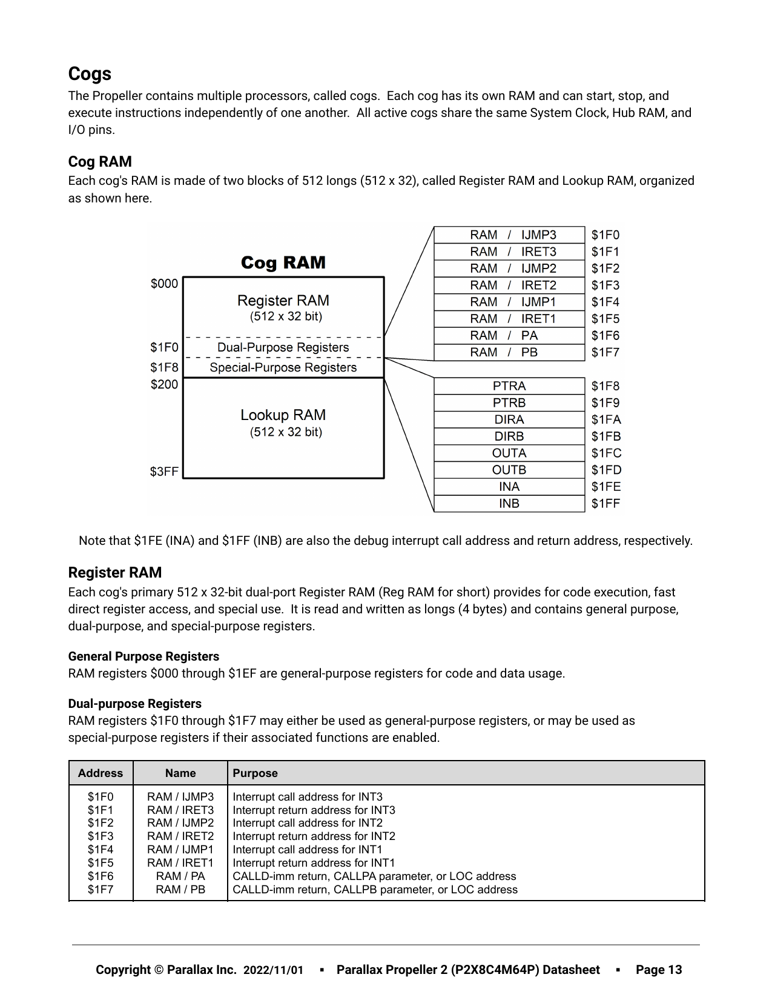

### P2DS-R009 | Page 17 — P2 Hub RAM Interface ("Egg-Beater")
- **Type:** block diagram
- **Description:** Radial "egg-beater" diagram of the hub interface: 8 cogs (Cog 0–7) surrounding a central hub of 8 Hub RAMs (16K×32 each) addressed by address LSBs; every cog can read/write 32 bits per clock via the rotating FIFO slice interface.
- **Tags:** block-diagram, hub-RAM, egg-beater, FIFO, cog-hub-interface, system-clock
- **ADC-relevant:** no
- 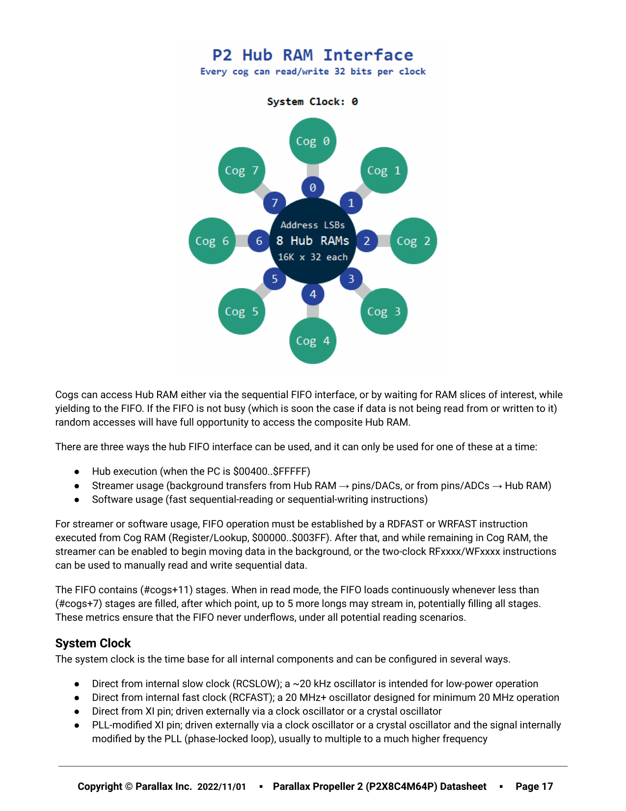

### P2DS-R010 | Page 22 — DIRx/OUTx Change Delay (Timing)
- **Type:** timing / waveform
- **Description:** Waveform showing that changing a DIRx/OUTx bit takes three additional clocks before the pin transitions; `DRVH #0` sets P0 OE and drives P0 latch high, with P0 OE / P0 HIGH beginning transition on the rising edge of clock 5.
- **Tags:** timing, waveform, DIR, OUT, pin-latency, DRVH, propagation-delay
- **ADC-relevant:** no
- 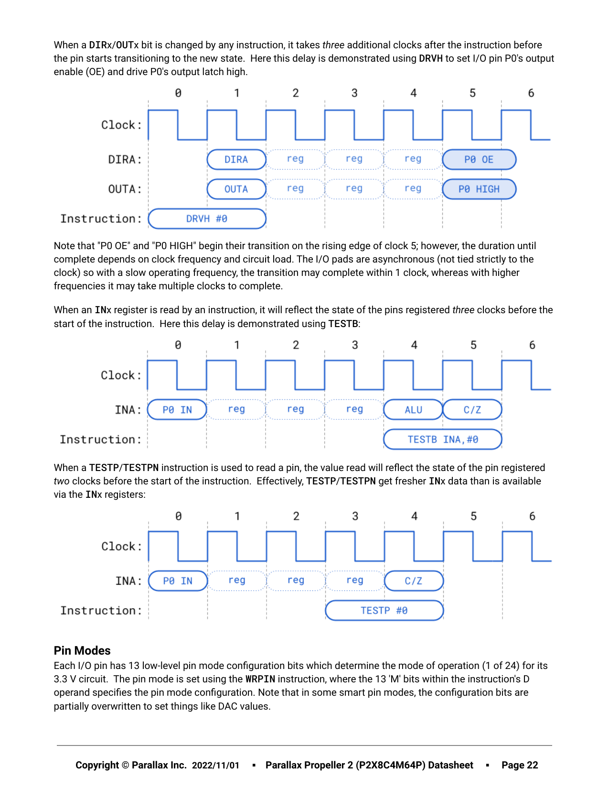 *(page also holds R011 and R012)*

### P2DS-R011 | Page 22 — INx Read Delay (Timing, TESTB)
- **Type:** timing / waveform
- **Description:** Waveform showing an INx register reflects pin state registered three clocks before the instruction start; demonstrated with `TESTB INA,#0`.
- **Tags:** timing, waveform, IN, input-latency, TESTB, propagation-delay
- **ADC-relevant:** no
- 

### P2DS-R012 | Page 22 — TESTP/TESTPN Read Delay (Timing)
- **Type:** timing / waveform
- **Description:** Waveform showing `TESTP/TESTPN` read the pin state registered two clocks before the instruction (fresher than INx registers); demonstrated with `TESTP #0`.
- **Tags:** timing, waveform, TESTP, TESTPN, input-latency, pin-read
- **ADC-relevant:** no
- 

### P2DS-R013 | Page 26 — Single I/O Pin Circuit (Top-Level)
- **Type:** block diagram
- **Description:** Top-level block of one I/O pin (P0..P63, 64 instances) powered from local 3.3 V (Vxxyy). Shows the M12..M0 mode configuration inputs, DIR/OUT/IN and CLK, VIO/GND rails, and connection to its own physical PIN plus its ADJACENT PIN. This is the master front-end that all pin-mode equivalent schematics elaborate.
- **Tags:** block-diagram, io-pin, pin-circuit, mode-bits, adjacent-pin, analog-front-end, master-diagram
- **ADC-relevant:** yes ★ (master pin front-end)
- 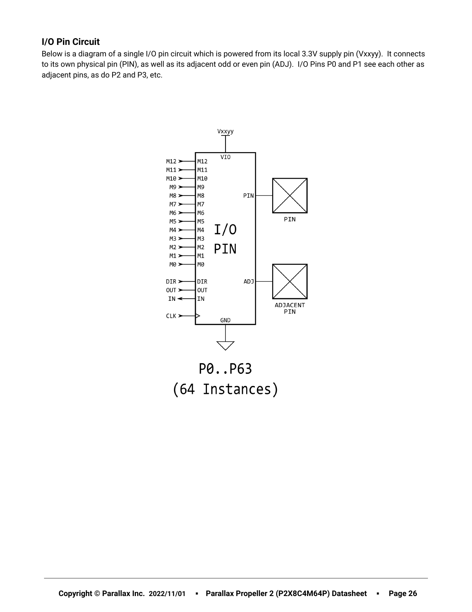

### P2DS-R014 | Page 27 — `%00000` Logic
- **Type:** schematic (equivalent I/O pin config)
- **Description:** Equivalent schematic for Logic mode: OUT/M6 → XOR → DRIVE block (H/L drive-strength table: Digital / 1.5k / 15k / 150k / 1mA / 100uA / 10uA / Float) → PIN; PIN read → inverters → M7 XOR → IN.
- **Tags:** schematic, pin-config, logic, drive-strength, DRIVE-block
- **ADC-relevant:** yes (I/O pin equivalent schematic)
- 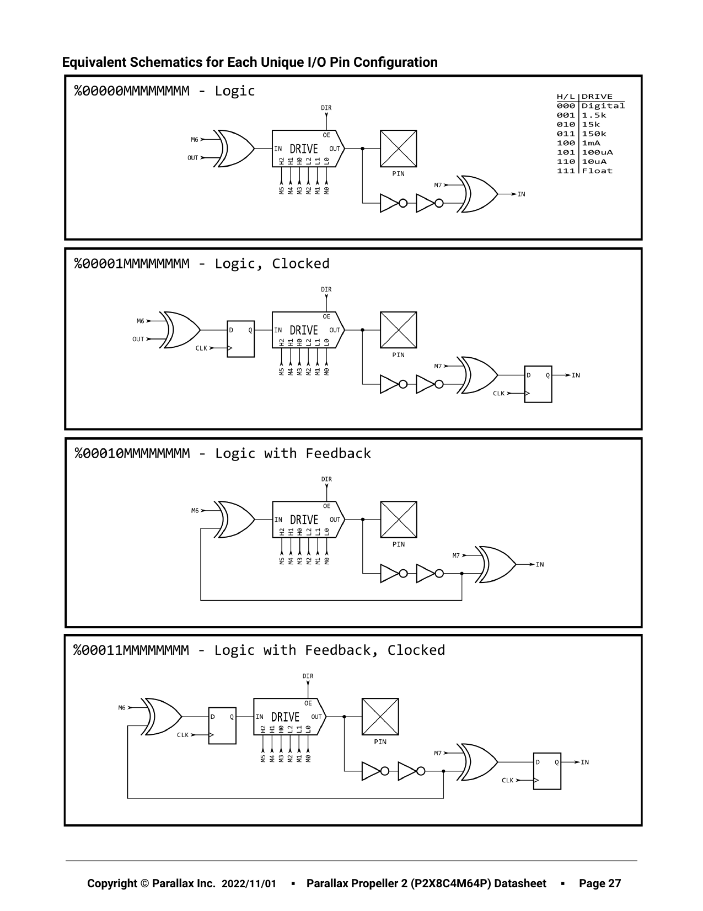 *(page holds R014–R017)*

### P2DS-R015 | Page 27 — `%00001` Logic, Clocked
- **Type:** schematic (equivalent I/O pin config)
- **Description:** Logic mode with input and output paths registered by D flip-flops clocked by CLK.
- **Tags:** schematic, pin-config, logic, clocked, flip-flop
- **ADC-relevant:** yes (I/O pin equivalent schematic)
- 

### P2DS-R016 | Page 27 — `%00010` Logic with Feedback
- **Type:** schematic (equivalent I/O pin config)
- **Description:** Logic mode with the pin-read path fed back into the drive-input XOR (local feedback loop).
- **Tags:** schematic, pin-config, logic, feedback
- **ADC-relevant:** yes (I/O pin equivalent schematic)
- 

### P2DS-R017 | Page 27 — `%00011` Logic with Feedback, Clocked
- **Type:** schematic (equivalent I/O pin config)
- **Description:** Logic-with-feedback variant with both input and output paths registered by CLK-clocked flip-flops.
- **Tags:** schematic, pin-config, logic, feedback, clocked
- **ADC-relevant:** yes (I/O pin equivalent schematic)
- 

### P2DS-R018 | Page 28 — `%00100` Logic with Adjacent-Pin Feedback
- **Type:** schematic (equivalent I/O pin config)
- **Description:** Logic mode where the ADJACENT PIN read (via inverters) feeds both the IN path (M7 XOR) and the DRIVE input (M6 XOR); own PIN is driven.
- **Tags:** schematic, pin-config, logic, adjacent-pin, feedback
- **ADC-relevant:** yes (I/O pin equivalent schematic)
- 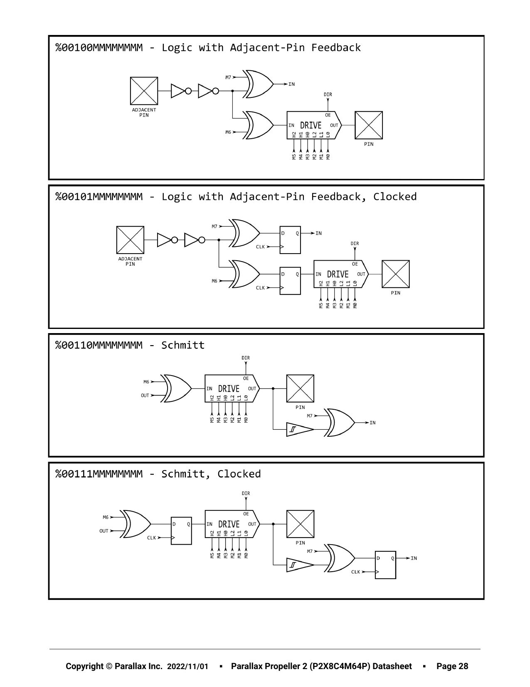 *(page holds R018–R021)*

### P2DS-R019 | Page 28 — `%00101` Logic with Adjacent-Pin Feedback, Clocked
- **Type:** schematic (equivalent I/O pin config)
- **Description:** Adjacent-pin-feedback logic with input/output paths registered by CLK-clocked flip-flops.
- **Tags:** schematic, pin-config, logic, adjacent-pin, feedback, clocked
- **ADC-relevant:** yes (I/O pin equivalent schematic)
- 

### P2DS-R020 | Page 28 — `%00110` Schmitt
- **Type:** schematic (equivalent I/O pin config)
- **Description:** Schmitt-trigger input mode: OUT/M6 XOR → DRIVE → PIN; PIN read passes through a Schmitt-trigger buffer before the M7 XOR to IN (hysteresis input threshold).
- **Tags:** schematic, pin-config, schmitt, hysteresis, input-threshold, analog-input
- **ADC-relevant:** yes (I/O pin equivalent schematic)
- 

### P2DS-R021 | Page 28 — `%00111` Schmitt, Clocked
- **Type:** schematic (equivalent I/O pin config)
- **Description:** Schmitt-trigger input mode with input/output paths registered by CLK-clocked flip-flops.
- **Tags:** schematic, pin-config, schmitt, hysteresis, clocked
- **ADC-relevant:** yes (I/O pin equivalent schematic)
- 

### P2DS-R022 | Page 29 — `%01000` Schmitt with Feedback
- **Type:** schematic (equivalent I/O pin config)
- **Description:** Schmitt input with the Schmitt-buffered pin read fed back into the DRIVE input XOR (local feedback).
- **Tags:** schematic, pin-config, schmitt, feedback, hysteresis
- **ADC-relevant:** yes (I/O pin equivalent schematic)
- 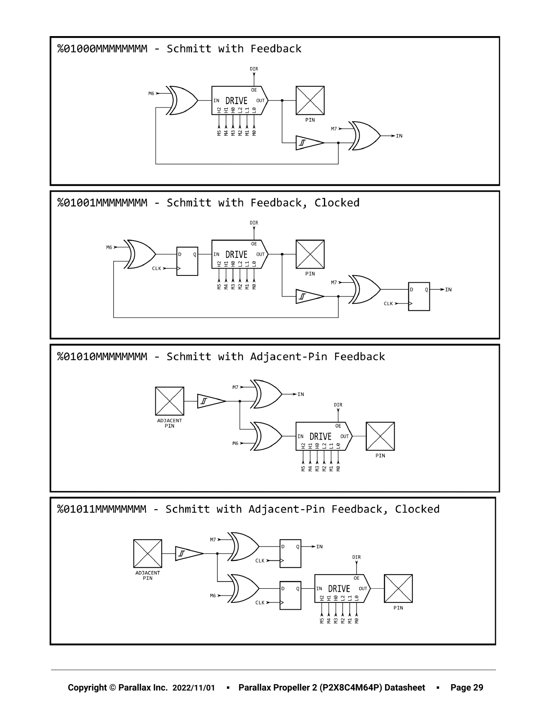 *(page holds R022–R025)*

### P2DS-R023 | Page 29 — `%01001` Schmitt with Feedback, Clocked
- **Type:** schematic (equivalent I/O pin config)
- **Description:** Schmitt-with-feedback with input/output registered by CLK-clocked flip-flops.
- **Tags:** schematic, pin-config, schmitt, feedback, clocked
- **ADC-relevant:** yes (I/O pin equivalent schematic)
- 

### P2DS-R024 | Page 29 — `%01010` Schmitt with Adjacent-Pin Feedback
- **Type:** schematic (equivalent I/O pin config)
- **Description:** Schmitt input where the ADJACENT PIN read (via Schmitt buffer) feeds both the IN path and the DRIVE input; own PIN driven.
- **Tags:** schematic, pin-config, schmitt, adjacent-pin, feedback
- **ADC-relevant:** yes (I/O pin equivalent schematic)
- 

### P2DS-R025 | Page 29 — `%01011` Schmitt with Adjacent-Pin Feedback, Clocked
- **Type:** schematic (equivalent I/O pin config)
- **Description:** Schmitt adjacent-pin-feedback variant with input/output registered by CLK-clocked flip-flops.
- **Tags:** schematic, pin-config, schmitt, adjacent-pin, feedback, clocked
- **ADC-relevant:** yes (I/O pin equivalent schematic)
- 

### P2DS-R026 | Page 30 — `%01100` Comparator
- **Type:** schematic (equivalent I/O pin config)
- **Description:** Analog comparator input mode: DRIVE → PIN; PIN and ADJACENT PIN feed the + and − inputs of a COMPARE block whose output goes (via M7 XOR) to IN.
- **Tags:** schematic, pin-config, comparator, analog-input, adjacent-pin, compare
- **ADC-relevant:** yes ★ (comparator mode)
- 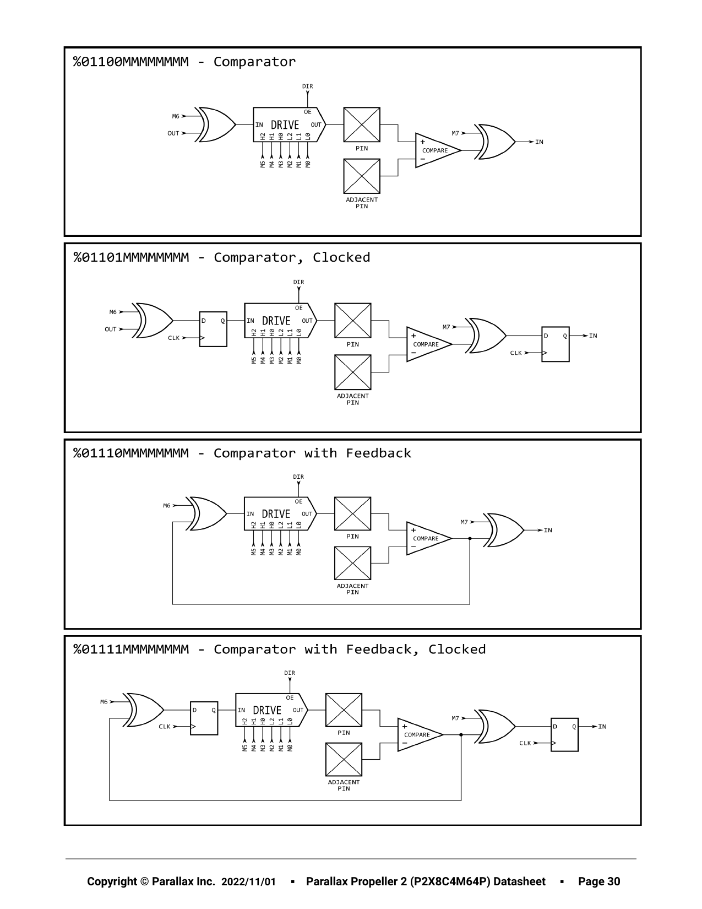 *(page holds R026–R029)*

### P2DS-R027 | Page 30 — `%01101` Comparator, Clocked
- **Type:** schematic (equivalent I/O pin config)
- **Description:** Comparator input mode with input/output paths registered by CLK-clocked flip-flops.
- **Tags:** schematic, pin-config, comparator, analog-input, clocked, compare
- **ADC-relevant:** yes ★ (comparator mode)
- 

### P2DS-R028 | Page 30 — `%01110` Comparator with Feedback
- **Type:** schematic (equivalent I/O pin config)
- **Description:** Comparator mode with the COMPARE output fed back into the DRIVE input XOR (local feedback), PIN vs ADJACENT PIN compared.
- **Tags:** schematic, pin-config, comparator, feedback, analog-input, compare
- **ADC-relevant:** yes ★ (comparator mode)
- 

### P2DS-R029 | Page 30 — `%01111` Comparator with Feedback, Clocked
- **Type:** schematic (equivalent I/O pin config)
- **Description:** Comparator-with-feedback variant with input/output registered by CLK-clocked flip-flops.
- **Tags:** schematic, pin-config, comparator, feedback, clocked, compare
- **ADC-relevant:** yes ★ (comparator mode)
- 

### P2DS-R030 | Page 31 — `%100` ADC with Optional Drive ★
- **Type:** schematic (equivalent I/O pin config)
- **Description:** Sigma-delta (Δ-Σ) ADC front-end. OUT/M6 XOR → optional DRIVE block → PIN; PIN feeds a Δ-Σ ADC whose S2/S1/S0 (M9/M8/M7) select gain per the SSS table (000 GND, 001 VIO, 010 Float, 011 1×, 100 3.2×, 101 10×, 110 32×, 111 100×); ADC BIT output → IN.
- **Tags:** schematic, pin-config, ADC, sigma-delta, delta-sigma, analog-input, gain, SSS-table, drive
- **ADC-relevant:** yes ★★ (ADC front-end — highest value)
- 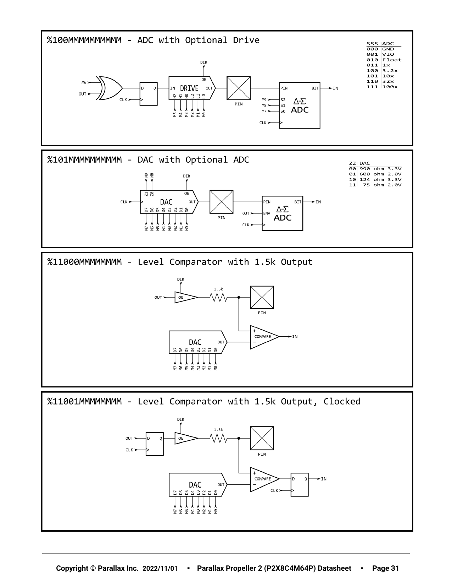 *(page holds R030–R033)*

### P2DS-R031 | Page 31 — `%101` DAC with Optional ADC ★
- **Type:** schematic (equivalent I/O pin config)
- **Description:** 8-bit DAC output with optional Δ-Σ ADC readback. D7..D0 (M7..M0) + Z1/Z0 (M9/M8) → DAC → PIN, with a ZZ DAC drive/impedance table (00: 990Ω 3.3V, 01: 600Ω 2.0V, 10: 124Ω 3.3V, 11: 75Ω 2.0V); PIN also feeds a Δ-Σ ADC (ENA) whose BIT → IN.
- **Tags:** schematic, pin-config, DAC, ADC, sigma-delta, analog-output, analog-input, ZZ-table, drive-impedance
- **ADC-relevant:** yes ★★ (DAC + ADC front-end — highest value)
- 

### P2DS-R032 | Page 31 — `%11000` Level Comparator with 1.5k Output ★
- **Type:** schematic (equivalent I/O pin config)
- **Description:** DAC-driven level comparator: OUT → OE tri-state buffer → 1.5k series resistor → PIN; an 8-bit DAC (D7..D0 = M7..M0) supplies the − reference to a COMPARE block whose + input is PIN; COMPARE → IN.
- **Tags:** schematic, pin-config, DAC, level-comparator, compare, 1.5k, analog
- **ADC-relevant:** yes ★ (DAC + comparator)
- 

### P2DS-R033 | Page 31 — `%11001` Level Comparator with 1.5k Output, Clocked ★
- **Type:** schematic (equivalent I/O pin config)
- **Description:** Level-comparator-with-1.5k-output variant with the output registered by a D flip-flop and the COMPARE result registered by a CLK-clocked flip-flop before IN.
- **Tags:** schematic, pin-config, DAC, level-comparator, compare, 1.5k, clocked
- **ADC-relevant:** yes ★ (DAC + comparator)
- 

### P2DS-R034 | Page 32 — `%11010` Level Comparator with Local Feedback ★
- **Type:** schematic (equivalent I/O pin config)
- **Description:** DAC-referenced level comparator with local feedback: PIN → 1.5k → OE buffer (driven by an inverter fed from the COMPARE output); an 8-bit DAC supplies the − reference, PIN is the + input; COMPARE → IN and back to the drive.
- **Tags:** schematic, pin-config, DAC, level-comparator, local-feedback, compare, 1.5k
- **ADC-relevant:** yes ★ (DAC + comparator)
- 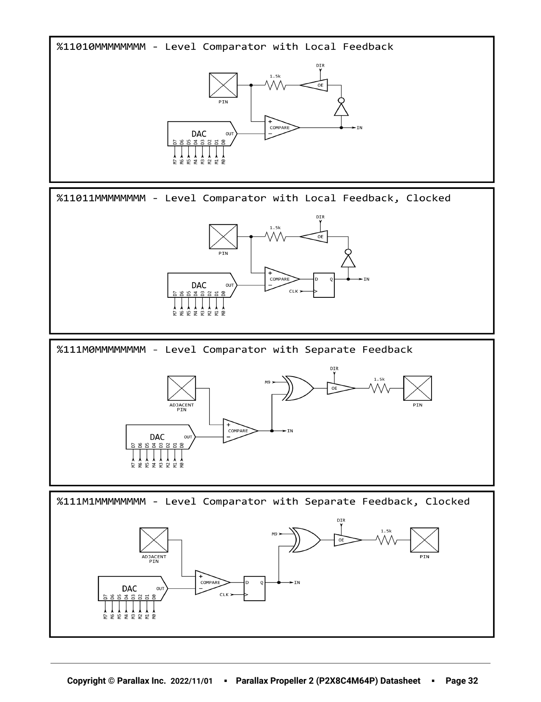 *(page holds R034–R037)*

### P2DS-R035 | Page 32 — `%11011` Level Comparator with Local Feedback, Clocked ★
- **Type:** schematic (equivalent I/O pin config)
- **Description:** Local-feedback level comparator with the COMPARE result registered by a CLK-clocked D flip-flop before feeding IN and the output driver.
- **Tags:** schematic, pin-config, DAC, level-comparator, local-feedback, clocked, compare
- **ADC-relevant:** yes ★ (DAC + comparator)
- 

### P2DS-R036 | Page 32 — `%111M0` Level Comparator with Separate Feedback ★
- **Type:** schematic (equivalent I/O pin config)
- **Description:** Level comparator using a separate feedback pin: ADJACENT PIN + DAC (−) → COMPARE → IN, while M9 XOR → OE buffer → 1.5k → own PIN provides the separate driven output.
- **Tags:** schematic, pin-config, DAC, level-comparator, separate-feedback, adjacent-pin, compare, 1.5k
- **ADC-relevant:** yes ★ (DAC + comparator)
- 

### P2DS-R037 | Page 32 — `%111M1` Level Comparator with Separate Feedback, Clocked ★
- **Type:** schematic (equivalent I/O pin config)
- **Description:** Separate-feedback level comparator with the COMPARE result registered by a CLK-clocked D flip-flop before feeding IN and the separate output driver.
- **Tags:** schematic, pin-config, DAC, level-comparator, separate-feedback, adjacent-pin, clocked, compare
- **ADC-relevant:** yes ★ (DAC + comparator)
- 

### P2DS-R038 | Page 49 — TQFP-100 Mechanical Case Outline
- **Type:** package / mechanical drawing
- **Description:** ON Semiconductor mechanical case outline for the TQFP100 14×14 mm, 0.5 mm pitch package (Case 932BR, Issue O): top/side/bottom views, lead detail (Detail A), millimeter dimension table, recommended mounting footprint, and generic marking diagram. Document 98AON94348G.
- **Tags:** package, mechanical, TQFP-100, case-outline, dimensions, footprint, ON-Semiconductor, 14x14, 0.5mm-pitch
- **ADC-relevant:** no
- 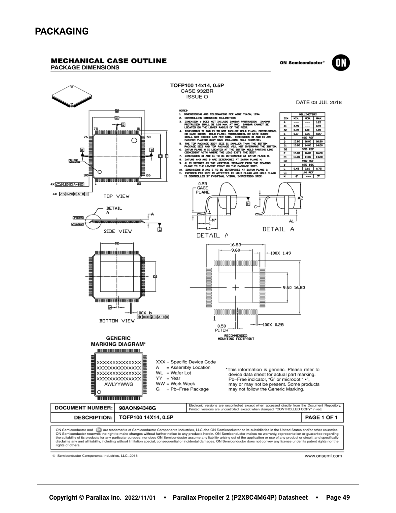

---

## Notes for Future Redraw Work
- Pages 27–32 are the "Equivalent Schematics for Each Unique I/O Pin Configuration" section; each `%…MMMMMMMMM` mode label encodes the 13-bit WRPIN pin-mode field (see page 23 in the source for the M-bit format). All panels share a common visual vocabulary: XOR gates for OUT/IN inversion (M6/M7 selectors), the DRIVE strength block, PIN / ADJACENT PIN pads (drawn as boxed X), Δ-Σ ADC, 8-bit DAC, and COMPARE blocks.
- The two embedded lookup tables inside the analog panels are load-bearing for redraw fidelity: the **SSS ADC gain table** (R030: 1×/3.2×/10×/32×/100×) and the **ZZ DAC drive/impedance table** (R031: 990Ω 3.3V / 600Ω 2.0V / 124Ω 3.3V / 75Ω 2.0V), plus the **H/L DRIVE strength table** on the Logic panels (R014: Digital/1.5k/15k/150k/1mA/100uA/10uA/Float).
- No figures appear on pages 1–5, 11, 12, 14–16, 18–21, 23–25, 33–48, or 50 (prose, plain register/opcode/timing tables, code listings, and the instruction-set reference tables).
