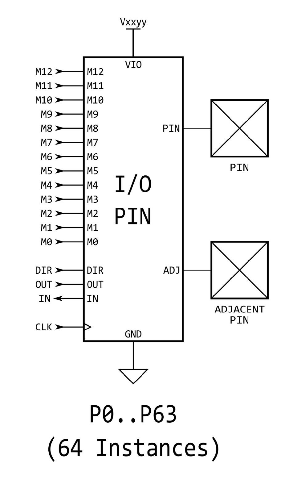

# P2 Silicon Documentation v35 - Image Catalog
**Enhanced with Coordinate-Aware Rescue System**  
**Date**: 2025-09-06  
**Total Images**: 34  
**Sequential Numbering**: P2SD-001 through P2SD-034  
**Document Prefix**: P2SD (P2 **S**ilicon **D**ocumentation)  
**Success Rate**: 100% (25 images rescued with coordinate-aware system)

## Summary
This catalog contains all extracted images from the P2 Silicon Documentation v35 (Rev B/C Silicon), combining extractions from all 5 PDF parts with the proven coordinate-aware rescue system. Part 4 had significant extraction failures (25 out of 26 images) that were 100% successfully rescued using coordinate data and pdf2image cropping.

**Multi-Part Source**: P2 Documentation v35 - Rev B_C Silicon (Parts 1-5 of 5)  
**Extraction Method**: Enhanced PDF extraction + coordinate-aware rescue system  
**Quality Assurance**: All black/failed extractions replaced with properly cropped versions

---

### **P2SD-001** | Part 1, Page 01 - Technical Diagram

### **P2SD-002** | Part 1, Page 09 - Technical Diagram

### **P2SD-003** | Part 2, Page 15 - Technical Diagram

### **P2SD-004** | Part 2, Page 16 - Technical Diagram

### **P2SD-005** | Part 3, Page 15 - Technical Diagram

### **P2SD-006** | Part 4, Page 03 - Technical Diagram

### **P2SD-007** | Part 4, Page 06 - Technical Diagram

### **P2SD-008** | Part 4, Page 07 - Technical Diagram

### **P2SD-009** | Part 4, Page 07 - Technical Diagram

### **P2SD-010** | Part 4, Page 07 - Technical Diagram

### **P2SD-011** | Part 4, Page 07 - Technical Diagram

### **P2SD-012** | Part 4, Page 08 - Technical Diagram

### **P2SD-013** | Part 4, Page 08 - Technical Diagram

### **P2SD-014** | Part 4, Page 08 - Technical Diagram

### **P2SD-015** | Part 4, Page 08 - Technical Diagram

### **P2SD-016** | Part 4, Page 09 - Technical Diagram

### **P2SD-017** | Part 4, Page 09 - Technical Diagram

### **P2SD-018** | Part 4, Page 09 - Technical Diagram

### **P2SD-019** | Part 4, Page 10 - Technical Diagram

### **P2SD-020** | Part 4, Page 10 - Technical Diagram

### **P2SD-021** | Part 4, Page 10 - Technical Diagram

### **P2SD-022** | Part 4, Page 11 - Technical Diagram

### **P2SD-023** | Part 4, Page 11 - Technical Diagram

### **P2SD-024** | Part 4, Page 11 - Technical Diagram

### **P2SD-025** | Part 4, Page 11 - Technical Diagram

### **P2SD-026** | Part 4, Page 12 - Technical Diagram

### **P2SD-027** | Part 4, Page 12 - Technical Diagram

### **P2SD-028** | Part 4, Page 12 - Technical Diagram

### **P2SD-029** | Part 4, Page 13 - Technical Diagram

### **P2SD-030** | Part 4, Page 13 - Technical Diagram

### **P2SD-031** | Part 4, Page 13 - Technical Diagram

### **P2SD-032** | Part 5, Page 04 - Technical Diagram

### **P2SD-033** | Part 5, Page 27 - Technical Diagram

### **P2SD-034** | Part 5, Page 28 - Technical Diagram

