# P2 Silicon Documentation v35 — Figure Catalog (render-based)

**Source:** Parallax Propeller 2 Documentation v35 (Rev B/C silicon), dated 2021-05-18
(`P2X8C4M64PES`, LPD1941 Rev B / LHU2019 Rev C). Certified Parallax **primary** source.
Delivered as five PDF parts (`...Part1of5.pdf` … `...Part5of5.pdf`, 127 pages total) that
form one logical document.

**Catalog date:** 2026-07-06
**Method:** Full-page **render** via `pdftoppm -r 150 -png` (150 DPI, whole page). Figure-bearing
pages were first located with 100-DPI contact sheets across all 127 pages, then each figure page was
re-rendered at 150 DPI and viewed to describe it.
**Total figure pages captured:** 18 (covering 40+ distinct diagram/schematic panels)
**ID scheme:** `P2SD-R###` — the **`-R`** denotes **render-based** capture (full page), to
distinguish this catalog from the older embedded-image `P2SD-###` catalog.

---

## Relationship to the 2025-09-06 embedded-image extraction (`../images-20250906/`)

This catalog was commissioned on the assumption that the prior `pdfimages` (embedded-image)
extraction would have **missed all vector line-art** (schematics, block diagrams). **On inspection,
that assumption proved FALSE for this document.** In this v35 PDF (produced from a DOCX), the
schematics and block diagrams are stored as **embedded raster images**, not true vector paths — so
`pdfimages` *did* capture them, at good fidelity, cleanly cropped to each figure. The old folder
already contains the I/O-pin block diagram, all per-mode pin schematics (including the ADC and DAC
front-ends), the WRPIN configuration table, the Hub RAM Interface diagram, both pinouts, the SINC
scope captures, the ADC filter-window plot, and the package drawing.

**So this render-based catalog does NOT "rescue" missing figures.** Its distinct value is:

1. **Full-page context** — each figure captured with its on-page title, section, and the adjacent
   legend/lookup tables (e.g. the SSS ADC-scale and ZZ DAC-drive tables sit beside the ADC/DAC
   schematics; here they are in one frame with page-number provenance).
2. **Text/ASCII figures the image extractor cannot see** — the I/O-pin timing diagrams (Part2 p20)
   and the instruction-pipeline timing diagram (Part5 p14) are monospace character art, invisible to
   `pdfimages`. They are captured here (R005, R017).
3. **A richer, described, ID'd, tagged catalog** with an ADC/analog quick-index — the reason the
   rebuild was requested.

**Guidance:** For a clean, tightly-cropped source to trace/redraw a single schematic, the
per-figure crops in `../images-20250906/` are often the better starting point. For page-level
provenance, context, and the described catalog, use **this** folder. Both are valid; neither
strictly supersedes the other. `../images-20250906/` is retained.

---

## 🔬 ADC / analog-front-end figures (quick index)

The rebuild's focus was the analog pin front-end (ADC / DAC / sigma-delta / comparator). The
ADC/analog-relevant entries:

| ID | Part / Page | Figure | Why ADC-relevant |
|----|-------------|--------|------------------|
| **P2SD-R013** | Part4 p11 | **`%100` ADC with Optional Drive** and **`%101` DAC with Optional ADC** pin schematics (Σ-Δ ADC + DAC blocks, SSS ADC-scale table, ZZ DAC-drive table) | **The two highest-value ADC/DAC pin front-end schematics.** |
| P2SD-R007 | Part4 p03 | WRPIN D[20:8] / Internal Configuration reference table (ADC modes, ADC scale, DAC drive levels, DAC_MODE encoding) | Master encoding table for the ADC/DAC/comparator pin configurations |
| P2SD-R008 | Part4 p06 | I/O Pin top-level block diagram (PIN, ADJACENT PIN, VIO) | The analog pin/adjacent-pin front-end all ADC/DAC/comparator modes build on |
| P2SD-R012 | Part4 p10 | `%01100` Comparator, `%01101` Comparator Clocked | Comparator-mode analog front-end |
| P2SD-R014 | Part4 p12 | `%11000/%11001/%11010` Level Comparator (1.5k / local feedback), DAC + COMPARE | Level-comparator analog front-end (on-pin DAC reference) |
| P2SD-R015 | Part4 p13 | `%11011/%111M0/%111M1` Level Comparator (local / separate feedback), DAC + COMPARE | Level-comparator analog front-end (on-pin DAC reference) |
| P2SD-R003 | Part2 p15 | SINC1 filter response (scope capture) | DAC output pin measured while a sine sweeps the ADC input pin; Goertzel/Σ-Δ demo |
| P2SD-R004 | Part2 p16 | SINC2 filter response (scope capture) | Same DAC-out / ADC-in Goertzel demo, higher-Q SINC2 filter |
| P2SD-R016 | Part5 p04 | ADC scope-mode windowed filter shapes (28-tap Hann, 45-tap Tukey, 68-tap Tukey) | Filter kernels applied to the incoming ADC bitstream in smart-pin scope mode |

Note **P2SD-R013** additionally carries `%01110`/`%01111` **Comparator with Feedback** (analog
comparator) panels.

---

## Figures

### P2SD-R001 | Part1, Page 01 — P2X8C4M64P Package Pinout (cover)
- **Type:** pinout / package drawing
- **Description:** Cover-page package pinout of the P2X8C4M64P in the 100-pin exposed-pad TQFP.
  All 100 pins labeled around the four edges (TEST, VDD, P0..P63, VIO-group boundary pins such as
  V0003/V0407, XI, XO, RESN), with the branded P2 / PARALLAX die-marking artwork in the body and the
  `AWLYYWW / CCCCC` marking legend.
- **Tags:** pinout, package, TQFP-100, P2X8C4M64P, pin-map, cover
- **ADC-relevant:** no
- 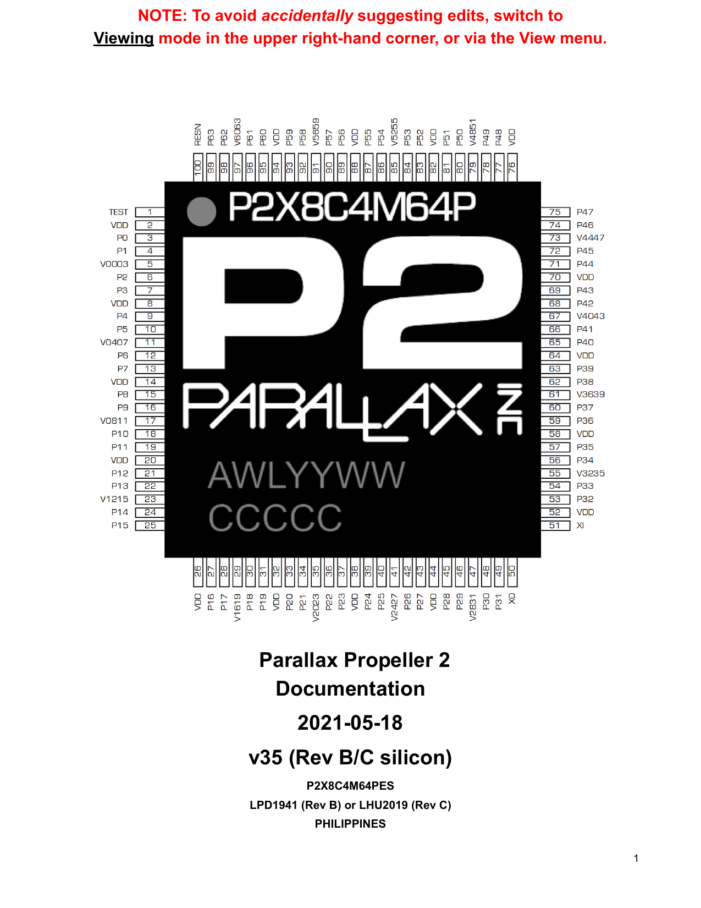

### P2SD-R002 | Part1, Page 09 — P2 Pinout with VIO/GIO Group Labels & Internal Block
- **Type:** pinout / block diagram
- **Description:** Engineering pinout of the 100-pin package showing pin numbers 1–100 plus the VIO
  power-group labels (VIO_0_3 … VIO_60_63) and the internal GIO smart-pin group blocks
  (GIO_0_3 … GIO_60_63) with VSS pads, annotated "8 cogs / 512K hub / 64 pins" in the die body.
  Complements R001 by mapping the VIO/GIO grouping of the I/O pins.
- **Tags:** pinout, VIO-groups, GIO-groups, power-pins, package, architecture-overview
- **ADC-relevant:** no
- 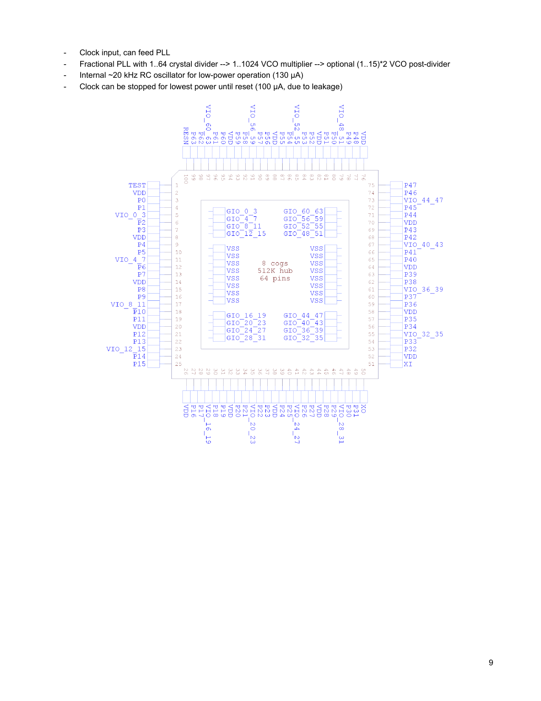

### P2SD-R003 | Part2, Page 15 — SINC1 Filter Response (DAC-out / ADC-in scope capture)
- **Type:** graph / waveform (oscilloscope photo)
- **Description:** Oscilloscope capture labeled "SINC1", –50KHz … 1MHz … +50KHz, showing the
  frequency response measured at the program's DAC output pin while a function generator drives a
  0–3.3V sine wave into the ADC input pin, swept 950–1050KHz over 12ms. Demonstrates the SINC1
  (single-integrator) Goertzel filter shape. Accompanied on-page by the `adcmode`/`dacmode` PASM
  setup constants.
- **Tags:** ADC, DAC, SINC1, Goertzel, filter-response, sigma-delta, scope-capture
- **ADC-relevant:** yes
- 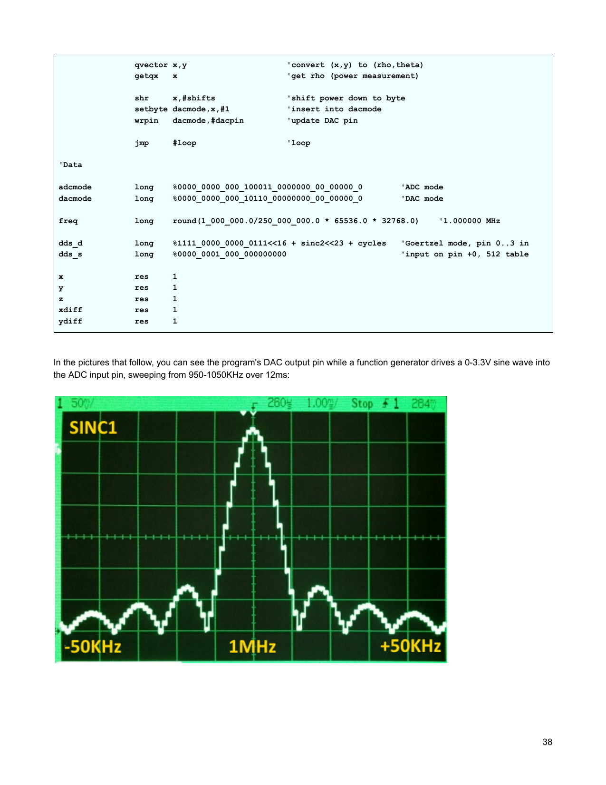

### P2SD-R004 | Part2, Page 16 — SINC2 Filter Response (DAC-out / ADC-in scope capture)
- **Type:** graph / waveform (oscilloscope photo)
- **Description:** Oscilloscope capture labeled "SINC2", –50KHz … 1MHz … +50KHz. Same DAC-out /
  ADC-in Goertzel measurement as R003 but with the SINC2 (double-integrator) filter, showing a
  higher-Q, narrower response; text notes the sine/cosine table was reduced from ±127 (SINC1) to
  ±10 (SINC2) to avoid (X,Y) accumulator overflow.
- **Tags:** ADC, DAC, SINC2, Goertzel, filter-response, sigma-delta, scope-capture
- **ADC-relevant:** yes
- 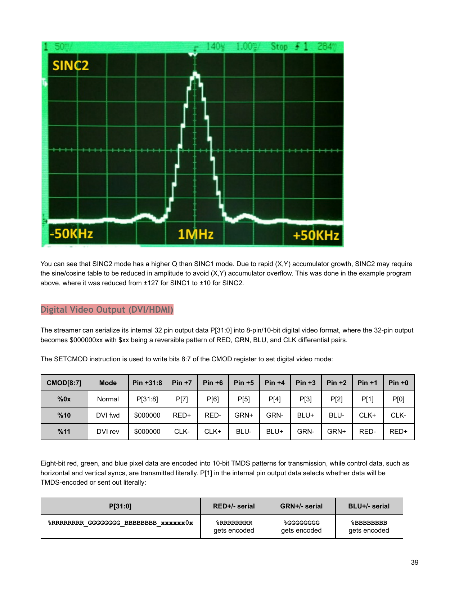

### P2SD-R005 | Part2, Page 20 — I/O Pin Timing Diagrams (DRVH / TESTB / TESTP)
- **Type:** timing diagram (monospace/ASCII rendered)
- **Description:** Three clock-aligned timing diagrams under "I/O PIN TIMING" illustrating pin
  register latency: (a) a DIRx/OUTx change takes THREE additional clocks before the pin transitions
  (shown with DRVH #0); (b) an INx read reflects pin state registered THREE clocks earlier (TESTB);
  (c) TESTP/TESTPN read reflects pin state TWO clocks earlier. Rendered as monospace character art
  in the source (invisible to embedded-image extraction) — a redraw candidate, low fidelity as-is.
- **Tags:** timing, I/O-pin, DIRx, OUTx, INA/INB, DRVH, TESTB, TESTP, pipeline-latency
- **ADC-relevant:** no
- 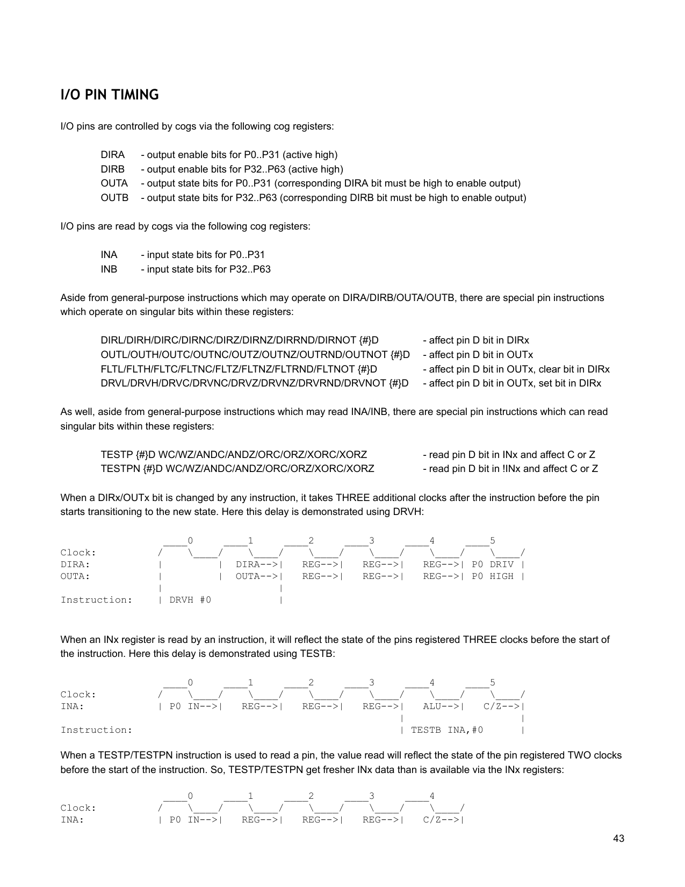

### P2SD-R006 | Part3, Page 15 — Hub RAM Interface (8-cog rotating slice diagram)
- **Type:** block diagram
- **Description:** Colorful "Hub RAM Interface — Every cog can read/write 32 bits per clock"
  diagram: eight cogs (Cog0–Cog7) arranged in a ring around a central "Address LSBs / 8 Hub RAMs /
  16K x 32" hub, with the 0–7 slice numbers showing the rotating egg-beater access. Illustrates the
  per-clock rotating hub-slice / FIFO access model.
- **Tags:** hub-RAM, egg-beater, cogs, memory-architecture, FIFO, block-diagram
- **ADC-relevant:** no
- 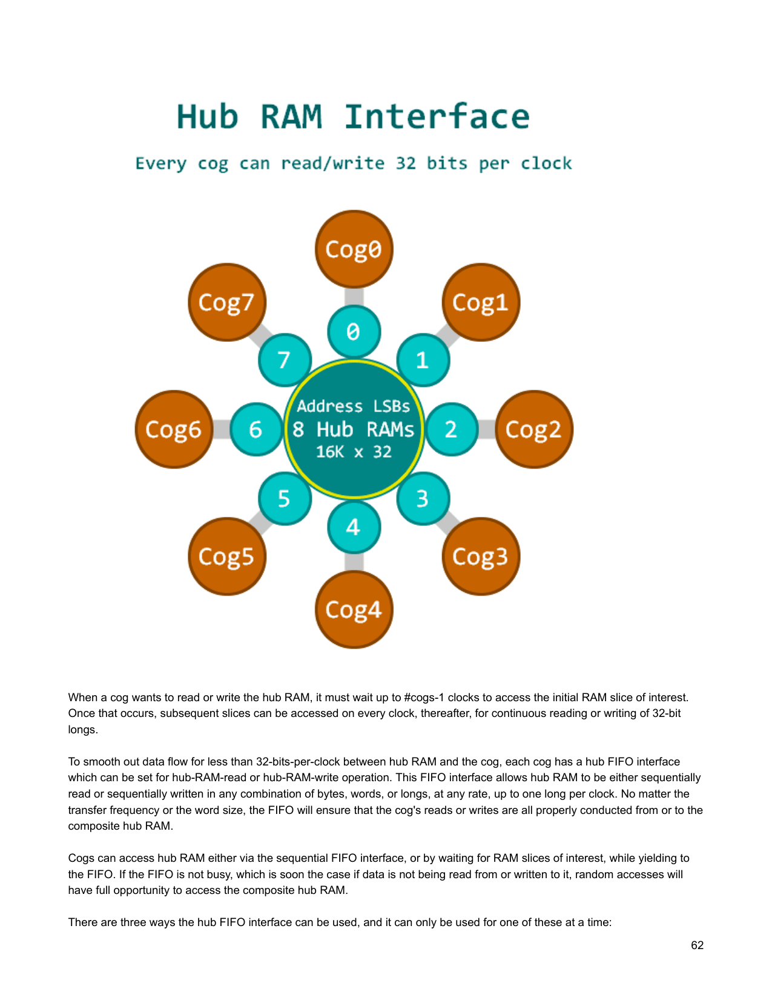

### P2SD-R007 | Part4, Page 03 — WRPIN D[20:8] / Internal Configuration Reference Table
- **Type:** reference table / encoding diagram (drawn as a boxed figure)
- **Description:** The master pin-configuration cross-reference under "%M..M: low-level pin control."
  Left table **WRPIN D[20:8] Configuration** maps M[12:0] encodings to Input / Pin-Output behavior
  (Pin/Adj Logic, Schmitt, Pin>Adj compare, the ADC modes — ADC GIO/VIO/float/Pin 1×/3.16×/10×/
  31.6×/100× — and the DAC drive levels 990Ω 3.3V / 600Ω 2.0V / 123.75Ω 3.3V / 75Ω 2.0V), with a
  Legend giving the C IN/OUT, I IN, O Output, HHH/LLL Drive-strength, and DDDDDDDD DAC-level fields.
  Right table **Internal Configuration** shows the resulting OE / DAC / ADC / ADC-Mode / Compare
  internal state. On-page text also gives the %TT DIR/OUT control and DAC_MODE encoding.
- **Tags:** WRPIN, pin-configuration, ADC, DAC, ADC-modes, DAC-drive, drive-strength, encoding, reference-table
- **ADC-relevant:** yes (defines the ADC/DAC/comparator pin-mode encodings)
- 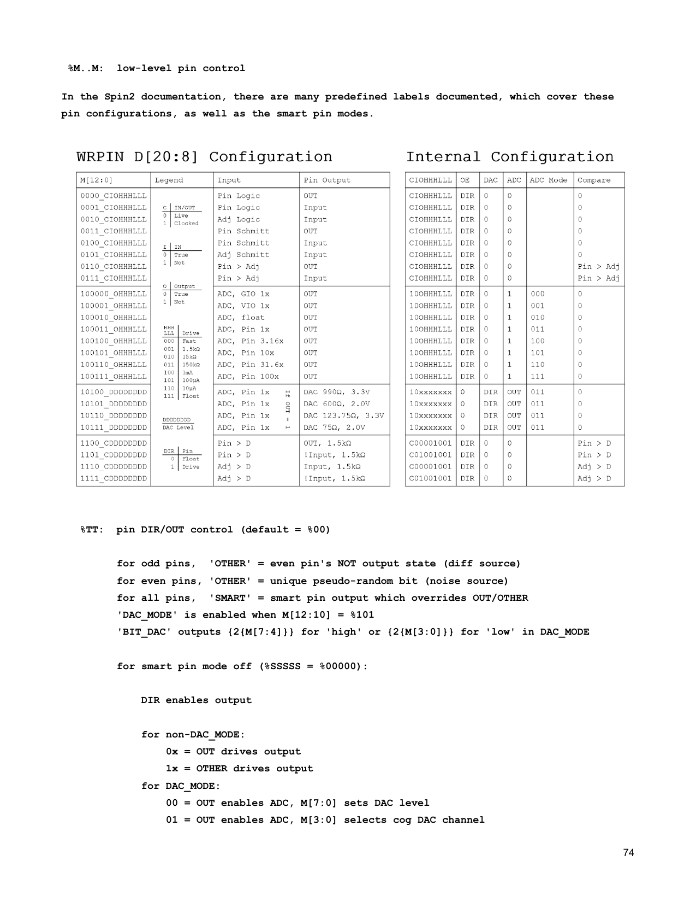

### P2SD-R008 | Part4, Page 06 — I/O Pin Top-Level Block Diagram ("64 Instances")
- **Type:** block diagram / schematic
- **Description:** Top-level "I/O PIN" block for the section **"Equivalent Schematics for Each
  Unique I/O Pin Configuration."** Shows the pin's interface: mode bits M0–M12, DIR/OUT/IN/CLK
  control, VIO (Vxxyy) supply and GND, plus the PIN and ADJACENT PIN pad symbols and ADJ output.
  Labeled P0..P63 (64 Instances) — the common frame that all per-mode schematics (R009–R015)
  specialize.
- **Tags:** I/O-pin, block-diagram, smart-pin, PIN, adjacent-pin, VIO, mode-bits, front-end
- **ADC-relevant:** yes (defines the analog pin/adjacent-pin front-end shared by all ADC/DAC/comparator modes)
- 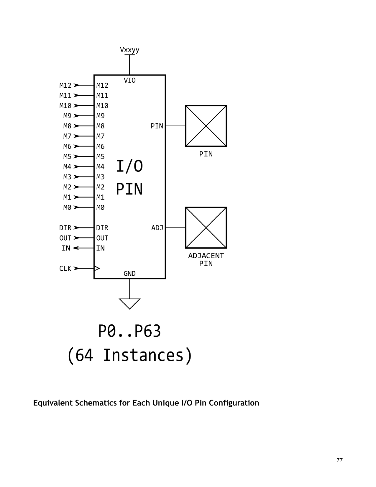

### P2SD-R009 | Part4, Page 07 — Pin Config Schematics: Logic Modes (%00000–%00011)
- **Type:** schematic (4 panels)
- **Description:** Four boxed equivalent-schematic panels for the digital-logic pin modes, each
  showing the XOR input muxes (M6/M7), DRIVE block (with H2..H0/L2..L0 strength taps), PIN pad, and
  IN path. Includes the H/L → DRIVE strength table (000 Digital, 001 1.5k, 010 15k, 011 150k,
  100 1mA, 101 100uA, 110 10uA, 111 Float). Panels:
  - `%00000` — Logic
  - `%00001` — Logic, Clocked
  - `%00010` — Logic with Feedback
  - `%00011` — Logic with Feedback, Clocked
- **Tags:** smart-pin-modes, schematic, logic, DRIVE, drive-strength, clocked, feedback
- **ADC-relevant:** no
- 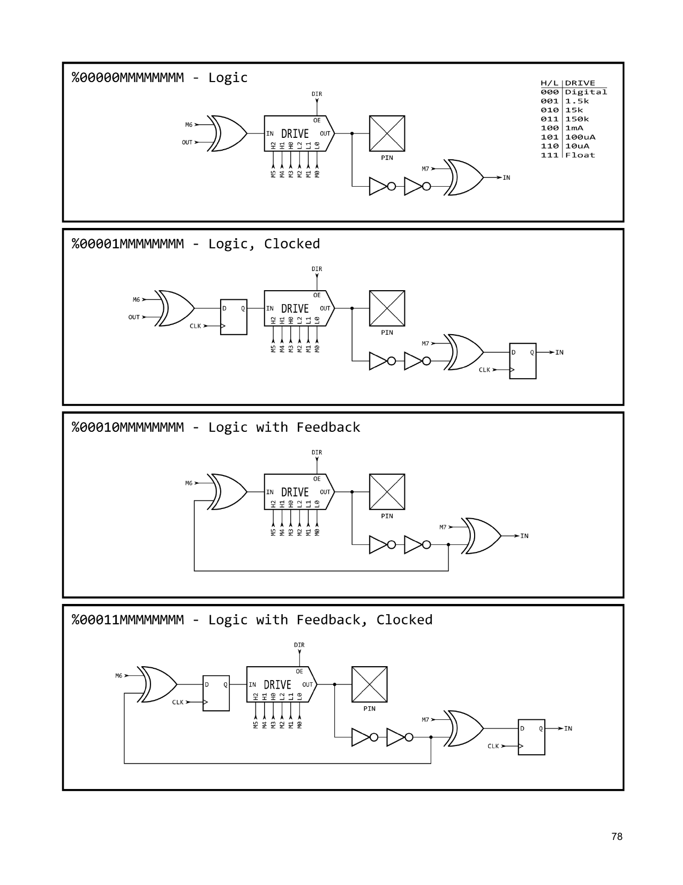

### P2SD-R010 | Part4, Page 08 — Pin Config Schematics: Logic Adjacent-Pin & Schmitt (%00100–%00111)
- **Type:** schematic (4 panels)
- **Description:** Four equivalent-schematic panels introducing the ADJACENT PIN feedback path and
  the Schmitt-trigger input symbol. Panels:
  - `%00100` — Logic with Adjacent-Pin Feedback
  - `%00101` — Logic with Adjacent-Pin Feedback, Clocked
  - `%00110` — Schmitt
  - `%00111` — Schmitt, Clocked
- **Tags:** smart-pin-modes, schematic, adjacent-pin, Schmitt-trigger, feedback, clocked
- **ADC-relevant:** no
- 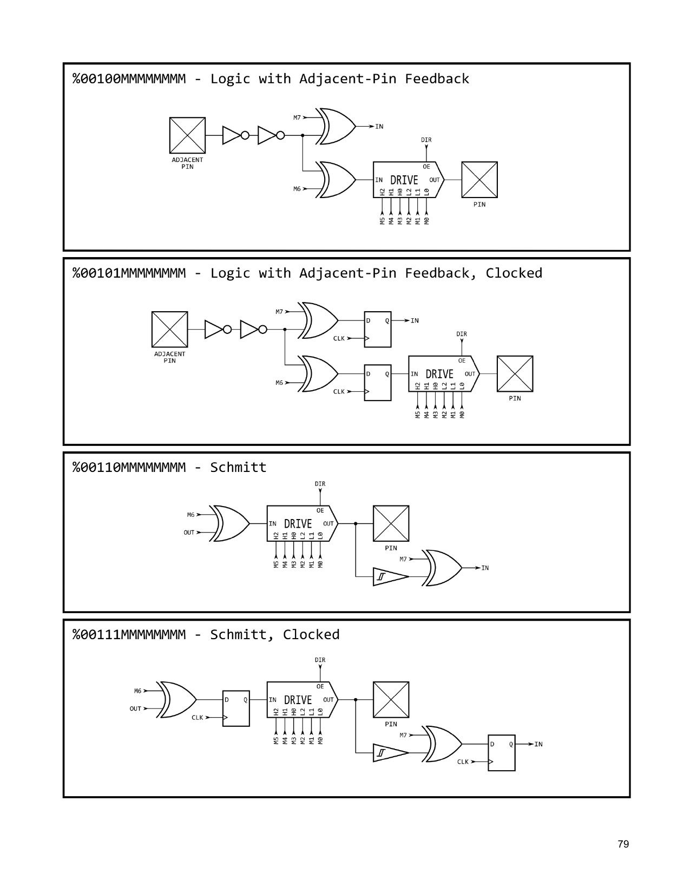

### P2SD-R011 | Part4, Page 09 — Pin Config Schematics: Schmitt with Feedback (%01000–%01010)
- **Type:** schematic (3 panels)
- **Description:** Three equivalent-schematic panels for Schmitt-input modes with feedback. Panels:
  - `%01000` — Schmitt with Feedback
  - `%01001` — Schmitt with Feedback, Clocked
  - `%01010` — Schmitt with Adjacent-Pin Feedback
- **Tags:** smart-pin-modes, schematic, Schmitt-trigger, feedback, adjacent-pin, clocked
- **ADC-relevant:** no
- 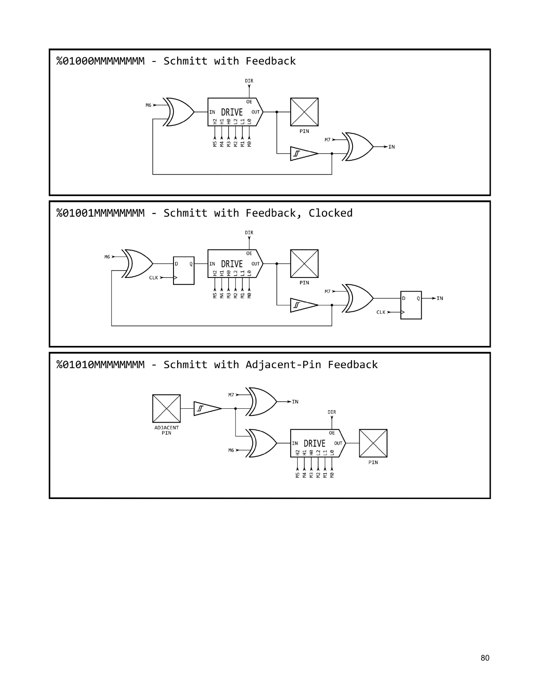

### P2SD-R012 | Part4, Page 10 — Pin Config Schematics: Schmitt Adj-Pin Clocked & Comparator (%01011–%01101)
- **Type:** schematic (3 panels)
- **Description:** Transition from Schmitt to analog comparator modes. Panels:
  - `%01011` — Schmitt with Adjacent-Pin Feedback, Clocked
  - `%01100` — Comparator (COMPARE block comparing PIN vs ADJACENT PIN)
  - `%01101` — Comparator, Clocked
- **Tags:** smart-pin-modes, schematic, Schmitt-trigger, comparator, adjacent-pin, analog
- **ADC-relevant:** yes (the `%01100`/`%01101` Comparator panels are analog-comparator pin modes)
- 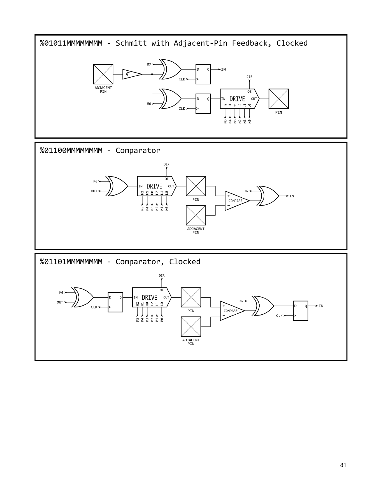

### P2SD-R013 | Part4, Page 11 — Pin Config Schematics: Comparator Feedback + ADC + DAC (%01110–%101)  ★ HIGHEST VALUE
- **Type:** schematic (4 panels)
- **Description:** The key analog front-end page. Panels:
  - `%01110` — Comparator with Feedback
  - `%01111` — Comparator with Feedback, Clocked
  - **`%100` — ADC with Optional Drive:** DRIVE → PIN → Σ-Δ (Delta-Sigma) ADC block with S2/S1/S0
    select (M9/M8/M7) and BIT→IN output. Carries the **SSS → ADC-scale table** (000 GND, 001 VIO,
    010 Float, 011 1×, 100 3.2×, 101 10×, 110 32×, 111 100×).
  - **`%101` — DAC with Optional ADC:** DAC block (D7..D0 driven by M7..M0, Z1/Z0 from M9/M8) →
    PIN → optional Σ-Δ ADC (ENA-gated). Carries the **ZZ → DAC-drive table** (00 990Ω 3.3V,
    01 600Ω 2.0V, 10 124Ω 3.3V, 11 75Ω 2.0V).
- **Tags:** smart-pin-modes, schematic, ADC, DAC, sigma-delta, delta-sigma, comparator, analog-front-end, ADC-scale, DAC-drive
- **ADC-relevant:** yes — the two most important ADC/DAC pin front-end schematics in the document
- 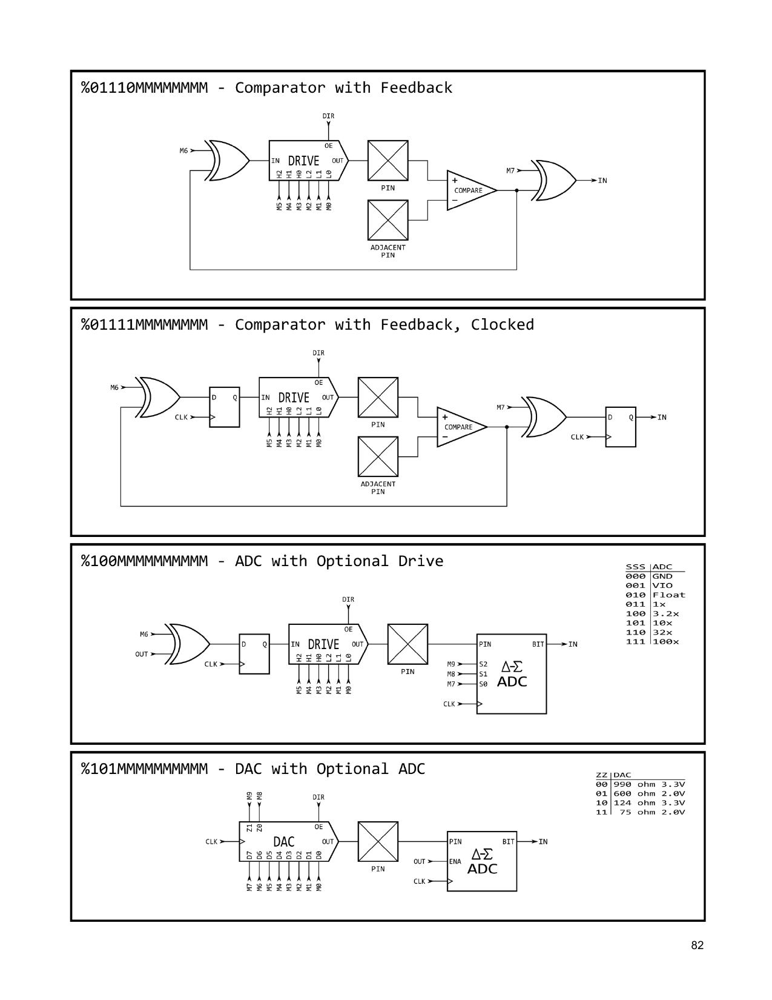

### P2SD-R014 | Part4, Page 12 — Pin Config Schematics: Level Comparator, 1.5k / Local Feedback (%11000–%11010)
- **Type:** schematic (3 panels)
- **Description:** Level-comparator analog modes using an on-pin DAC reference and a 1.5k series
  resistor into the COMPARE block. Panels:
  - `%11000` — Level Comparator with 1.5k Output
  - `%11001` — Level Comparator with 1.5k Output, Clocked
  - `%11010` — Level Comparator with Local Feedback
- **Tags:** smart-pin-modes, schematic, level-comparator, DAC-reference, 1.5k, analog, comparator
- **ADC-relevant:** yes (analog level-comparator front-end driven by the on-pin DAC)
- 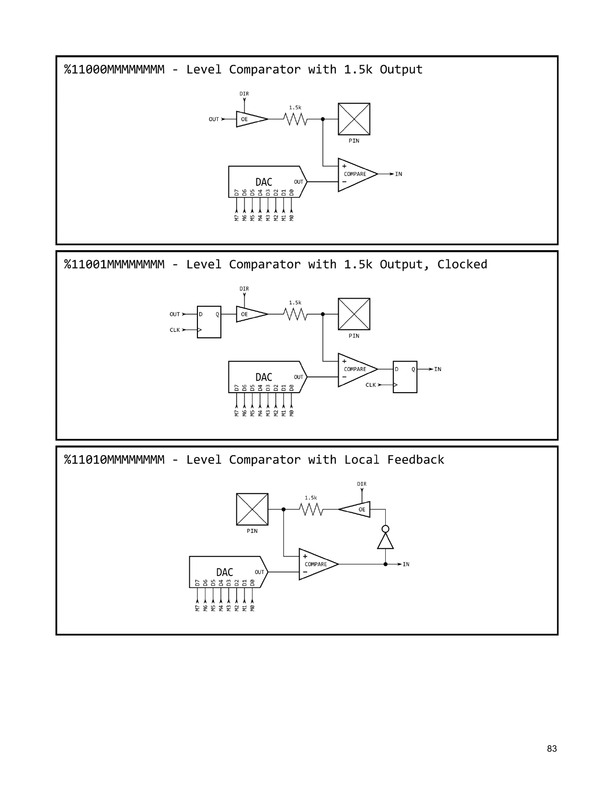

### P2SD-R015 | Part4, Page 13 — Pin Config Schematics: Level Comparator, Local / Separate Feedback (%11011–%111M1)
- **Type:** schematic (3 panels)
- **Description:** Remaining level-comparator analog modes; the last two use a mode bit (M) in the
  code field. Panels:
  - `%11011` — Level Comparator with Local Feedback, Clocked
  - `%111M0` — Level Comparator with Separate Feedback
  - `%111M1` — Level Comparator with Separate Feedback, Clocked
- **Tags:** smart-pin-modes, schematic, level-comparator, separate-feedback, DAC-reference, analog, comparator
- **ADC-relevant:** yes (analog level-comparator front-end driven by the on-pin DAC)
- 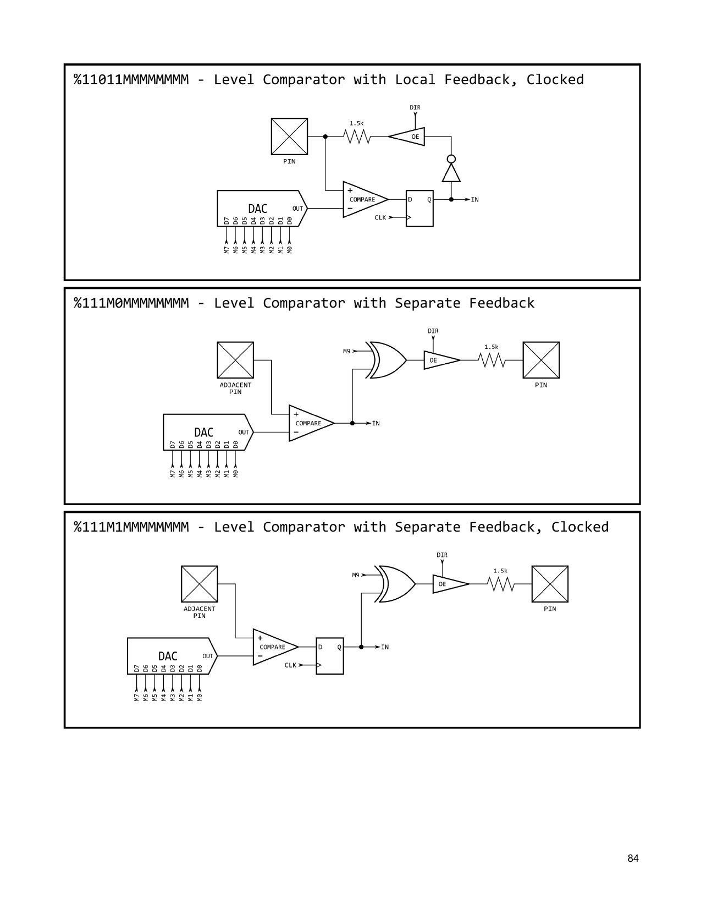

### P2SD-R016 | Part5, Page 04 — ADC Scope-Mode Windowed Filter Shapes (Hann / Tukey)
- **Type:** graph / plot (3 bar-shape plots)
- **Description:** Plots of the three windowed filter functions from which smart-pin scope-mode ADC
  samples are computed (incoming ADC bit shifted into a tap string, weighted taps summed): **28-tap
  Hann**, **45-tap Tukey**, **68-tap Tukey**. On-page text: samples normalized to 8 bits, DC dynamic
  range ~5–6 bits; X[1:0] selects the filter (%00 = 68-tap Tukey, %01 = 45-tap Tukey, %1x = 28-tap
  Hann).
- **Tags:** ADC, scope-mode, windowed-filter, Hann, Tukey, tap-weights, smart-pin, DSP
- **ADC-relevant:** yes
- 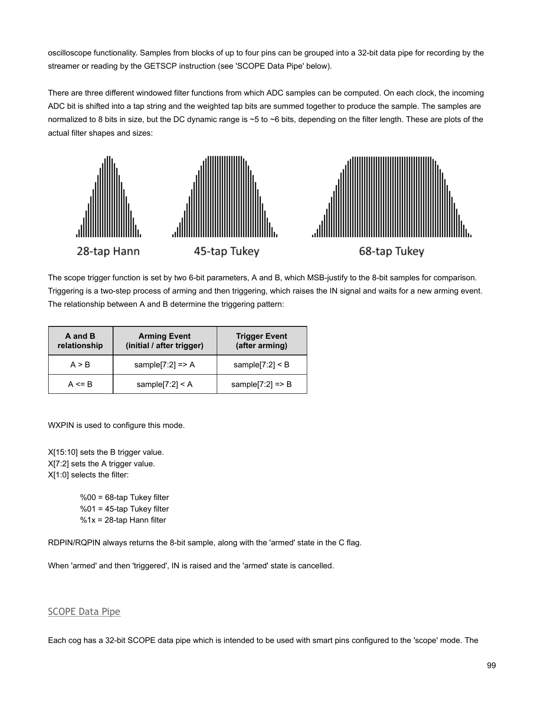

### P2SD-R017 | Part5, Page 14 — Instruction Pipeline Timing Diagram (embedded instructions.txt)
- **Type:** timing / pipeline diagram (monospace/ASCII rendered)
- **Description:** The "instruction timing" pipeline diagram from the embedded `instructions.txt`
  listing, showing the clk-aligned rdRAM / latch / ALU / wrRAM stages and the per-stage
  `get` / `stall/done = 'gox'` / `done = 'go'` pipeline flow across successive instructions.
  Rendered as monospace character art in the source (invisible to embedded-image extraction) — a
  redraw candidate; note it is part of a text listing and continues across following pages.
- **Tags:** instruction-timing, pipeline, cog-execution, rdRAM, ALU, wrRAM, ASCII-diagram
- **ADC-relevant:** no
- 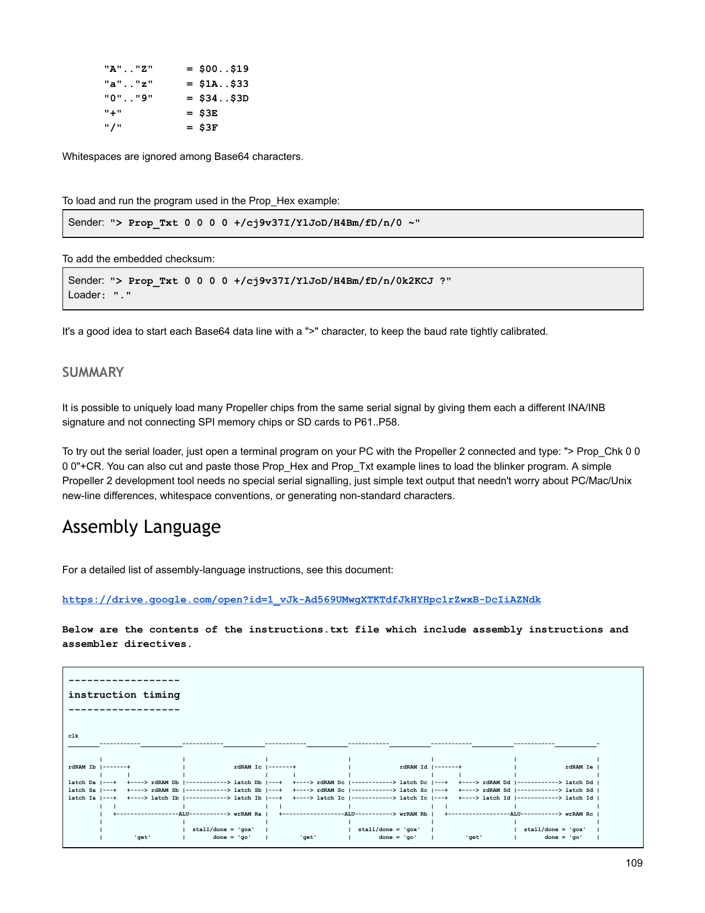

### P2SD-R018 | Part5, Page 28 — TQFP100 Package Mechanical Drawing
- **Type:** package / mechanical drawing
- **Description:** ON Semiconductor "MECHANICAL CASE OUTLINE / PACKAGE DIMENSIONS" for
  **TQFP100 14x14, 0.5P, CASE 932BR, ISSUE O** (dated 03 JUL 2018): top/side/bottom views, DETAIL A
  lead profile, gage-plane detail, recommended mounting footprint (100X 1.49 / 0.50 pitch /
  100X 0.28), the full millimeter dimension table, and the generic marking diagram (AWLYYWWG).
- **Tags:** package, mechanical-drawing, TQFP-100, dimensions, footprint, CASE-932BR, ON-Semiconductor
- **ADC-relevant:** no
- 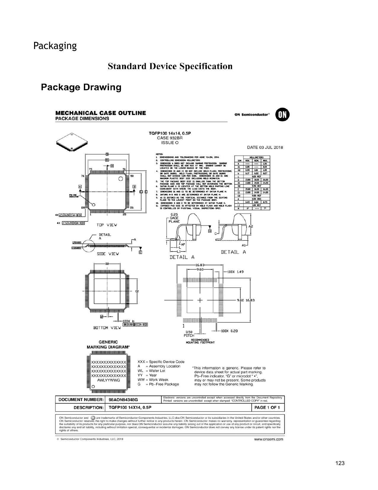

---

## Method notes & coverage

- **All 127 pages** (Part1 24pp, Part2 25pp, Part3 25pp, Part4 25pp, Part5 28pp) were rendered to
  100-DPI contact sheets and visually screened. Pages that are pure prose, plain register/opcode
  tables, colored bit-field tables (e.g. RGB pixel-mode tables), or PASM/Spin2 code listings were
  skipped by design.
- The 40+ per-mode I/O-pin equivalent schematics live in **Part4 pages 06–13** (one top-level block
  diagram + seven pages of boxed per-mode panels, up to four panels per page). Every distinguishable
  mode panel is enumerated in its page entry above, with its `%`-prefixed mode code and title read
  verbatim from the render.
- Two entries (**R005** I/O-pin timing, **R017** instruction pipeline timing) are **monospace/ASCII
  timing diagrams** embedded in the text rather than raster/vector figures; they are unique to this
  render catalog (the embedded-image extraction cannot see them).
- **Deliberately omitted vs the old folder:** the old `../images-20250906/` folder additionally
  contains **Part5 p27** (a syntax-colored **Boot ROM / Debug ROM code listing** captured as an
  embedded image). It is a code listing, not a diagram, so it is excluded here per the skip rules.
  Every other figure in the old folder has a full-page counterpart here.
- The SINC1/SINC2 scope captures (R003/R004) are embedded raster photos (also present, cropped, in
  the old folder); re-captured here in-context for completeness.
