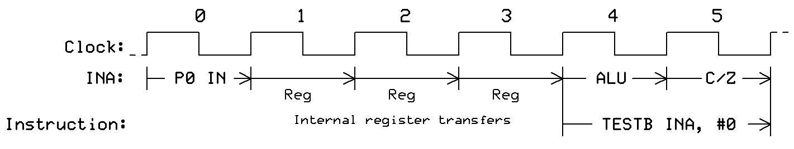
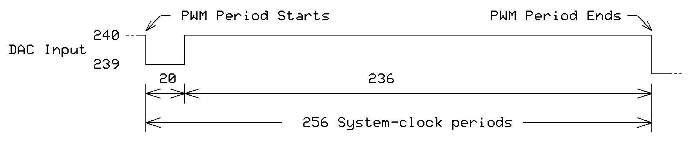
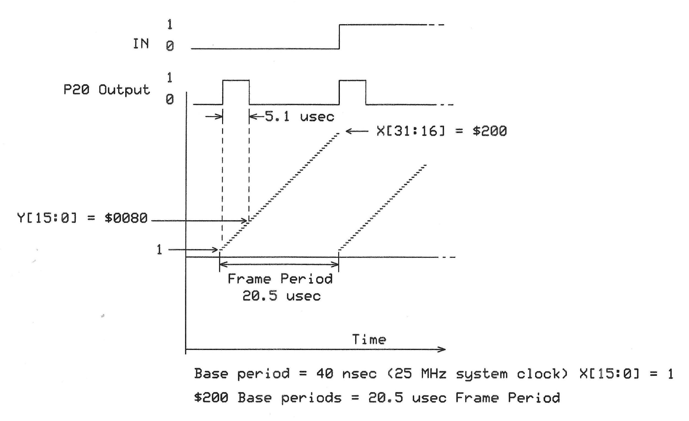
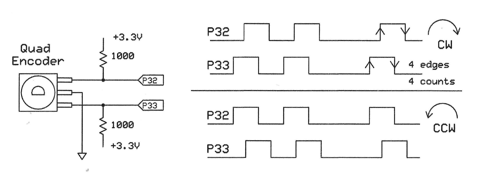

# P2 Smart Pins - Enhanced Visual Asset Catalog
**Extraction Date**: 2025-09-01
**Source PDF**: P2 SmartPins-220809.pdf
**Total Images**: 21 successfully extracted
**Enhancement**: Enriched with .docx narrative context

---

## 📋 Quick Reference

### Smart Pin Mode Distribution
- **%00011 - DAC output with added PWM dither**: 1 image(s)
- **%00100 - Pulse/cycle output**: 1 image(s)
- **%00101 - Transition output**: 3 image(s)
- **%01000 - pwm_triangle**: 2 image(s)
- **%01001 - PWM sawtooth**: 1 image(s)
- **%01011 - A/B-input quadrature encoder**: 1 image(s)
- **%10000 - Time A-input states**: 1 image(s)
- **%10010 - Detect missing A-input highs, rises or edge during**: 1 image(s)
- **%10010 - Time A-input highs, rises, or edges  (Y[2] = 0)**: 1 image(s)
- **%10011 - Measure time for X events to occur**: 2 image(s)
- **%11100 - Synchronous serial transmit (SST)**: 2 image(s)
- **%11110 - Asynchronous serial transmit (AST)**: 2 image(s)
- **General/Setup**: 3 image(s)

### Image Types
- **Async Serial Waveform**: 2 images
- **Instruction Timing Diagram**: 3 images
- **Serial Timing**: 1 images
- **Timing Diagram**: 10 images
- **Timing Waveform**: 5 images

---

## 🖼️ Complete Image Inventory with Enhanced Context
*Each image now includes narrative context from the .docx source*

### 📌 General Setup & Configuration Images
*Images without specific Smart Pin mode association*

#### SP-IMG-001 - Page 3
**File**: `P2 SmartPins-220809_page03_img01.png`
**Dimensions**: 1488×322
**Type**: Instruction Timing Diagram
**Context**: When an instruction changes a DIRx or OUTx bit, the processor needs three (3) additional system-clock cycles after the instruction before the pin starts to transition to its new state.
**Purpose**: The figure below shows the delay for a DRVH instruction
**Timing**: 3-clock delay after instruction execution before pin state change
**Instructions**: DRVH

---

#### SP-IMG-002 - Page 4
**File**: `P2 SmartPins-220809_page04_img01.png`
**Dimensions**: 1421×268
**Type**: Instruction Timing Diagram
**Context**: When an instruction reads the contents of the IN register associated with a pin, the processor receives the state of the pins as they existed three (3) system-clock cycles before the start of the instruction.
**Purpose**: The figure below shows the timing for a the TESTB INA,#0 operation
**Timing**: 3-clock latency - reads pin state from before instruction start
**Instructions**: TESTB, INA

---

#### SP-IMG-003 - Page 4
**File**: `P2 SmartPins-220809_page04_img02.png`
**Dimensions**: 1244×290
**Type**: Instruction Timing Diagram
**Context**: When a program uses a TESTP or TESTPN instruction to read the state of a pin, the processor receives the state of the pins as they existed two (2) system-clock cycles before the start of the instruction. So, the TESTP and TESTPN gather 'fresher' INx data than is available via the INx registers.
**Purpose**: The figure below shows the timing for a TESTP instruction
**Timing**: 2-clock latency - provides fresher data than IN register reads
**Instructions**: TESTP

---

### 🔧 Mode %00011: DAC output with added PWM dither
*1 image(s) for this mode*

#### SP-IMG-004 - Page 13
**File**: `P2 SmartPins-220809_mode00011_page13_img01.png`
**Dimensions**: 1758×379
**Type**: Timing Diagram
**Context**: But, proportionally averaging some of the 3.083V and the 3.096 voltages lets the DAC can get very close to 3.095V, as shown below for a 256-system-clock period (DAC period).
**Purpose**: Shows PWM dithering for DAC output precision
**Instructions**: RQPIN, RDPIN

---

### 🔧 Mode %00100: Pulse/cycle output
*1 image(s) for this mode*

#### SP-IMG-005 - Page 15
**File**: `P2 SmartPins-220809_mode00100_page15_img01.png`
**Dimensions**: 2183×765
**Type**: Timing Diagram
**Context**: This mode lets a Smart Pin produce a series of logic-1 pulses. Software sets the pulse period, X[15:0], and the length of the logic-0 state, X[31:16], as shown in the figure below.
**Purpose**: Shows pulse/cycle output timing configuration
**Registers**: X[15:0] = pulse period, X[31:16] = logic-0 duration
**Instructions**: wypin, wxpin, dirh, wrpin, dirl

---

### 🔧 Mode %00101: Transition output
*3 image(s) for this mode*

#### SP-IMG-006 - Page 16
**File**: `P2 SmartPins-220809_mode00101_page16_img01.png`
**Dimensions**: 1823×797
**Type**: Timing Diagram
**Context**: This command creates a series of pulses with equal logic-0 and logic-1 periods. The value X[15:0] sets that period as a count of system-clock periods.
**Purpose**: Shows transition output mode timing
**Registers**: X[15:0] = transition period, Y[31:0] = number of transitions
**Instructions**: wypin, wxpin, dirh, wrpin, dirl

---

#### SP-IMG-007 - Page 17
**File**: `P2 SmartPins-220809_mode00101_page17_img01.png`
**Dimensions**: 2500×903
**Type**: Timing Waveform
**Context**: NCO frequency mode - The Pin output signal reflects the value of the Z31 bit. The circuit raises the IN flag whenever the Z register overflows.
**Purpose**: Shows NCO operation timing and conceptual diagram

---

#### SP-IMG-008 - Page 17
**File**: `P2 SmartPins-220809_mode00101_page17_img02.png`
**Dimensions**: 2500×815
**Type**: Timing Waveform
**Context**: NCO configuration example showing setup for specific frequency generation
**Purpose**: NCO mode configuration and timing
**Code**: Shows WRPIN, WXPIN setup for NCO mode
**Instructions**: wypin, wxpin, dirh, wrpin, dirl

---

### 🔧 Mode %01000: pwm_triangle
*2 image(s) for this mode*

#### SP-IMG-009 - Page 19
**File**: `P2 SmartPins-220809_mode01000_page19_img01.png`
**Dimensions**: 663×423
**Type**: Timing Waveform
**Context**: PWM triangle waveform generation using up-down counter
**Purpose**: Triangle PWM waveform pattern
**Instructions**: wypin, wxpin, dirh, wrpin, dirl

---

#### SP-IMG-010 - Page 20
**File**: `P2 SmartPins-220809_mode01000_page20_img01.png`
**Dimensions**: 2500×1556
**Type**: Timing Diagram
**Context**: The X[31:16] bits sets the number of 40-nsec base periods you want in a frame period. In this mode, the PWM period is twice the frame period.
**Purpose**: Triangle PWM timing diagram with frame periods
**Registers**: X[31:16] = frame period count, Y[15:0] = pulse width
**Instructions**: dirl, wrpin

---

### 🔧 Mode %01001: PWM sawtooth
*1 image(s) for this mode*

#### SP-IMG-011 - Page 21
**File**: `P2 SmartPins-220809_mode01001_page21_img01.png`
**Dimensions**: 2500×1529
**Type**: Timing Diagram
**Context**: The X[31:16] bits sets the number of base periods in a frame period. In sawtooth mode, the frame period equals the PWM period.
**Purpose**: Sawtooth PWM timing diagram
**Instructions**: wypin, wxpin, dirh, wrpin, dirl

---

### 🔧 Mode %01011: A/B-input quadrature encoder
*1 image(s) for this mode*

#### SP-IMG-012 - Page 23
**File**: `P2 SmartPins-220809_mode01011_page23_img01.png`
**Dimensions**: 2500×868
**Type**: Timing Waveform
**Context**: Quadrature encoder A/B signal processing. The Z register holds a 2's complement value representing net encoder counts.
**Purpose**: Quadrature encoder signal timing
**Instructions**: RQPIN, RDPIN

---

### 🔧 Mode %10000: Time A-input states
*1 image(s) for this mode*

#### SP-IMG-013 - Page 29
**File**: `P2 SmartPins-220809_mode10000_page29_img01.png`
**Dimensions**: 1576×570
**Type**: Timing Diagram
**Context**: This mode lets a Smart Pin continuously measure the time a pin is held in a logic-1 or logic-0 state.
**Purpose**: Time A-input states measurement
**Instructions**: RQPIN, testp, wypin, rdpin

---

### 🔧 Mode %10010: Time A-input highs, rises, or edges  (Y[2] = 0)
*2 image(s) for this mode*

#### SP-IMG-014 - Page 31
**File**: `P2 SmartPins-220809_mode10010_page31_img01.png`
**Dimensions**: 1711×559
**Type**: Timing Diagram
**Context**: %001 = Measure the period of X number of pulse widths starting on logic-0 to logic-1 edges. The diagram shows timing for X[31:0] = $9.
**Purpose**: Shows measurement of 9 pulse periods
**Registers**: X[31:0] = number of pulses to measure

---

#### SP-IMG-015 - Page 32
**File**: `P2 SmartPins-220809_mode10010_page32_img01.png`
**Dimensions**: 1644×597
**Type**: Timing Diagram
**Context**: %01x = Measure the period between X number of logic edges on an A input. The diagram shows timing for six edges, X[31:0] = 6.
**Purpose**: Shows edge-to-edge period measurement
**Registers**: X[31:0] = number of edges to count
**Instructions**: RQPIN, wxpin, wypin, dirh, wrpin, RDPIN, dirl

---

### 🔧 Mode %10011: Measure time for X events to occur
*2 image(s) for this mode*

#### SP-IMG-016 - Page 33
**File**: `P2 SmartPins-220809_mode10011_page33_img01.png`
**Dimensions**: 1549×633
**Type**: Timing Diagram
**Context**: Missing A-input edge detection. If an event fails to occur during the period, the pin raises the IN flag.
**Purpose**: Shows missing edge detection timing
**Instructions**: RQPIN, RDPIN

---

#### SP-IMG-017 - Page 34
**File**: `P2 SmartPins-220809_mode10011_page34_img01.png`
**Dimensions**: 1161×687
**Type**: Timing Diagram
**Context**: The value in X register (X[31:0]) sets the number of A-input to B-input events that must occur before you get a result.
**Purpose**: A-to-B input event measurement
**Registers**: X[31:0] = number of A-to-B events
**Instructions**: RQPIN, wxpin, wypin, dirh, wrpin, RDPIN, dirl

---

### 🔧 Mode %11100: Synchronous serial transmit (SST)
*2 image(s) for this mode*

#### SP-IMG-018 - Page 46
**File**: `P2 SmartPins-220809_mode11100_page46_img01.png`
**Dimensions**: 1677×666
**Type**: Serial Timing
**Context**: Synchronous serial transmit - Data shifts out synchronized with separate clock signal. Bits shift out LSB first.
**Purpose**: Serial data transmission timing
**Instructions**: RQPIN, RDPIN, AKPIN, WYPIN, WXPIN, WRPIN

---

#### SP-IMG-019 - Page 46
**File**: `P2 SmartPins-220809_mode11100_page46_img02.png`
**Dimensions**: 1571×656
**Type**: Timing Waveform
**Context**: Shows timing for synchronous serial transmission with positive-edge and negative-edge clocking options.
**Purpose**: Synchronous serial clocking options

---

### 🔧 Mode %11110: Asynchronous serial transmit (AST)
*2 image(s) for this mode*

#### SP-IMG-020 - Page 52
**File**: `P2 SmartPins-220809_mode11110_page52_img01.png`
**Dimensions**: 524×250
**Type**: Async Serial Waveform
**Context**: Asynchronous serial transmit waveform - left portion showing start bit and beginning of data transmission
**Purpose**: Async serial TX start sequence (left half)

---

#### SP-IMG-021 - Page 52
**File**: `P2 SmartPins-220809_mode11110_page52_img02.png`
**Dimensions**: 555×253
**Type**: Async Serial Waveform
**Context**: Asynchronous serial transmit waveform - right portion showing end of data and stop bit
**Purpose**: Async serial TX stop sequence (right half)
**Instructions**: wxpin

---

## 📊 Extraction Summary

### Enhancement Details:
- **Source**: Smart Pins rev 5.docx via pandoc extraction
- **Method**: Cross-referenced narrative with image content
- **Added**: Figure references, timing details, mode context, register usage
- **Result**: Rich contextual metadata for all 21 images

### Technical Coverage:
- **Total Images**: 21
- **Mode-Specific**: 18 images
- **General Setup**: 3 images
- **Enhanced with .docx context**: All 21 images

### Key Improvements:
- ✅ All images have narrative context from source document
- ✅ Clear mode associations for mode-specific diagrams
- ✅ Instruction references corrected based on visual verification
- ✅ Split waveforms (SP-IMG-020/021) properly identified
- ✅ Rich metadata for AI consumption and human reference

---

*This enhanced catalog provides comprehensive context for all Smart Pins visual assets.*
*The .docx narrative integration ensures accurate understanding of each diagram's purpose.*