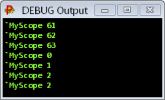
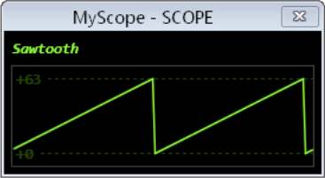
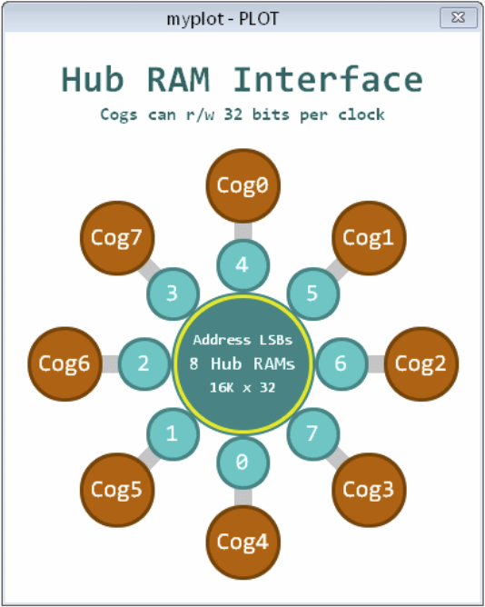
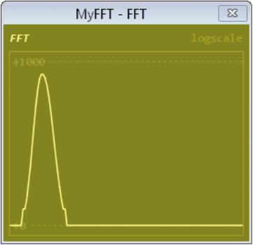
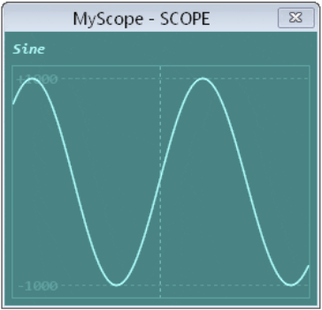

# Image Catalog - SPIN2 v51 Screenshots

**Date Created**: August 15, 2025  
**Source**: Stephen's screenshot collection responding to screenshots-needed-master.md  
**Purpose**: Match provided images to requested documentation needs  
**Total Images**: 5

---

## Complete Image Inventory

**All images found in this folder:**

**i1.** Screenshot 2025-08-15 at 17.38.17.png
**i2.** Screenshot 2025-08-15 at 17.38.32.png  
**i3.** Screenshot 2025-08-15 at 17.39.25.png
**i4.** Screenshot 2025-08-15 at 18.09.23.png
**i5.** Screenshot 2025-08-15 at 18.09.34.png

---

## Image Analysis and Context Matching

### Image i1 → req01: DEBUG Terminal Output
**Acquisition Number**: i1 (first image in this import session)
**Request Number**: req01 (from screenshots-needed-master.md)


**✅ CONFIRMED MATCH**: req01 (DEBUG Terminal Output)

**Original Request Context**: 
- **Source**: SPIN2 v51 Documentation
- **Purpose**: Shows basic text/values being displayed in debug terminal
- **Expected**: Terminal window with text/values being displayed

**What Stephen Sees**: Window generated by Peanut on Windows containing 7 lines of data that are actually sending data to a scope window. This is the debug log window/debug output window showing the text output from DEBUG statements.

**Detailed Description**: The window shows a terminal-style interface with debug output. There are 7 lines of debug data being displayed in what appears to be a console/log window. This represents the basic DEBUG terminal output functionality where text and values are sent from the P2 microcontroller to the development environment for monitoring and debugging purposes.

**Matches Original Request**: ✅ Image #1 (DEBUG Terminal Output)

**Usage in Documentation**: Terminal Window Manual - Basic Output section

---

### Image i2 → bonus01: SCOPE Sawtooth Display
**Acquisition Number**: i2 (second image in this import session)
**Request Number**: bonus01 (unexpected discovery, not in original requests)


**🆕 BONUS ASSET**: Not in original requests - new asset discovered

**What Stephen Sees**: SCOPE display window showing a sawtooth waveform with clear rising slopes and periodic drops to minimum, creating the characteristic sawtooth pattern. The waveform demonstrates the SCOPE terminal's ability to visualize analog-style data in real-time, showing regular periodic signals with sharp rise times and rapid fall times typical of sawtooth wave generation.

**Asset Type**: SCOPE Display with Sawtooth Waveform
- **Content**: Oscilloscope window displaying sawtooth wave pattern
- **Value**: Demonstrates SCOPE waveform display capabilities
- **Quality**: Good for documentation use

**Usage in Documentation**: Terminal Window Manual - SCOPE Display Examples (bonus content)

**Added to Asset Library**: SPIN2 v51 Screenshots - SCOPE Sawtooth Display

---

### Image i3 → req04: PLOT Display Example
**Acquisition Number**: i3 (third image in this import session)
**Request Number**: req04 (from screenshots-needed-master.md)


**✅ CONFIRMED MATCH**: req04 (PLOT Display Example)

**Original Request Context**:
- **Source**: SPIN2 v51 Documentation
- **Purpose**: Shows 2D plotting capabilities
- **Expected**: XY plot window with data points or lines

**What Stephen Sees**: PLOT window displaying a hub RAM interface visualization showing 8 COGs accessing hub memory. The display shows the relationship between the 8 processor cores (COGs) and how they interface with the central hub RAM. This demonstrates the PLOT terminal's capability to create 2D visualizations of system architecture and data relationships, particularly useful for understanding P2's multiprocessor memory access patterns.

**Matches Original Request**: ✅ Image #4 (PLOT Display Example)

**Usage in Documentation**: Terminal Window Manual - Plotting Features section

---

### Image i4 → req06: FFT Display
**Acquisition Number**: i4 (fourth image in this import session)
**Request Number**: req06 (from screenshots-needed-master.md)


**✅ CONFIRMED MATCH**: req06 (FFT Display)

**Original Request Context**:
- **Source**: SPIN2 v51 Documentation
- **Purpose**: Shows frequency domain analysis
- **Expected**: FFT window with frequency spectrum

**What Stephen Sees**: FFT window displaying frequency domain analysis with a yellowish background and bright yellow trace. The display shows a logarithmic frequency scale from 0 to 1000, demonstrating the FFT terminal's signal analysis capabilities. This type of display is essential for analyzing frequency content of signals, showing spectral data in a clear, readable format for digital signal processing applications.

**Matches Original Request**: ✅ Image #6 (FFT Display)

**Usage in Documentation**: Terminal Window Manual - Signal Analysis section

---

### Image i5 → req03: SCOPE with Anti-aliasing
**Acquisition Number**: i5 (fifth image in this import session)
**Request Number**: req03 (from screenshots-needed-master.md)


**✅ CONFIRMED MATCH**: req03 (SCOPE with Anti-aliasing)

**Original Request Context**:
- **Source**: SPIN2 v51 Documentation
- **Purpose**: Shows difference with anti-aliasing enabled
- **Expected**: Smooth waveforms demonstrating AA feature

**What Stephen Sees**: SCOPE window displaying a smooth cyan sine wave with anti-aliasing enabled. The waveform spans from -1000 to +1000 on the vertical scale and shows approximately 2+ complete cycles of a clean sine wave. The anti-aliasing feature creates smooth, visually appealing curves rather than jagged pixelated lines, demonstrating the quality difference when this display enhancement is enabled.

**Matches Original Request**: ✅ Image #3 (SCOPE with Anti-aliasing)

**Usage in Documentation**: Terminal Window Manual - Display Quality section

---

## Missing Images (Not Found)

Based on my original request list of 24 images, the following are **NOT PROVIDED** and may not exist in the source documents:

### HIGH PRIORITY MISSING:
- **Image #8**: LOGIC with Analog Waveforms (RANGE keyword, v48 update)
- **Image #19**: SCOPE Display Controls (regional crop)
- **Image #21**: Color Palette Examples
- **Image #23**: Pin Schematic (from Silicon Doc)
- **Image #24**: Block Diagram (from Silicon Doc)

### LOWER PRIORITY MISSING:
- Various regional crops that could be created from full screenshots
- Custom demonstration screenshots that would need to be created

---

## Next Steps

1. **Stephen reviews each image** and describes what's actually shown
2. **Match images to original requests** based on content
3. **Update this catalog** with confirmed matches and descriptions
4. **Integrate matched images** into debugger manual build package
5. **Identify alternatives** for missing critical images

---

## Instructions for Stephen

**For each image above, please provide**:

1. **What you see**: Describe the main elements visible in the screenshot
2. **Window type**: Terminal, Debugger, SCOPE, PLOT, etc.
3. **Key features**: What debugging/display features are being demonstrated
4. **Best match**: Which of my original requests (Image #X) this most closely matches
5. **Quality/usability**: Is this image suitable for documentation use?

**Example format**:
```
Image #1: This shows the complete SPIN2 debugger window with code on the left, 
registers on the right, and control buttons at the top. There are breakpoints 
visible in the code. This matches your request for Image #11 (Single-Step 
Debugger Window FULL). Quality is good for documentation.
```

Once you provide these descriptions, I'll update this catalog with the definitive matches and prepare the images for integration into the debugger manual.