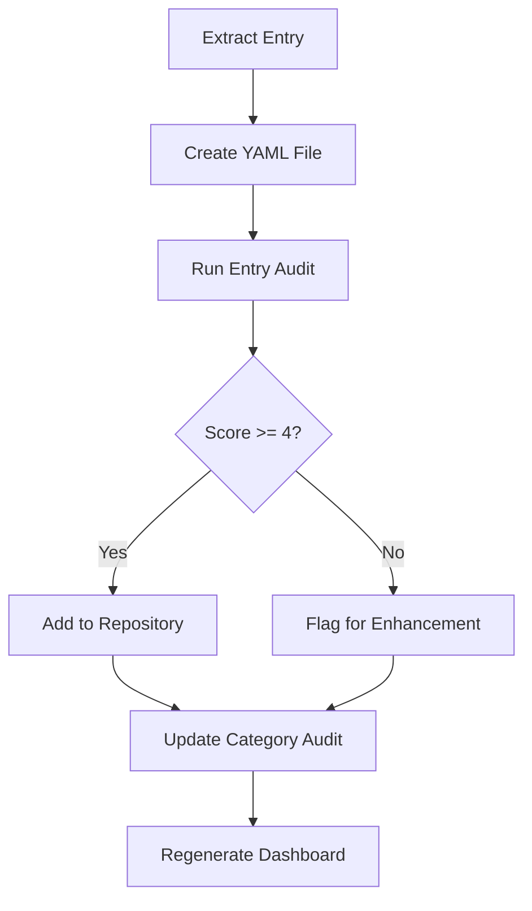
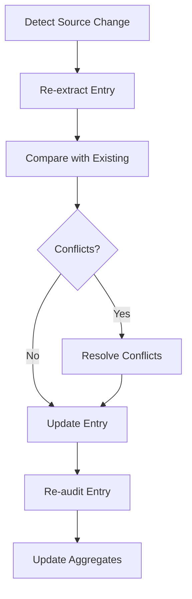
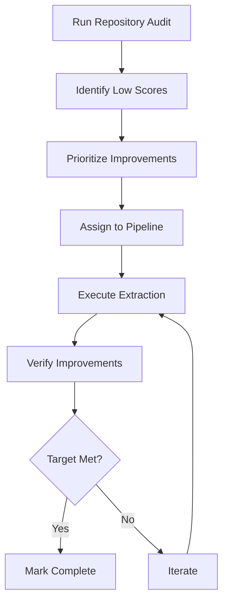

# Quality Audit Procedures and Workflows

## Overview
This document defines the procedures for conducting quality audits on the P2 Knowledge Base repository.

## Audit Types

### 1. Entry-Level Audit
**Frequency**: On every extraction or update
**Scope**: Individual instruction/component files

#### Procedure:
1. Load the entry YAML file
2. Check for required fields presence
3. Count optional fields populated
4. Verify source layer coverage
5. Calculate completeness score (0-8)
6. Identify gaps and issues
7. Generate individual audit file
8. Update category aggregate audit

#### Automation:
```bash
python3 audit-entry.py <entry-path>
```

### 2. Category-Level Audit
**Frequency**: Daily
**Scope**: All entries in a category (e.g., PASM2 instructions)

#### Procedure:
1. Scan all entries in category directory
2. Load individual audit files
3. Calculate aggregate metrics:
   - Score distribution
   - Average completeness
   - Coverage percentages
4. Identify systematic gaps
5. Generate priority lists
6. Update category audit file

### 3. Repository-Level Audit
**Frequency**: Weekly
**Scope**: Entire repository

#### Procedure:
1. Aggregate all category audits
2. Calculate repository-wide metrics
3. Generate quality dashboard
4. Identify improvement priorities
5. Create action items
6. Publish reports

## Completeness Scoring Algorithm

### Score Calculation (0-8 points)
```python
def calculate_completeness_score(entry):
    score = 0
    
    # Layer 1: CSV data (1 point)
    if entry.source_layers.csv:
        score += 1
        
    # Layer 2: Datasheet timing (1 point)
    if entry.source_layers.datasheet:
        score += 1
        
    # Layer 3: Silicon Doc narrative (1 point)
    if entry.source_layers.silicon_doc:
        score += 1
        
    # Layer 4: Forum clarifications (1 point)
    if entry.source_layers.forum_clarification:
        score += 1
        
    # Examples present (1 point)
    if entry.examples and len(entry.examples) > 0:
        score += 1
        
    # Cross-references (1 point)
    if entry.related_instructions or entry.see_also:
        score += 1
        
    # Usage patterns (1 point)
    if entry.usage_notes:
        score += 1
        
    # Meta-knowledge (1 point)
    if entry.special_cases or has_optimization_tips(entry):
        score += 1
        
    return score
```

### Score Interpretation
- **0-2**: Insufficient for any use
- **3-4**: Minimal documentation, development only
- **5-6**: Functional documentation, limited production use
- **7**: Production-ready documentation
- **8**: Comprehensive, exemplary documentation

## Gap Identification

### Systematic Gap Detection
1. **Missing Fields Analysis**
   - Scan for consistently empty fields across entries
   - Identify pattern (e.g., "No timing data for CORDIC ops")
   
2. **Source Coverage Gaps**
   - Compare extraction status against known sources
   - List unprocessed documents or sections
   
3. **Cross-Reference Integrity**
   - Verify all referenced entries exist
   - Check for orphaned references
   - Ensure bidirectional links

### Priority Assignment
```python
def calculate_priority(entry_audit):
    priority = 0
    
    # Usage frequency (estimated)
    if entry_id in HIGH_FREQUENCY_INSTRUCTIONS:
        priority += 40
    elif entry_id in MEDIUM_FREQUENCY_INSTRUCTIONS:
        priority += 20
    else:
        priority += 10
        
    # Current score gap from target
    score_gap = 6 - entry_audit.completeness_score
    priority += score_gap * 10
    
    # Blocking issues
    if entry_audit.has_blocking_issues:
        priority += 25
        
    # User requests
    if entry_id in USER_REQUESTED_IMPROVEMENTS:
        priority += 15
        
    return min(priority, 100)  # Cap at 100
```

## Audit Workflows

### New Entry Workflow


### Update Workflow


### Quality Improvement Workflow


## Automation Scripts

### audit-entry.py
Audits a single entry file:
```bash
python3 audit-entry.py instructions/pasm2/add-instruction.yaml
```

### audit-category.py
Audits all entries in a category:
```bash
python3 audit-category.py pasm2-instructions
```

### generate-dashboard.py
Creates quality dashboard:
```bash
python3 quality-audits/generate-dashboard.py
```

### continuous-audit.py
Monitors changes and triggers audits:
```bash
python3 continuous-audit.py --watch
```

## Quality Gates

### Minimum Requirements
- **Development**: Score >= 3
- **Testing**: Score >= 4
- **Production**: Score >= 6
- **Publication**: Score >= 7

### Validation Checks
1. **Schema Compliance**: Entry matches schema
2. **Required Fields**: All required fields present
3. **Format Validation**: Encoding patterns valid
4. **Reference Integrity**: Cross-references resolve
5. **Example Compilation**: Code examples valid

## Reporting

### Daily Report
- Extraction progress
- Score improvements
- New gaps identified
- Priority queue status

### Weekly Report
- Overall quality trends
- Category comparisons
- Achievement milestones
- Action items

### Monthly Report
- Strategic progress
- Resource allocation
- Quality targets
- Roadmap updates

## Continuous Improvement

### Feedback Loop
1. Monitor API usage patterns
2. Track user queries
3. Identify documentation gaps
4. Prioritize improvements
5. Execute enhancements
6. Measure impact

### Quality Metrics
- **Coverage**: % of entries at each score level
- **Velocity**: Score improvements per day
- **Accuracy**: Verification pass rate
- **Completeness**: Average score by category
- **Timeliness**: Age of last update

## Best Practices

### Do's
- ✅ Audit immediately after extraction
- ✅ Track all source references
- ✅ Document gaps and issues
- ✅ Prioritize by user impact
- ✅ Automate repetitive checks

### Don'ts
- ❌ Skip audits to save time
- ❌ Ignore systematic gaps
- ❌ Accept low scores without plan
- ❌ Delay dashboard updates
- ❌ Manual audit when automation exists

## Troubleshooting

### Common Issues
1. **Score Regression**: Entry score decreased
   - Check for field deletion
   - Verify source data intact
   - Review extraction logs
   
2. **Audit Failures**: Script errors
   - Validate YAML syntax
   - Check schema version
   - Review error logs
   
3. **Dashboard Not Updating**
   - Verify cron job running
   - Check file permissions
   - Review generation logs