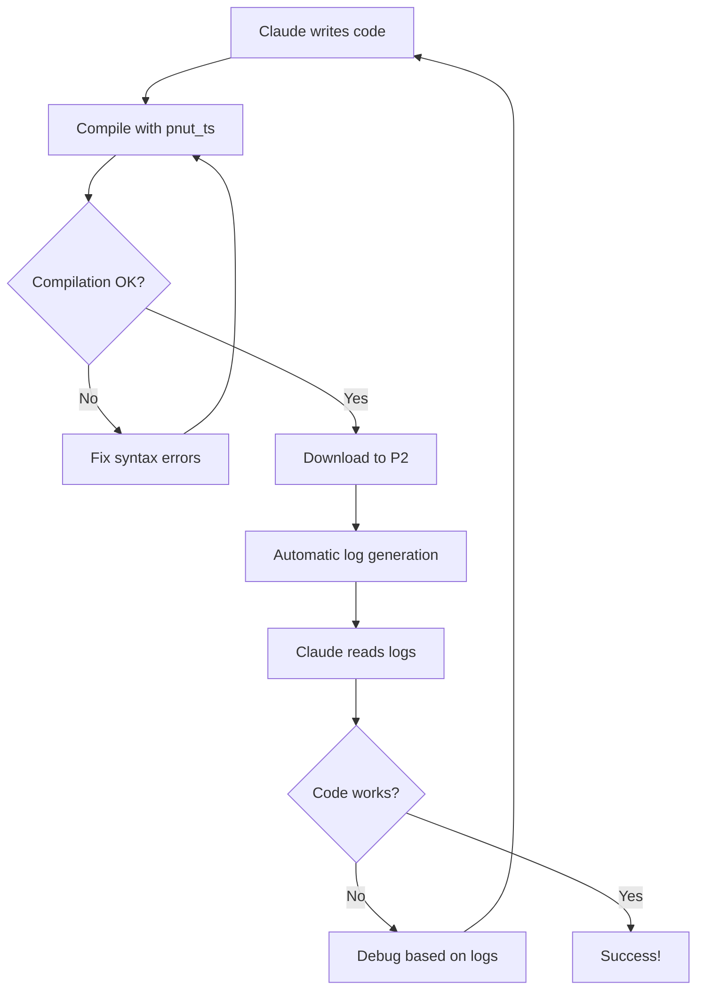

# Claude P2 Development Environment - Operational Model

## Overview
Claude instances supporting P2 developers have access to a complete toolchain enabling full round-trip development: write → compile → download → debug → iterate.

## Available Tools

### 1. Compiler (Production Ready)
- **Tool**: `pnut_ts` - Multi-platform Spin2/PASM2 compiler
- **Status**: ✅ Production ready
- **Capabilities**:
  - Compile Spin2/PASM2 to binary
  - Generate listing files
  - Validate syntax
  - Create flash images

### 2. Downloader/Debugger (Coming Soon)
- **Tool**: P2 Downloader with logging
- **Status**: 🚧 Not yet production ready
- **Capabilities**:
  - Download binaries to P2 hardware
  - Full debug output logging
  - Predictable log file locations
  - Real-time execution feedback

## Round-Trip Development Workflow



## File Structure

```
project-root/
├── src/                    # Source code
│   └── main.spin2
├── bin/                    # Compiled binaries
│   ├── main.bin
│   └── main.lst
├── logs/                   # Predictable log location
│   ├── download_20250823_141500.log
│   └── debug_20250823_141500.log
└── test/                   # Test fixtures
```

## Claude Operational Protocol

### 1. Writing Code
```bash
# Claude creates new P2 program
cat > src/blink_test.spin2 << 'EOF'
DAT
    ORG 0
main
    DRVH    #56         ' LED on P2 Eval board
    WAITX   ##50_000_000
    DRVL    #56
    WAITX   ##50_000_000
    JMP     #main
EOF
```

### 2. Compiling
```bash
# Validate and compile
pnut_ts -l src/blink_test.spin2 -o bin/blink_test

# Check compilation success
if [ $? -eq 0 ]; then
    echo "✓ Compilation successful"
    ls -la bin/blink_test.*
else
    echo "✗ Compilation failed - check errors"
fi
```

### 3. Downloading (When Available)
```bash
# Download to P2 hardware
p2download bin/blink_test.bin --port /dev/ttyUSB0 --verbose

# Logs automatically created in predictable location
# Example: logs/download_YYYYMMDD_HHMMSS.log
```

### 4. Reading Logs
```bash
# Claude can immediately read the log
LATEST_LOG=$(ls -t logs/download_*.log | head -1)
cat "$LATEST_LOG"

# Parse for specific information
grep "ERROR" "$LATEST_LOG"
grep "SUCCESS" "$LATEST_LOG"
```

### 5. Iterative Development
```python
# Example: Claude's iterative debugging approach
def debug_p2_code():
    # 1. Write initial code
    write_file("src/test.spin2", code)
    
    # 2. Compile
    result = run_command("pnut_ts src/test.spin2")
    if not result.success:
        fix_syntax_errors(result.errors)
        return debug_p2_code()  # Retry
    
    # 3. Download
    run_command("p2download bin/test.bin")
    
    # 4. Check logs
    log = read_latest_log()
    if "ERROR" in log:
        analyze_runtime_error(log)
        modify_code_based_on_error()
        return debug_p2_code()  # Retry
    
    return "Success!"
```

## Log File Format

Expected log structure:
```
[2025-08-23 14:15:00] P2 Downloader v1.0.0
[2025-08-23 14:15:00] Port: /dev/ttyUSB0
[2025-08-23 14:15:00] Binary: blink_test.bin (256 bytes)
[2025-08-23 14:15:01] Connecting to P2...
[2025-08-23 14:15:01] P2 detected: Rev C, 8 cogs
[2025-08-23 14:15:01] Downloading...
[2025-08-23 14:15:02] Download complete
[2025-08-23 14:15:02] Execution started
[2025-08-23 14:15:02] Debug output:
[2025-08-23 14:15:02]   Pin 56: HIGH
[2025-08-23 14:15:03]   Pin 56: LOW
[2025-08-23 14:15:03]   Pin 56: HIGH
```

## Claude Capabilities

### What Claude CAN Do:
1. ✅ Write complete P2 applications
2. ✅ Validate syntax with compiler
3. ✅ Generate optimized code
4. ✅ Debug compilation errors
5. ✅ (Future) Download to hardware
6. ✅ (Future) Read execution logs
7. ✅ (Future) Debug runtime issues
8. ✅ (Future) Iterate based on hardware feedback

### What Claude CANNOT Do:
1. ❌ Physically connect hardware
2. ❌ See LED blinks or physical outputs
3. ❌ Measure analog signals
4. ❌ Interact with external peripherals

## Example Session

```markdown
User: "Help me debug why my P2 LED isn't blinking"

Claude: I'll help you debug this. Let me write a test program and check the logs.

[Creates test program]
[Compiles with pnut_ts]
[Downloads to P2]
[Reads log file]

Claude: I found the issue in the logs. Your code is using pin 16, but the 
log shows no activity on that pin. The P2 Eval board LED is on pin 56. 
Let me fix that and test again...

[Modifies code]
[Recompiles and downloads]
[Confirms success in logs]

Claude: Fixed! The log now shows pin 56 toggling every 500ms. Your LED 
should be blinking.
```

## Setup Instructions for Developers

### Installing the Environment
```bash
# 1. Install compiler (already in Claude's environment)
which pnut_ts  # Should show path

# 2. Install downloader (when available)
# Instructions will be provided here

# 3. Create project structure
mkdir -p src bin logs test

# 4. Test compiler
echo 'DAT
    ORG 0
    NOP' > test.spin2
pnut_ts test.spin2
```

### Environment Variables
```bash
# Add to .bashrc or .zshrc
export P2_PROJECT_ROOT="/path/to/project"
export P2_LOG_DIR="$P2_PROJECT_ROOT/logs"
export P2_PORT="/dev/ttyUSB0"  # Or appropriate port
```

## Best Practices for Claude

1. **Always compile before downloading** - Catch errors early
2. **Use verbose logging** - More information for debugging
3. **Check logs immediately** - Fresh context is best
4. **Save working examples** - Build a library of tested code
5. **Document hardware setup** - Note pin connections, board type
6. **Version control binaries** - Track what was downloaded when

## Integration with Knowledge Base

The P2 Knowledge Base provides:
- Instruction reference for valid opcodes
- Code patterns and examples
- Hardware specifications
- Pin mappings for various boards

Claude should reference these when:
- Writing new code
- Debugging compilation errors
- Explaining hardware behavior
- Optimizing performance

## Future Enhancements

### Phase 1 (Current)
- ✅ Compiler integration
- ✅ Syntax validation
- ✅ Knowledge base reference

### Phase 2 (Coming)
- 🚧 Downloader integration
- 🚧 Log parsing
- 🚧 Runtime debugging

### Phase 3 (Planned)
- 📋 Interactive debugging
- 📋 Performance profiling
- 📋 Multi-cog coordination
- 📋 Peripheral simulation

## Summary

This environment enables Claude to be a true P2 development partner, capable of:
- Writing code based on requirements
- Compiling and validating syntax
- Downloading to real hardware
- Reading execution results
- Iterating to fix issues
- Teaching through practical examples

The predictable log locations and structured output make it possible for Claude to provide intelligent debugging assistance based on actual hardware behavior, not just theoretical knowledge.