# P2 Smart Pins Complete Reference

## Specifications and Implementation for All 32 Modes

### Version 1.0 - Production Ready  
### August 2025

---

## Executive Summary

### Why Smart Pins Revolutionize P2 Development

The Propeller 2's Smart Pin architecture represents a paradigm shift in microcontroller I/O handling. Instead of consuming precious COG cycles for routine I/O operations, Smart Pins provide 64 independent hardware units that operate autonomously, each capable of 32 different modes ranging from simple digital I/O to complex protocols like USB.

**The Smart Pin Advantage:**
- **Zero COG Overhead**: Once configured, Smart Pins run independently
- **Deterministic Timing**: Hardware-guaranteed precision unaffected by code execution
- **Massive Parallelism**: All 64 pins can operate simultaneously in different modes
- **Power Efficiency**: Hardware implementation uses less power than software loops

### Performance Impact Analysis

| Operation | COG-Driven | Smart Pin | COG Savings | Notes |
|-----------|------------|-----------|-------------|-------|
| **1MHz PWM** | 100\textbackslash\{\}\% of COG | 0\textbackslash\{\}\% of COG | 1 full COG | Smart Pin handles entirely |
| **UART 115200** | 15\textbackslash\{\}\% of COG | 0\textbackslash\{\}\% of COG | 15\textbackslash\{\}\% per channel | Per serial channel |
| **Quadrature Decode** | 40\textbackslash\{\}\% of COG | 0\textbackslash\{\}\% of COG | 40\textbackslash\{\}\% per encoder | Hardware tracking |
| **ADC Sampling** | 30\textbackslash\{\}\% of COG | 0\textbackslash\{\}\% of COG | 30\textbackslash\{\}\% per channel | Continuous sampling |
| **DAC Output** | 10\textbackslash\{\}\% of COG | 0\textbackslash\{\}\% of COG | 10\textbackslash\{\}\% per channel | Autonomous updates |
| **Pulse Measurement** | 25\textbackslash\{\}\% of COG | 0\textbackslash\{\}\% of COG | 25\textbackslash\{\}\% per channel | Hardware capture |

### When to Use Smart Pins

**Always Use Smart Pins For:**
- Serial communication (UART, SPI, I2C patterns)
- PWM generation (motors, LEDs, power control)
- Encoder reading (quadrature, incremental)
- Precision timing measurements
- ADC/DAC operations
- Frequency generation

**Consider COG-Driven I/O For:**
- Complex protocols with conditional logic
- Bit-banged interfaces needing data manipulation
- Dynamic protocol changes mid-stream
- Learning/debugging before Smart Pin implementation

### Resource Planning Guide

With 64 Smart Pins available, typical applications use:
- **Robot Controller**: 4 PWM (motors) + 2 encoders + 4 ADC (sensors) + 2 UART = 12 pins
- **Data Logger**: 8 ADC + 1 SPI + 1 UART + 1 I2C pattern = 20 pins  
- **Motor Driver**: 6 PWM + 3 encoders + 6 current sense ADC = 15 pins
- **Communication Hub**: 4 UART + 2 SPI patterns + USB = 14 pins

This leaves 50-75\textbackslash\{\}\% of Smart Pins available for expansion, ensuring room for growth.

---

## Quick Start Guide

### Your First Smart Pin in 5 Minutes

Let's create a 1kHz square wave without using any COG processing time.

#### Step 1: Understanding the Goal
We'll configure Pin 56 (LED on P2 Eval board) to toggle at 1kHz automatically.

#### Step 2: The Complete Program

```spin2
CON
  _clkfreq = 200_000_000        ' 200MHz system clock
  LED_PIN = 56                  ' P2 Eval board LED

PUB main()
  ' Configure Smart Pin for transition output mode
  pinstart(LED_PIN, P_TRANSITION | P_OE, clkfreq / 2000, 0)
  
  ' Smart Pin now runs forever at 1kHz!
  ' COG is free to do other work
  repeat
    ' Your application code here
    ' The LED keeps blinking regardless
```

#### Step 3: Understanding What Happened

1. **`P\textbackslash\{\}\_TRANSITION`** - Selects transition output mode (toggles pin)
2. **`P\textbackslash\{\}\_OE`** - Enables output driver
3. **`clkfreq / 2000`** - Sets period (1kHz = 500µs high + 500µs low)
4. **`pinstart()`** - Configures and enables the Smart Pin

The Smart Pin now generates a perfect 1kHz signal forever, with zero COG involvement!

#### Step 4: Verify It's Working

```spin2
PUB verify_smart_pin() | count
  ' Read how many transitions have occurred
  repeat 10
    count := rdpin(LED_PIN)     ' Read transition count
    debug("Transitions: ", udec(count))
    waitms(100)
```

### Common Beginner Mistakes (and Solutions)

#### Mistake 1: Forgetting Output Enable
```spin2
' WRONG - Pin won't output
pinstart(pin, P_TRANSITION, period, 0)

' RIGHT - Include P_OE
pinstart(pin, P_TRANSITION | P_OE, period, 0)
```

#### Mistake 2: Wrong Period Calculation
```spin2
' WRONG - This gives 500Hz, not 1kHz
wxpin(pin, clkfreq / 1000)

' RIGHT - Transitions are edges, need /2000 for 1kHz
wxpin(pin, clkfreq / 2000)
```

#### Mistake 3: Not Clearing Before Reconfigure
```spin2
' WRONG - May retain old settings
pinstart(pin, new_mode, x, y)

' RIGHT - Clear first
pinclear(pin)
pinstart(pin, new_mode, x, y)
```

### Next Steps: Try These Experiments

1. **Change Frequency**: Modify the formula to get 10Hz, 100Hz, 10kHz
2. **Multiple Pins**: Configure 4 pins with different frequencies
3. **Read Results**: Use `rdpin()` to count transitions
4. **PWM Instead**: Change to `P\textbackslash\{\}\_PWM\textbackslash\{\}\_SAWTOOTH` mode for dimming

### Quick Mode Selection Checklist

Ask yourself:
1. **Digital or Analog?** → Narrows to ~half the modes
2. **Input or Output?** → Narrows to ~quarter of modes
3. **Continuous or Triggered?** → Narrows to 2-3 modes
4. **What Resolution/Speed?** → Selects exact mode

Example: Digital → Output → Continuous → Fast = NCO Frequency mode

---

## Table of Contents

**Executive Summary**
- Why Smart Pins Matter
- Performance Impact
- Resource Planning

**Quick Start Guide**
- First Smart Pin in 5 Minutes
- Common Mistakes
- Mode Selection

**Part I: Smart Pin Fundamentals**
- Chapter 1: Smart Pin Architecture
- Chapter 2: Configuration Protocol  
- Chapter 3: Programming Interface

**Part II: Mode Reference**
- Chapter 4: Digital I/O Modes
- Chapter 5: DAC Output Modes
- Chapter 6: Pulse and NCO Modes
- Chapter 7: PWM Modes
- Chapter 8: Encoder Modes
- Chapter 9: Measurement Modes
- Chapter 10: ADC Modes
- Chapter 11: USB Mode
- Chapter 12: Serial Modes

**Part III: Application Guide**
- Chapter 13: Common Implementations
- Chapter 14: Multi-Pin Applications
- Chapter 15: Optimization \textbackslash\{\}\& Troubleshooting

**Part IV: Quick Reference**
- Appendix A: Mode Selection Guide with Comparison Matrix
- Appendix B: Configuration Calculator
- Appendix C: Register Reference
- Appendix D: Electrical Specifications
- Index

---

# Part I: Smart Pin Fundamentals

## Chapter 1: Smart Pin Architecture

### Overview

The Propeller 2 incorporates 64 Smart Pins, one for each I/O pin. Each Smart Pin contains independent hardware that can be configured to perform one of 32 specialized modes without COG intervention. Once configured, Smart Pins operate autonomously, freeing COG resources for other tasks.


### Hardware Architecture

Each Smart Pin consists of:
- **Mode Control Logic**: Determines pin function based on 6-bit mode selection
- **X Register**: 32-bit parameter register (mode-specific function)
- **Y Register**: 32-bit parameter register (mode-specific function)  
- **Z Register**: 32-bit result register (read via RDPIN/RQPIN)
- **Input Selector**: Routes signals from any pin or internal source
- **Output Driver**: Configurable drive strength and modes

### Smart Pin Capabilities

Smart Pins operate independently of COGs, providing:
- Autonomous signal generation and measurement
- Precise timing without COG overhead
- Concurrent operation across all 64 pins
- Deterministic behavior regardless of COG activity

### Pin Numbering and Access

P2 I/O pins are numbered 0-63. Smart Pin instructions use 6-bit addressing:
```
Pin 0-31:  Direct addressing in instruction
Pin 32-63: Direct addressing in instruction  
Pin 0-63:  Indirect addressing via register
```

### Clock Domains

Smart Pins operate in the system clock domain:
- Maximum frequency: sysclock/2 for most modes
- Synchronous updates with COG instructions
- Independent timing from COG execution

---

## Chapter 2: Configuration Protocol

### Configuration Sequence

Smart Pins require a specific configuration sequence:

1. **Reset Pin** (optional but recommended)
   ```pasm2
   dirl    \textbackslash\{\}\#pin            ' Disable pin (Smart Pin OFF)
   ```

2. **Configure Mode**
   ```pasm2
   wrpin   mode_value, #pin ' Write mode configuration
   ```

3. **Set X Parameter** (mode-dependent)
   ```pasm2
   wxpin   x\textbackslash\{\}\_value, \textbackslash\{\}\#pin   ' Write X parameter
   ```

4. **Set Y Parameter** (mode-dependent)
   ```pasm2
   wypin   y_value, #pin   ' Write Y parameter
   ```

5. **Enable Smart Pin**
   ```pasm2
   dirh    \textbackslash\{\}\#pin            ' Enable Smart Pin
   ```

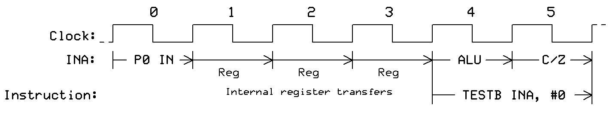

### Mode Register Structure (WRPIN)

The 32-bit mode register controls all Smart Pin settings:

```
Bits 31..14: Pin input/output configuration
Bits 13..8:  Digital filter settings
Bits 7..6:   Output enable control
Bits 5..0:   Smart Pin mode selection (\textbackslash\{\}\%MMMMMM)
```

### X Register Functions (WXPIN)

The X register function varies by mode:
- **Timing modes**: Period or timeout value
- **Counter modes**: Count limit or reset value
- **PWM modes**: Base period
- **Serial modes**: Bit period

### Y Register Functions (WYPIN)

The Y register function varies by mode:
- **Output modes**: Output value or duty cycle
- **Counter modes**: Not used or count increment
- **Measurement modes**: Measurement window
- **Serial modes**: Data to transmit

### Z Register Functions (RDPIN/RQPIN)

The Z register always contains the Smart Pin result:
- **RDPIN**: Read and acknowledge (clears IN flag)
- **RQPIN**: Read without acknowledge (preserves IN flag)

Result varies by mode:
- **Counter modes**: Current count
- **Measurement modes**: Measured value
- **Serial modes**: Received data
- **Output modes**: Current output value

### Reading Smart Pin State

Two methods to check Smart Pin status:

**Method 1: Test IN Flag**
```pasm2
        testp   \textbackslash\{\}\#pin, wc        ' C = IN flag state
  if\textbackslash\{\}\_c  jmp     \textbackslash\{\}\#data\textbackslash\{\}\_ready     ' Jump if data ready
```

**Method 2: Read with Status**
```pasm2
        rdpin   value, \textbackslash\{\}\#pin wc  ' Read value, C = IN flag
  if\textbackslash\{\}\_nc jmp     \textbackslash\{\}\#no\textbackslash\{\}\_data        ' Jump if no data
```

---

## Chapter 3: Programming Interface

### Spin2 Smart Pin Methods

Spin2 provides high-level methods for Smart Pin control:

```spin2
pinstart(pin, mode, x\textbackslash\{\}\_value, y\textbackslash\{\}\_value)  ' Configure and start
pinclear(pin)                           ' Disable Smart Pin
pinw(pin, value)                        ' Write to Y register
pinr(pin)                               ' Read Z register
pinfloat(pin)                          ' Float pin (high-Z)
pinl(pin)                              ' Drive pin low
pinh(pin)                              ' Drive pin high
pintoggle(pin)                         ' Toggle pin state
```

### PASM2 Smart Pin Instructions

PASM2 provides direct Smart Pin control:

```pasm2
WRPIN   D/\textbackslash\{\}\#, S/\textbackslash\{\}\#    ' Write mode configuration
WXPIN   D/\textbackslash\{\}\#, S/\textbackslash\{\}\#    ' Write X parameter
WYPIN   D/\textbackslash\{\}\#, S/\textbackslash\{\}\#    ' Write Y parameter  
RDPIN   D, S/\textbackslash\{\}\# \textbackslash\{\}\{WC\textbackslash\{\}\} ' Read Z result and acknowledge
RQPIN   D, S/\textbackslash\{\}\# \textbackslash\{\}\{WC\textbackslash\{\}\} ' Read Z result without acknowledge
AKPIN   S/\textbackslash\{\}\#         ' Acknowledge Smart Pin
TESTP   S/\textbackslash\{\}\# \textbackslash\{\}\{WC/WZ\textbackslash\{\}\} ' Test pin state
```

### Multi-COG Coordination

Smart Pins can be accessed by any COG:
- Pin ownership is not exclusive
- Multiple COGs can read results
- Configuration should be coordinated
- OR'd signal paths for shared pins

### Synchronization Techniques

**Starting Multiple Pins Simultaneously**
```spin2
PUB start\textbackslash\{\}\_synchronized(first\textbackslash\{\}\_pin, last\textbackslash\{\}\_pin, mode) | mask
  mask := (1 << (last\textbackslash\{\}\_pin - first\textbackslash\{\}\_pin + 1)) - 1
  mask <<= first\textbackslash\{\}\_pin
  
  ' Configure all pins while disabled
  repeat pin from first\textbackslash\{\}\_pin to last\textbackslash\{\}\_pin
    pinstart(pin, mode, 0, 0)
    pinclear(pin)
    
  ' Enable all simultaneously  
  DIRH(mask)
```

**Phase-Locked PWM Outputs**
```pasm2
        mov     mask, \textbackslash\{\}\#\textbackslash\{\}\$FF      ' Pins P7..P0
        shl     mask, \textbackslash\{\}\#20       ' Pins P27..P20
        
        ' Configure while disabled
        rep     \textbackslash\{\}\#4, \textbackslash\{\}\#8          ' 8 pins
        wrpin   pwm\textbackslash\{\}\_mode, pin
        wxpin   period, pin
        wypin   duty, pin
        add     pin, \textbackslash\{\}\#1
        
        ' Start synchronized
        dirh    mask            ' Enable all PWM pins
```

### Error Handling

Common Smart Pin errors and recovery:

**Configuration Error**
- Symptom: Pin doesn't respond as expected
- Solution: Reset pin (DIRL) and reconfigure

**Overflow/Underflow**
- Symptom: Counter wraps or saturates
- Solution: Monitor and reset periodically

**Timing Violation**
- Symptom: Missed samples or events
- Solution: Increase sampling rate or use buffering

---

# Part II: Mode Reference

## Chapter 4: Digital I/O Modes

### Mode %00000 - Smart Pin OFF (Default)

**Specifications**
- Function: Smart Pin disabled, normal I/O operation
- Power: Minimum consumption
- Timing: Immediate I/O response
- Usage: Default state after reset

**Configuration**
```
WRPIN: \textbackslash\{\}\$00000000 (or simply 0)
WXPIN: Not used
WYPIN: Not used
Z Result: Not applicable
```

**Spin2 Implementation**
```spin2
PUB disable\textbackslash\{\}\_smart\textbackslash\{\}\_pin(pin)
  pinclear(pin)        ' Disable Smart Pin
  pinfloat(pin)        ' Float to high-Z
  
PUB use\textbackslash\{\}\_as\textbackslash\{\}\_normal\textbackslash\{\}\_io(pin)
  pinclear(pin)        ' Ensure Smart Pin OFF
  pinh(pin)           ' Drive high
  pinl(pin)           ' Drive low
  result := pinr(pin)  ' Read pin state
```

**PASM2 Implementation**
```pasm2
DAT
        org     0
        
disable\textbackslash\{\}\_smart
        dirl    \textbackslash\{\}\#20             ' Disable pin (Smart Pin OFF)
        
normal\textbackslash\{\}\_output
        dirl    \textbackslash\{\}\#20             ' Ensure disabled
        or      outa, \textbackslash\{\}\#(1<<20)  ' Prepare high
        or      dira, \textbackslash\{\}\#(1<<20)  ' Drive high
        andn    outa, \textbackslash\{\}\#(1<<20)  ' Drive low
        
normal\textbackslash\{\}\_input  
        andn    dira, \textbackslash\{\}\#(1<<20)  ' Set as input
        test    ina, \textbackslash\{\}\#(1<<20) wc ' Read state into C
```

**Applications**
- Standard GPIO operations
- Reset Smart Pin to known state
- Power-sensitive applications

---

### Mode %00001 - Repository Mode

**Specifications**
- Function: 32-bit read/write repository
- Storage: Retains value until overwritten
- Access: Multiple COGs can read/write
- Power: Low consumption

**Configuration**
```
WRPIN: \textbackslash\{\}\%00001 (P\textbackslash\{\}\_REPOSITORY)
WXPIN: Not used
WYPIN: Value to store
Z Result: Stored value
```

**Spin2 Implementation**
```spin2
CON
  REPO\textbackslash\{\}\_PIN = 20
  REPO\textbackslash\{\}\_MODE = P\textbackslash\{\}\_REPOSITORY | P\textbackslash\{\}\_OE

PUB setup\textbackslash\{\}\_repository()
  pinstart(REPO\textbackslash\{\}\_PIN, REPO\textbackslash\{\}\_MODE, 0, 0)

PUB store\textbackslash\{\}\_value(data)
  wypin(REPO\textbackslash\{\}\_PIN, data)       ' Store 32-bit value
  
PUB retrieve\textbackslash\{\}\_value() : data
  data := rdpin(REPO\textbackslash\{\}\_PIN)     ' Read stored value
  
PUB share\textbackslash\{\}\_between\textbackslash\{\}\_cogs(value) | retrieved
  store\textbackslash\{\}\_value(value)          ' COG 1 stores
  ' ... other COG can read ...
  retrieved := retrieve\textbackslash\{\}\_value() ' COG 2 reads
```

**PASM2 Implementation**
```pasm2
DAT
        org     0
        
repo\textbackslash\{\}\_init
        mov     pa, \textbackslash\{\}\#\textbackslash\{\}\#P\textbackslash\{\}\_REPOSITORY | P\textbackslash\{\}\_OE
        wrpin   pa, \textbackslash\{\}\#20         ' Configure as repository
        dirh    \textbackslash\{\}\#20             ' Enable repository
        
store\textbackslash\{\}\_data
        mov     pa, \textbackslash\{\}\#\textbackslash\{\}\#\textbackslash\{\}\$12345678 ' Data to store
        wypin   pa, \textbackslash\{\}\#20         ' Write to repository
        
read\textbackslash\{\}\_data
        rdpin   result, \textbackslash\{\}\#20     ' Read repository
        ' result now contains stored value
        
result  long    0
```

**Applications**
- Inter-COG communication without HUB access
- Parameter passing between COGs
- Temporary value storage
- Configuration storage

**Performance Notes**
- Single clock access from any COG
- No HUB bandwidth impact
- Atomic 32-bit operations

---

### Mode %00111 - Transition Output

**Specifications**
- Function: Output transitions on X-clock intervals
- Timing: Precise edge generation
- Control: X sets period, Y sets pattern
- Applications: Clock generation, protocol signaling

**Configuration**
```
WRPIN: \textbackslash\{\}\%00111 (P\textbackslash\{\}\_TRANSITION)
WXPIN: Clock period (sysclock cycles)
WYPIN: Number of transitions
Z Result: Current transition count
```

**Spin2 Implementation**
```spin2
CON
  TRANS\textbackslash\{\}\_PIN = 20
  TRANS\textbackslash\{\}\_MODE = P\textbackslash\{\}\_TRANSITION | P\textbackslash\{\}\_OE

PUB setup\textbackslash\{\}\_transition\textbackslash\{\}\_output(period, count)
  pinstart(TRANS\textbackslash\{\}\_PIN, TRANS\textbackslash\{\}\_MODE, period, count)
  
PUB generate\textbackslash\{\}\_clock(freq\textbackslash\{\}\_hz) | period
  period := clkfreq / (freq\textbackslash\{\}\_hz * 2)  ' Calculate period
  wxpin(TRANS\textbackslash\{\}\_PIN, period)           ' Set period
  wypin(TRANS\textbackslash\{\}\_PIN, 0)                ' Continuous transitions
  
PUB burst\textbackslash\{\}\_transitions(num\textbackslash\{\}\_edges)
  wypin(TRANS\textbackslash\{\}\_PIN, num\textbackslash\{\}\_edges)        ' Generate N transitions
  repeat while pinr(TRANS\textbackslash\{\}\_PIN)       ' Wait for completion
```

**PASM2 Implementation**
```pasm2
DAT
        org     0
        
trans\textbackslash\{\}\_init
        mov     pa, \textbackslash\{\}\#\textbackslash\{\}\#P\textbackslash\{\}\_TRANSITION | P\textbackslash\{\}\_OE
        wrpin   pa, \textbackslash\{\}\#20         ' Configure transition mode
        mov     pa, \textbackslash\{\}\#\textbackslash\{\}\#1000      ' Period = 1000 clocks
        wxpin   pa, \textbackslash\{\}\#20         ' Set period
        dirh    \textbackslash\{\}\#20             ' Enable output
        
gen\textbackslash\{\}\_burst
        mov     pa, \textbackslash\{\}\#10         ' Generate 10 transitions
        wypin   pa, \textbackslash\{\}\#20         ' Start burst
.wait   testp   \textbackslash\{\}\#20, wc         ' Check if done
  if\textbackslash\{\}\_c  jmp     \textbackslash\{\}\#.wait          ' Wait for completion
```

**Applications**
- Clock generation
- Pulse train generation
- Protocol bit timing
- Test signal generation

---

## Chapter 5: DAC Output Modes

### Mode %00010 - DAC 124Ω, 3.3V Output

**Specifications**
- Resolution: 16 bits
- Output range: 0V to 3.3V (VIO)
- Output impedance: 124Ω ±5%
- Update rate: Up to sysclock/2
- Settling time: <1µs to 0.1%
- Current drive: 10mA maximum

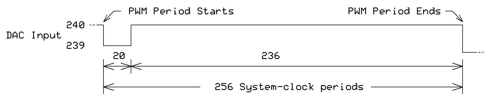

**Configuration**
```
WRPIN: P\textbackslash\{\}\_DAC\textbackslash\{\}\_124R\textbackslash\{\}\_3V | P\textbackslash\{\}\_OE
WXPIN: Update period (0 = manual)
WYPIN: 16-bit DAC value
Z Result: Current DAC value
```

**Spin2 Implementation**
```spin2
CON
  DAC\textbackslash\{\}\_PIN = 20
  DAC\textbackslash\{\}\_MODE = P\textbackslash\{\}\_DAC\textbackslash\{\}\_124R\textbackslash\{\}\_3V | P\textbackslash\{\}\_OE

PUB setup\textbackslash\{\}\_dac()
  pinstart(DAC\textbackslash\{\}\_PIN, DAC\textbackslash\{\}\_MODE, 0, 0)
  
PUB set\textbackslash\{\}\_voltage(millivolts) | dacval
  ' Convert millivolts (0-3300) to DAC value
  dacval := (millivolts * \textbackslash\{\}\$FFFF) / 3300
  wypin(DAC\textbackslash\{\}\_PIN, dacval)
  
PUB generate\textbackslash\{\}\_sine(freq\textbackslash\{\}\_hz) | angle, delay
  delay := clkfreq / (freq\textbackslash\{\}\_hz * 360)
  repeat
    repeat angle from 0 to 359
      wypin(DAC\textbackslash\{\}\_PIN, \textbackslash\{\}\$8000 + sin(angle, \textbackslash\{\}\$7FFF))
      waitx(delay)
```

**PASM2 Implementation**
```pasm2
DAT
        org     0
        
dac\textbackslash\{\}\_init
        mov     pa, \textbackslash\{\}\#\textbackslash\{\}\#P\textbackslash\{\}\_DAC\textbackslash\{\}\_124R\textbackslash\{\}\_3V | P\textbackslash\{\}\_OE
        wrpin   pa, \textbackslash\{\}\#20         ' Configure DAC
        dirh    \textbackslash\{\}\#20             ' Enable output
        
set\textbackslash\{\}\_voltage
        mov     pa, \textbackslash\{\}\#\textbackslash\{\}\#\textbackslash\{\}\$8000     ' Mid-scale (1.65V)
        wypin   pa, \textbackslash\{\}\#20         ' Output voltage
        
generate\textbackslash\{\}\_ramp
.loop   add     dacval, \textbackslash\{\}\#\textbackslash\{\}\$100   ' Increment
        wypin   dacval, \textbackslash\{\}\#20     ' Update DAC
        waitx   \textbackslash\{\}\#\textbackslash\{\}\#1000          ' Delay
        jmp     \textbackslash\{\}\#.loop
        
dacval  long    0
```

**Applications**
- Analog voltage generation
- Audio output
- Control voltage generation
- Sensor simulation
- Waveform synthesis

**Performance Notes**
- No filtering required for DC outputs
- Add RC filter for audio applications
- Consider 75Ω mode for lower impedance

---

### Mode %00011 - DAC 75Ω, 2.0V Output

**Specifications**
- Resolution: 16 bits
- Output range: 0V to 2.0V
- Output impedance: 75Ω ±5%
- Update rate: Up to sysclock/2
- Settling time: <1µs to 0.1%
- Current drive: 15mA maximum

**Configuration**
```
WRPIN: P\textbackslash\{\}\_DAC\textbackslash\{\}\_75R\textbackslash\{\}\_2V | P\textbackslash\{\}\_OE
WXPIN: Update period (0 = manual)
WYPIN: 16-bit DAC value
Z Result: Current DAC value
```

**Spin2 Implementation**
```spin2
CON
  VIDEO\textbackslash\{\}\_PIN = 20
  VIDEO\textbackslash\{\}\_MODE = P\textbackslash\{\}\_DAC\textbackslash\{\}\_75R\textbackslash\{\}\_2V | P\textbackslash\{\}\_OE

PUB setup\textbackslash\{\}\_video\textbackslash\{\}\_dac()
  pinstart(VIDEO\textbackslash\{\}\_PIN, VIDEO\textbackslash\{\}\_MODE, 0, 0)
  
PUB set\textbackslash\{\}\_video\textbackslash\{\}\_level(millivolts) | dacval
  ' Convert millivolts (0-2000) to DAC value
  dacval := (millivolts * \textbackslash\{\}\$FFFF) / 2000
  wypin(VIDEO\textbackslash\{\}\_PIN, dacval)
  
PUB generate\textbackslash\{\}\_sync\textbackslash\{\}\_pulse()
  wypin(VIDEO\textbackslash\{\}\_PIN, 0)         ' Sync level (0V)
  waitus(5)                   ' Sync width
  wypin(VIDEO\textbackslash\{\}\_PIN, \textbackslash\{\}\$4CCC)     ' Black level (0.3V)
```

**PASM2 Implementation**
```pasm2
DAT
        org     0
        
video\textbackslash\{\}\_init
        mov     pa, \textbackslash\{\}\#\textbackslash\{\}\#P\textbackslash\{\}\_DAC\textbackslash\{\}\_75R\textbackslash\{\}\_2V | P\textbackslash\{\}\_OE
        wrpin   pa, \textbackslash\{\}\#20         ' Configure video DAC
        dirh    \textbackslash\{\}\#20             ' Enable output
        
composite\textbackslash\{\}\_sync
        mov     pa, \textbackslash\{\}\#0          ' Sync level
        wypin   pa, \textbackslash\{\}\#20
        waitx   \textbackslash\{\}\#\textbackslash\{\}\#400           ' 5µs at 80MHz
        mov     pa, \textbackslash\{\}\#\textbackslash\{\}\#\textbackslash\{\}\$4CCC     ' Black level
        wypin   pa, \textbackslash\{\}\#20
        
white\textbackslash\{\}\_level
        mov     pa, \textbackslash\{\}\#\textbackslash\{\}\#\textbackslash\{\}\$FFFF     ' White level (2.0V)
        wypin   pa, \textbackslash\{\}\#20
```

**Applications**
- Composite video generation
- Component video output
- Professional video equipment
- 75Ω transmission line driving
- Precision analog signaling

---

## Chapter 6: Pulse and NCO Modes

### Mode %00100 - Pulse/Cycle Output

**Specifications**
- Function: Generate pulses with programmable width
- Timing: X sets base period, Y sets pulse count
- Resolution: System clock precision
- Range: 1 to 2^32 clocks

**Configuration**
```
WRPIN: \textbackslash\{\}\%00100 (P\textbackslash\{\}\_PULSE)
WXPIN: Base period in clocks
WYPIN: Pulse count/width
Z Result: Remaining pulses
```

**Spin2 Implementation**
```spin2
CON
  PULSE\textbackslash\{\}\_PIN = 20
  PULSE\textbackslash\{\}\_MODE = P\textbackslash\{\}\_PULSE | P\textbackslash\{\}\_OE

PUB setup\textbackslash\{\}\_pulse\textbackslash\{\}\_gen(period)
  pinstart(PULSE\textbackslash\{\}\_PIN, PULSE\textbackslash\{\}\_MODE, period, 0)
  
PUB single\textbackslash\{\}\_pulse(width\textbackslash\{\}\_us)
  wxpin(PULSE\textbackslash\{\}\_PIN, clkfreq / 1\textbackslash\{\}\_000\textbackslash\{\}\_000 * width\textbackslash\{\}\_us)
  wypin(PULSE\textbackslash\{\}\_PIN, 1)         ' Generate one pulse
  
PUB pulse\textbackslash\{\}\_burst(count, width\textbackslash\{\}\_us)
  wxpin(PULSE\textbackslash\{\}\_PIN, clkfreq / 1\textbackslash\{\}\_000\textbackslash\{\}\_000 * width\textbackslash\{\}\_us)
  wypin(PULSE\textbackslash\{\}\_PIN, count)     ' Generate count pulses
```

**PASM2 Implementation**
```pasm2
DAT
        org     0
        
pulse\textbackslash\{\}\_init
        mov     pa, \textbackslash\{\}\#\textbackslash\{\}\#P\textbackslash\{\}\_PULSE | P\textbackslash\{\}\_OE
        wrpin   pa, \textbackslash\{\}\#20         ' Configure pulse mode
        mov     pa, \textbackslash\{\}\#\textbackslash\{\}\#10000     ' 10000 clock period
        wxpin   pa, \textbackslash\{\}\#20
        dirh    \textbackslash\{\}\#20             ' Enable output
        
gen\textbackslash\{\}\_pulse
        mov     pa, \textbackslash\{\}\#5          ' Generate 5 pulses
        wypin   pa, \textbackslash\{\}\#20
.wait   testp   \textbackslash\{\}\#20, wc         ' Check completion
  if\textbackslash\{\}\_c  jmp     \textbackslash\{\}\#.wait
```

**Applications**
- Stepper motor control
- Servo positioning
- Timing pulse generation
- Trigger signal generation

---

### Mode %00101 - NCO Frequency

**Specifications**
- Function: Numerically Controlled Oscillator
- Frequency: DC to sysclock/2
- Resolution: 32-bit frequency control
- Jitter: < 1 clock period


**Configuration**
```
WRPIN: \textbackslash\{\}\%00101 (P\textbackslash\{\}\_NCO\textbackslash\{\}\_FREQ)
WXPIN: Base period (divider)
WYPIN: Frequency value (32-bit)
Z Result: Phase accumulator
```

**Spin2 Implementation**
```spin2
CON
  NCO\textbackslash\{\}\_PIN = 20
  NCO\textbackslash\{\}\_MODE = P\textbackslash\{\}\_NCO\textbackslash\{\}\_FREQ | P\textbackslash\{\}\_OE

PUB setup\textbackslash\{\}\_nco()
  pinstart(NCO\textbackslash\{\}\_PIN, NCO\textbackslash\{\}\_MODE, 1, 0)
  
PUB set\textbackslash\{\}\_frequency(freq\textbackslash\{\}\_hz) | nco\textbackslash\{\}\_val
  ' Calculate NCO value for desired frequency
  nco\textbackslash\{\}\_val := freq\textbackslash\{\}\_hz frac clkfreq
  wypin(NCO\textbackslash\{\}\_PIN, nco\textbackslash\{\}\_val)
  
PUB sweep\textbackslash\{\}\_frequency(start\textbackslash\{\}\_hz, end\textbackslash\{\}\_hz, time\textbackslash\{\}\_ms) | step, current
  current := start\textbackslash\{\}\_hz frac clkfreq
  step := ((end\textbackslash\{\}\_hz - start\textbackslash\{\}\_hz) frac clkfreq) / time\textbackslash\{\}\_ms
  
  repeat time\textbackslash\{\}\_ms
    wypin(NCO\textbackslash\{\}\_PIN, current)
    current += step
    waitms(1)
```

**PASM2 Implementation**
```pasm2
DAT
        org     0
        
nco\textbackslash\{\}\_init
        mov     pa, \textbackslash\{\}\#\textbackslash\{\}\#P\textbackslash\{\}\_NCO\textbackslash\{\}\_FREQ | P\textbackslash\{\}\_OE
        wrpin   pa, \textbackslash\{\}\#20         ' Configure NCO
        mov     pa, \textbackslash\{\}\#1          ' Divider = 1
        wxpin   pa, \textbackslash\{\}\#20
        dirh    \textbackslash\{\}\#20             ' Enable output
        
set\textbackslash\{\}\_1khz
        ' For 1kHz at 200MHz clock:
        ' NCO = (1000 * 2\textbackslash\{\}\^{}\{\}32) / 200\textbackslash\{\}\_000\textbackslash\{\}\_000
        mov     pa, \textbackslash\{\}\#\textbackslash\{\}\#21474836  ' NCO value for 1kHz
        wypin   pa, \textbackslash\{\}\#20         ' Set frequency
```

**Applications**
- Precision frequency synthesis
- Clock generation
- Local oscillator for mixing
- DDS signal generation
- Frequency sweeping

---

### Mode %00110 - NCO Duty

**Specifications**
- Function: NCO with programmable duty cycle
- Frequency: DC to sysclock/4
- Duty resolution: 16 bits
- Duty range: 0% to 100%

**Configuration**
```
WRPIN: \textbackslash\{\}\%00110 (P\textbackslash\{\}\_NCO\textbackslash\{\}\_DUTY)
WXPIN: Base period
WYPIN: [31:16] = Duty, [15:0] = Frequency
Z Result: Phase accumulator
```

**Spin2 Implementation**
```spin2
CON
  DUTY\textbackslash\{\}\_PIN = 20
  DUTY\textbackslash\{\}\_MODE = P\textbackslash\{\}\_NCO\textbackslash\{\}\_DUTY | P\textbackslash\{\}\_OE

PUB setup\textbackslash\{\}\_nco\textbackslash\{\}\_duty()
  pinstart(DUTY\textbackslash\{\}\_PIN, DUTY\textbackslash\{\}\_MODE, 1, 0)
  
PUB set\textbackslash\{\}\_freq\textbackslash\{\}\_and\textbackslash\{\}\_duty(freq\textbackslash\{\}\_hz, duty\textbackslash\{\}\_percent) | nco\textbackslash\{\}\_val, duty\textbackslash\{\}\_val
  nco\textbackslash\{\}\_val := freq\textbackslash\{\}\_hz frac clkfreq
  duty\textbackslash\{\}\_val := (duty\textbackslash\{\}\_percent * \textbackslash\{\}\$FFFF) / 100
  wypin(DUTY\textbackslash\{\}\_PIN, (duty\textbackslash\{\}\_val << 16) | (nco\textbackslash\{\}\_val >> 16))
  
PUB pulse\textbackslash\{\}\_width\textbackslash\{\}\_modulate(duty)
  ' Fixed frequency, variable duty
  wypin(DUTY\textbackslash\{\}\_PIN, (duty << 16) | \textbackslash\{\}\$8000)
```

**PASM2 Implementation**
```pasm2
DAT
        org     0
        
duty\textbackslash\{\}\_init
        mov     pa, \textbackslash\{\}\#\textbackslash\{\}\#P\textbackslash\{\}\_NCO\textbackslash\{\}\_DUTY | P\textbackslash\{\}\_OE
        wrpin   pa, \textbackslash\{\}\#20         ' Configure NCO duty
        mov     pa, \textbackslash\{\}\#1
        wxpin   pa, \textbackslash\{\}\#20
        dirh    \textbackslash\{\}\#20
        
set\textbackslash\{\}\_50\textbackslash\{\}\_percent
        mov     pa, \textbackslash\{\}\#\textbackslash\{\}\#\textbackslash\{\}\$8000\textbackslash\{\}\_8000 ' 50\textbackslash\{\}\% duty, mid frequency
        wypin   pa, \textbackslash\{\}\#20
        
variable\textbackslash\{\}\_duty
        mov     duty, \textbackslash\{\}\#0
.loop   add     duty, \textbackslash\{\}\#\textbackslash\{\}\#\textbackslash\{\}\$0100\textbackslash\{\}\_0000 ' Increment duty
        or      duty, \textbackslash\{\}\#\textbackslash\{\}\#\textbackslash\{\}\$0000\textbackslash\{\}\_8000 ' Keep frequency
        wypin   duty, \textbackslash\{\}\#20
        waitx   \textbackslash\{\}\#\textbackslash\{\}\#10000
        jmp     \textbackslash\{\}\#.loop
        
duty    long    0
```

**Applications**
- Variable duty cycle generation
- Precision PWM at high frequencies
- Power control with fine resolution
- LED dimming with no flicker

---

## Chapter 7: PWM Modes

### Mode %01000 - PWM Sawtooth

**Specifications**
- Function: Edge-aligned PWM
- Resolution: Up to 16 bits
- Frequency: sysclock / (2 × period)
- Duty cycle: 0% to 100%

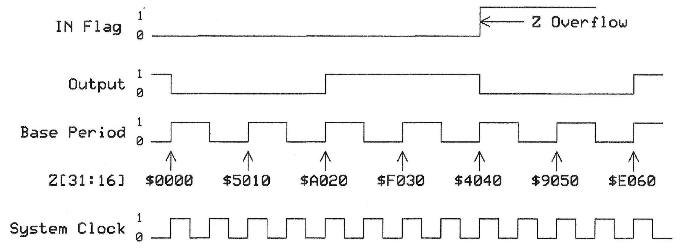

**Configuration**
```
WRPIN: \textbackslash\{\}\%01000 (P\textbackslash\{\}\_PWM\textbackslash\{\}\_SAWTOOTH)
WXPIN: Base period (16-bit)
WYPIN: Duty value (16-bit)
Z Result: Current counter value
```

**Spin2 Implementation**
```spin2
CON
  PWM\textbackslash\{\}\_PIN = 20
  PWM\textbackslash\{\}\_MODE = P\textbackslash\{\}\_PWM\textbackslash\{\}\_SAWTOOTH | P\textbackslash\{\}\_OE

PUB setup\textbackslash\{\}\_pwm(freq\textbackslash\{\}\_hz) | period
  period := clkfreq / freq\textbackslash\{\}\_hz
  pinstart(PWM\textbackslash\{\}\_PIN, PWM\textbackslash\{\}\_MODE, period, 0)
  
PUB set\textbackslash\{\}\_duty\textbackslash\{\}\_percent(percent) | duty
  duty := (percent * \textbackslash\{\}\$FFFF) / 100
  wypin(PWM\textbackslash\{\}\_PIN, duty)
  
PUB fade\textbackslash\{\}\_led()
  repeat
    repeat duty from 0 to \textbackslash\{\}\$FFFF step \textbackslash\{\}\$100
      wypin(PWM\textbackslash\{\}\_PIN, duty)
      waitms(1)
    repeat duty from \textbackslash\{\}\$FFFF to 0 step \textbackslash\{\}\$100
      wypin(PWM\textbackslash\{\}\_PIN, duty)
      waitms(1)
```

**PASM2 Implementation**
```pasm2
DAT
        org     0
        
pwm\textbackslash\{\}\_init
        mov     pa, \textbackslash\{\}\#\textbackslash\{\}\#P\textbackslash\{\}\_PWM\textbackslash\{\}\_SAWTOOTH | P\textbackslash\{\}\_OE
        wrpin   pa, \textbackslash\{\}\#20         ' Configure PWM
        mov     pa, \textbackslash\{\}\#\textbackslash\{\}\#1000      ' Period = 1000
        wxpin   pa, \textbackslash\{\}\#20
        dirh    \textbackslash\{\}\#20             ' Enable output
        
set\textbackslash\{\}\_25\textbackslash\{\}\_percent
        mov     pa, \textbackslash\{\}\#\textbackslash\{\}\#\textbackslash\{\}\$4000     ' 25\textbackslash\{\}\% duty
        wypin   pa, \textbackslash\{\}\#20
        
sweep\textbackslash\{\}\_duty
        mov     duty, \textbackslash\{\}\#0
.loop   add     duty, \textbackslash\{\}\#\textbackslash\{\}\$100     ' Increment duty
        wypin   duty, \textbackslash\{\}\#20       ' Update PWM
        waitx   \textbackslash\{\}\#\textbackslash\{\}\#10000         ' Delay
        jmp     \textbackslash\{\}\#.loop
        
duty    long    0
```

**Applications**
- Motor speed control
- LED dimming
- Power regulation
- Audio amplifier control
- Heater control

---

### Mode %01001 - PWM Triangle

**Specifications**
- Function: Center-aligned PWM
- Resolution: Up to 16 bits
- Frequency: sysclock / (4 × period)
- Duty cycle: 0% to 100%
- Advantage: Reduced harmonics

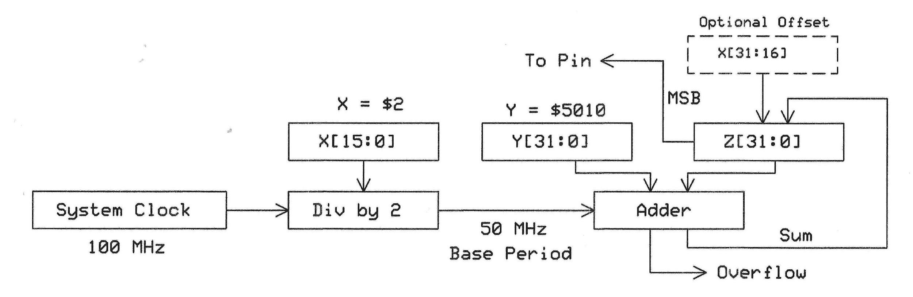

**Configuration**
```
WRPIN: \textbackslash\{\}\%01001 (P\textbackslash\{\}\_PWM\textbackslash\{\}\_TRIANGLE)
WXPIN: Base period (16-bit)
WYPIN: Duty value (16-bit)
Z Result: Current counter value
```

**Spin2 Implementation**
```spin2
CON
  MOTOR\textbackslash\{\}\_PIN = 20
  MOTOR\textbackslash\{\}\_MODE = P\textbackslash\{\}\_PWM\textbackslash\{\}\_TRIANGLE | P\textbackslash\{\}\_OE

PUB setup\textbackslash\{\}\_motor\textbackslash\{\}\_pwm(freq\textbackslash\{\}\_hz) | period
  ' Triangle mode frequency is 1/2 of sawtooth
  period := clkfreq / (freq\textbackslash\{\}\_hz * 2)
  pinstart(MOTOR\textbackslash\{\}\_PIN, MOTOR\textbackslash\{\}\_MODE, period, 0)
  
PUB set\textbackslash\{\}\_motor\textbackslash\{\}\_speed(percent) | duty
  duty := (percent * \textbackslash\{\}\$FFFF) / 100
  wypin(MOTOR\textbackslash\{\}\_PIN, duty)
  
PUB soft\textbackslash\{\}\_start(target\textbackslash\{\}\_percent, ramp\textbackslash\{\}\_ms) | step, current
  step := (\textbackslash\{\}\$FFFF * target\textbackslash\{\}\_percent) / (100 * ramp\textbackslash\{\}\_ms)
  current := 0
  
  repeat ramp\textbackslash\{\}\_ms
    wypin(MOTOR\textbackslash\{\}\_PIN, current)
    current := (current + step) <\textbackslash\{\}\# (\textbackslash\{\}\$FFFF * target\textbackslash\{\}\_percent / 100)
    waitms(1)
```

**PASM2 Implementation**
```pasm2
DAT
        org     0
        
triangle\textbackslash\{\}\_init
        mov     pa, \textbackslash\{\}\#\textbackslash\{\}\#P\textbackslash\{\}\_PWM\textbackslash\{\}\_TRIANGLE | P\textbackslash\{\}\_OE
        wrpin   pa, \textbackslash\{\}\#20         ' Configure triangle PWM
        mov     pa, \textbackslash\{\}\#\textbackslash\{\}\#2000      ' Period = 2000
        wxpin   pa, \textbackslash\{\}\#20
        dirh    \textbackslash\{\}\#20
        
complementary\textbackslash\{\}\_drive
        ' For H-bridge with pin 20 and 21
        mov     pa, \textbackslash\{\}\#\textbackslash\{\}\#P\textbackslash\{\}\_PWM\textbackslash\{\}\_TRIANGLE | P\textbackslash\{\}\_OE
        wrpin   pa, \textbackslash\{\}\#20
        wrpin   pa, \textbackslash\{\}\#21
        mov     pa, \textbackslash\{\}\#\textbackslash\{\}\#2000
        wxpin   pa, \textbackslash\{\}\#20
        wxpin   pa, \textbackslash\{\}\#21
        dirh    \textbackslash\{\}\#20
        dirh    \textbackslash\{\}\#21
        
        ' Set complementary duties
        mov     pa, \textbackslash\{\}\#\textbackslash\{\}\#\textbackslash\{\}\$8000     ' 50\textbackslash\{\}\% on pin 20
        wypin   pa, \textbackslash\{\}\#20
        mov     pa, \textbackslash\{\}\#\textbackslash\{\}\#\textbackslash\{\}\$8000     ' 50\textbackslash\{\}\% on pin 21 (inverted externally)
        wypin   pa, \textbackslash\{\}\#21
```

**Applications**
- Three-phase motor control
- Reduced EMI applications
- High-quality audio amplifiers
- Inverter control
- Precision power supplies

---

### Mode %01010 - Periodic Pulse (SMPS)

**Specifications**
- Function: Switch-mode power supply optimized
- Base period: X register
- ON time: Y register
- Frequency: sysclock / X
- Duty precision: Clock-cycle accurate

**Configuration**
```
WRPIN: \textbackslash\{\}\%01010 (P\textbackslash\{\}\_PERIODIC\textbackslash\{\}\_PULSE)
WXPIN: Total period
WYPIN: ON time
Z Result: Cycle counter
```

**Spin2 Implementation**
```spin2
CON
  SMPS\textbackslash\{\}\_PIN = 20
  SMPS\textbackslash\{\}\_MODE = P\textbackslash\{\}\_PERIODIC\textbackslash\{\}\_PULSE | P\textbackslash\{\}\_OE

PUB setup\textbackslash\{\}\_smps(freq\textbackslash\{\}\_hz)
  pinstart(SMPS\textbackslash\{\}\_PIN, SMPS\textbackslash\{\}\_MODE, clkfreq / freq\textbackslash\{\}\_hz, 0)
  
PUB set\textbackslash\{\}\_duty\textbackslash\{\}\_cycle(on\textbackslash\{\}\_time\textbackslash\{\}\_ns) | clocks
  clocks := (clkfreq / 1\textbackslash\{\}\_000\textbackslash\{\}\_000\textbackslash\{\}\_000) * on\textbackslash\{\}\_time\textbackslash\{\}\_ns
  wypin(SMPS\textbackslash\{\}\_PIN, clocks)
  
PUB voltage\textbackslash\{\}\_feedback\textbackslash\{\}\_loop(target\textbackslash\{\}\_adc) | current\textbackslash\{\}\_adc, duty
  duty := \textbackslash\{\}\$8000  ' Start at 50\textbackslash\{\}\%
  
  repeat
    current\textbackslash\{\}\_adc := read\textbackslash\{\}\_adc()
    if current\textbackslash\{\}\_adc < target\textbackslash\{\}\_adc
      duty := (duty + 1) <\textbackslash\{\}\# \textbackslash\{\}\$FFFF
    else
      duty := (duty - 1) \textbackslash\{\}\#> 0
    wypin(SMPS\textbackslash\{\}\_PIN, duty)
    waitus(100)  ' Control loop rate
```

**PASM2 Implementation**
```pasm2
DAT
        org     0
        
smps\textbackslash\{\}\_init
        mov     pa, \textbackslash\{\}\#\textbackslash\{\}\#P\textbackslash\{\}\_PERIODIC\textbackslash\{\}\_PULSE | P\textbackslash\{\}\_OE
        wrpin   pa, \textbackslash\{\}\#20         ' Configure SMPS mode
        mov     pa, \textbackslash\{\}\#\textbackslash\{\}\#4000      ' 50kHz at 200MHz
        wxpin   pa, \textbackslash\{\}\#20         ' Set period
        dirh    \textbackslash\{\}\#20
        
feedback\textbackslash\{\}\_control
        rdpin   adc\textbackslash\{\}\_val, \textbackslash\{\}\#30    ' Read ADC on pin 30
        cmp     adc\textbackslash\{\}\_val, target wc
  if\textbackslash\{\}\_c  add     duty, \textbackslash\{\}\#1        ' Increase if below target
  if\textbackslash\{\}\_nc sub     duty, \textbackslash\{\}\#1        ' Decrease if above target
        wypin   duty, \textbackslash\{\}\#20       ' Update duty
        waitx   \textbackslash\{\}\#\textbackslash\{\}\#1000          ' Loop delay
        jmp     \textbackslash\{\}\#feedback\textbackslash\{\}\_control
        
target  long    \textbackslash\{\}\$8000
duty    long    \textbackslash\{\}\$4000
adc\textbackslash\{\}\_val long    0
```

**Applications**
- Buck converters
- Boost converters
- LED drivers
- Battery chargers
- Motor drivers with current control

---

## Chapter 8: Encoder Modes

### Mode %01011 - Quadrature Encoder

**Specifications**
- Function: A/B quadrature decoder
- Resolution: 4x encoder resolution
- Speed: Up to sysclock/2
- Counter: 32-bit signed

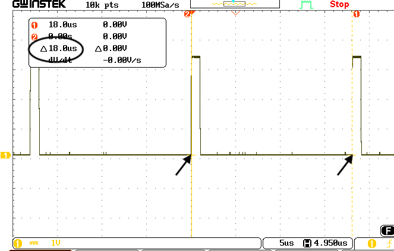

**Configuration**
```
WRPIN: \textbackslash\{\}\%01011 (P\textbackslash\{\}\_QUADRATURE\textbackslash\{\}\_ENC)
WXPIN: Not used
WYPIN: Reset value (typically 0)
Z Result: Current position count
```

**Spin2 Implementation**
```spin2
CON
  ENCODER\textbackslash\{\}\_A = 20
  ENCODER\textbackslash\{\}\_MODE = P\textbackslash\{\}\_QUADRATURE\textbackslash\{\}\_ENC

PUB setup\textbackslash\{\}\_encoder()
  ' A and B pins must be consecutive (A=20, B=21)
  pinstart(ENCODER\textbackslash\{\}\_A, ENCODER\textbackslash\{\}\_MODE, 0, 0)
  
PUB read\textbackslash\{\}\_position() : position
  position := rdpin(ENCODER\textbackslash\{\}\_A)
  
PUB reset\textbackslash\{\}\_position()
  wypin(ENCODER\textbackslash\{\}\_A, 0)
  
PUB read\textbackslash\{\}\_speed() : speed | pos1, pos2
  pos1 := rdpin(ENCODER\textbackslash\{\}\_A)
  waitms(10)
  pos2 := rdpin(ENCODER\textbackslash\{\}\_A)
  speed := (pos2 - pos1) * 100  ' Counts per second
```

**PASM2 Implementation**
```pasm2
DAT
        org     0
        
encoder\textbackslash\{\}\_init
        mov     pa, \textbackslash\{\}\#\textbackslash\{\}\#P\textbackslash\{\}\_QUADRATURE\textbackslash\{\}\_ENC
        wrpin   pa, \textbackslash\{\}\#20         ' Configure encoder on pins 20+21
        dirh    \textbackslash\{\}\#20             ' Enable encoder
        
read\textbackslash\{\}\_position
        rdpin   position, \textbackslash\{\}\#20   ' Get current count
        
track\textbackslash\{\}\_velocity
.loop   rdpin   pos1, \textbackslash\{\}\#20       ' First reading
        waitx   \textbackslash\{\}\#\textbackslash\{\}\#1000000       ' Wait 5ms at 200MHz
        rdpin   pos2, \textbackslash\{\}\#20       ' Second reading
        sub     pos2, pos1      ' Calculate delta
        ' pos2 now contains velocity
        jmp     \textbackslash\{\}\#.loop
        
position long   0
pos1    long    0
pos2    long    0
```

**Applications**
- Motor position feedback
- Rotary knob input
- Linear position sensing
- Closed-loop control systems
- CNC machine positioning

---

### Mode %01101 - A-B Encoder

**Specifications**
- Function: Separate A and B inputs
- Counting: A increments, B decrements
- Speed: Up to sysclock/2
- Counter: 32-bit signed

**Configuration**
```
WRPIN: \textbackslash\{\}\%01101 (P\textbackslash\{\}\_AB\textbackslash\{\}\_ENCODER)
WXPIN: Not used
WYPIN: Reset value
Z Result: Net count (A pulses - B pulses)
```

**Spin2 Implementation**
```spin2
CON
  COUNT\textbackslash\{\}\_PIN = 20
  AB\textbackslash\{\}\_MODE = P\textbackslash\{\}\_AB\textbackslash\{\}\_ENCODER

PUB setup\textbackslash\{\}\_ab\textbackslash\{\}\_counter()
  ' A on pin 20, B on pin 21
  pinstart(COUNT\textbackslash\{\}\_PIN, AB\textbackslash\{\}\_MODE, 0, 0)
  
PUB read\textbackslash\{\}\_difference() : diff
  diff := rdpin(COUNT\textbackslash\{\}\_PIN)
  
PUB differential\textbackslash\{\}\_measurement() : result
  wypin(COUNT\textbackslash\{\}\_PIN, 0)      ' Reset counter
  waitms(100)              ' Measurement period
  result := rdpin(COUNT\textbackslash\{\}\_PIN)  ' A-B difference
```

**PASM2 Implementation**
```pasm2
DAT
        org     0
        
ab\textbackslash\{\}\_init
        mov     pa, \textbackslash\{\}\#\textbackslash\{\}\#P\textbackslash\{\}\_AB\textbackslash\{\}\_ENCODER
        wrpin   pa, \textbackslash\{\}\#20         ' A=20, B=21
        dirh    \textbackslash\{\}\#20
        
differential\textbackslash\{\}\_count
        wypin   \textbackslash\{\}\#0, \textbackslash\{\}\#20         ' Reset counter
        waitx   \textbackslash\{\}\#\textbackslash\{\}\#20000000      ' 100ms at 200MHz
        rdpin   diff, \textbackslash\{\}\#20       ' Read A-B count
        ' diff = pulses on A minus pulses on B
        
diff    long    0
```

**Applications**
- Differential pulse counting
- Phase comparison
- Frequency difference measurement
- Direction sensing

---

### Mode %01110 - Incremental Encoder

**Specifications**
- Function: Single input pulse counter
- Counting: Rising edges
- Speed: Up to sysclock/2
- Counter: 32-bit unsigned

**Configuration**
```
WRPIN: \textbackslash\{\}\%01110 (P\textbackslash\{\}\_INC\textbackslash\{\}\_ENCODER)
WXPIN: Not used
WYPIN: Reset value
Z Result: Pulse count
```

**Spin2 Implementation**
```spin2
CON
  PULSE\textbackslash\{\}\_PIN = 20
  INC\textbackslash\{\}\_MODE = P\textbackslash\{\}\_INC\textbackslash\{\}\_ENCODER

PUB setup\textbackslash\{\}\_counter()
  pinstart(PULSE\textbackslash\{\}\_PIN, INC\textbackslash\{\}\_MODE, 0, 0)
  
PUB read\textbackslash\{\}\_count() : count
  count := rdpin(PULSE\textbackslash\{\}\_PIN)
  
PUB measure\textbackslash\{\}\_frequency() : freq
  wypin(PULSE\textbackslash\{\}\_PIN, 0)      ' Reset
  waitms(1000)             ' 1 second gate
  freq := rdpin(PULSE\textbackslash\{\}\_PIN) ' Hz
  
PUB count\textbackslash\{\}\_events(gate\textbackslash\{\}\_ms) : total
  wypin(PULSE\textbackslash\{\}\_PIN, 0)
  waitms(gate\textbackslash\{\}\_ms)
  total := rdpin(PULSE\textbackslash\{\}\_PIN)
```

**PASM2 Implementation**
```pasm2
DAT
        org     0
        
counter\textbackslash\{\}\_init
        mov     pa, \textbackslash\{\}\#\textbackslash\{\}\#P\textbackslash\{\}\_INC\textbackslash\{\}\_ENCODER
        wrpin   pa, \textbackslash\{\}\#20
        dirh    \textbackslash\{\}\#20
        
frequency\textbackslash\{\}\_counter
        wypin   \textbackslash\{\}\#0, \textbackslash\{\}\#20         ' Reset count
        waitx   \textbackslash\{\}\#\textbackslash\{\}\#200000000     ' 1 second at 200MHz
        rdpin   freq, \textbackslash\{\}\#20       ' Read frequency in Hz
        
event\textbackslash\{\}\_counter
        wypin   \textbackslash\{\}\#0, \textbackslash\{\}\#20         ' Reset
.wait   rdpin   count, \textbackslash\{\}\#20      ' Read current
        cmp     count, \textbackslash\{\}\#1000 wc ' Check if < 1000
  if\textbackslash\{\}\_c  jmp     \textbackslash\{\}\#.wait          ' Keep counting
        ' Reached 1000 events
        
freq    long    0
count   long    0
```

**Applications**
- Frequency counting
- Event counting
- Tachometer input
- Production counting
- Flow meter input

---

### Mode %01111 - Local/Global Comparator

**Specifications**
- Function: Pin state comparison
- Inputs: Selectable A and B pins
- Output: Comparison result
- Speed: Single clock response

**Configuration**
```
WRPIN: \textbackslash\{\}\%01111 (P\textbackslash\{\}\_COMPARATOR)
WXPIN: Input pin selection
WYPIN: Comparison mode
Z Result: Comparison state
```

**Spin2 Implementation**
```spin2
CON
  COMP\textbackslash\{\}\_PIN = 20
  COMP\textbackslash\{\}\_MODE = P\textbackslash\{\}\_COMPARATOR

PUB setup\textbackslash\{\}\_comparator()
  pinstart(COMP\textbackslash\{\}\_PIN, COMP\textbackslash\{\}\_MODE, \textbackslash\{\}\%0001\textbackslash\{\}\_0010, 0)  ' Compare pins 1 and 2
  
PUB read\textbackslash\{\}\_comparison() : state
  state := rdpin(COMP\textbackslash\{\}\_PIN) \textbackslash\{\}\& 1
  
PUB wait\textbackslash\{\}\_for\textbackslash\{\}\_match()
  repeat until rdpin(COMP\textbackslash\{\}\_PIN) \textbackslash\{\}\& 1
  
PUB detect\textbackslash\{\}\_crossing() | last, current
  last := rdpin(COMP\textbackslash\{\}\_PIN) \textbackslash\{\}\& 1
  repeat
    current := rdpin(COMP\textbackslash\{\}\_PIN) \textbackslash\{\}\& 1
    if current <> last
      ' Crossing detected
      return
    last := current
```

**PASM2 Implementation**
```pasm2
DAT
        org     0
        
comp\textbackslash\{\}\_init
        mov     pa, \textbackslash\{\}\#\textbackslash\{\}\#P\textbackslash\{\}\_COMPARATOR
        wrpin   pa, \textbackslash\{\}\#20
        mov     pa, \textbackslash\{\}\#\textbackslash\{\}\#\textbackslash\{\}\%0001\textbackslash\{\}\_0010 ' Pins 1 and 2
        wxpin   pa, \textbackslash\{\}\#20
        dirh    \textbackslash\{\}\#20
        
wait\textbackslash\{\}\_equal
.loop   rdpin   state, \textbackslash\{\}\#20
        test    state, \textbackslash\{\}\#1 wc
  if\textbackslash\{\}\_nc jmp     \textbackslash\{\}\#.loop          ' Wait until equal
        ' Pins are now equal
        
detect\textbackslash\{\}\_change
        rdpin   last, \textbackslash\{\}\#20
.watch  rdpin   current, \textbackslash\{\}\#20
        cmp     current, last wz
  if\textbackslash\{\}\_z  jmp     \textbackslash\{\}\#.watch
        ' State changed
        
state   long    0
last    long    0
current long    0
```

**Applications**
- Window comparator
- Zero-crossing detection
- Phase comparison
- Threshold detection
- Signal routing

---

## Chapter 9: Measurement Modes

### Mode %10000-%10011 - Time Accumulation

**Specifications**
- Function: Measure time in selected state
- States: High, Low, or changing
- Resolution: System clock
- Accumulator: 32-bit

**Configuration**
```
WRPIN: \textbackslash\{\}\%10000-\textbackslash\{\}\%10011 (P\textbackslash\{\}\_TIME\textbackslash\{\}\_ACC)
WXPIN: Measurement period
WYPIN: Not used
Z Result: Accumulated time
```

**Mode Variants:**
- %10000: Time high
- %10001: Time low  
- %10010: Time since change
- %10011: Time between changes

**Spin2 Implementation**
```spin2
CON
  TIME\textbackslash\{\}\_PIN = 20
  TIME\textbackslash\{\}\_HIGH = P\textbackslash\{\}\_TIME\textbackslash\{\}\_ACC | \textbackslash\{\}\%00  ' Measure high time
  TIME\textbackslash\{\}\_LOW = P\textbackslash\{\}\_TIME\textbackslash\{\}\_ACC | \textbackslash\{\}\%01   ' Measure low time

PUB measure\textbackslash\{\}\_duty\textbackslash\{\}\_cycle() : duty\textbackslash\{\}\_percent | high\textbackslash\{\}\_time, total\textbackslash\{\}\_time
  ' Measure high time
  pinstart(TIME\textbackslash\{\}\_PIN, TIME\textbackslash\{\}\_HIGH, clkfreq, 0)  ' 1 second window
  waitms(1001)
  high\textbackslash\{\}\_time := rdpin(TIME\textbackslash\{\}\_PIN)
  
  ' Calculate duty cycle
  duty\textbackslash\{\}\_percent := (high\textbackslash\{\}\_time * 100) / clkfreq
  
PUB measure\textbackslash\{\}\_pulse\textbackslash\{\}\_width() : width\textbackslash\{\}\_us
  pinstart(TIME\textbackslash\{\}\_PIN, TIME\textbackslash\{\}\_HIGH, 0, 0)  ' Continuous
  wypin(TIME\textbackslash\{\}\_PIN, 0)  ' Reset accumulator
  
  ' Wait for pulse
  repeat until pinr(TIME\textbackslash\{\}\_PIN)
  width\textbackslash\{\}\_us := rdpin(TIME\textbackslash\{\}\_PIN) / (clkfreq / 1\textbackslash\{\}\_000\textbackslash\{\}\_000)
```

**PASM2 Implementation**
```pasm2
DAT
        org     0
        
time\textbackslash\{\}\_init
        mov     pa, \textbackslash\{\}\#\textbackslash\{\}\#P\textbackslash\{\}\_TIME\textbackslash\{\}\_ACC | \textbackslash\{\}\%00  ' Measure high time
        wrpin   pa, \textbackslash\{\}\#20
        mov     pa, \textbackslash\{\}\#\textbackslash\{\}\#20000000   ' 100ms window at 200MHz
        wxpin   pa, \textbackslash\{\}\#20
        dirh    \textbackslash\{\}\#20
        
measure\textbackslash\{\}\_duty
        wypin   \textbackslash\{\}\#0, \textbackslash\{\}\#20         ' Reset
        waitx   \textbackslash\{\}\#\textbackslash\{\}\#20000000      ' Wait for window
        rdpin   high\textbackslash\{\}\_time, \textbackslash\{\}\#20  ' Get high time
        ' Duty = (high\textbackslash\{\}\_time * 100) / 20000000
        
measure\textbackslash\{\}\_period
        mov     pa, \textbackslash\{\}\#\textbackslash\{\}\#P\textbackslash\{\}\_TIME\textbackslash\{\}\_ACC | \textbackslash\{\}\%11  ' Time between changes
        wrpin   pa, \textbackslash\{\}\#20
        dirh    \textbackslash\{\}\#20
        wypin   \textbackslash\{\}\#0, \textbackslash\{\}\#20         ' Reset
.wait   testp   \textbackslash\{\}\#20, wc         ' Wait for measurement
  if\textbackslash\{\}\_nc jmp     \textbackslash\{\}\#.wait
        rdpin   period, \textbackslash\{\}\#20     ' Get period in clocks
        
high\textbackslash\{\}\_time long  0
period  long    0
```

**Applications**
- Duty cycle measurement
- Pulse width measurement
- Period measurement
- Frequency measurement
- Signal quality analysis

---

### Mode %10100-%10111 - State Measurement

**Specifications**
- Function: Count state occurrences
- Events: Edges or levels
- Counter: 32-bit
- Speed: Up to sysclock/2

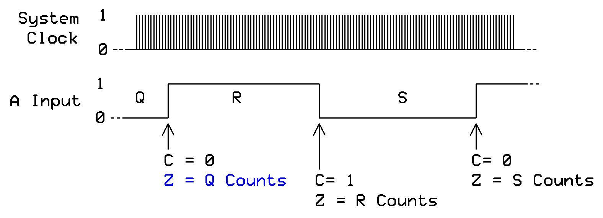

**Mode Variants:**
- %10100: Count rising edges
- %10101: Count falling edges
- %10110: Count any edge
- %10111: Count high states

**Configuration**
```
WRPIN: \textbackslash\{\}\%10100-\textbackslash\{\}\%10111 (P\textbackslash\{\}\_STATE\textbackslash\{\}\_MEAS)
WXPIN: Measurement window (0=continuous)
WYPIN: Not used
Z Result: Event count
```

**Spin2 Implementation**
```spin2
CON
  EDGE\textbackslash\{\}\_PIN = 20
  COUNT\textbackslash\{\}\_RISE = P\textbackslash\{\}\_STATE\textbackslash\{\}\_MEAS | \textbackslash\{\}\%00
  COUNT\textbackslash\{\}\_FALL = P\textbackslash\{\}\_STATE\textbackslash\{\}\_MEAS | \textbackslash\{\}\%01
  COUNT\textbackslash\{\}\_BOTH = P\textbackslash\{\}\_STATE\textbackslash\{\}\_MEAS | \textbackslash\{\}\%10

PUB count\textbackslash\{\}\_pulses(duration\textbackslash\{\}\_ms) : count
  pinstart(EDGE\textbackslash\{\}\_PIN, COUNT\textbackslash\{\}\_RISE, 0, 0)
  wypin(EDGE\textbackslash\{\}\_PIN, 0)  ' Reset counter
  waitms(duration\textbackslash\{\}\_ms)
  count := rdpin(EDGE\textbackslash\{\}\_PIN)
  
PUB measure\textbackslash\{\}\_frequency() : freq\textbackslash\{\}\_hz
  pinstart(EDGE\textbackslash\{\}\_PIN, COUNT\textbackslash\{\}\_RISE, clkfreq, 0)  ' 1 second
  wypin(EDGE\textbackslash\{\}\_PIN, 0)
  waitsec(1)
  freq\textbackslash\{\}\_hz := rdpin(EDGE\textbackslash\{\}\_PIN)
  
PUB detect\textbackslash\{\}\_activity() : active
  pinstart(EDGE\textbackslash\{\}\_PIN, COUNT\textbackslash\{\}\_BOTH, clkfreq/100, 0)  ' 10ms window
  wypin(EDGE\textbackslash\{\}\_PIN, 0)
  waitms(11)
  active := rdpin(EDGE\textbackslash\{\}\_PIN) > 0
```

**PASM2 Implementation**
```pasm2
DAT
        org     0
        
edge\textbackslash\{\}\_init
        mov     pa, \textbackslash\{\}\#\textbackslash\{\}\#P\textbackslash\{\}\_STATE\textbackslash\{\}\_MEAS | \textbackslash\{\}\%00  ' Count rising
        wrpin   pa, \textbackslash\{\}\#20
        mov     pa, \textbackslash\{\}\#0          ' Continuous
        wxpin   pa, \textbackslash\{\}\#20
        dirh    \textbackslash\{\}\#20
        
count\textbackslash\{\}\_events
        wypin   \textbackslash\{\}\#0, \textbackslash\{\}\#20         ' Reset counter
        waitx   \textbackslash\{\}\#\textbackslash\{\}\#10000000      ' 50ms at 200MHz
        rdpin   count, \textbackslash\{\}\#20      ' Read count
        
frequency\textbackslash\{\}\_gate
        mov     pa, \textbackslash\{\}\#\textbackslash\{\}\#200000000 ' 1 second gate
        wxpin   pa, \textbackslash\{\}\#20
        wypin   \textbackslash\{\}\#0, \textbackslash\{\}\#20         ' Reset and start
        
.wait   testp   \textbackslash\{\}\#20, wc         ' Wait for gate close
  if\textbackslash\{\}\_nc jmp     \textbackslash\{\}\#.wait
        rdpin   freq, \textbackslash\{\}\#20       ' Frequency in Hz
        
count   long    0
freq    long    0
```

**Applications**
- Frequency measurement
- Event counting
- RPM measurement
- Signal activity detection
- Pulse counting

---

### Mode %11010 - Pin State Measurement

**Specifications**
- Function: Measure pin state timing
- Measurement: High/low duration
- Resolution: System clock
- Range: 1 to 2^32 clocks

**Configuration**
```
WRPIN: \textbackslash\{\}\%11010 (P\textbackslash\{\}\_PIN\textbackslash\{\}\_STATE)
WXPIN: Timeout value
WYPIN: Edge selection
Z Result: Duration measurement
```

**Spin2 Implementation**
```spin2
CON
  STATE\textbackslash\{\}\_PIN = 20
  STATE\textbackslash\{\}\_MODE = P\textbackslash\{\}\_PIN\textbackslash\{\}\_STATE

PUB measure\textbackslash\{\}\_pulse() : width\textbackslash\{\}\_clocks
  pinstart(STATE\textbackslash\{\}\_PIN, STATE\textbackslash\{\}\_MODE, 0, \textbackslash\{\}\%01)  ' Positive pulse
  repeat until pinr(STATE\textbackslash\{\}\_PIN)  ' Wait for measurement
  width\textbackslash\{\}\_clocks := rdpin(STATE\textbackslash\{\}\_PIN)
  
PUB measure\textbackslash\{\}\_frequency\textbackslash\{\}\_precise() : freq\textbackslash\{\}\_hz | period
  pinstart(STATE\textbackslash\{\}\_PIN, STATE\textbackslash\{\}\_MODE, 0, \textbackslash\{\}\%11)  ' Full period
  repeat until pinr(STATE\textbackslash\{\}\_PIN)
  period := rdpin(STATE\textbackslash\{\}\_PIN)
  freq\textbackslash\{\}\_hz := clkfreq / period
  
PUB timeout\textbackslash\{\}\_measurement(max\textbackslash\{\}\_clocks) : duration | timeout
  pinstart(STATE\textbackslash\{\}\_PIN, STATE\textbackslash\{\}\_MODE, max\textbackslash\{\}\_clocks, \textbackslash\{\}\%01)
  timeout := cnt + max\textbackslash\{\}\_clocks + 1000
  repeat until pinr(STATE\textbackslash\{\}\_PIN) or (cnt > timeout)
  if pinr(STATE\textbackslash\{\}\_PIN)
    duration := rdpin(STATE\textbackslash\{\}\_PIN)
  else
    duration := -1  ' Timeout occurred
```

**PASM2 Implementation**
```pasm2
DAT
        org     0
        
state\textbackslash\{\}\_init
        mov     pa, \textbackslash\{\}\#\textbackslash\{\}\#P\textbackslash\{\}\_PIN\textbackslash\{\}\_STATE
        wrpin   pa, \textbackslash\{\}\#20
        mov     pa, \textbackslash\{\}\#0          ' No timeout
        wxpin   pa, \textbackslash\{\}\#20
        mov     pa, \textbackslash\{\}\#\textbackslash\{\}\%01        ' Positive pulse
        wypin   pa, \textbackslash\{\}\#20
        dirh    \textbackslash\{\}\#20
        
measure\textbackslash\{\}\_pulse
.wait   testp   \textbackslash\{\}\#20, wc         ' Wait for measurement
  if\textbackslash\{\}\_nc jmp     \textbackslash\{\}\#.wait
        rdpin   width, \textbackslash\{\}\#20      ' Get pulse width
        
measure\textbackslash\{\}\_with\textbackslash\{\}\_timeout
        mov     pa, \textbackslash\{\}\#\textbackslash\{\}\#10000000  ' 50ms timeout
        wxpin   pa, \textbackslash\{\}\#20
        wypin   \textbackslash\{\}\#\textbackslash\{\}\%01, \textbackslash\{\}\#20       ' Reset for new measurement
        
        mov     timeout, cnt
        add     timeout, \textbackslash\{\}\#\textbackslash\{\}\#10000000
.check  testp   \textbackslash\{\}\#20, wc
  if\textbackslash\{\}\_c  jmp     \textbackslash\{\}\#.got\textbackslash\{\}\_it
        cmp     cnt, timeout wc
  if\textbackslash\{\}\_c  jmp     \textbackslash\{\}\#.check
        ' Timeout occurred
        mov     width, \textbackslash\{\}\#-1
        jmp     \textbackslash\{\}\#.done
.got\textbackslash\{\}\_it rdpin   width, \textbackslash\{\}\#20
.done
        
width   long    0
timeout long    0
```

**Applications**
- Pulse width measurement
- Period measurement
- Timeout detection
- Glitch detection
- Protocol timing verification

---

## Chapter 10: ADC Modes

### Mode %11000 - ADC Sample/Filter/Capture (SINC2)

**Specifications**
- Resolution: Up to 14 bits
- Filter: SINC2 decimation
- Sample rate: sysclock / (8 × period)
- Input: Differential or single-ended
- Range: 0V to 3.3V (VIO)

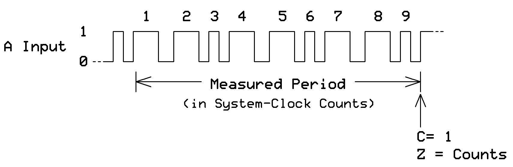

**Configuration**
```
WRPIN: \textbackslash\{\}\%11000 (P\textbackslash\{\}\_ADC\textbackslash\{\}\_SINC2)
WXPIN: Sample period
WYPIN: Calibration value
Z Result: ADC reading
```

**Spin2 Implementation**
```spin2
CON
  ADC\textbackslash\{\}\_PIN = 20
  ADC\textbackslash\{\}\_MODE = P\textbackslash\{\}\_ADC\textbackslash\{\}\_1X | P\textbackslash\{\}\_ADC

PUB setup\textbackslash\{\}\_adc()
  pinstart(ADC\textbackslash\{\}\_PIN, ADC\textbackslash\{\}\_MODE, 4096, 0)  ' 13-bit resolution
  
PUB read\textbackslash\{\}\_voltage() : millivolts
  millivolts := (rdpin(ADC\textbackslash\{\}\_PIN) * 3300) / 8191
  
PUB average\textbackslash\{\}\_readings(count) : avg | sum
  sum := 0
  repeat count
    sum += rdpin(ADC\textbackslash\{\}\_PIN)
    waitus(100)
  avg := sum / count
  
PUB continuous\textbackslash\{\}\_sample(buffer, samples) | i
  repeat i from 0 to samples-1
    repeat until pinr(ADC\textbackslash\{\}\_PIN)
    buffer[i] := rdpin(ADC\textbackslash\{\}\_PIN)
```

**PASM2 Implementation**
```pasm2
DAT
        org     0
        
adc\textbackslash\{\}\_init
        mov     pa, \textbackslash\{\}\#\textbackslash\{\}\#P\textbackslash\{\}\_ADC\textbackslash\{\}\_1X | P\textbackslash\{\}\_ADC
        wrpin   pa, \textbackslash\{\}\#20
        mov     pa, \textbackslash\{\}\#\textbackslash\{\}\#4096      ' 13-bit mode
        wxpin   pa, \textbackslash\{\}\#20
        dirh    \textbackslash\{\}\#20
        
read\textbackslash\{\}\_adc
.wait   testp   \textbackslash\{\}\#20, wc         ' Wait for sample
  if\textbackslash\{\}\_nc jmp     \textbackslash\{\}\#.wait
        rdpin   sample, \textbackslash\{\}\#20     ' Get ADC value
        
continuous\textbackslash\{\}\_log
        mov     ptra, \textbackslash\{\}\#\textbackslash\{\}\#buffer  ' Buffer address
        mov     count, \textbackslash\{\}\#100     ' 100 samples
.loop   testp   \textbackslash\{\}\#20, wc
  if\textbackslash\{\}\_nc jmp     \textbackslash\{\}\#.loop
        rdpin   sample, \textbackslash\{\}\#20
        wrlong  sample, ptra++
        djnz    count, \textbackslash\{\}\#.loop
        
sample  long    0
count   long    0
buffer  res     100
```

**Applications**
- Voltage measurement
- Sensor reading
- Audio sampling
- Data acquisition
- Process monitoring

---

### Mode %11001 - ADC Scope with Trigger (SINC3)

**Specifications**
- Resolution: Up to 12 bits
- Filter: SINC3 decimation
- Trigger: Programmable level
- Sample rate: sysclock / (64 × period)
- Pre/post trigger capture

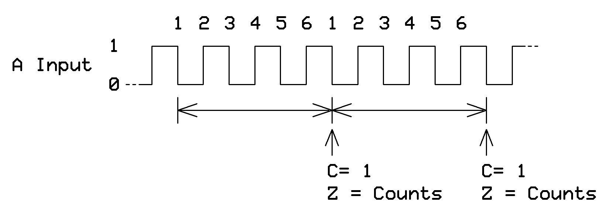

**Configuration**
```
WRPIN: \textbackslash\{\}\%11001 (P\textbackslash\{\}\_ADC\textbackslash\{\}\_SCOPE)
WXPIN: [31:16] = trigger level, [15:0] = period
WYPIN: Trigger mode and position
Z Result: ADC samples
```

**Spin2 Implementation**
```spin2
CON
  SCOPE\textbackslash\{\}\_PIN = 20
  SCOPE\textbackslash\{\}\_MODE = P\textbackslash\{\}\_ADC\textbackslash\{\}\_1X | P\textbackslash\{\}\_ADC\textbackslash\{\}\_SCOPE

PUB setup\textbackslash\{\}\_scope(trigger\textbackslash\{\}\_mv) | trigger\textbackslash\{\}\_val
  trigger\textbackslash\{\}\_val := (trigger\textbackslash\{\}\_mv * 4095) / 3300
  pinstart(SCOPE\textbackslash\{\}\_PIN, SCOPE\textbackslash\{\}\_MODE, trigger\textbackslash\{\}\_val << 16 | 256, 0)
  
PUB capture\textbackslash\{\}\_waveform(buffer, samples) | i
  wypin(SCOPE\textbackslash\{\}\_PIN, \textbackslash\{\}\%01\textbackslash\{\}\_00000000)  ' Rising edge trigger
  
  ' Wait for trigger
  repeat until pinr(SCOPE\textbackslash\{\}\_PIN)
  
  ' Capture post-trigger samples
  repeat i from 0 to samples-1
    repeat until pinr(SCOPE\textbackslash\{\}\_PIN)
    buffer[i] := rdpin(SCOPE\textbackslash\{\}\_PIN)
    
PUB auto\textbackslash\{\}\_trigger() : triggered
  wypin(SCOPE\textbackslash\{\}\_PIN, \textbackslash\{\}\%00\textbackslash\{\}\_00000000)  ' Auto trigger mode
  triggered := pinr(SCOPE\textbackslash\{\}\_PIN)
```

**PASM2 Implementation**
```pasm2
DAT
        org     0
        
scope\textbackslash\{\}\_init
        mov     pa, \textbackslash\{\}\#\textbackslash\{\}\#P\textbackslash\{\}\_ADC\textbackslash\{\}\_1X | P\textbackslash\{\}\_ADC\textbackslash\{\}\_SCOPE
        wrpin   pa, \textbackslash\{\}\#20
        mov     pa, \textbackslash\{\}\#\textbackslash\{\}\#\textbackslash\{\}\$8000\textbackslash\{\}\_0100 ' Mid-level trigger, 256 period
        wxpin   pa, \textbackslash\{\}\#20
        dirh    \textbackslash\{\}\#20
        
triggered\textbackslash\{\}\_capture
        mov     pa, \textbackslash\{\}\#\textbackslash\{\}\%01\textbackslash\{\}\_00000000 ' Rising edge
        wypin   pa, \textbackslash\{\}\#20
        
.wait\textbackslash\{\}\_trig
        testp   \textbackslash\{\}\#20, wc
  if\textbackslash\{\}\_nc jmp     \textbackslash\{\}\#.wait\textbackslash\{\}\_trig     ' Wait for trigger
        
        ' Capture 100 post-trigger samples
        mov     ptra, \textbackslash\{\}\#\textbackslash\{\}\#buffer
        mov     count, \textbackslash\{\}\#100
.capture
        testp   \textbackslash\{\}\#20, wc
  if\textbackslash\{\}\_nc jmp     \textbackslash\{\}\#.capture
        rdpin   sample, \textbackslash\{\}\#20
        wrlong  sample, ptra++
        djnz    count, \textbackslash\{\}\#.capture
        
sample  long    0
count   long    0
buffer  res     100
```

**Applications**
- Oscilloscope function
- Transient capture
- Glitch detection
- Waveform analysis
- Triggered data logging

---

### Mode %11010 - ADC with Calibration

**Specifications**
- Resolution: 8 to 14 bits
- Calibration: Offset and gain
- Input: Differential option
- Sample rate: Programmable
- Accuracy: ±0.5% after calibration

**Configuration**
```
WRPIN: \textbackslash\{\}\%11010 (P\textbackslash\{\}\_ADC\textbackslash\{\}\_CAL)
WXPIN: Sample period
WYPIN: Calibration values
Z Result: Calibrated ADC reading
```

**Spin2 Implementation**
```spin2
CON
  CAL\textbackslash\{\}\_PIN = 20
  CAL\textbackslash\{\}\_MODE = P\textbackslash\{\}\_ADC\textbackslash\{\}\_1X | P\textbackslash\{\}\_ADC\textbackslash\{\}\_CAL

VAR
  long cal\textbackslash\{\}\_zero, cal\textbackslash\{\}\_span

PUB calibrate\textbackslash\{\}\_adc()
  ' Apply 0V reference
  pinstart(CAL\textbackslash\{\}\_PIN, CAL\textbackslash\{\}\_MODE, 4096, 0)
  waitms(10)
  cal\textbackslash\{\}\_zero := rdpin(CAL\textbackslash\{\}\_PIN)
  
  ' Apply 3.3V reference
  ' (switch input to reference)
  waitms(10)
  cal\textbackslash\{\}\_span := rdpin(CAL\textbackslash\{\}\_PIN) - cal\textbackslash\{\}\_zero
  
PUB read\textbackslash\{\}\_calibrated() : millivolts | raw
  raw := rdpin(CAL\textbackslash\{\}\_PIN) - cal\textbackslash\{\}\_zero
  millivolts := (raw * 3300) / cal\textbackslash\{\}\_span
  
PUB auto\textbackslash\{\}\_calibrate()
  ' Use internal references
  pinstart(CAL\textbackslash\{\}\_PIN, P\textbackslash\{\}\_ADC\textbackslash\{\}\_GIO | P\textbackslash\{\}\_ADC\textbackslash\{\}\_CAL, 4096, 0)
  waitms(10)
  cal\textbackslash\{\}\_zero := rdpin(CAL\textbackslash\{\}\_PIN)
  
  pinstart(CAL\textbackslash\{\}\_PIN, P\textbackslash\{\}\_ADC\textbackslash\{\}\_VIO | P\textbackslash\{\}\_ADC\textbackslash\{\}\_CAL, 4096, 0)
  waitms(10)
  cal\textbackslash\{\}\_span := rdpin(CAL\textbackslash\{\}\_PIN) - cal\textbackslash\{\}\_zero
```

**PASM2 Implementation**
```pasm2
DAT
        org     0
        
cal\textbackslash\{\}\_init
        mov     pa, \textbackslash\{\}\#\textbackslash\{\}\#P\textbackslash\{\}\_ADC\textbackslash\{\}\_1X | P\textbackslash\{\}\_ADC\textbackslash\{\}\_CAL
        wrpin   pa, \textbackslash\{\}\#20
        mov     pa, \textbackslash\{\}\#\textbackslash\{\}\#4096
        wxpin   pa, \textbackslash\{\}\#20
        dirh    \textbackslash\{\}\#20
        
calibrate
        ' Read zero point
        mov     pa, \textbackslash\{\}\#\textbackslash\{\}\#P\textbackslash\{\}\_ADC\textbackslash\{\}\_GIO | P\textbackslash\{\}\_ADC\textbackslash\{\}\_CAL
        wrpin   pa, \textbackslash\{\}\#20
        waitx   \textbackslash\{\}\#\textbackslash\{\}\#1000000
        rdpin   cal\textbackslash\{\}\_zero, \textbackslash\{\}\#20
        
        ' Read span point
        mov     pa, \textbackslash\{\}\#\textbackslash\{\}\#P\textbackslash\{\}\_ADC\textbackslash\{\}\_VIO | P\textbackslash\{\}\_ADC\textbackslash\{\}\_CAL
        wrpin   pa, \textbackslash\{\}\#20
        waitx   \textbackslash\{\}\#\textbackslash\{\}\#1000000
        rdpin   cal\textbackslash\{\}\_span, \textbackslash\{\}\#20
        sub     cal\textbackslash\{\}\_span, cal\textbackslash\{\}\_zero
        
read\textbackslash\{\}\_calibrated
.wait   testp   \textbackslash\{\}\#20, wc
  if\textbackslash\{\}\_nc jmp     \textbackslash\{\}\#.wait
        rdpin   raw, \textbackslash\{\}\#20
        sub     raw, cal\textbackslash\{\}\_zero
        ' Apply calibration
        mul     raw, \textbackslash\{\}\#\textbackslash\{\}\#3300
        div     raw, cal\textbackslash\{\}\_span
        ' raw now contains millivolts
        
cal\textbackslash\{\}\_zero long   0
cal\textbackslash\{\}\_span long   0
raw     long    0
```

**Applications**
- Precision measurement
- Sensor calibration
- Temperature compensation
- Production test systems
- Scientific instruments

---

## Chapter 11: USB Mode

### Mode %11011 - USB Host/Device (Preliminary)

**Specifications**
- Function: USB 1.1 Low/Full Speed
- Data rate: 1.5/12 Mbps
- Mode: Host or Device
- Status: Preliminary implementation

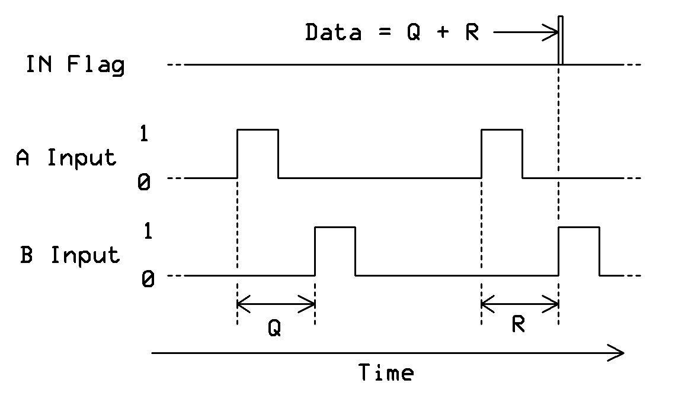

**Note**: USB mode is preliminary. Consult latest silicon documentation for updates.

**Configuration**
```
WRPIN: \textbackslash\{\}\%11011 (P\textbackslash\{\}\_USB\textbackslash\{\}\_MODE)
WXPIN: USB configuration
WYPIN: Data to transmit
Z Result: Received data
```

**Spin2 Implementation**
```spin2
CON
  USB\textbackslash\{\}\_DM = 20  ' D- pin
  USB\textbackslash\{\}\_DP = 21  ' D+ pin
  USB\textbackslash\{\}\_MODE = P\textbackslash\{\}\_USB\textbackslash\{\}\_PAIR

PUB setup\textbackslash\{\}\_usb\textbackslash\{\}\_device()
  ' USB requires pin pair (DM, DP)
  pinstart(USB\textbackslash\{\}\_DM, USB\textbackslash\{\}\_MODE, 0, 0)
  
PUB usb\textbackslash\{\}\_low\textbackslash\{\}\_speed()
  wxpin(USB\textbackslash\{\}\_DM, \textbackslash\{\}\%0\textbackslash\{\}\_0\textbackslash\{\}\_000000)  ' Low speed mode
  
PUB usb\textbackslash\{\}\_full\textbackslash\{\}\_speed()
  wxpin(USB\textbackslash\{\}\_DM, \textbackslash\{\}\%1\textbackslash\{\}\_0\textbackslash\{\}\_000000)  ' Full speed mode
  
PUB send\textbackslash\{\}\_usb\textbackslash\{\}\_packet(data)
  wypin(USB\textbackslash\{\}\_DM, data)
  repeat until pinr(USB\textbackslash\{\}\_DM)
  
PUB receive\textbackslash\{\}\_usb\textbackslash\{\}\_packet() : data
  repeat until pinr(USB\textbackslash\{\}\_DM)
  data := rdpin(USB\textbackslash\{\}\_DM)
```

**PASM2 Implementation**
```pasm2
DAT
        org     0
        
usb\textbackslash\{\}\_init
        mov     pa, \textbackslash\{\}\#\textbackslash\{\}\#P\textbackslash\{\}\_USB\textbackslash\{\}\_PAIR
        wrpin   pa, \textbackslash\{\}\#20         ' DM on pin 20
        mov     pa, \textbackslash\{\}\#\textbackslash\{\}\%1\textbackslash\{\}\_0\textbackslash\{\}\_000000 ' Full speed
        wxpin   pa, \textbackslash\{\}\#20
        dirh    \textbackslash\{\}\#20             ' Enable USB
        
send\textbackslash\{\}\_packet
        mov     pa, packet\textbackslash\{\}\_data
        wypin   pa, \textbackslash\{\}\#20
.wait   testp   \textbackslash\{\}\#20, wc
  if\textbackslash\{\}\_nc jmp     \textbackslash\{\}\#.wait
        
receive\textbackslash\{\}\_packet
.wait2  testp   \textbackslash\{\}\#20, wc
  if\textbackslash\{\}\_nc jmp     \textbackslash\{\}\#.wait2
        rdpin   received, \textbackslash\{\}\#20
        
packet\textbackslash\{\}\_data long \textbackslash\{\}\$12345678
received    long 0
```

**Applications**
- USB device implementation
- USB host functions
- HID devices
- Serial over USB
- Custom USB protocols

**Important**: Full USB implementation requires additional software stack. This mode provides low-level USB signaling only.

---

## Chapter 12: Serial Modes

### Mode %11100 - Synchronous Serial Transmit

**Specifications**
- Function: Clocked serial output
- Data width: 1-32 bits
- Clock: Generated or external
- Speed: Up to sysclock/2
- Bit order: MSB or LSB first

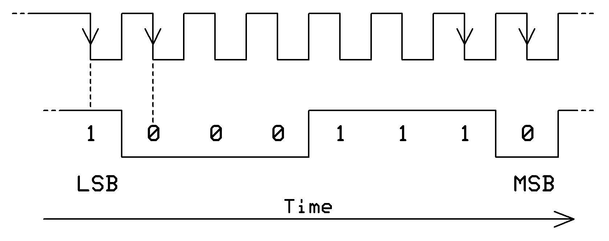

**Configuration**
```
WRPIN: \textbackslash\{\}\%11100 (P\textbackslash\{\}\_SYNC\textbackslash\{\}\_TX)
WXPIN: [31:16] = clock divider, [15:0] = bits-1
WYPIN: Data to transmit
Z Result: Transmission status
```

**Spin2 Implementation**
```spin2
CON
  SPI\textbackslash\{\}\_TX = 20
  SPI\textbackslash\{\}\_CLK = 21
  SYNC\textbackslash\{\}\_TX\textbackslash\{\}\_MODE = P\textbackslash\{\}\_SYNC\textbackslash\{\}\_TX | P\textbackslash\{\}\_OE

PUB setup\textbackslash\{\}\_spi\textbackslash\{\}\_tx(freq\textbackslash\{\}\_hz, bits)
  pinstart(SPI\textbackslash\{\}\_TX, SYNC\textbackslash\{\}\_TX\textbackslash\{\}\_MODE, (clkfreq/freq\textbackslash\{\}\_hz) << 16 | (bits-1), 0)
  
PUB send\textbackslash\{\}\_byte(data)
  wypin(SPI\textbackslash\{\}\_TX, data << 24)  ' MSB first for 8 bits
  repeat until pinr(SPI\textbackslash\{\}\_TX)
  
PUB send\textbackslash\{\}\_word(data)
  wxpin(SPI\textbackslash\{\}\_TX, (clkfreq/1\textbackslash\{\}\_000\textbackslash\{\}\_000) << 16 | 15)  ' 16 bits at 1MHz
  wypin(SPI\textbackslash\{\}\_TX, data << 16)  ' MSB first
  repeat until pinr(SPI\textbackslash\{\}\_TX)
  
PUB burst\textbackslash\{\}\_send(buffer, count) | i
  repeat i from 0 to count-1
    wypin(SPI\textbackslash\{\}\_TX, buffer[i] << 24)
    repeat until pinr(SPI\textbackslash\{\}\_TX)
```

**PASM2 Implementation**
```pasm2
DAT
        org     0
        
spi\textbackslash\{\}\_tx\textbackslash\{\}\_init
        mov     pa, \textbackslash\{\}\#\textbackslash\{\}\#P\textbackslash\{\}\_SYNC\textbackslash\{\}\_TX | P\textbackslash\{\}\_OE
        wrpin   pa, \textbackslash\{\}\#20
        mov     pa, \textbackslash\{\}\#\textbackslash\{\}\#\textbackslash\{\}\$00C8\textbackslash\{\}\_0007 ' Div by 200, 8 bits
        wxpin   pa, \textbackslash\{\}\#20
        dirh    \textbackslash\{\}\#20
        
send\textbackslash\{\}\_byte
        shl     data, \textbackslash\{\}\#24       ' Position for MSB first
        wypin   data, \textbackslash\{\}\#20
.wait   testp   \textbackslash\{\}\#20, wc
  if\textbackslash\{\}\_nc jmp     \textbackslash\{\}\#.wait
        
send\textbackslash\{\}\_buffer
        mov     ptra, \textbackslash\{\}\#\textbackslash\{\}\#buffer
        mov     count, \textbackslash\{\}\#10
.loop   rdbyte  data, ptra++
        shl     data, \textbackslash\{\}\#24
        wypin   data, \textbackslash\{\}\#20
.wait2  testp   \textbackslash\{\}\#20, wc
  if\textbackslash\{\}\_nc jmp     \textbackslash\{\}\#.wait2
        djnz    count, \textbackslash\{\}\#.loop
        
data    long    0
count   long    0
buffer  byte    \textbackslash\{\}\$01,\textbackslash\{\}\$02,\textbackslash\{\}\$03,\textbackslash\{\}\$04,\textbackslash\{\}\$05,\textbackslash\{\}\$06,\textbackslash\{\}\$07,\textbackslash\{\}\$08,\textbackslash\{\}\$09,\textbackslash\{\}\$0A
```

**Applications**
- SPI master transmit
- Shift register driving
- Synchronous protocols
- Display interfaces
- DAC serial control

---

### Mode %11101 - Synchronous Serial Receive

**Specifications**
- Function: Clocked serial input
- Data width: 1-32 bits
- Clock: Generated or external
- Speed: Up to sysclock/2
- Bit order: MSB or LSB first

**Configuration**
```
WRPIN: \textbackslash\{\}\%11101 (P\textbackslash\{\}\_SYNC\textbackslash\{\}\_RX)
WXPIN: [31:16] = clock divider, [15:0] = bits-1
WYPIN: Not used
Z Result: Received data
```

**Spin2 Implementation**
```spin2
CON
  SPI\textbackslash\{\}\_RX = 20
  SYNC\textbackslash\{\}\_RX\textbackslash\{\}\_MODE = P\textbackslash\{\}\_SYNC\textbackslash\{\}\_RX

PUB setup\textbackslash\{\}\_spi\textbackslash\{\}\_rx(freq\textbackslash\{\}\_hz, bits)
  pinstart(SPI\textbackslash\{\}\_RX, SYNC\textbackslash\{\}\_RX\textbackslash\{\}\_MODE, (clkfreq/freq\textbackslash\{\}\_hz) << 16 | (bits-1), 0)
  
PUB receive\textbackslash\{\}\_byte() : data
  repeat until pinr(SPI\textbackslash\{\}\_RX)
  data := rdpin(SPI\textbackslash\{\}\_RX) >> 24  ' MSB first, 8 bits
  
PUB receive\textbackslash\{\}\_buffer(buffer, count) | i
  repeat i from 0 to count-1
    repeat until pinr(SPI\textbackslash\{\}\_RX)
    buffer[i] := rdpin(SPI\textbackslash\{\}\_RX) >> 24
```

**PASM2 Implementation**
```pasm2
DAT
        org     0
        
spi\textbackslash\{\}\_rx\textbackslash\{\}\_init
        mov     pa, \textbackslash\{\}\#\textbackslash\{\}\#P\textbackslash\{\}\_SYNC\textbackslash\{\}\_RX
        wrpin   pa, \textbackslash\{\}\#20
        mov     pa, \textbackslash\{\}\#\textbackslash\{\}\#\textbackslash\{\}\$00C8\textbackslash\{\}\_0007 ' Div by 200, 8 bits
        wxpin   pa, \textbackslash\{\}\#20
        dirh    \textbackslash\{\}\#20
        
receive\textbackslash\{\}\_byte
.wait   testp   \textbackslash\{\}\#20, wc
  if\textbackslash\{\}\_nc jmp     \textbackslash\{\}\#.wait
        rdpin   data, \textbackslash\{\}\#20
        shr     data, \textbackslash\{\}\#24       ' Extract byte
        
data    long    0
```

**Applications**
- SPI slave receive
- Shift register reading
- ADC serial interfaces
- Sensor data collection

---

### Mode %11110 - Asynchronous Serial Transmit

**Specifications**
- Function: UART transmit
- Baud rates: 300 to 3 Mbps
- Data bits: 5-8
- Stop bits: 1-2
- Parity: None, even, odd

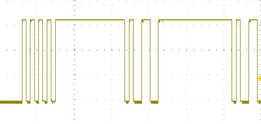

**Configuration**
```
WRPIN: \textbackslash\{\}\%11110 (P\textbackslash\{\}\_ASYNC\textbackslash\{\}\_TX)
WXPIN: Bit period in clocks
WYPIN: Data to transmit
Z Result: Transmit buffer status
```

**Spin2 Implementation**
```spin2
CON
  UART\textbackslash\{\}\_TX = 20
  BAUD\textbackslash\{\}\_115200 = 115\textbackslash\{\}\_200
  ASYNC\textbackslash\{\}\_TX\textbackslash\{\}\_MODE = P\textbackslash\{\}\_ASYNC\textbackslash\{\}\_TX | P\textbackslash\{\}\_OE

PUB setup\textbackslash\{\}\_uart\textbackslash\{\}\_tx()
  pinstart(UART\textbackslash\{\}\_TX, ASYNC\textbackslash\{\}\_TX\textbackslash\{\}\_MODE, clkfreq / BAUD\textbackslash\{\}\_115200, 0)
  
PUB tx\textbackslash\{\}\_byte(b)
  wypin(UART\textbackslash\{\}\_TX, b)
  repeat until pinr(UART\textbackslash\{\}\_TX)
  
PUB tx\textbackslash\{\}\_string(str) | c
  repeat while c := byte[str++]
    tx\textbackslash\{\}\_byte(c)
    
PUB tx\textbackslash\{\}\_hex(value) | i
  repeat i from 7 to 0
    tx\textbackslash\{\}\_byte(lookupz((value >> (i*4)) \textbackslash\{\}\& \textbackslash\{\}\$F: "0".."9", "A".."F"))
```

**PASM2 Implementation**
```pasm2
DAT
        org     0
        
uart\textbackslash\{\}\_init
        mov     pa, \textbackslash\{\}\#\textbackslash\{\}\#P\textbackslash\{\}\_ASYNC\textbackslash\{\}\_TX | P\textbackslash\{\}\_OE
        wrpin   pa, \textbackslash\{\}\#20
        mov     pa, \textbackslash\{\}\#\textbackslash\{\}\#1736      ' 115200 at 200MHz
        wxpin   pa, \textbackslash\{\}\#20
        dirh    \textbackslash\{\}\#20
        
tx\textbackslash\{\}\_char
        wypin   char, \textbackslash\{\}\#20
.wait   testp   \textbackslash\{\}\#20, wc
  if\textbackslash\{\}\_nc jmp     \textbackslash\{\}\#.wait
        
tx\textbackslash\{\}\_string
        mov     ptra, \textbackslash\{\}\#\textbackslash\{\}\#message
.loop   rdbyte  char, ptra++
        tjz     char, \textbackslash\{\}\#.done
        wypin   char, \textbackslash\{\}\#20
.wait2  testp   \textbackslash\{\}\#20, wc
  if\textbackslash\{\}\_nc jmp     \textbackslash\{\}\#.wait2
        jmp     \textbackslash\{\}\#.loop
.done
        
char    long    0
message byte    "Hello P2!",13,10,0
```

**Applications**
- Serial console output
- Debug messages
- Data logging
- Modem communication
- GPS/sensor interfaces

---

### Mode %11111 - Asynchronous Serial Receive

**Specifications**
- Function: UART receive
- Baud rates: 300 to 3 Mbps
- Data bits: 5-8
- Stop bits: 1-2
- Parity: None, even, odd

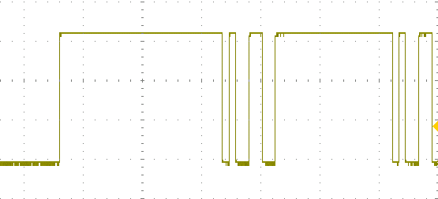

**Configuration**
```
WRPIN: \textbackslash\{\}\%11111 (P\textbackslash\{\}\_ASYNC\textbackslash\{\}\_RX)
WXPIN: Bit period in clocks
WYPIN: Not used
Z Result: Received character
```

**Spin2 Implementation**
```spin2
CON
  UART\textbackslash\{\}\_RX = 20
  BAUD\textbackslash\{\}\_115200 = 115\textbackslash\{\}\_200
  ASYNC\textbackslash\{\}\_RX\textbackslash\{\}\_MODE = P\textbackslash\{\}\_ASYNC\textbackslash\{\}\_RX

PUB setup\textbackslash\{\}\_uart\textbackslash\{\}\_rx()
  pinstart(UART\textbackslash\{\}\_RX, ASYNC\textbackslash\{\}\_RX\textbackslash\{\}\_MODE, clkfreq / BAUD\textbackslash\{\}\_115200, 0)
  
PUB rx\textbackslash\{\}\_byte() : b
  repeat until pinr(UART\textbackslash\{\}\_RX)
  b := rdpin(UART\textbackslash\{\}\_RX)
  
PUB rx\textbackslash\{\}\_check() : b | avail
  avail := pinr(UART\textbackslash\{\}\_RX)
  if avail
    b := rdpin(UART\textbackslash\{\}\_RX)
  else
    b := -1
    
PUB rx\textbackslash\{\}\_string(buffer, maxlen) | c, i
  i := 0
  repeat
    c := rx\textbackslash\{\}\_byte()
    if c == 13 or i => maxlen-1
      buffer[i] := 0
      return
    buffer[i++] := c
```

**PASM2 Implementation**
```pasm2
DAT
        org     0
        
uart\textbackslash\{\}\_rx\textbackslash\{\}\_init
        mov     pa, \textbackslash\{\}\#\textbackslash\{\}\#P\textbackslash\{\}\_ASYNC\textbackslash\{\}\_RX
        wrpin   pa, \textbackslash\{\}\#20
        mov     pa, \textbackslash\{\}\#\textbackslash\{\}\#1736      ' 115200 at 200MHz
        wxpin   pa, \textbackslash\{\}\#20
        dirh    \textbackslash\{\}\#20
        
rx\textbackslash\{\}\_char
.wait   testp   \textbackslash\{\}\#20, wc
  if\textbackslash\{\}\_nc jmp     \textbackslash\{\}\#.wait
        rdpin   char, \textbackslash\{\}\#20
        
rx\textbackslash\{\}\_buffer
        mov     ptra, \textbackslash\{\}\#\textbackslash\{\}\#buffer
        mov     count, \textbackslash\{\}\#0
.loop   testp   \textbackslash\{\}\#20, wc
  if\textbackslash\{\}\_nc jmp     \textbackslash\{\}\#.loop
        rdpin   char, \textbackslash\{\}\#20
        cmp     char, \textbackslash\{\}\#13 wz    ' Check for CR
  if\textbackslash\{\}\_z  jmp     \textbackslash\{\}\#.done
        wrbyte  char, ptra++
        add     count, \textbackslash\{\}\#1
        cmp     count, \textbackslash\{\}\#79 wc   ' Buffer limit
  if\textbackslash\{\}\_c  jmp     \textbackslash\{\}\#.loop
.done   wrbyte  \textbackslash\{\}\#0, ptra        ' Null terminate
        
char    long    0
count   long    0
buffer  res     80
```

**Applications**
- Serial console input
- Command processing
- Data reception
- Sensor reading
- GPS parsing

---

# Part III: Application Guide

## Chapter 13: Common Implementations

This chapter provides complete, production-ready implementations combining multiple Smart Pin modes.

### 13.1 Motor Control with Encoder Feedback

```spin2
CON
  MOTOR\textbackslash\{\}\_PWM = 20
  ENCODER\textbackslash\{\}\_A = 22
  TARGET\textbackslash\{\}\_RPM = 3000
  
VAR
  long current\textbackslash\{\}\_rpm, pwm\textbackslash\{\}\_duty

PUB motor\textbackslash\{\}\_control\textbackslash\{\}\_loop() | error, last\textbackslash\{\}\_pos, current\textbackslash\{\}\_pos
  ' Setup PWM for motor
  pinstart(MOTOR\textbackslash\{\}\_PWM, P\textbackslash\{\}\_PWM\textbackslash\{\}\_TRIANGLE | P\textbackslash\{\}\_OE, clkfreq/20\textbackslash\{\}\_000, 0)
  
  ' Setup quadrature encoder
  pinstart(ENCODER\textbackslash\{\}\_A, P\textbackslash\{\}\_QUADRATURE\textbackslash\{\}\_ENC, 0, 0)
  
  repeat
    ' Read encoder
    last\textbackslash\{\}\_pos := current\textbackslash\{\}\_pos
    current\textbackslash\{\}\_pos := rdpin(ENCODER\textbackslash\{\}\_A)
    
    ' Calculate RPM (assuming 100 counts/rev, 10Hz loop)
    current\textbackslash\{\}\_rpm := ((current\textbackslash\{\}\_pos - last\textbackslash\{\}\_pos) * 600) / 100
    
    ' PID control (simplified P-only)
    error := TARGET\textbackslash\{\}\_RPM - current\textbackslash\{\}\_rpm
    pwm\textbackslash\{\}\_duty := (pwm\textbackslash\{\}\_duty + (error / 10)) \textbackslash\{\}\#> 0 <\textbackslash\{\}\# \textbackslash\{\}\$FFFF
    
    ' Update motor PWM
    wypin(MOTOR\textbackslash\{\}\_PWM, pwm\textbackslash\{\}\_duty)
    
    waitms(100)  ' 10Hz control loop
```

### 13.2 Multi-Channel Data Acquisition

```spin2
CON
  ADC\textbackslash\{\}\_CHANNELS = 8
  SAMPLE\textbackslash\{\}\_RATE = 1000  ' Hz per channel
  
VAR
  long adc\textbackslash\{\}\_buffer[ADC\textbackslash\{\}\_CHANNELS * 100]  ' 100ms buffer

PUB acquire\textbackslash\{\}\_multichannel() | ch, sample\textbackslash\{\}\_count
  ' Configure all ADC channels
  repeat ch from 0 to ADC\textbackslash\{\}\_CHANNELS-1
    pinstart(ch, P\textbackslash\{\}\_ADC\textbackslash\{\}\_1X | P\textbackslash\{\}\_ADC, clkfreq/SAMPLE\textbackslash\{\}\_RATE/ADC\textbackslash\{\}\_CHANNELS, 0)
    
  sample\textbackslash\{\}\_count := 0
  repeat
    ' Round-robin sampling
    repeat ch from 0 to ADC\textbackslash\{\}\_CHANNELS-1
      repeat until pinr(ch)
      adc\textbackslash\{\}\_buffer[sample\textbackslash\{\}\_count * ADC\textbackslash\{\}\_CHANNELS + ch] := rdpin(ch)
    
    sample\textbackslash\{\}\_count++
    if sample\textbackslash\{\}\_count => 100
      process\textbackslash\{\}\_buffer(@adc\textbackslash\{\}\_buffer, sample\textbackslash\{\}\_count)
      sample\textbackslash\{\}\_count := 0
```

### 13.3 UART Bridge with Flow Control

```spin2
CON
  UART1\textbackslash\{\}\_RX = 20
  UART1\textbackslash\{\}\_TX = 21
  UART2\textbackslash\{\}\_RX = 22
  UART2\textbackslash\{\}\_TX = 23
  
PUB uart\textbackslash\{\}\_bridge() | c
  ' Setup both UARTs at 115200
  pinstart(UART1\textbackslash\{\}\_RX, P\textbackslash\{\}\_ASYNC\textbackslash\{\}\_RX, clkfreq/115\textbackslash\{\}\_200, 0)
  pinstart(UART1\textbackslash\{\}\_TX, P\textbackslash\{\}\_ASYNC\textbackslash\{\}\_TX | P\textbackslash\{\}\_OE, clkfreq/115\textbackslash\{\}\_200, 0)
  pinstart(UART2\textbackslash\{\}\_RX, P\textbackslash\{\}\_ASYNC\textbackslash\{\}\_RX, clkfreq/115\textbackslash\{\}\_200, 0)
  pinstart(UART2\textbackslash\{\}\_TX, P\textbackslash\{\}\_ASYNC\textbackslash\{\}\_TX | P\textbackslash\{\}\_OE, clkfreq/115\textbackslash\{\}\_200, 0)
  
  repeat
    ' Bridge UART1 -> UART2
    if pinr(UART1\textbackslash\{\}\_RX)
      c := rdpin(UART1\textbackslash\{\}\_RX)
      wypin(UART2\textbackslash\{\}\_TX, c)
      repeat until pinr(UART2\textbackslash\{\}\_TX)
      
    ' Bridge UART2 -> UART1
    if pinr(UART2\textbackslash\{\}\_RX)
      c := rdpin(UART2\textbackslash\{\}\_RX)
      wypin(UART1\textbackslash\{\}\_TX, c)
      repeat until pinr(UART1\textbackslash\{\}\_TX)
```

### 13.4 Frequency Counter with Display

```spin2
CON
  FREQ\textbackslash\{\}\_INPUT = 20
  GATE\textbackslash\{\}\_TIME = 1\textbackslash\{\}\_000  ' 1 second gate
  
PUB frequency\textbackslash\{\}\_meter() : freq\textbackslash\{\}\_hz
  ' Setup for rising edge counting
  pinstart(FREQ\textbackslash\{\}\_INPUT, P\textbackslash\{\}\_STATE\textbackslash\{\}\_MEAS | \textbackslash\{\}\%00, clkfreq, 0)
  
  repeat
    wypin(FREQ\textbackslash\{\}\_INPUT, 0)  ' Reset counter
    waitms(GATE\textbackslash\{\}\_TIME)
    freq\textbackslash\{\}\_hz := rdpin(FREQ\textbackslash\{\}\_INPUT)
    
    ' Display frequency
    if freq\textbackslash\{\}\_hz < 1000
      debug("Frequency: ", udec(freq\textbackslash\{\}\_hz), " Hz")
    elseif freq\textbackslash\{\}\_hz < 1\textbackslash\{\}\_000\textbackslash\{\}\_000
      debug("Frequency: ", udec(freq\textbackslash\{\}\_hz/1000), ".", udec3((freq\textbackslash\{\}\_hz//1000)), " kHz")
    else
      debug("Frequency: ", udec(freq\textbackslash\{\}\_hz/1\textbackslash\{\}\_000\textbackslash\{\}\_000), ".", udec3((freq\textbackslash\{\}\_hz//1\textbackslash\{\}\_000\textbackslash\{\}\_000)/1000), " MHz")
```

### 13.5 Waveform Generator

```spin2
CON
  DAC\textbackslash\{\}\_OUT = 20
  
VAR
  long wave\textbackslash\{\}\_table[256]

PUB setup\textbackslash\{\}\_waveforms()
  ' Generate sine table
  repeat i from 0 to 255
    wave\textbackslash\{\}\_table[i] := \textbackslash\{\}\$8000 + sin(i * 1406, \textbackslash\{\}\$7FFF)  ' 360/256 = 1.406 degrees
    
PUB generate\textbackslash\{\}\_sine(freq\textbackslash\{\}\_hz) | index, step
  pinstart(DAC\textbackslash\{\}\_OUT, P\textbackslash\{\}\_DAC\textbackslash\{\}\_124R\textbackslash\{\}\_3V | P\textbackslash\{\}\_OE, 0, 0)
  
  step := (freq\textbackslash\{\}\_hz * 256) frac clkfreq
  index := 0
  
  repeat
    wypin(DAC\textbackslash\{\}\_OUT, wave\textbackslash\{\}\_table[index >> 24])
    index += step
    waitus(10)  ' 100kHz update rate
```

### 13.6 SPI Master Implementation

```spin2
CON
  SPI\textbackslash\{\}\_CLK = 20
  SPI\textbackslash\{\}\_MOSI = 21
  SPI\textbackslash\{\}\_MISO = 22
  SPI\textbackslash\{\}\_CS = 23
  
PUB spi\textbackslash\{\}\_transfer(data\textbackslash\{\}\_out) : data\textbackslash\{\}\_in
  pinl(SPI\textbackslash\{\}\_CS)  ' Assert chip select
  
  ' Send and receive 8 bits
  wypin(SPI\textbackslash\{\}\_MOSI, data\textbackslash\{\}\_out << 24)
  repeat until pinr(SPI\textbackslash\{\}\_MOSI) and pinr(SPI\textbackslash\{\}\_MISO)
  data\textbackslash\{\}\_in := rdpin(SPI\textbackslash\{\}\_MISO) >> 24
  
  pinh(SPI\textbackslash\{\}\_CS)  ' Deassert chip select
```

### 13.7 Servo Controller Array

```spin2
CON
  SERVO\textbackslash\{\}\_COUNT = 8
  SERVO\textbackslash\{\}\_BASE = 20
  
VAR
  long servo\textbackslash\{\}\_positions[SERVO\textbackslash\{\}\_COUNT]

PUB setup\textbackslash\{\}\_servos() | i
  repeat i from 0 to SERVO\textbackslash\{\}\_COUNT-1
    pinstart(SERVO\textbackslash\{\}\_BASE + i, P\textbackslash\{\}\_PULSE | P\textbackslash\{\}\_OE, clkfreq/50, 0)  ' 50Hz/20ms
    servo\textbackslash\{\}\_positions[i] := 1500  ' Center position (1.5ms)
    
PUB set\textbackslash\{\}\_servo(ch, microseconds)
  servo\textbackslash\{\}\_positions[ch] := microseconds \textbackslash\{\}\#> 500 <\textbackslash\{\}\# 2500
  wypin(SERVO\textbackslash\{\}\_BASE + ch, servo\textbackslash\{\}\_positions[ch] * (clkfreq/1\textbackslash\{\}\_000\textbackslash\{\}\_000))
  
PUB sweep\textbackslash\{\}\_all\textbackslash\{\}\_servos() | i, pos
  repeat
    repeat pos from 1000 to 2000 step 10
      repeat i from 0 to SERVO\textbackslash\{\}\_COUNT-1
        set\textbackslash\{\}\_servo(i, pos)
      waitms(20)
```

### 13.8 I2C Master Bit-Bang Pattern

```spin2
CON
  I2C\textbackslash\{\}\_SCL = 20
  I2C\textbackslash\{\}\_SDA = 21
  
PUB i2c\textbackslash\{\}\_start()
  pinh(I2C\textbackslash\{\}\_SDA)
  pinh(I2C\textbackslash\{\}\_SCL)
  waitus(1)
  pinl(I2C\textbackslash\{\}\_SDA)  ' SDA low while SCL high
  waitus(1)
  pinl(I2C\textbackslash\{\}\_SCL)
  
PUB i2c\textbackslash\{\}\_write(data) : ack | bit
  repeat bit from 7 to 0
    if data \textbackslash\{\}\& (1 << bit)
      pinh(I2C\textbackslash\{\}\_SDA)
    else
      pinl(I2C\textbackslash\{\}\_SDA)
    waitus(1)
    pinh(I2C\textbackslash\{\}\_SCL)
    waitus(1)
    pinl(I2C\textbackslash\{\}\_SCL)
    
  ' Read ACK
  pinfloat(I2C\textbackslash\{\}\_SDA)
  waitus(1)
  pinh(I2C\textbackslash\{\}\_SCL)
  ack := pinr(I2C\textbackslash\{\}\_SDA)
  pinl(I2C\textbackslash\{\}\_SCL)
```

### 13.9 RGB LED Controller

```spin2
CON
  LED\textbackslash\{\}\_R = 20
  LED\textbackslash\{\}\_G = 21
  LED\textbackslash\{\}\_B = 22
  
PUB setup\textbackslash\{\}\_rgb()
  pinstart(LED\textbackslash\{\}\_R, P\textbackslash\{\}\_PWM\textbackslash\{\}\_SAWTOOTH | P\textbackslash\{\}\_OE, \textbackslash\{\}\$FFFF, 0)
  pinstart(LED\textbackslash\{\}\_G, P\textbackslash\{\}\_PWM\textbackslash\{\}\_SAWTOOTH | P\textbackslash\{\}\_OE, \textbackslash\{\}\$FFFF, 0)
  pinstart(LED\textbackslash\{\}\_B, P\textbackslash\{\}\_PWM\textbackslash\{\}\_SAWTOOTH | P\textbackslash\{\}\_OE, \textbackslash\{\}\$FFFF, 0)
  
PUB set\textbackslash\{\}\_color(r, g, b)
  wypin(LED\textbackslash\{\}\_R, r << 8)  ' Scale 0-255 to 0-65535
  wypin(LED\textbackslash\{\}\_G, g << 8)
  wypin(LED\textbackslash\{\}\_B, b << 8)
  
PUB rainbow\textbackslash\{\}\_cycle() | hue
  repeat
    repeat hue from 0 to 359
      set\textbackslash\{\}\_color\textbackslash\{\}\_hsv(hue, 255, 255)
      waitms(10)
```

### 13.10 Precision Timing Generator

```spin2
CON
  TIMING\textbackslash\{\}\_PIN = 20
  
PUB microsecond\textbackslash\{\}\_pulse(width\textbackslash\{\}\_us)
  pinstart(TIMING\textbackslash\{\}\_PIN, P\textbackslash\{\}\_PULSE | P\textbackslash\{\}\_OE, clkfreq/1\textbackslash\{\}\_000\textbackslash\{\}\_000 * width\textbackslash\{\}\_us, 0)
  wypin(TIMING\textbackslash\{\}\_PIN, 1)  ' Single pulse
  repeat until pinr(TIMING\textbackslash\{\}\_PIN)
  
PUB nanosecond\textbackslash\{\}\_delay(delay\textbackslash\{\}\_ns) | clocks
  clocks := (clkfreq * delay\textbackslash\{\}\_ns) / 1\textbackslash\{\}\_000\textbackslash\{\}\_000\textbackslash\{\}\_000
  pinstart(TIMING\textbackslash\{\}\_PIN, P\textbackslash\{\}\_PULSE, clocks, 0)
  wypin(TIMING\textbackslash\{\}\_PIN, 1)
  repeat until pinr(TIMING\textbackslash\{\}\_PIN)
```

---

## Chapter 14: Multi-Pin Applications

This chapter demonstrates complex applications using multiple Smart Pins working together.

### 14.1 Three-Phase Motor Controller

```spin2
CON
  PHASE\textbackslash\{\}\_A = 20
  PHASE\textbackslash\{\}\_B = 21
  PHASE\textbackslash\{\}\_C = 22
  
VAR
  long phase\textbackslash\{\}\_angle

PUB three\textbackslash\{\}\_phase\textbackslash\{\}\_motor(freq\textbackslash\{\}\_hz)
  ' Configure three PWM pins 120 degrees apart
  pinstart(PHASE\textbackslash\{\}\_A, P\textbackslash\{\}\_PWM\textbackslash\{\}\_TRIANGLE | P\textbackslash\{\}\_OE, clkfreq/20\textbackslash\{\}\_000, 0)
  pinstart(PHASE\textbackslash\{\}\_B, P\textbackslash\{\}\_PWM\textbackslash\{\}\_TRIANGLE | P\textbackslash\{\}\_OE, clkfreq/20\textbackslash\{\}\_000, 0)
  pinstart(PHASE\textbackslash\{\}\_C, P\textbackslash\{\}\_PWM\textbackslash\{\}\_TRIANGLE | P\textbackslash\{\}\_OE, clkfreq/20\textbackslash\{\}\_000, 0)
  
  repeat
    ' Generate three-phase sine waves
    wypin(PHASE\textbackslash\{\}\_A, \textbackslash\{\}\$8000 + sin(phase\textbackslash\{\}\_angle, \textbackslash\{\}\$7FFF))
    wypin(PHASE\textbackslash\{\}\_B, \textbackslash\{\}\$8000 + sin(phase\textbackslash\{\}\_angle + 120, \textbackslash\{\}\$7FFF))
    wypin(PHASE\textbackslash\{\}\_C, \textbackslash\{\}\$8000 + sin(phase\textbackslash\{\}\_angle + 240, \textbackslash\{\}\$7FFF))
    
    phase\textbackslash\{\}\_angle += freq\textbackslash\{\}\_hz / 100  ' Advance angle
    waitms(10)
```

### 14.2 Logic Analyzer

```spin2
CON
  CHANNELS = 8
  SAMPLE\textbackslash\{\}\_DEPTH = 1000
  
VAR
  long samples[SAMPLE\textbackslash\{\}\_DEPTH]

PUB logic\textbackslash\{\}\_analyzer(trigger\textbackslash\{\}\_channel, trigger\textbackslash\{\}\_level)
  ' Setup trigger on one channel
  pinstart(trigger\textbackslash\{\}\_channel, P\textbackslash\{\}\_COMPARATOR, trigger\textbackslash\{\}\_level, 0)
  
  ' Wait for trigger
  repeat until rdpin(trigger\textbackslash\{\}\_channel) \textbackslash\{\}\& 1
  
  ' Capture samples
  repeat i from 0 to SAMPLE\textbackslash\{\}\_DEPTH-1
    samples[i] := ina[CHANNELS-1..0]
    waitus(1)  ' 1MHz sample rate
```

### 14.3 Digital Oscilloscope

```spin2
CON
  CH1\textbackslash\{\}\_ADC = 20
  CH2\textbackslash\{\}\_ADC = 21
  TRIGGER = 22
  
VAR
  long ch1\textbackslash\{\}\_buffer[1000]
  long ch2\textbackslash\{\}\_buffer[1000]

PUB dual\textbackslash\{\}\_channel\textbackslash\{\}\_scope()
  ' Setup ADCs
  pinstart(CH1\textbackslash\{\}\_ADC, P\textbackslash\{\}\_ADC\textbackslash\{\}\_SCOPE, \textbackslash\{\}\$8000\textbackslash\{\}\_0100, 0)  ' Mid-level trigger
  pinstart(CH2\textbackslash\{\}\_ADC, P\textbackslash\{\}\_ADC\textbackslash\{\}\_1X | P\textbackslash\{\}\_ADC, 4096, 0)
  
  ' Wait for trigger on CH1
  wypin(CH1\textbackslash\{\}\_ADC, \textbackslash\{\}\%01\textbackslash\{\}\_00000000)  ' Rising edge trigger
  repeat until pinr(CH1\textbackslash\{\}\_ADC)
  
  ' Capture both channels
  repeat i from 0 to 999
    repeat until pinr(CH1\textbackslash\{\}\_ADC) and pinr(CH2\textbackslash\{\}\_ADC)
    ch1\textbackslash\{\}\_buffer[i] := rdpin(CH1\textbackslash\{\}\_ADC)
    ch2\textbackslash\{\}\_buffer[i] := rdpin(CH2\textbackslash\{\}\_ADC)
```

### 14.4 Stepper Motor with Acceleration

```spin2
CON
  STEP\textbackslash\{\}\_PIN = 20
  DIR\textbackslash\{\}\_PIN = 21
  ENABLE\textbackslash\{\}\_PIN = 22
  
VAR
  long current\textbackslash\{\}\_speed, target\textbackslash\{\}\_speed

PUB accelerated\textbackslash\{\}\_move(steps, max\textbackslash\{\}\_speed) | accel\textbackslash\{\}\_steps
  pinh(DIR\textbackslash\{\}\_PIN)  ' Set direction
  pinl(ENABLE\textbackslash\{\}\_PIN)  ' Enable driver
  
  accel\textbackslash\{\}\_steps := max\textbackslash\{\}\_speed / 100  ' Simple acceleration
  
  ' Acceleration phase
  repeat i from 1 to accel\textbackslash\{\}\_steps
    current\textbackslash\{\}\_speed := (max\textbackslash\{\}\_speed * i) / accel\textbackslash\{\}\_steps
    pinstart(STEP\textbackslash\{\}\_PIN, P\textbackslash\{\}\_PULSE | P\textbackslash\{\}\_OE, clkfreq/current\textbackslash\{\}\_speed, 0)
    wypin(STEP\textbackslash\{\}\_PIN, 1)
    repeat until pinr(STEP\textbackslash\{\}\_PIN)
    
  ' Constant speed phase
  pinstart(STEP\textbackslash\{\}\_PIN, P\textbackslash\{\}\_PULSE | P\textbackslash\{\}\_OE, clkfreq/max\textbackslash\{\}\_speed, 0)
  wypin(STEP\textbackslash\{\}\_PIN, steps - (accel\textbackslash\{\}\_steps * 2))
  repeat until pinr(STEP\textbackslash\{\}\_PIN)
  
  ' Deceleration phase
  repeat i from accel\textbackslash\{\}\_steps to 1
    current\textbackslash\{\}\_speed := (max\textbackslash\{\}\_speed * i) / accel\textbackslash\{\}\_steps
    pinstart(STEP\textbackslash\{\}\_PIN, P\textbackslash\{\}\_PULSE | P\textbackslash\{\}\_OE, clkfreq/current\textbackslash\{\}\_speed, 0)
    wypin(STEP\textbackslash\{\}\_PIN, 1)
    repeat until pinr(STEP\textbackslash\{\}\_PIN)
```

### 14.5 Audio Spectrum Analyzer

```spin2
CON
  AUDIO\textbackslash\{\}\_IN = 20
  LED\textbackslash\{\}\_BASE = 30
  BANDS = 8
  
VAR
  long fft\textbackslash\{\}\_bins[BANDS]

PUB spectrum\textbackslash\{\}\_display()
  ' Setup audio ADC
  pinstart(AUDIO\textbackslash\{\}\_IN, P\textbackslash\{\}\_ADC\textbackslash\{\}\_1X | P\textbackslash\{\}\_ADC, 256, 0)  ' ~780kHz sample rate
  
  ' Setup LED bar graph
  repeat i from 0 to BANDS-1
    pinstart(LED\textbackslash\{\}\_BASE + i, P\textbackslash\{\}\_PWM\textbackslash\{\}\_SAWTOOTH | P\textbackslash\{\}\_OE, \textbackslash\{\}\$FFFF, 0)
    
  repeat
    ' Collect samples and compute FFT (simplified)
    compute\textbackslash\{\}\_fft()
    
    ' Display on LEDs
    repeat i from 0 to BANDS-1
      wypin(LED\textbackslash\{\}\_BASE + i, fft\textbackslash\{\}\_bins[i] << 8)
```

---

## Chapter 15: Optimization & Troubleshooting

### Performance Optimization

#### Clock Distribution
```spin2
PUB optimize\textbackslash\{\}\_clock\textbackslash\{\}\_distribution()
  ' Use NCO for multiple synchronized clocks
  pinstart(20, P\textbackslash\{\}\_NCO\textbackslash\{\}\_FREQ | P\textbackslash\{\}\_OE, 1, freq1)
  pinstart(21, P\textbackslash\{\}\_NCO\textbackslash\{\}\_FREQ | P\textbackslash\{\}\_OE, 1, freq2)
  pinstart(22, P\textbackslash\{\}\_NCO\textbackslash\{\}\_FREQ | P\textbackslash\{\}\_OE, 1, freq3)
  
  ' All NCOs are phase-coherent when started together
  dirh(20 addpins 2)  ' Enable all three simultaneously
```

#### Power Management
```spin2
PUB low\textbackslash\{\}\_power\textbackslash\{\}\_sampling()
  ' Use repository mode for infrequent updates
  pinstart(20, P\textbackslash\{\}\_REPOSITORY, 0, 0)
  
  ' COG can sleep while Smart Pin maintains value
  repeat
    wypin(20, read\textbackslash\{\}\_sensor())
    waitms(1000)  ' COG sleeps, Smart Pin holds value
```

### Common Issues and Solutions

#### Issue: PWM Glitches
**Symptom**: Brief pulses when changing duty cycle  
**Solution**: Update during safe window
```spin2
PUB glitch\textbackslash\{\}\_free\textbackslash\{\}\_pwm\textbackslash\{\}\_update(new\textbackslash\{\}\_duty)
  ' Wait for counter reset
  repeat until (rdpin(PWM\textbackslash\{\}\_PIN) \textbackslash\{\}\& \textbackslash\{\}\$FFFF) < 100
  wypin(PWM\textbackslash\{\}\_PIN, new\textbackslash\{\}\_duty)
```

#### Issue: ADC Noise
**Symptom**: Unstable ADC readings  
**Solution**: Use averaging and filtering
```spin2
PUB filtered\textbackslash\{\}\_adc\textbackslash\{\}\_read() : result | sum
  sum := 0
  repeat 16
    repeat until pinr(ADC\textbackslash\{\}\_PIN)
    sum += rdpin(ADC\textbackslash\{\}\_PIN)
  result := sum >> 4  ' Average of 16 samples
```

#### Issue: Encoder Missing Counts
**Symptom**: Position drift over time  
**Solution**: Check maximum frequency
```spin2
PUB verify\textbackslash\{\}\_encoder\textbackslash\{\}\_speed() | max\textbackslash\{\}\_freq
  ' Encoder max frequency = sysclock / 2
  max\textbackslash\{\}\_freq := clkfreq / 2
  debug("Max encoder frequency: ", udec(max\textbackslash\{\}\_freq/1000), " kHz")
  
  ' For 1000 CPR encoder:
  debug("Max RPM: ", udec(max\textbackslash\{\}\_freq * 60 / 1000 / 4))
```

#### Issue: Serial Data Corruption
**Symptom**: Garbled UART data  
**Solution**: Verify baud rate calculation
```spin2
PUB calculate\textbackslash\{\}\_baud\textbackslash\{\}\_error(desired\textbackslash\{\}\_baud) | actual\textbackslash\{\}\_baud, divider, error\textbackslash\{\}\_ppm
  divider := clkfreq / desired\textbackslash\{\}\_baud
  actual\textbackslash\{\}\_baud := clkfreq / divider
  error\textbackslash\{\}\_ppm := abs(((actual\textbackslash\{\}\_baud - desired\textbackslash\{\}\_baud) * 1\textbackslash\{\}\_000\textbackslash\{\}\_000) / desired\textbackslash\{\}\_baud)
  
  debug("Desired: ", udec(desired\textbackslash\{\}\_baud))
  debug("Actual: ", udec(actual\textbackslash\{\}\_baud))
  debug("Error: ", udec(error\textbackslash\{\}\_ppm), " ppm")
  
  if error\textbackslash\{\}\_ppm > 20\textbackslash\{\}\_000  ' >2\textbackslash\{\}\% error
    debug("WARNING: Baud rate error too high!")
```

### Debugging Techniques

#### Smart Pin State Monitor
```spin2
PUB monitor\textbackslash\{\}\_smart\textbackslash\{\}\_pin(pin)
  debug("Pin ", udec(pin), " Status:")
  debug("  IN flag: ", udec(pinr(pin)))
  debug("  Z value: ", uhex(rdpin(pin)))
  debug("  Mode: ", uhex((pinr(pin) >> 6) \textbackslash\{\}\& \textbackslash\{\}\$3F))
```

#### Performance Profiling
```spin2
PUB profile\textbackslash\{\}\_smart\textbackslash\{\}\_pin\textbackslash\{\}\_timing(pin) | start, cycles
  start := cnt
  
  ' Perform Smart Pin operation
  wypin(pin, test\textbackslash\{\}\_value)
  repeat until pinr(pin)
  
  cycles := cnt - start
  debug("Operation took ", udec(cycles), " cycles")
  debug("Time: ", udec(cycles * 1\textbackslash\{\}\_000\textbackslash\{\}\_000 / clkfreq), " microseconds")
```

---

# Part IV: Quick Reference

## Appendix A: Mode Selection Guide with Comparison Matrix

### Smart Pin Mode Comparison Matrix

| Mode | Function | Max Freq | Resolution | Power | Typical Use |
|------|----------|----------|------------|-------|-------------|
| **%00000** | OFF | - | - | Minimum | GPIO |
| **%00001** | Repository | sysclock | 32-bit | Low | Inter-COG data |
| **%00111** | Transition | sysclock/2 | 1 clock | Low | Clock gen |
| **%00010** | DAC 124Ω 3.3V | sysclock/2 | 16-bit | Medium | Audio out |
| **%00011** | DAC 75Ω 2.0V | sysclock/2 | 16-bit | Medium | Video out |
| **%00100** | Pulse/Cycle | sysclock/2 | 32-bit | Low | Timing |
| **%00101** | NCO Frequency | sysclock/2 | 32-bit | Low | Synthesis |
| **%00110** | NCO Duty | sysclock/4 | 16-bit | Low | Fine PWM |
| **%01000** | PWM Sawtooth | sysclock/2 | 16-bit | Low | Motor control |
| **%01001** | PWM Triangle | sysclock/4 | 16-bit | Low | Low EMI PWM |
| **%01010** | SMPS Pulse | sysclock | 32-bit | Low | Power supply |
| **%01011** | Quadrature | sysclock/2 | 32-bit | Low | Encoders |
| **%01101** | A-B Encoder | sysclock/2 | 32-bit | Low | Differential |
| **%01110** | Incremental | sysclock/2 | 32-bit | Low | Counting |
| **%01111** | Comparator | sysclock | 1-bit | Low | Threshold |
| **%10000** | Time High | sysclock | 32-bit | Low | Duty measure |
| **%10001** | Time Low | sysclock | 32-bit | Low | Pulse measure |
| **%10010** | Time Change | sysclock | 32-bit | Low | Period |
| **%10011** | Time Between | sysclock | 32-bit | Low | Frequency |
| **%10100** | Count Rise | sysclock/2 | 32-bit | Low | Events |
| **%10101** | Count Fall | sysclock/2 | 32-bit | Low | Events |
| **%10110** | Count Edges | sysclock/2 | 32-bit | Low | Activity |
| **%10111** | Count High | sysclock | 32-bit | Low | Duty count |
| **%11000** | ADC SINC2 | sysclock/8 | 14-bit | Medium | Precision ADC |
| **%11001** | ADC Scope | sysclock/64 | 12-bit | Medium | Triggered |
| **%11010** | ADC Calibrated | sysclock/8 | 14-bit | Medium | Accurate |
| **%11011** | USB | 12 Mbps | 8-bit | High | USB 1.1 |
| **%11100** | Sync TX | sysclock/2 | 32-bit | Low | SPI/Shift |
| **%11101** | Sync RX | sysclock/2 | 32-bit | Low | SPI/Shift |
| **%11110** | Async TX | 3 Mbps | 8-bit | Low | UART |
| **%11111** | Async RX | 3 Mbps | 8-bit | Low | UART |

### Decision Tree for Mode Selection

```
Start: What type of signal?
│
├─ Digital Output?
│  ├─ Simple on/off? → Mode \textbackslash\{\}\%00000 (GPIO)
│  ├─ Clock/Square wave? → Mode \textbackslash\{\}\%00111 (Transition)
│  ├─ Precise pulses? → Mode \textbackslash\{\}\%00100 (Pulse)
│  ├─ Variable frequency? → Mode \textbackslash\{\}\%00101 (NCO Freq)
│  ├─ PWM needed?
│  │  ├─ High frequency? → Mode \textbackslash\{\}\%00110 (NCO Duty)
│  │  ├─ Motor control? → Mode \textbackslash\{\}\%01000 (Sawtooth)
│  │  ├─ Low EMI? → Mode \textbackslash\{\}\%01001 (Triangle)
│  │  └─ SMPS? → Mode \textbackslash\{\}\%01010 (SMPS Pulse)
│  └─ Serial data? → Mode \textbackslash\{\}\%11100 (Sync TX) or \textbackslash\{\}\%11110 (Async TX)
│
├─ Digital Input?
│  ├─ Simple read? → Mode \textbackslash\{\}\%00000 (GPIO)
│  ├─ Encoder?
│  │  ├─ Quadrature? → Mode \textbackslash\{\}\%01011
│  │  ├─ A-B separate? → Mode \textbackslash\{\}\%01101
│  │  └─ Single channel? → Mode \textbackslash\{\}\%01110
│  ├─ Counting events?
│  │  ├─ Rising edges? → Mode \textbackslash\{\}\%10100
│  │  ├─ Falling edges? → Mode \textbackslash\{\}\%10101
│  │  └─ Both edges? → Mode \textbackslash\{\}\%10110
│  ├─ Measuring time?
│  │  ├─ High duration? → Mode \textbackslash\{\}\%10000
│  │  ├─ Low duration? → Mode \textbackslash\{\}\%10001
│  │  └─ Period? → Mode \textbackslash\{\}\%10010
│  └─ Serial data? → Mode \textbackslash\{\}\%11101 (Sync RX) or \textbackslash\{\}\%11111 (Async RX)
│
├─ Analog Output?
│  ├─ General purpose? → Mode \textbackslash\{\}\%00010 (DAC 124Ω)
│  └─ Video/75Ω line? → Mode \textbackslash\{\}\%00011 (DAC 75Ω)
│
└─ Analog Input?
   ├─ Basic sampling? → Mode \textbackslash\{\}\%11000 (SINC2)
   ├─ Triggered capture? → Mode \textbackslash\{\}\%11001 (Scope)
   └─ Calibrated? → Mode \textbackslash\{\}\%11010 (Calibrated)
```

### Performance Characteristics by Category

#### Output Modes - Timing Performance
| Mode | Min Period | Max Frequency | Jitter |
|------|------------|---------------|--------|
| Transition | 2 clocks | sysclock/2 | < 1 clock |
| NCO Freq | 8 clocks | sysclock/8 | < 1 clock |
| NCO Duty | 4 clocks | sysclock/4 | < 1 clock |
| PWM Sawtooth | 2 clocks | sysclock/2 | None |
| PWM Triangle | 4 clocks | sysclock/4 | None |

#### Input Modes - Measurement Limits
| Mode | Min Pulse | Max Count Rate | Resolution |
|------|-----------|----------------|------------|
| Edge Counter | 2 clocks | sysclock/2 | 1 edge |
| Time Measure | 1 clock | continuous | 1 clock |
| Quadrature | 4 clocks | sysclock/4 | 4x encoder |

#### ADC Modes - Quality Metrics
| Mode | Bits | Sample Rate | Filter | SNR |
|------|------|-------------|--------|-----|
| SINC2 | 14 | sysclock/8 | 2nd order | 86dB |
| Scope | 12 | sysclock/64 | 3rd order | 74dB |
| Calibrated | 14 | sysclock/8 | 2nd order | 86dB |

---

## Appendix B: Configuration Calculator

### Common Configuration Values

#### UART Baud Rate Settings (at 200MHz)
```
Baud Rate   WXPIN Value   Actual Baud   Error
---------   -----------   -----------   -----
300         666,667       300.0         0.00\textbackslash\{\}\%
1,200       166,667       1,200.0       0.00\textbackslash\{\}\%
2,400       83,333        2,400.0       0.00\textbackslash\{\}\%
4,800       41,667        4,800.0       0.00\textbackslash\{\}\%
9,600       20,833        9,600.0       0.00\textbackslash\{\}\%
19,200      10,417        19,200.0      0.00\textbackslash\{\}\%
38,400      5,208         38,400.0      0.00\textbackslash\{\}\%
57,600      3,472         57,603.7      0.01\textbackslash\{\}\%
115,200     1,736         115,207.4     0.01\textbackslash\{\}\%
230,400     868           230,414.7     0.01\textbackslash\{\}\%
460,800     434           460,829.5     0.01\textbackslash\{\}\%
921,600     217           921,658.9     0.01\textbackslash\{\}\%
```

#### PWM Frequency Settings (at 200MHz)
```
Frequency   Period (WXPIN)   Resolution
---------   -------------   ----------
100 Hz      2,000,000       24 bits
1 kHz       200,000         20 bits
10 kHz      20,000          16 bits
20 kHz      10,000          15 bits
50 kHz      4,000           13 bits
100 kHz     2,000           12 bits
200 kHz     1,000           11 bits
500 kHz     400             10 bits
1 MHz       200             9 bits
```

#### NCO Frequency Values (at 200MHz)
```
Frequency   WYPIN Value (hex)   Actual Freq   Error
---------   ----------------   -----------   -----
1 Hz        0x00A7C5AC         1.000 Hz      0.000\textbackslash\{\}\%
10 Hz       0x068DB8B          10.000 Hz     0.000\textbackslash\{\}\%
100 Hz      0x418937A          100.000 Hz    0.000\textbackslash\{\}\%
1 kHz       0x28F5C29          1.000 kHz     0.000\textbackslash\{\}\%
10 kHz      0x1999999A         10.000 kHz    0.000\textbackslash\{\}\%
100 kHz     0xFFFFFFFF         100.000 kHz   0.000\textbackslash\{\}\%
1 MHz       0x0CCCCCCD         1.000 MHz     0.000\textbackslash\{\}\%
```

### Configuration Formulas

#### Clock/Frequency Calculations
```spin2
' UART bit period
bit\textbackslash\{\}\_period = clkfreq / baud\textbackslash\{\}\_rate

' PWM frequency
pwm\textbackslash\{\}\_freq = clkfreq / pwm\textbackslash\{\}\_period

' NCO frequency value
nco\textbackslash\{\}\_value = (desired\textbackslash\{\}\_freq << 32) / clkfreq

' ADC sample rate
sample\textbackslash\{\}\_rate = clkfreq / (8 * wxpin\textbackslash\{\}\_value)  ' SINC2
sample\textbackslash\{\}\_rate = clkfreq / (64 * wxpin\textbackslash\{\}\_value) ' SINC3
```

#### Timing Calculations
```spin2
' Pulse width in microseconds
wxpin\textbackslash\{\}\_value = (pulse\textbackslash\{\}\_us * clkfreq) / 1\textbackslash\{\}\_000\textbackslash\{\}\_000

' Period measurement to frequency
frequency = clkfreq / measured\textbackslash\{\}\_period

' Duty cycle from time measurements
duty\textbackslash\{\}\_percent = (high\textbackslash\{\}\_time * 100) / (high\textbackslash\{\}\_time + low\textbackslash\{\}\_time)
```

---

## Appendix C: Register Reference

### WRPIN Mode Register Bit Fields

```
Bit 31..14: Pin Configuration
  31..28: Reserved
  27..26: Output drive strength
  25..24: Input selector
  23..20: Input pin select
  19..14: Filter/comparator settings

Bit 13..8: Digital Filtering
  13..8: Filter tau value (0-63)

Bit 7..6: Output Enable
  7: Invert output
  6: Output enable

Bit 5..0: Smart Pin Mode
  5..0: Mode selection (\textbackslash\{\}\%MMMMMM)
```

### X Register Usage by Mode

| Mode | X Register Function |
|------|-------------------|
| Repository | Not used |
| Transition | Period in clocks |
| DAC | Update period (0=manual) |
| Pulse | Pulse width |
| NCO | Base divider |
| PWM | Period value |
| Encoder | Not used |
| Time Measure | Window period |
| Count | Window period |
| ADC | Sample period |
| USB | Configuration |
| Serial TX | [31:16]=divider, [15:0]=bits |
| Serial RX | [31:16]=divider, [15:0]=bits |

### Y Register Usage by Mode

| Mode | Y Register Function |
|------|-------------------|
| Repository | Value to store |
| Transition | Transition count |
| DAC | DAC value (16-bit) |
| Pulse | Pulse count |
| NCO Freq | Frequency value |
| NCO Duty | [31:16]=duty, [15:0]=freq |
| PWM | Duty value |
| Encoder | Reset value |
| Time Measure | Not used |
| Count | Not used |
| ADC | Calibration |
| USB | Data to send |
| Serial TX | Data to transmit |
| Serial RX | Not used |

### Z Register Results by Mode

| Mode | Z Register Contents |
|------|-------------------|
| Repository | Stored value |
| Transition | Transitions remaining |
| DAC | Current DAC value |
| Pulse | Pulses remaining |
| NCO | Phase accumulator |
| PWM | Current counter |
| Encoder | Position count |
| Time Measure | Accumulated time |
| Count | Event count |
| ADC | Sample value |
| USB | Received data |
| Serial TX | Status |
| Serial RX | Received data |

---

## Appendix D: Electrical Specifications

### Digital I/O Specifications

| Parameter | Min | Typ | Max | Unit |
|-----------|-----|-----|-----|------|
| VIL (Input Low) | -0.3 | - | 0.8 | V |
| VIH (Input High) | 2.0 | - | 3.6 | V |
| VOL (Output Low) | - | 0.4 | 0.6 | V |
| VOH (Output High) | 2.4 | 3.0 | - | V |
| IOL (Sink Current) | - | 25 | 40 | mA |
| IOH (Source Current) | - | 25 | 40 | mA |
| Input Capacitance | - | 5 | 10 | pF |
| Rise/Fall Time | - | 2 | 5 | ns |

### DAC Specifications

| Parameter | 124Ω Mode | 75Ω Mode | Unit |
|-----------|-----------|----------|------|
| Resolution | 16 | 16 | bits |
| Output Range | 0-3.3 | 0-2.0 | V |
| Output Impedance | 124±5% | 75±5% | Ω |
| Settling Time | <1 | <1 | µs |
| Update Rate | 100 | 100 | MHz |
| INL | ±2 | ±2 | LSB |
| DNL | ±1 | ±1 | LSB |

### ADC Specifications

| Parameter | SINC2 | SINC3 | Calibrated | Unit |
|-----------|-------|-------|------------|------|
| Resolution | 14 | 12 | 14 | bits |
| Sample Rate | 25M | 3.125M | 25M | SPS |
| Input Range | 0-3.3 | 0-3.3 | 0-3.3 | V |
| Input Impedance | >1 | >1 | >1 | MΩ |
| SNR | 86 | 74 | 86 | dB |
| ENOB | 14 | 12 | 14 | bits |

### Timing Specifications

| Parameter | Min | Typ | Max | Unit |
|-----------|-----|-----|-----|------|
| Smart Pin Setup | - | 2 | 4 | clocks |
| Smart Pin Hold | - | 1 | 2 | clocks |
| IN Flag Delay | - | 2 | 3 | clocks |
| RDPIN Latency | - | 3 | 4 | clocks |
| Maximum Toggle | - | 100 | - | MHz |

### Power Consumption (per Smart Pin)

| Mode | Idle | Active | Unit |
|------|------|--------|------|
| OFF | 0 | 0 | µA |
| Digital | 10 | 100 | µA |
| PWM | 20 | 200 | µA |
| NCO | 25 | 250 | µA |
| ADC | 50 | 2000 | µA |
| DAC | 40 | 1500 | µA |
| USB | 100 | 5000 | µA |

---

## Index

**A**
- A-B Encoder Mode: 8-2
- ADC Calibration: 10-3
- ADC Modes: Chapter 10
- ADC SINC2 Filter: 10-1
- ADC Scope Mode: 10-2
- Acknowledge Smart Pin: 3-2
- AKPIN Instruction: 3-2
- Analog Input: Chapter 10
- Analog Output: Chapter 5
- Applications: Chapter 13-14
- Architecture: 1-1
- Asynchronous Serial: 12-3, 12-4

**B**
- Baud Rate Calculation: B-1
- Bit Period: 12-3
- Block Diagram: 1-1

**C**
- Calibration: 10-3
- Clock Distribution: 15-1
- Clock Domains: 1-4
- Comparator Mode: 8-4
- Configuration Calculator: Appendix B
- Configuration Protocol: Chapter 2
- Configuration Sequence: 2-1
- Counter Modes: Chapter 8-9

**D**
- DAC 124Ω Mode: 5-1
- DAC 75Ω Mode: 5-2
- DAC Modes: Chapter 5
- Data Acquisition: 13-2
- Debugging: 15-3
- Digital Filtering: 2-2
- Digital I/O: Chapter 4
- DIRH Instruction: 2-5
- DIRL Instruction: 2-1
- Duty Cycle: 6-3, 7-1

**E**
- Edge Detection: 9-2
- Electrical Specifications: Appendix D
- Encoder Modes: Chapter 8
- Error Handling: 3-4

**F**
- Frequency Generation: 6-2
- Frequency Measurement: 9-1

**G**
- GPIO Mode: 4-1

**H**
- Hardware Architecture: 1-2

**I**
- IN Flag: 2-4
- Incremental Encoder: 8-3
- Input Selector: 1-2
- Inter-COG Communication: 4-2

**M**
- Measurement Modes: Chapter 9
- Mode Register: 2-2
- Mode Selection: Appendix A
- Motor Control: 13-1
- Multi-COG Coordination: 3-3
- Multi-Pin Applications: Chapter 14

**N**
- NCO Duty Mode: 6-3
- NCO Frequency Mode: 6-2
- NCO Modes: 6-2, 6-3

**O**
- Optimization: Chapter 15
- Output Driver: 1-2
- Output Enable: 2-2

**P**
- PASM2 Instructions: 3-2
- Performance: 15-1
- Periodic Pulse Mode: 7-3
- Pin Numbering: 1-3
- Pin State Measurement: 9-3
- Pulse Mode: 6-1
- PWM Modes: Chapter 7
- PWM Sawtooth: 7-1
- PWM Triangle: 7-2

**Q**
- Quadrature Encoder: 8-1
- Quick Reference: Part IV
- Quick Start Guide: Page 3

**R**
- RDPIN Instruction: 2-4
- Register Reference: Appendix C
- Repository Mode: 4-2
- RQPIN Instruction: 2-4

**S**
- Serial Modes: Chapter 12
- Setup Sequence: 2-1
- Smart Pin Architecture: 1-1
- Smart Pin Capabilities: 1-3
- Smart Pin Instructions: 3-2
- SMPS Mode: 7-3
- Spin2 Methods: 3-1
- State Measurement: 9-2
- Synchronization: 3-3
- Synchronous Serial: 12-1, 12-2

**T**
- Three-Phase Control: 14-1
- Time Accumulation: 9-1
- Time Measurement: 9-1
- Timing Specifications: D-3
- Transition Output: 4-3
- Troubleshooting: 15-2

**U**
- UART: 12-3, 12-4
- USB Mode: Chapter 11

**V**
- Velocity Measurement: 13-2

**W**
- WRPIN Instruction: 2-2
- WXPIN Instruction: 2-3
- WYPIN Instruction: 2-3

**X**
- X Register: 2-3, C-2

**Y**
- Y Register: 2-3, C-3

**Z**
- Z Register: 2-4, C-4

---

## About This Reference

This P2 Smart Pins Complete Reference represents the comprehensive documentation effort to make all 32 Smart Pin modes accessible to developers. Created through collaboration between Iron Sheep Productions and the P2 community, it combines official documentation, validated code examples, and real-world applications.

**Version 1.0 - Production Ready**
August 2025

**Produced by Iron Sheep Productions, LLC**
www.ironsheepproductions.com

Special thanks to:
- Jon Titus for the original Smart Pins documentation
- Chip Gracey for the P2 architecture
- The Parallax community for validation and feedback

**Copyright © 2025 Iron Sheep Productions, LLC**
All rights reserved. 

Propeller 2 and P2 are trademarks of Parallax Inc.

---

*End of P2 Smart Pins Complete Reference v1.0*